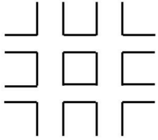
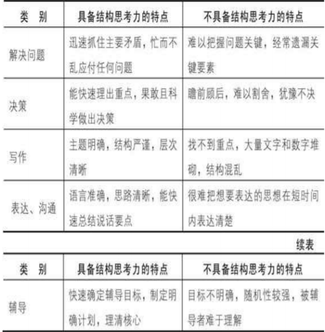
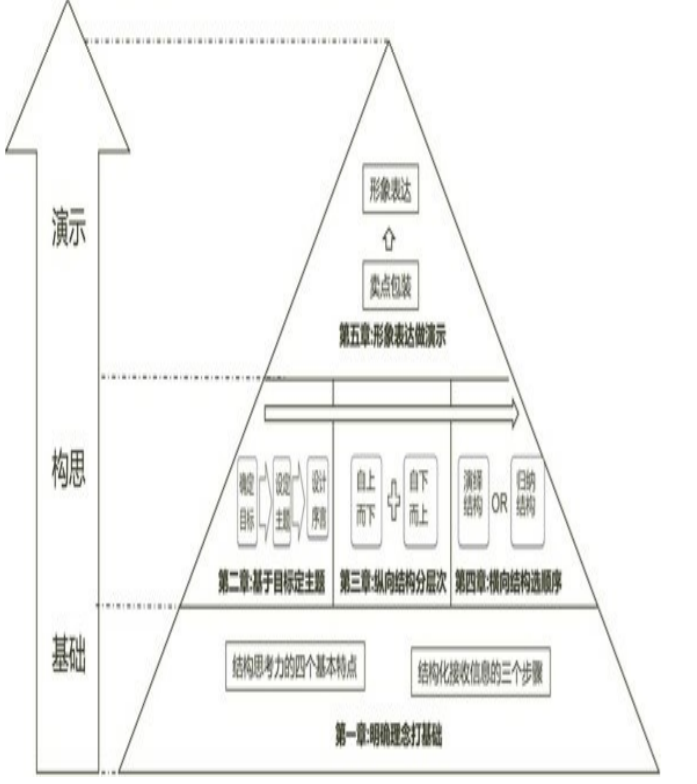
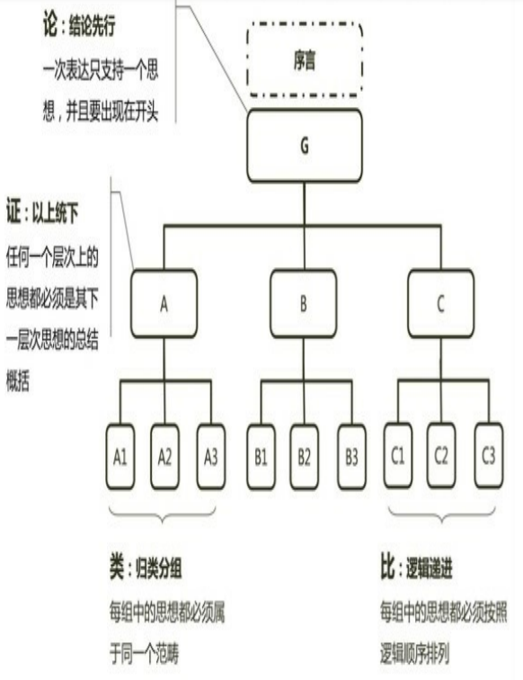
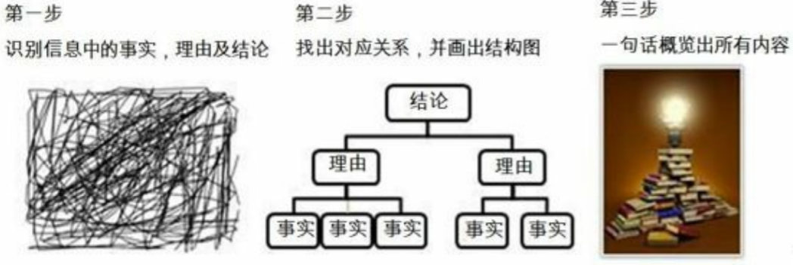

# 结构思考力

## <结构思考力>书籍阅读

> 一定要把这本书看完，还有其他的一些PPT等。
>
> 就这是这一点，就让一个人创办了一个小企业，可想而知，当一个人在某个领域精通时，财富、名誉等都不是问题了。

### 概述与导言

#### 引言

只有思考清晰，才能表达有力。

作者：李忠秋

#### 案例

记忆：30秒内记住所有符号

答案：

#### 导论-何为结构思考力

结构是万物之本，任何事物都通过结构表达价值和意义

比如: 原子模型， 音乐基础知识结构

### 第一节-结构思考力的作用

作用：

#### 基础技能

- 基础思维

- 专业岗位要求

- 管理者必备的技能。 高效管理者的三大技能：

  - 技术性技能

  - 人际性技能

  - 概念性技能

    

- 提升分析和解决问题的能力

#### 通过统一标准，提升整个组织的工作效率

**汇报工作讲结果**

**探讨工作讲过程**

**质疑问题提方案**

### 第二节-强调“先总后分”的立体化思考方式

#### 先总后分 思考过程

如何能够将200ml的水装进100ml的杯子里？

横向与纵向相结合的立体化思维

### 第三节-将结构思考力应用于思考和表达

#### 适用于思考和表达结构的构建

将运用结构思考力的过程分为三大阶段五个步骤

#### 构建思考结构的五个步骤

第一步：明确理念打基础

结构思考力的核心理念包含四个基本特点和结构化接收信 息的三个步骤

四个基本特点**：结论先行、以上统下、归类分组、逻辑递进**

第二步：画龙点睛，基于目标定主题

第三步：画地成图，纵向结构分层次

第四步：运筹画策，横向结构选顺序

第五步：画栋雕梁，形象表达做演示

### 第一章 明确理念打基础

#### 第一节 结构思考力的四个基本特点

即金字塔原理的四个基本原则：**“结论先行”、“以上统下”、“归类分组”和“逻辑递进”**

##### 论：结论先行

##### 证：以上统下

##### 类：归类分组

过“奇妙的数字7±2”，说的是大脑短期记忆无法一次容纳7个以上的记忆项目。有的人可能一 次能记住9个项目，而有的人只能记住5个，大脑比较容易记住的是3个项目。如果要点太多且不进行归类分 组，听众基本不会理解你毫无头绪的表达。

##### 比：逻辑递进

#### 第二节：结构化接收信息的三个步骤

##### 第一步：**识别信息中的事实、理由及结论**。

找出信息中哪些是观点类的，哪些是事实描述类的信息， 观点类的信息中哪些是结论、哪些是支撑结论的理由，并将它们区分开。 

##### 第二步：**找到事实与观点的对应关系**，并画出**结构图**。

接下来找出这些事实与观点的对应关系，并依 据事实、理由、结论的对应关系画出金字塔结构图。 

##### 第三步：**一句话概括出所有内容**。

接收信息除了在前两步做到能够听清楚以外，最后还要用一句话概 括出所有内容，做到说明白。

