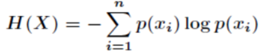
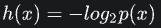
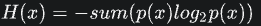
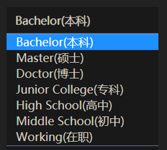

# 碎片知识

### KOL

Key Opinion Leader

关键意见领袖

通常定义为：拥有更多、更准确的产品信息，且为相关群体所接受或信任，并对该群体的购买行为有较大影响的人

特点：对产品了解、有极强的沟通能力

如：带货网红

### 风控模型--群体稳定性指标PSI

在风控中，**稳定性压倒一切**。原因在于，一套风控模型正式上线运行后往往需要很久（通常一年以上）才会被替换下线。如果模型不稳定，意味着模型不可控，对于业务本身而言就是一种不确定性风险，直接影响决策的合理性。

稳定性的直观理解

在日常生活中，我们可能会看到每月电表、水表数值的变化。直观理解上的系统稳定，通常是指**某项指标波动小（低方差**），指标曲线几乎是一条水平的直线。此时，我们就会觉得系统运行正常稳定，很有安全感。

在数学上，我们通常可以用**变异系数（**Coefficient of Variation，CV**）**来衡量这种数据波动水平。变异系数越小，代表波动越小，稳定性越好。

> 变异系数的计算公式为：变异系数 C·V =（ 标准偏差 SD / 平均值Mean ）× 100%

群体稳定性指标（Population Stability Index，PSI）

PSI反映了**验证样本**在各分数段的分布与**建模样本**分布的稳定性。

在建模中，我们常用来**筛选特征变量、评估模型稳定性**。

**稳定性是有参照的**，因此**需要有两个分布——实际分布**（actual）**和预期分布**（expected）。其中，在建模时通常以训练样本（In the Sample, INS）作为预期分布，而验证样本通常作为实际分布。验证样本一般包括样本外（Out of Sample，OOS）和跨时间样本（Out of Time，OOT）

**相对熵（KL散度）的理解**

相对熵（relative entropy），又被称为Kullback-Leibler散度（Kullback-Leibler divergence）或信息散度（information divergence），是两个概率分布间差异的**非对称性**度量。

### 信息熵

信息量是对信息的度量，就跟时间的度量是秒一样，当我们考虑一个离散的随机变量x的时候，当我们观察到的这个变量的一个具体值的时候，我们接收到了多少信息呢？

多少信息用信息量来衡量，**我们接受到的信息量跟具体发生的事件有关。**

信息的大小跟随机事件的概率有关。**越小概率的事情发生了产生的信息量越大**，如湖南产生的地震了；**越大概率的事情发生了产生的信息量越小**，如太阳从东边升起来了（**肯定发生嘛，没什么信息量**）。

**如果我们有俩个不相关的事件x和y，那么我们观察到的俩个事件同时发生时获得的信息应该等于观察到的事件各自发生时获得的信息之和，即：**

h(x,y) = h(x) + h(y)

由于x，y是俩个不相关的事件，那么满足p(x,y) = p(x)*p(y).

根据上面推导，**我们很容易看出h(x)一定与p(x)的对数有关（因为只有对数形式的真数相乘之后，能够对应对数的相加形式，可以试试）**

因此我们有信息量公式如下：

**其中，负号是为了确保信息一定是正数或者是0，总不能为负数吧！**

**信息量度量的是一个具体事件发生了所带来的信息，而熵则是在结果出来之前对可能产生的信息量的期望——考虑该随机变量的所有可能取值，即所有可能发生事件所带来的信息量的期望。即**

### 学位

