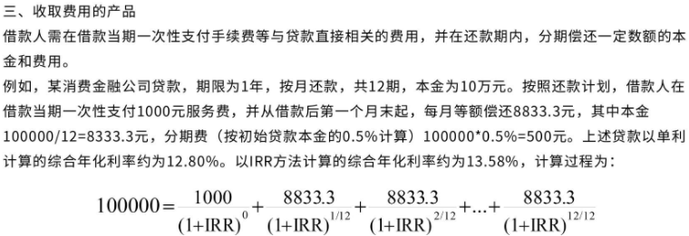

# Finance Notes

## 专有名词

### 利率

利息，是利息率的简称，指一定期限内利息额与**存款本金或贷款本金**的比率。

通常分为年利率、月利率、日利率

- 年利率：一年的存款利息，一般以百分比展示
- 月利率：一般以千分之几表示
- 日利率：一般以万分之几表示

年利率/年化利率 = 月利率 X 12 = 日利率 X 365

- 积数计息发

  计息期间每天的贷款余额逐日累计相加 (如余额几天无变动的，乘以未发生变动的天数)，即为计息积数。

  利息=累计计息积数×日利率。

  其中累计计息积数=账户每日余额合计数。

  > 举个例子，小王于2018年3月28日存款1万元，定期整存整取6个月，到期日为2018年9月28日，实际支取日为2018年9月28日，适用的六个月期存款利率（年利率）为2.80％。
  >
  > 应付利息＝（10000×184）×（2.80％/360）＝143.11（元）
  >
  > 逐笔计息法以单笔存款或贷款的金额为计息基数，一般由于定期存款或贷款。计息期为整年（月）的，计息公式为：利息=本金×年（月）数×年（月）利率。
  >
  > 计息期有整年（月）又有零头天数的，计息公式为：利息=本金×年（月）数×年（月）利率+本金×零头天数×日利率。
  >
  > 上例：应付利息＝10000×6×（2.8％/12）＝140.00元
  >
  > 两种方式计息结果的差异：143.11－140.00＝3.11元。
  >
  > 综上所述，积数计息法是根据银行贷款账户中，每天剩余的贷款余额累积产生的，金额越大利息也就越大，积数计息法主要用于计算本金经常变化的贷款利息。

- 逐笔计算法

  逐笔计息法是按预先确定的计息公式逐笔计算利息的方法。采用逐笔计息法时，银行在不同情况下可选择不同的计息公式。

  本金×年×年利率+本金×零头天数

### 年化率

**年化利率**是指通过产品的固有收益率折现到全年的利率。

假设某金融产品收益期为a年，收益率为b，那么年化利率

r=(1+b)^a-1

2021年3月31日，中国人民银行发布公告，对贷款产品的贷款年化利率做出相关规定：

所有从事贷款业务的机构，在网站、移动端应用程序、宣传海报等渠道进行营销时，应当以明显的方式向借款人展示年化利率。从事贷款业务的机构包括但不限于存款类金融机构、汽车金融公司、消费金融公司、小额贷款公司以及为贷款业务提供广告或展示平台的互联网平台等。

贷款年化利率应以对借款人收取的所有贷款成本与其实际占用的贷款本金的比例计算，并折算为年化形式。贷款年化利率可采用复利或单利方法计算：复利计算方法即内部收益率法；采用单利计算方法的，应说明是单利

