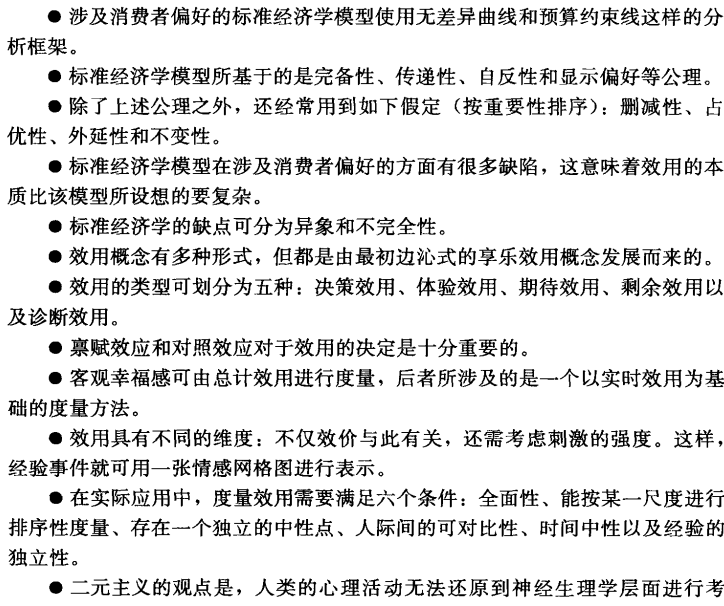
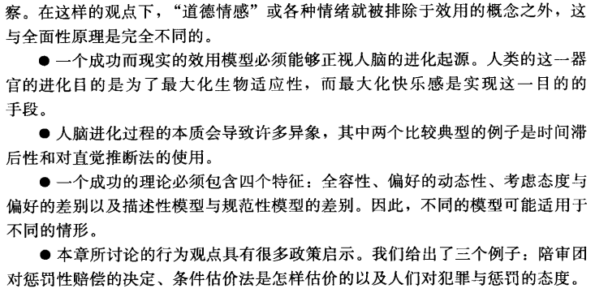
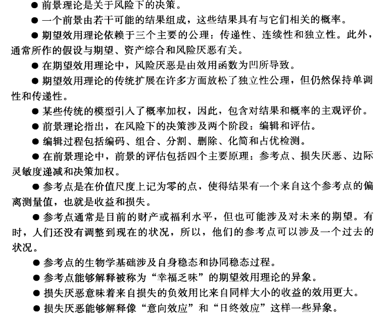
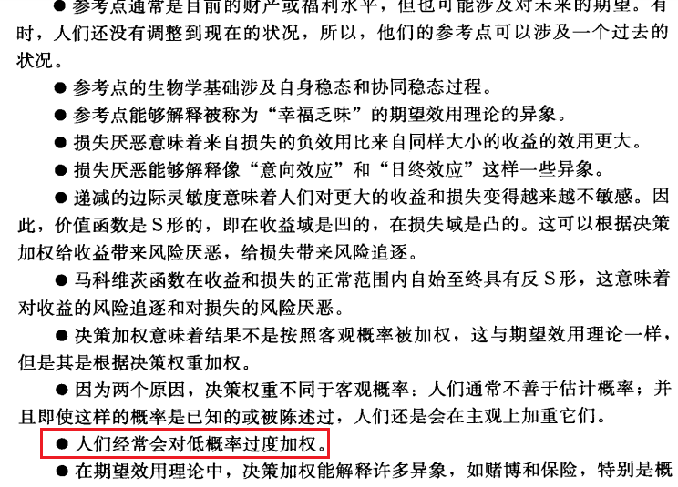

# 行为经济学

## C1-行为经济学的性质

绪论

行为经济学：通过提供更为显示的心理学基础，而增强了经济学的解释力

与标准经济学有差异

奥卡姆剃刀

用心理学来解释经济行为

人们倾向于从外在的名义值来评价各种交易的实际价值：

1. 一年中：4%的通胀，薪水提高2%
2. 一年中无通胀，薪水降低2%

尽管损失都是2%，但是大多数人都选择1

经济行为的本质：经济行为不只是货币交易，利他行为恶意行为隶属其中

## C2-价值、态度、偏好与选择

### 标准经济学模型：

#### 消费者行为

人们选择他们能负担得起的最好的东西

## C3-基于风险和不确定性的决策

## C4-心理核算

