# Stock Notes

## 为什么要炒股，凭什么挣钱


## 核心思想

**交易你的计划，计划你的交易**

**买入就是为了你的认知下注**

**具备认知，学会预期，兑现预期**

股性至上

情绪！！！！


成功交易者的四个要素上。

1. 自律观念，要始终遵守自己的交易体系。
2. 限制损失，以事先计划的方式限制损失。
3. 交易体系，计划你的交易，交易你的计划。
4. 控制情绪，任何时候都要控制情绪以避免错误。


- [x] 新学乍练
- [ ] 初窥门径，登堂入室，略有小成，渐入佳境，炉火纯青，独步江湖，自成一派，以臻大成，登峰造极，神功盖世，天下无双。


# <span style="color:red;font-weight:bold">短线</span>

## TODO

- 怎么找补涨？
- 怎么判断情绪？
- 怎么判断龙头？
- 审美问题？

趋势容量票


高标断板后走出来的首板，需要注意的。

之前凯龙股份核掉，就宣布做多失败，这时候能走出来就是当做反指做的--长白山


ST活跃的时候，市场是较为弱势的。

创业板的流动性受北证影响，北证起来了，创业板做不了了


修复的表现：

1. 负反馈的消失
2. 高度、宽度的扩展
3. 

先要高度，再有宽度：有高标，然后才用容量。捷荣=>塞力斯


择时


盈亏比 > 胜率


腾达？：申港广东分


一直一字，吃独食，筹码结构极度不均，高位非常的危险，一旦有人砸，其他人都跟着咋


一个主升周期，一般有3波主升，2波补涨


龙头补涨切换空仓


周期复盘


## 反思

#### 龙虎榜是真的吗？

其他主力借龙虎榜呢，基金借呢？


#### 基金一定要挣钱？

基民关基金经理什么事，管理费+和其他主力沆瀣一气高位接盘 挣钱不香吗

#### 博弈监管？


## 经验积累

1. 不信则不信，要信则早信。早信挣钱，迟信买单---超导
1. 拉直线的风险非常高--抛压很大，往往会回落
1. 买在分歧，卖在一致
1. 做左侧、做右侧(左右、底部)
1. **买在分歧，卖在一致**
1. 国家队救跌不救涨
1. 太一致了，就是利空
1. 开太高的票小心一点，除非一进二这种
1. 并行的热点板块不会超过3，因为资金不允许
1. 趋势票：低吸，连板票：打板追高
1. 老龙辨识度高，老妖反抽
1. 逆指数板块
1. 退潮的板块不建议做
1. 冲高回落：捅上方的套牢盘，比横盘要好一些
1. 对于冲高回落：买点药靠后，上午不要动
1. 量化：助涨助跌
1. 月末、周末、年末 都有兑现的趋势，避免未来未知负面消息面风险
1. 分时上看到一根大阳线，有大资金介入了，可以考虑入
1. 冲高回落就是洗盘的常见手法
1. 震荡：高抛低吸
1. 把握节奏：情绪节奏。控盘资金想怎么让你难受，就反着做。
1. 在情绪好转的时候把自己放到情绪里面，让情绪推动自己前进
1. 想要赚钱，你身上一定有一些特质，区别于其他人的。和大部分人一样，那就只有亏钱
1. 逻辑好的票要拿得住
1. 尾盘抢筹：第二天往往低开？
1. 上班族：第一天做好买卖点、预期
1. 股票市场很难做，没有一两年的磨砺，是很难的
1. 逻辑票、情绪票、周期票
1. 啥时候动啥时候买，不提前买--情绪
1. 看对、作对、重仓做对
1. 做多动能的透支：在下跌趋势做多，然后失败，反而对后续的修复不算利好。
1. 没有涨停的板块就是弱
1. 知道逻辑、知道龙头，为什么不买呢，执行力不够
1. 买之前：这个票是不是这个方向的龙头，预计是龙头
1. 做新不做旧
1. 做股票和性格息息相关
1. 情绪流>技术流>基本, 学习情绪很快
1. 大盘差：抱团、抱妖
1. 妖股-缩量上涨，放量大概率是见顶
1. 席位：游资不会总用自己的席位，这不是暴露自己的底仓了嘛，除非名牌。借席位。 很多大佬都用拉萨的席位买。 龙虎榜不完全可靠，大佬都有很多号
1. **模式是练出来的：买两手试试，通过不断练习，形成自己的模式。比如C天元，看好，买两手没啥问题，亏了才有负反馈，才知道自己的模式有问题，才能纠正。**
1. 大盘一好，抱团情绪立马解散，大盘不行的时候，不搞你，大盘起来了就不需要你了，强监管
1. 夏抄电，冬抄煤
1. 医药：避险板块?
1. 300：多科技线，主板更多臭鱼烂虾
1. 中字头拉尾盘：第二天低开？
1. 对倒：一个机构，两个账户，一买一卖，对倒，好处：保持量能
1. 市场差：反指、高位抱团、空仓 三种选择
1. 大盘下跌拉证券，是自救，如果失败，则指数会坚定下杀
1. 纯碱期货：你们限制下产能，我们做多，把价格拉起来，反过来给你们分红
1. 超跌反弹，第三天一般都是很难的
1. 正T倒T：正T是先买后卖，倒T是先卖后买
1. 每次大反弹，都是中国联通涨停？
1. 回购不注销，就是耍流氓：不注销和吸筹一样，拉高卖出。
1. 国家队每次救市，都是先拉大票沪指数，如果市场非常危急，融资盘大量爆仓，快触发危急了，再开始拉小票。都是通过ETF方式取拉。
1. 医药是反指：指数震荡的时候，很可能拉反指
1. 悲观者不会错，但是客观者猛猛转
1. 开得太高都不能接，不管是正股还是转债，必须要找预期差的方向
1. 

1.杜绝临时起意，只做计划内和分析后的票。（每次临时冲动就是大亏的根源，当天亏+次日又亏。）

2.只做趋势票，均线向上。

3.跟热点板块里面的票。

4.只做龙一，强于板块，领涨板块，“逆”板块则风险增大。

5.热点效应产生时，必有妖股（3板以上）。

6.龙头量走极端，极倍量或者极缩量，两者代表暴力洗盘和高度控盘。但是主力心态是一样的。极度必极速，怠慢则不达。

7.龙头个股的突破才是真正的突破。突破买入原则要遵守规律（建仓，试盘，洗盘，突破，主升浪），不要买入建仓时即可。

8.每日计划3支票，要买确定性，做大概率正确的票，如不符合预期，坚决不入。

9.对了及时止盈，错了止损要坚决。

10.庄在哪里就去哪里；资金去哪里就追哪里；人气在何处就去何处；要做就做最强的票。

11.多维度思考和甄别:个股的爆发性和持续性，不创新高，不会高。

12.顺势而为，尊重市场，因为市场永远都是对的！


补涨：之前和它同一天首板的票

龙头爆量要做高低切，不要高位接力

## 核心思想

**短线资金可以当做一种情绪<br />这笔资金需要板块承接<br />预判这笔资金下一步承接的板块。<br />切换的时候会先抢占目标板块的高标<br />**<br />不是一个板块走出来了，你才去时候诸葛分析，而是要分析走出来的原因。<br />一定要思考，深度思考，思考背后的深层次原因，高老师这个人太牛逼，做什么都深入研究、深入思考，学习！！<br /><br />高老师半年就做起来了，一开始认识票、认识板块、各题材核心标的，然后看情绪，看当前环境下的核心票，思考行进的逻辑。<br /><br />建立短线框架：<br />1. 认识短线票：什么是短线票(游资、合力)，什么是庄股/机构(eg:德业股份)，什么是量化<br />


一定要出手，不做永远不会做

## 板块与核心个股

<p style="color:red;font-weight:bold">每走过一个行情，必须要把相关的板块、核心个股背下来，历史的也需要整理</p>

工具：开盘啦题材库

### 赛道

#### 光伏

1. 

```js
1.硅料（多晶硅）。国内三巨头，保利协鑫，通威股份，新特能源。全球CR5占比58%,国内占比78%。成本控制能力是核心竞争力。化工属性，重资产，长周期，周期性明显。
2.硅片。双寡头。隆基股份、中环股份，占全球硅片份额分别为38%和41%，合计80%。卖水人单晶炉两个龙头，晶盛机电和连城数控。
3.电池片。技术含量较低，产品同质化，竞争格局较为分散。通威股份、爱旭股份、晶澳科技、晶科科技，全球CR5占比27%。
4.组件（电池板）。技术壁垒较低，看渠道和成本优势。隆基股份、晶科能源、晶澳科技、天合能源。CR5占比45%。
5.光伏玻璃。双寡头，信义光能和福莱特。合计占比超过60%。周期性强。
6.胶膜。福斯特绝对龙头占比超过55%。
7.电站。重资产投入，收益率低。正泰电器，协鑫新能源。
8.逆变器。华为、阳光电源、锦浪科技、上能电气、固德威。综合来看，硅片和逆变器环节较好，隆基股份和阳光电源，是光伏领域两大龙头。硅料环节和光伏玻璃环节，周期性太强，不易把握。电池片环节竞争格局分散，产品同质化，价值低。电站很难赚钱。胶膜一家独大
```

#### 锂电


### 泛AI

#### 机器人

1. 中马传动

#### 算力

1. 真视通

2. 拓维信息

3. 高新发展

4. 森远股份

5. 莲花健康

6. 恒润股份

7. 恒为科技

8. 直真科技

9. 鸿博股份

10. 深桑达

    


1. 


#### 文化传媒

1. 引力传媒
2. 龙版传媒
3. 龙韵股份
4. 中天光泽
4. 时代出版
4. 


#### VR/AR/MR

1. 亚世光电：
2. 双象股份

#### CXO

**CXO**俗称**医药外包**，简言之，就是为制药企业提供药物研究、开发、生成等服务的外包公司。**CXO主要分为CRO**(Contract Research Organization，**研发**)、**CMO**(Contract Manufacture Organization，**生产**)、**CSO**(Contract Sales Organization，**销售**)三大环节，**可以理解为研发外包、生产外包、销售外包**。

1. 药明康德

### 汽车

#### 汽车零部件

1. 圣龙股份

#### 整车

小米、塞力斯


### 装配式建筑

**装配式建筑**（英语：Prefabricated building，又非正式地简称作Prefab），主要指[预制构件](https://zh.wikipedia.org/wiki/预制构件)在工地上装配而成的建筑，也称**组立式建筑**。这种建筑建造快、受环境制约小、节约劳力、质量较高。预制构件包括预制柱、预制主梁、预制次梁、预制叠合板、预制楼梯、预制外维护墙、预制看台板等结构构件；它们皆在预制工厂或者工地附近临时建造之临时预制厂内先行铸造完成，并经适当的养护措施下，达到设计要求之规定强度后，始可经由拖板车载运至施工现场，交由吊装设备将预制构件按照正确的定位讯息安装定位；当完成一个楼层之所有预制构件安装作业后，再将必要之叠合层钢筋与机电管路埋置妥当后，整体一次浇置叠合层之混凝土，将所有预制构件全部固结为一具整体性之结构楼层，此施工方法又可称之为积层预铸工法。另外在台湾所谓之“組合屋”，是指用简单骨架、墙板直接组合而成的临时房屋。多半被用在临时性建筑，例如大型施工场所的办公室、矿区、偏远地区的临时房舍，重大天灾时灾民暂时栖身等用途。新型的装配式建筑采用冷压轻[钢结构](https://zh.wikipedia.org/wiki/钢结构)以及各类轻型材料组合房屋的各个部分，有很好的保温、隔音、防火、防虫、节能、抗[震](https://zh.wikipedia.org/wiki/地震)、防潮功能。共分为砌块建筑、板材建筑、盒式建筑、骨架板材建筑、升板和升层建筑五种

### 预制菜

### 星闪

星闪联邦推出的一种新一代 **近距离无线连接技术**

与传统无线连接技术(Wifi/BlueT)项目，功耗降低60%，传输速度快6倍，覆盖范围多2倍，抗干扰能力强。

是万物互联的基础----鸿蒙


## 短线基础知识

### 预期

很多数据不是只根据同比、环比来看的，而是预期。专业人员会评估，给出预期，如果不合符这个预期，那么是利空。同比、环比有些时候意义不大，比如22年疫情，整个国家经济停滞，23年如果用同比，增加不多则表示非常不符合预期，因为和去年最艰难的时候差不多，说明完全没有好转。而我们的预期是经济大幅反弹，实际完全不符合预期！！！

### 监管

#### 异动停盘规则

https://xueqiu.com/5556116888/235640814


**沪市**

**异动规则**：连续2日-3日区间涨幅偏离值大于20%触发一次异动

**沪市st股异动规则**：连续3日区间涨幅偏离值大于15%触发一次异动

偏离值计算方法：区间偏离值=股票的区间涨跌幅-[上证指数](https://xueqiu.com/S/SH000001?from=status_stock_match)区间的涨跌幅

注释：两个10%涨停区间涨幅是21%，而不是10%+10%

举个例子：2天2个涨停板区间涨幅为21%，如果同期2天[上证指数](https://xueqiu.com/S/SH000001?from=status_stock_match)涨幅为2%，那么偏离值就是21-2=19%触发不了异动。如果同期2天上证指数跌了2%，那么偏离值就是21+2=23%触发异动。

**停牌规则**：沪市监管比较严格，没有固定的停牌制度，一般会出窗口指导作为监管警示，盘中发警告短信，采取限制交易措施


**深市**：

**异动规则**：连续2日-3日区间涨幅偏离值大于20%触发一次异动

**深市st股异动规则**：连续3日区间涨幅偏离值大于15%触发一次异动

深市偏离值计算方法：区间偏离值=股票的区间涨跌幅-[深证A指](https://xueqiu.com/S/SZ399107?from=status_stock_match)（ 399107）区间的涨跌幅

注释：两个10%涨停区间涨幅是21%，而不是10%+10%

**停牌规则**：

1、同向4次异动即有可能触发停牌。这里4次异动为短期内，4次异动是最低触发标准，规则具有一定弹性。

2、复牌后10个交易日内再次触发同向异动

3、两个或者三个交易日涨幅偏离值超过20%

停牌时间：一般来说，首次停牌5个交易日，二次停牌10个交易日

#### 重点监控

主要触发条件是：股价大幅异常波动，涉嫌内幕交易，关联交易等。

主要影响：**大资金不敢随意交易，不敢拉升，因为有被封账户的风险**

### 正反指

#### 反指


电力、热力


小题材大多都是反指

寒潮


高位票

竞价爆量 开板 是卖点

- 


**次新是反指**。


#### 正指

1. 光伏
2. 储能

### 庄股

如何识别机构票：<br />F10主力持仓：各种基金的多是机构票？<br />

家就是指在资本市场上，拥有雄厚的资金的主力资金、机构。判断一只股票是否有庄家在，是否属于庄股，可以根据庄股的特征判断：

**特征一：在K线图上，时不时地有大阳线、大阴线，并且还有较长的上影线、较长的下影线。**

**特征二：庄股的分时走势忽上忽下，一般都以震荡为主。**

**特征三：庄股的成交量忽大忽小，股价暴涨暴跌。**

**特征四：庄股盘中交易行为异常，也就是毫无理由的涨停也可能毫无理由地跌停。**

**特征五：庄股的业绩也时好时坏，具有迷惑性。**

**特征六：逆市而动，即大盘上涨它回调或盘整，大盘下跌它逆势上涨。**


高老师：有游资参与的、市场合力的，不是庄主导的。

任何票都有庄

### 逼空

反复上涨，做空者没有低点回调买入，不能卖出，只能被倒逼买入

2024年02-06的反弹行情

### 资金属性

1. 国家队：一般和大盘关联，如果护盘失败，则有负反馈。如果护盘成功，盘面非常抽象
   - 比如拉银行，大家都明白是护盘行为，那大家跟不跟，一般不够，都会兑现。
2. 量化：涨停榜上通常多个席位一起出现
3. 机构：喜欢高抛低吸，不喜欢格局。
4. 游资：

盘面动的时候，需要知道是什么在动。

**低位看逻辑，高位看情绪**


高潮次日是分歧：比如20CM5个涨停，次日可能会大幅兑现，大分歧


### 审美

## 短线技术分析

### 总封单金额

如果总封单净额非常大 ，比如40个亿，这时候注意到当前情绪在高潮，也要小心次日，高潮次日是分歧。

冰点次日顶一个最高板
总封单金额的变化--工具

### 炸板率

### 上板与量

如果一个高位票昨天涨停，今天是否涨停和量有什么关系

缩量上涨封板，还是放量上涨？ 放量下跌


2023-10-12张江高科，高位，昨天一字，今天一字开，竞价开出来就爆量。比昨天一字的竞价量要多2倍有余---爆量。因此高开低走，收-4。

所以这个地方一定不能爆量，可以适当放量。

爆量以为这获利盘在清仓式出货，都卖给了竞价买入的接盘侠了。

而且空方一旦态度坚决，多方是很难获胜的，必然大跌。

你想，有人大幅卖出，有实力的多方为什么要和它博弈，这种强分歧他们是不会参与的。票本身就在高位

而且今天大盘高开，大盘好的时候，资金分散，是很难抱团的，如果今天大盘不行，张江反而可能强势，至少被砸了之后有更多资金参与。

都想模仿捷荣，但是环境不一样，都是失败的模仿者。


**<u>顶一字的爆量---一定是卖点</u>**

### 卡位 相互相存

多个高位票

会相互卡位

也会相互带动---不同时加速，加速+换手

### 中位股

中位股是最先掉队的

1. 相对高位股，没有辨识度
2. 相对低位股，没有性价比
3. 中位股数量一般不少，没有这麽大的量支撑。

### 高低切

从竞价封单也可以先看到：如果低位股封单大于高位股，则发生了高低切

### 套

如果上板是刻意的，不自然的，被反推的，

第二天还一字，

则很可能天地

这种就是一个套，尽量不参与，或者需要非常小心

### 接力

最简单

1. 管住手
2. 是合力：地位反而需要大量引导资金
3. 仓位配置

### 龙头分类

龙头、补涨、跟风？杂毛？

#### 市场总龙

真龙头，其他都是‘杂毛’

龙头和妖股：

1. 龙头会带起一波一波的补涨
2. 妖股则不一定需要补涨，可以独立走强
3. 妖股是龙头进化而来

#### 补涨龙

补涨龙--最强补涨，

赚钱效应的延续

跟风、模仿

#### 卡位龙

一旦确定就是一字板，卡的是时间

巨量封单，买不进

#### 撤退龙

#### 炮灰龙

无法带领板块分歧转一致的是炮灰龙

特征：见顶A杀，没有盘顶结构

作用：暖场，大概度

#### 先于龙

和炮灰龙相反，能带领板块分歧转一致

后续变为总龙，或者让位于总龙

#### 妖龙

#### 跨年妖

所有的跨年大妖都有以下五个共同特点！ 

第一：跨年大妖一般是11月初启动，一直能涨两到三个月跨度到元旦前后； 

第二：跨年大妖启动时市值不会大，一般都在20-50亿以内； 

第三：跨年大妖启动时股价不会太高，一般都在10元以内； 

第四：跨年大妖启动底部会有N型模型； 

第五：跨年大妖启动对应的往往都是大题材！

每一年11月到12月，A股都会走出一个跨年大妖股！ 

2016年是三江购物，股价10元涨到50元； 

2017年是贵州燃气，股价5.5涨到26元； 

2018年是东方通信，股价4元涨到41元； 

2019年是星期六，股价6元涨到36元； 

2020年是郑州煤电，股价从2元涨到10元； 

2021年是九安医疗，股价从3元涨到95元； 

2022年是西安饮食，股价从5元涨到22元


### 龙头反抽

高标一般回落20%-30%会有反弹


## 模式打造

我的模式？


## 盯盘

1. 1分钟涨速
2. 板块涨速


#### 神奇九转

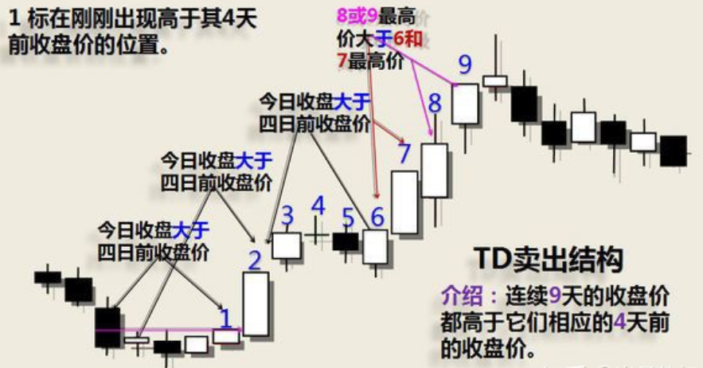

用法口诀　　1.上升趋势看跌9。　　2.下降趋势看高9。　　3.逆势看背离9。　　4.九转序列震荡必杀技。　　简单来说：上涨时低9可以帮助上涨；跌时，高9可以帮助下跌；当它上升时，需要高9才能结束反弹，出现背离共振；下降时，下降结束需要低9，出现背离共振。　　神奇九转比较适用股票震荡市或弱市中的震荡市，如果是熊市急跌或者大牛市则不适用。在下跌过程中，一直出现到9这个序列号9转结构成立，可以考虑加仓买入。主要是帮助投资者来进行逃顶的操作以及把握底部的机会，而此类操作方式对于投资者来说在一些市场中就在熊市中很容易出错，而牛市则是容易错过后期的走势。　　投资指标不能只看一个，要同时出现多个指标才比较靠谱

#### 洗盘与出货

1、震荡幅度：洗盘一般较小。出货一般较大。

2、庄家获利空间：洗盘一般小于20％，出货一般大于50％，甚至100％。

3、当天外盘和内盘成交量比：洗盘内外盘成交差不多，出货时一般内盘大于外盘，且常有大卖单出现。

4、成交量：洗盘时成交量萎缩，出货时放大。

5、均线发散趋势：洗盘时仍然呈向上发散趋势，多头排列不变；出货时已被破坏，或者开始向下。

6、是否护盘：洗盘一般在中低价区不有效破10日均线，在中高价区不有效破20日均线（或者30）日均线；出货一般会迅速下破5,10日等短期均线，且在高位出现叉


## 指标

### 量

什么时候需要量，什么时候不需要量

爆量


## 竞价

### 竞价总结

时间：9:25后5分钟是最重要的，通过这五分钟判断方向，推演当日情绪和走势。**不管怎么样这五分钟一定要专线看**

工具：开盘啦 情绪-打板

观察点：竞价的涨幅、跌幅、竞价成交额、一字、板块


#### 一字定方向

看竞价一字：

1. 一字数量
2. 一字所属板块
3. 一字封单：封单大小、变化

#### 高位三个方向

1. 参与核心：板块要继续行进，高标必须创新高。核心高标和板块一定是共振的、正相关的。
2. 参与新细分分支：阻力小 低位
3. 参与核心个股对应的转债：日内套利，如果正股和板块很强可以过夜

#### 超预期

1. 弱转强
2. 高开
3. 负反馈修复
4. 


#### 负反馈


### 竞价手法


### TODO

你看板哥：https://mp.weixin.qq.com/s/54pqgbX-NnKYE7tAXMs4nw

那个票不是9点35之前买的

竞价开出来，看竞价涨幅，全是低空经济的票，这不就是全面回流了吗。不管是容量、还是情绪表，还是逻辑标，还是20/转载-- 中信海直、广电计量、商洛电子、万丰奥威、金盾股份、光洋股份、深城交 --- 好好复盘，刻在脑子里

学习看竞价----竞价超预期

看竞价涨幅

竞价板块涨幅

核心个股竞价


怎么样辨别超预期 和 高开兑现？


那么冰点后突发利好怎么确定是否高开坑人呢?

一是尽量参与新细分，比如通感一体化

新细分新面孔埋伏获利盘较少，兑现压力小

二是参与强度最高方向的转债，进退自如，比如华体转债、商络债。

三就是核心辨识度了，金盾股份小锦反复说了常山药业2.0，不过现在走势可以说是常山plus了，盘子更小题材持续性更强


工具：开盘啦 板块竞价功能


TODO：

1. 每日竞价分析，规律总结
2. 


### 竞价超预期

#### 小锦鲤zzz

https://mp.weixin.qq.com/s/tM5NMlym_UZ-r0doZSsOTQ

如何判断当日大涨方向？如何判断退潮？小锦鲤竞价思路：

低空经济从3月6号以来，一路上升走到了3月21号，到3月27后走下行趋势。

3-28：

本轮低空经济二波爆发是由华体科一字定方向带起的

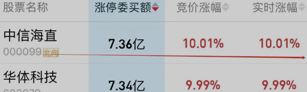

华体科技一字定方向，细分是低空经济的**新分支通感一体化**；中军万**丰奥威竞价高开**表态，可以看到的是竞价封单最大的两个都是低空经济方向

如何上车：

1. 华体科技的**<u>转债</u>**：T0灵活去留。竞价后万丰奥威上板、趋势深城交反包20cm，板块强度足够那么债是可以隔夜的，两日套利近30p

2. 参与一字定方向的华体科技**<u>板块细分</u>**——通感一体化板块掀起涨停潮
3. **直接参与辨识度**，万丰奥威、金盾股份，<u>两个板块高度方向。万丰奥威、金盾股份走弱之时也是低空经济板块走弱之时，板块需要向上打高度，金盾股份与万丰奥威必然要创新高，反之万丰、金盾走弱板块盘中每一次回流都是卖点</u>

3-29

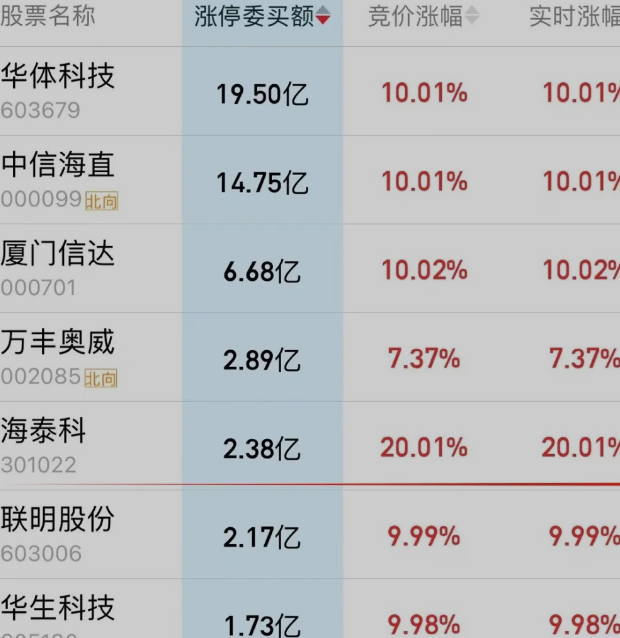

次日除了低空经济方向，竞价较强的就是以海泰科为代表的小米汽车，由于海泰转债竞价18p开的太高叠加小米汽车开盘兑现预期，这个方向当日可以放弃。

华体科技的通感一体化方向20cm接力当日全军覆没，不过第二天给了修复，高潮次日兑现为主，套利华体转债即可，别的带不走

4.1

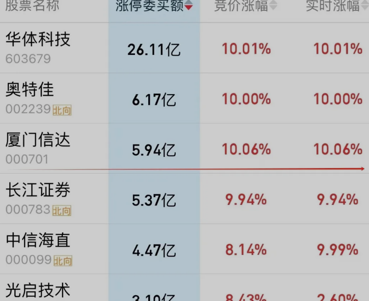

华体继续一字，比较超预期的是厦门信达加单一字，代表小米汽车方向300龙头海泰科竞价超预期高开，那么直接套利转债即可，防止盘中被兑现，收益也是20p+。

4.2

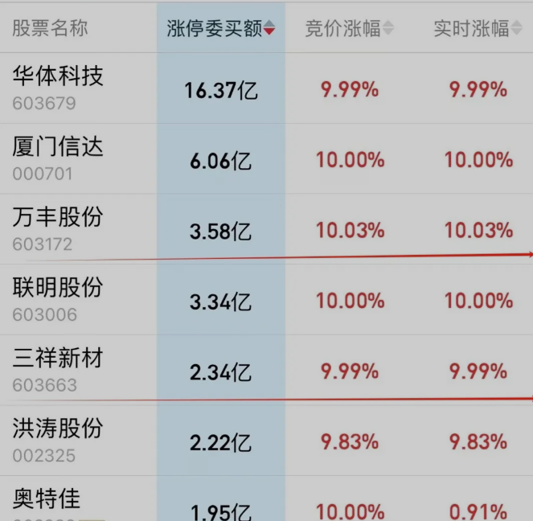

除了前两日强的低空经济、小米汽车，竞价较强的是以万丰代表的**化工方向**

化工套利**福新转债**2日**20p，**当日福新债涨停也是由于化工板块爆发加上资金对福莱新材次日溢价的预期

4.3


东方锆业一字定方向，有色当日大涨。

但是高标华体科技开盘跌停，低空经济直接退潮，影响短线情绪。

所以当日有色板块都是烂板，市场大退潮属于管住手行情。


### 集合竞价

#### 集合竞价是怎么排队的

https://m.10jqka.com.cn/588906991.html

两个方面：1：营业部层次2：交易所层次


营业部方面，所有的委托都是9：15以前在券商服务器存放，9：15：00发送，其中分成两种情况：有通道细化的和无通道细化的

有通道细化的通常是大券商，细化出了优先委托(可能叫VIP委托什么的)和普通委托，在券商内部进行了排队，你所看到的委托编号，是营业部的编号，不是证券公司的编号。同样的集合竞价，优先委托排在普通委托前面。

无通道细化的通常是小券商，整个证券公司按照委托时间公平排队。

交易所方面，9：15：00开始对各个券商席位进行轮询，轮询是随机的。所以你能不能在几千万股封死跌停板上卖出，取决于：你是否是证券公司的第一笔委托以及你所在的证券公司在第一轮轮询的次序。

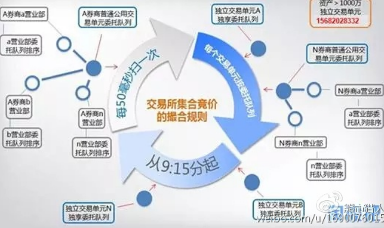

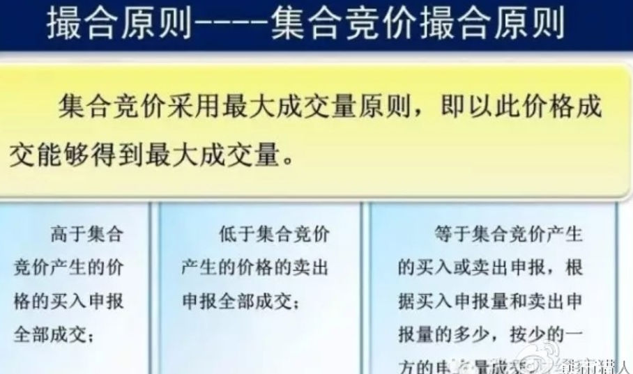

深圳股票在收盘14:57—15:00是收盘集合竞价时间，这3分钟不能撤单

集合竞价先是价格优先，然后才是时间优先


A股集合竞价时间为9点15分至9点25分，14点57分至15点00分

**9点15分至9点20分，根据买卖双方挂单，预先撮合，不成交**，以预先成交量最大的价位显示，**可申报，可撤销**，因此主力庄家可以**挂很高的大买单，造一个高价**，**让你以为这股要暴涨，诱惑你进场，**怎么躲避呢？**他的拉价大买单，9.20之前会撤掉，不然就亏了**，**因此9.20以后的价位，才有点真实**。

9点20分至9点25分，可申报不可撤销，9点25分之前都不成交，依然是预先撮合，以预先成交量最大的价位显示，**但是因为不能撤销的，因此价格有点真实了（9.25分前，都不能绝对真实，如下图）**，这些撮合交易，全部在**9点25分0秒以**最大成交量的价位统一成交，然后成交价就是开盘价。（**这是一个价格?，即之前委托的买卖都是这个价格，保证成交量最大，所以高于这个价格的卖单不会成交，低于这个价格的卖单会以这个价格成交，买单相反，低于的买不了不成交，高的以这个价格成交。**）

**9.25-9.30休息，不成交，可申报不可撤销，9.30开盘后才能撤销。**

集合竞价卖出股票后，资金在9:25后就可用，买进另一只股票。

尾盘14.57分开始，以最近成交价为价格，不再显示十档价位，进入尾盘竞价，可申报，不可撤销，**尾盘竞价变动一般不大，3点00分0s，根据成交量最大的价位，给出收盘价，一天的交易结束。**

**成交规则**

**价格优先，时间优先，撮合规则。**

买东西，自然是价高者得，**价格相同，先出价的得。**

卖东西，自然是价低的先卖出，**价格一样，先卖的先成交。**

**撮合规则就很值得学习利用，即卖价比买一低，以买一先成交，买价比卖一高，以卖一先成交**


## 连板

### 买点

最高版买点：

1. 表现极强主动性
2. 极致的反推：克来机电


### 卖点

低位表现出性价比，低位出现买点，高位则可能出现买点

高切低：低位卖点和高位买点

艾艾精工 切 东方时尚


### 低位

低位的介入判断：

1. 题材的强度
2. 20CM


## 接力

接力很简单

从捷荣到圣龙


TODO 2024-04-06 鲍老师 录播


## 盘口


## 周期

### 情绪周期

虽然现在情绪周期太普及了，不一定都有用，但是需要了解。


### 周期复盘

ABCD四个周期现在到第四个小周期了也就是D，ABC分别是国脉文化/华扬联众、东方精工/四川金顶、安奈儿/天元智能。这里都形成卡位到失败。那么D小周期应该是今天2-3的这批票。等等这批票死完，新的大周期开始

#### 低空经济202403

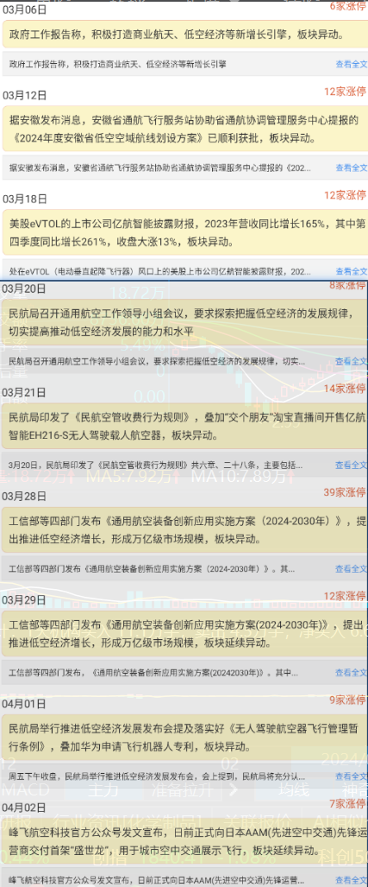

| 20240403 | 002023 | 海特高新 | 1    | 79   | 换手板 |
| -------- | ------ | -------- | ---- | ---- | ------ |
| 20240403 | 000701 | 厦门信达 | 5    | 36   | 换手板 |
| 20240402 | 603950 | 长源东谷 | 1    | 61   | 换手板 |
| 20240402 | 000701 | 厦门信达 | 4    | 33   | 一字板 |
| 20240401 | 300778 | 新城市   | 1    | 26   | 换手板 |
| 20240401 | 002967 | 广电计量 | 1    | 85   | 换手板 |
| 20240401 | 002097 | 山河智能 | 1    | 100  | 换手板 |
| 20240401 | 000701 | 厦门信达 | 3    | 30   | 一字板 |
| 20240401 | 000099 | 中信海直 | 4    | 122  | 换手板 |
| 20240329 | 605001 | 威奥股份 | 1    | 24   | T字板  |
| 20240329 | 603085 | 天成自控 | 1    | 39   | 换手板 |
| 20240329 | 002625 | 光启技术 | 1    | 396  | 换手板 |
| 20240329 | 001696 | 宗申动力 | 2    | 72   | 换手板 |
| 20240329 | 000701 | 厦门信达 | 2    | 27   | 一字板 |
| 20240329 | 000099 | 中信海直 | 3    | 111  | 一字板 |
| 20240328 | 688631 | 莱斯信息 | 1    | 24   | 换手板 |
| 20240328 | 600990 | 四创电子 | 1    | 48   | 换手板 |
| 20240328 | 600580 | 卧龙电驱 | 1    | 228  | 换手板 |
| 20240328 | 301091 | 深城交   | 1    | 53   | 换手板 |
| 20240328 | 300484 | 蓝海华腾 | 1    | 24   | 换手板 |
| 20240328 | 300411 | 金盾股份 | 1    | 44   | 换手板 |
| 20240328 | 300107 | 建新股份 | 1    | 22   | 换手板 |
| 20240328 | 002967 | 广电计量 | 1    | 75   | 换手板 |
| 20240328 | 002676 | 顺威股份 | 2    | 36   | 一字板 |
| 20240328 | 002526 | 山东矿机 | 1    | 49   | 换手板 |
| 20240328 | 002413 | 雷科防务 | 1    | 58   | 换手板 |
| 20240328 | 002148 | 北纬科技 | 1    | 24   | 换手板 |
| 20240328 | 002097 | 山河智能 | 1    | 88   | 换手板 |
| 20240328 | 002085 | 万丰奥威 | 1    | 334  | 换手板 |
| 20240328 | 001696 | 宗申动力 | 1    | 65   | 换手板 |
| 20240328 | 000561 | 烽火电子 | 1    | 49   | 换手板 |
| 20240328 | 000420 | 吉林化纤 | 1    | 92   | 换手板 |
| 20240328 | 000099 | 中信海直 | 2    | 101  | 一字板 |
| 20240327 | 603373 | 安邦护卫 | 2    | 11   | 换手板 |
| 20240327 | 002957 | 科瑞技术 | 2    | 72   | 换手板 |
| 20240327 | 000099 | 中信海直 | 1    | 92   | 换手板 |
| 20240326 | 603373 | 安邦护卫 | 1    | 10   | 换手板 |
| 20240326 | 002957 | 科瑞技术 | 1    | 65   | 换手板 |
| 20240326 | 002708 | 光洋股份 | 1    | 45   | 换手板 |
| 20240325 | 002735 | 王子新材 | 3    | 30   | 换手板 |
| 20240325 | 002669 | 康达新材 | 2    | 38   | 换手板 |
| 20240322 | 002735 | 王子新材 | 2    | 27   | 换手板 |
| 20240322 | 002669 | 康达新材 | 1    | 34   | 换手板 |
| 20240322 | 000420 | 吉林化纤 | 1    | 92   | 换手板 |
| 20240321 | 605056 | 咸亨国际 | 2    | 30   | T字板  |
| 20240321 | 603879 | 永悦科技 | 8    | 37   | T字板  |
| 20240321 | 603085 | 天成自控 | 1    | 38   | 换手板 |
| 20240321 | 603018 | 华设集团 | 1    | 58   | 换手板 |
| 20240321 | 600990 | 四创电子 | 1    | 52   | 换手板 |
| 20240321 | 600580 | 卧龙电驱 | 2    | 240  | 换手板 |
| 20240321 | 300690 | 双一科技 | 1    | 24   | 换手板 |
| 20240321 | 300542 | 新晨科技 | 1    | 35   | 换手板 |
| 20240321 | 002735 | 王子新材 | 1    | 25   | 换手板 |
| 20240321 | 002148 | 北纬科技 | 2    | 27   | 一字板 |
| 20240320 | 688631 | 莱斯信息 | 1    | 22   | 换手板 |
| 20240320 | 605056 | 咸亨国际 | 1    | 28   | 换手板 |
| 20240320 | 603879 | 永悦科技 | 7    | 34   | T字板  |
| 20240320 | 603373 | 安邦护卫 | 2    | 9    | 换手板 |
| 20240320 | 600580 | 卧龙电驱 | 1    | 219  | 换手板 |
| 20240320 | 002148 | 北纬科技 | 1    | 25   | 换手板 |
| 20240320 | 000801 | 四川九洲 | 2    | 152  | 换手板 |
| 20240319 | 603879 | 永悦科技 | 6    | 31   | 一字板 |
| 20240319 | 603373 | 安邦护卫 | 1    | 9    | 换手板 |
| 20240319 | 000801 | 四川九洲 | 1    | 138  | 换手板 |
| 20240318 | 688631 | 莱斯信息 | 1    | 16   | 换手板 |
| 20240318 | 603879 | 永悦科技 | 5    | 28   | 一字板 |
| 20240318 | 600580 | 卧龙电驱 | 1    | 189  | 换手板 |
| 20240318 | 003004 | 声迅股份 | 2    | 18   | 换手板 |
| 20240318 | 002967 | 广电计量 | 1    | 75   | 换手板 |
| 20240318 | 002085 | 万丰奥威 | 2    | 278  | 换手板 |
| 20240315 | 605056 | 咸亨国际 | 1    | 25   | 换手板 |
| 20240315 | 603879 | 永悦科技 | 4    | 25   | T字板  |
| 20240315 | 003004 | 声迅股份 | 1    | 16   | 换手板 |
| 20240315 | 002085 | 万丰奥威 | 1    | 253  | 换手板 |
| 20240314 | 603879 | 永悦科技 | 3    | 23   | T字板  |
| 20240313 | 603879 | 永悦科技 | 2    | 21   | 换手板 |
| 20240313 | 000099 | 中信海直 | 2    | 92   | 换手板 |
| 20240312 | 603085 | 天成自控 | 1    | 34   | 换手板 |
| 20240312 | 600990 | 四创电子 | 1    | 47   | 换手板 |
| 20240312 | 300975 | 商络电子 | 1    | 33   | 换手板 |
| 20240312 | 300411 | 金盾股份 | 1    | 29   | 换手板 |
| 20240312 | 300107 | 建新股份 | 1    | 18   | 换手板 |
| 20240312 | 002085 | 万丰奥威 | 2    | 225  | 换手板 |
| 20240312 | 000099 | 中信海直 | 1    | 83   | 换手板 |
| 20240311 | 603950 | 长源东谷 | 1    | 52   | 换手板 |
| 20240311 | 603261 | 立航科技 | 5    | 9    | T字板  |
| 20240311 | 002085 | 万丰奥威 | 1    | 205  | 换手板 |
| 20240308 | 603261 | 立航科技 | 4    | 9    | 换手板 |
| 20240307 | 603261 | 立航科技 | 3    | 8    | 一字板 |
| 20240307 | 300411 | 金盾股份 | 3    | 24   | 换手板 |
| 20240307 | 300107 | 建新股份 | 1    | 16   | 换手板 |
| 20240306 | 603261 | 立航科技 | 2    | 7    | 一字板 |
| 20240306 | 300411 | 金盾股份 | 2    | 20   | 换手板 |
| 20240306 | 002735 | 王子新材 | 1    | 20   | 换手板 |
| 20240306 | 000801 | 四川九洲 | 1    | 126  | 换手板 |
| 20240305 | 603261 | 立航科技 | 1    | 6    | 换手板 |
| 20240305 | 300411 | 金盾股份 | 1    | 17   | 换手板 |
| 20240304 | 000801 | 四川九洲 | 1    | 112  | 换手板 |
| 20240229 | 002085 | 万丰奥威 | 1    | 152  | 换手板 |
| 20240229 | 000801 | 四川九洲 | 1    | 96   | 换手板 |

| 20240403 | 2    |
| -------- | ---- |
| 20240402 | 2    |
| 20240401 | 5    |
| 20240329 | 6    |
| 20240328 | 18   |
| 20240327 | 3    |
| 20240326 | 3    |
| 20240325 | 2    |
| 20240322 | 3    |
| 20240321 | 10   |
| 20240320 | 7    |
| 20240319 | 3    |
| 20240318 | 6    |
| 20240315 | 4    |
| 20240314 | 1    |
| 20240313 | 2    |
| 20240312 | 7    |
| 20240311 | 3    |
| 20240308 | 1    |
| 20240307 | 3    |
| 20240306 | 4    |
| 20240305 | 2    |
| 20240304 | 1    |
| 20240229 | 2    |
| 20240226 | 2    |
| 20240220 | 1    |
| 20240219 | 2    |
| 20240208 | 1    |
| 20240207 | 2    |
| 20240206 | 1    |
| 20240131 | 1    |
| 20240124 | 1    |
| 20240123 | 1    |
| 20240116 | 3    |
| 20240112 | 1    |
| 20240111 | 3    |
| 20240110 | 1    |
| 20231228 | 1    |
| 20231016 | 1    |
| 20231013 | 1    |
| 20231012 | 1    |
| 20230713 | 1    |

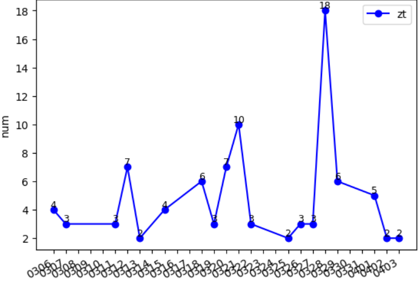

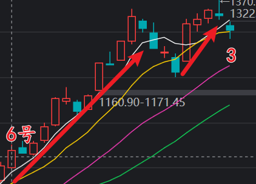

很明显的两波走势：

1. 第一波：03-06 到 0321，主升
2. 二波：调整天后，0328到0421走了4天


容量标：

| code   | name     |
| ------ | -------- |
| 000099 | 中信海直 |
| 002625 | 光启技术 |
| 600580 | 卧龙电驱 |
| 002085 | 万丰奥威 |

万丰奥威、卧龙电气，中信海直、中其技术


连板（按时间顺序）：

1. 金盾股份 2024-03-07：20CM核心 3板
2. 立航科技 2024-03-13：最先的连板标的，7板
3. 永悦科技 2024-03-20：8板，立航科技断板的时候是3板
4. 中信海直 2024-03-27：容量4板

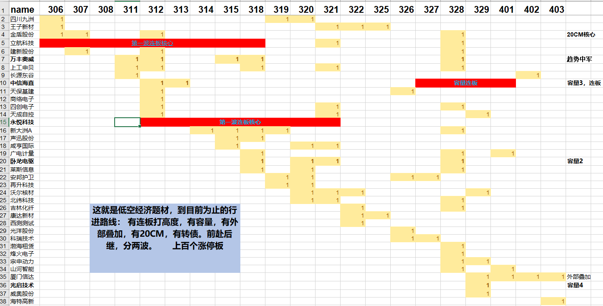


TODO：

1. 哪些票是连板核心
2. 哪些票是补涨
3. 哪些是跟风
4. 每天的阵眼是什么，每天最先上板的连板、容量，封单大小，看板次数，竞价强度
5. 20CM、转债和连板的关系
6. 容量票、行进路线
7. 消息驱动的作用。
8. 连板的图形
9. 卡位 等细节

这些东西，每一轮周期都是一样的逻辑

- 大局观上对整个周期的把握
- 细节上对各个时间点、各个票的 深入分析。对票之间的关系，题材之间的关系 进行分析。


#### AI2023上


#### 华为2023下


塞力斯 江淮 长安


## 趋势

1. 主升阶段不做T
2. 要能讲故事
3. 不言顶，坚定持股

## 游资

### 思明南路

### **申港广东分**

情绪周期顶级高手，参与过的短线高度股数不胜数，近期也是深度参与捷荣技术、圣龙股份、三柏硕等高标，实力无比强悍。

腾德？

### 上塘路

### 三板组

运作资金操盘手法极其凶悍，联动席位极多。低位发动首板后总能快速二板三板，因此被称作三板组。

https://www.fupanwang.com/youzi_info/88.html


二板加速，三板一字，四版杀人


### 国家队

#### 中央汇金

中央汇金投资有限责任公司（以下简称“中央汇金公司”）是依据《中华人民共和国公司法》由国家出资设立的国有独资公司。

代表国家依法行使对[国有商业银行](https://zh.wikipedia.org/wiki/商业银行)等重点金融企业出资人的权利和义务；有“金融[国资委](https://zh.wikipedia.org/wiki/国资委)”之称。汇金公司是中国投资有限责任公司的全资子公司，根据国务院授权，对国有重点金融企业进行股权投资，以出资额为限代表国家依法对国有重点金融企业行使出资人权利和履行出资人义务，实现国有金融资产保值增值。汇金公司不开展其他任何商业性经营活动，不干预其控股的国有重点金融企业的日常经营活动。

#### 国资委


#### 中信证券四大金刚

中信证券四家营业部指的是中信证券总部营业部、中信证券北京望京营业部、中信证券北京金融大街营业部、中信证券北京呼家楼营业部。这四家营业部被民间投资者昵称为“四大金刚”。

“四大金刚”扫货动用的资金量动辄上亿元起。


# 人性

## 个人分析

- 低吸能力太差，不敢


本我

真我

性格的缺陷

认知上的无知


## 人性

炒股就是抄人性


**中国人：生活有一种无形的压迫感，感觉有后面有一条狗在追**，感觉为了父母的眼光，为了中华名族，，，范围忽略的最重要的东西---自己<br />这就是枷锁<br />人生就像一场游戏，大闹一场，欢洒而去


# 深度思考

深度思考，思考思考再思考


## 日常思考

### 资本市场

2024-04-05

为什么要有股市？

股市的目的是为了融资。

什么是融资？融资就是一些人需要进行生产活动，但是欠缺资金，于是想其他人借，并承诺未来给出回报。

什么样的人发起的融资？企业家

为什么要发起？生产活动，最终目的是为了获取财富、尊重、人生价值等需求。

为什么要允许这种行为？这是生产活动，是促进社会发展、保证社会运行的根本之道。为什么？因为满足了人们的需求，提供了就业，促进社会稳定。

这种融资有哪些形式？C2C，如创业天使轮投资，创业初始阶段，资金小，不确定性高，范围小。 大型融资，向广大群众融资，资金需求大，不确定小，是公司发展起来后的进一步需求。

怎么来实现资本和融资者回报承诺的绑定？股票！你给我钱，我给你一个股票凭证，你用这个后面来兑换回报。

是来提供这个融资平台？--交易所，股票交易所，提供一个场所让人借钱和出借钱--股票市场

这种金融模式是啥？信贷！最基础的经济学概念

股票市场类型？一级 二级

一级市场是什么？股票的发行市场，也就是融资和出资的这一步。

为什么需要二级市场？按道理，股票和融资公司绑定，公司挣多少钱，按股份给出资人分红就好了啊，为什么还需要二级市场呢？

1. 一级市场参与的人不多，不可能让所有人通过一级市场去出资
2. 一级市场没法较好评估公司价值。融资时有一个初始价值，但是之后不能仅凭公司单方面的说明，或者少数人的调研，就了解公司的动态价值。
3. 提供给更多人参与的空间。让一部分人沉迷于这个行业，即制造了就业，也让这部分比较有钱的人安分下来，政治上也有稳定作用

什么人来开设这个交易市场？国家机构，信用支撑

什么人来监督着整个过程？证监会

二级市场为什么要有买卖股票？只有通过买卖才能推动股票价格涨跌，才能形成动态的公司市值，才能反应公司价值

二级市场投资者通过什么方式参与买卖？券商

为什么不能直接通过交易所？

1. 交易所有多个，如果通过交易所 需要管理多个账号
2. 太复杂，直接依赖。需要通过券商解耦

### 股市参与者

2024-04-05

参与股市的人是什么人？叫投资者

参与条件？成年，注册账号

账号是通过什么注册的？券商，券商帮你在每个交易所开通账号

几人条件这麽低，那参与的人会更多，几亿股民，排除僵尸账号外有上千万的活跃账号

门槛低，越公平吗，对于相同权限的股民来说是公平的，相互之间公平。

参与人多，相对公平，大家都挣钱吗？不是。牛市挣钱的人较多，熊市挣钱的非常少。 总体来看，也是符合二八定律，7亏2平1赚

亏钱的人这麽多，为什么他们要参与？为什么你要参与？出发点是什么。**想赚钱，想赚快钱，想赚大钱**

这种想取巧赚钱体现了人的什么思想？

1. 贪：不管挣钱了，还是亏钱了，都想赚更多，想回本
2. 懒：这种简单钱，太有诱惑，不需要其他努力，懒钱
3. 始终“希望”：在欲望的驱使下，保持一定的希望
4. 试一试的心态：试一试 说不定就做出来了呢

贪懒是人的本性，正式这种本性，才有源源不断的人进入市场。胜多粥少，市场竞争更加激烈，更加卷

炒股，本质是炒人，都希望重别人手中抢钱。


### 交易风格


### 成功交易者特点


# 社会热点思考

## 基金

### 做空自己

基金公司将自己管理的券卖出去

然后吃利息

太TM畜生了

### 内幕

基金：高位接

和主力说好了，然后吃主力利润，让基民亏钱。

自己吃管理费和主力的回扣


恒润股份：董事长声明建算力中心，承诺不减持。原来是配合私募操盘。


## 常规事件

### 直播带货

董宇辉半年卖货24亿，相当于4个上海2万平方米的山姆超市

反映了：当下互联网时代，网红个人带货的暴利的空间。

相关公司：

1. 元隆雅图
2. 奥飞娱乐
3. 广博股份
4. 中天广泽
5. 引力传媒
6. 跨境通

### 2023年底养老金结余6万亿

2023年底，基本养老保险基金剩余6万亿

意味着2022年以及之前交的社保都已经用完了，全部发给了已经退休的人。

因为2023年打工人总共交了6万亿社保。

打工人积累的血汗钱被吸血鬼狂吃，这其中有多少猫腻，有多少是真正用来发放养老金，正确地发放养老金。

2024年的养老金只能用2023年的6万亿发，够吗？按这个消耗速度，多久就会入不敷出？

不够了他们怎么办，开源节流，要么加大征收比例，要么减少发放，不管那种方式，苦的都是广大百姓。

不要以为到我们这个年纪还会有多少养老金的。

这群草台班子


### 草台班子

A股那么多漏洞

- 非流通股通过转融通融券借出做空
- 频繁IPO吸血
- IPO高发行价，高PE，过度募集
- 各种违规减持，处罚轻微

你以为他们不知道吗，这些也是他们的利益来源，他们就是吸血鬼。

一群草台班子。

### 李一舟AI课

1. 时间节点：Sora文生视频，老美技术不断突破，我们缺止步不前，只会抄抄抄，这种情绪本身需要一个载体去释放，结果这种Sora还没开放就炒作卖课，正好成为一个嘲笑的载体。
2. 宣传太过于明面了：炒作，微信广告推广，水能载舟亦能覆舟。其他私圈或者面向企业的也挣钱。他只是收割最底层的韭菜
3. 自身质量：水课，无真正的内容

## 地产

### 房地产

地方政府高价卖地，推高房价

# 大神学习

## 豹老师

也是几个月就做出来的

之前听A哥们聊，也是听不懂，听这听那都听不懂

也交过钱，也进过元子的群

没有一定的知识积累、认知，听这些很多都听不懂

短信这里有一个“窗户纸”，捅破了就悟道，不然就是一片糊糊


能不能做出来，我觉得天赋是第二，努力才是第一，独立思考


lEOPARD复盘 老师：短线很简单

短线有哪些内容？也是自己总结的？

1. 择时
2. 择股
3. 

**什么是原因？什么是结果？一定要总结原因**

不是XX涨停，所以YY涨停


类似的逻辑是什么？ TODO

1. 立鼎光电 vs. 亚世光电
2. 东安动力 vs. 晋拓股份


趋势性龙头的特征：每日有新高，如果没有，只允许有一天的调整时间


300 6个因子scj

## JShen

### 短线逻辑

- 找龙头：龙头板块、龙头个股(连板数、趋势龙、情绪龙)
- 核心：找到/判断 哪个涨幅最大的个股，只要行情没结束，每一天都是买入机会，

**短线的认知：经验、短线的环境判断、题材大小**

**买入就是为了你的认知下注**


对于短线而言：最重要的就是认知水平的高低

做短线需要交易，交易就有成功率

交易不是多劳多得，累大概率不挣钱，挣钱大概率不累

提升认知、强化认知

经验需要时间积累

短线的环境判断：行情好多做，行情差少做

题材大小：题材大一定做，题材小选择性做


交易你的计划，计划你的交易

具备认知，学会预期，兑现预期

预期不兑现，就是不及预期

比预期好，就是超预期

认知和预期，相辅相成


当你的认知水平越接近市场真相，你看到的超预期和不及预期也就更有效


心态要调整到平和的状态去交易

- 愤怒和激动都会影响你的判断，去做一些模式之外的东西


努力看对，坚持作对

以假设为前提，以事实为基础，以逻辑为驱动

克服人性弱点，专注成就卓越


5W，4次翻倍就是80万

80万，四次翻倍就是1200万

稳定盈利


前面4年，好好上班，认真学习炒股，找到模式

稳定之后全职，干个5年退休

每年翻倍，需要每周1.5%+

### 2024-02-07

国家队每次救市：都是先大大票保指数，当行情实在太差，各种融资盘爆仓，面临大危机的时候，才会出手去拉小票。 都是通过ETF去操作的。


微盘股：市值倒数1000名的，流动性将会变差。这些票大部分都是垃圾，不会带来投资价值，被市场抛弃。走成香港的模样。

这些票要想继续下去，并购重组是一个方式，24可能的主线


洪涛-垃圾


仙股

中证500/1000里面的核心票


易满会下课，新村长：吴清

- 上海的
- 之前管科技--新致生产力
  - 复旦微电
  - 张江高科
- 新官上任三把火：会怎么办？
  - 投资者为本
  - 稳与进 统筹
  - 强监管、防风险、促发展 一体推进
- 证监会调整为国务院直属机构 后的 首任主席


25岁是一个分水岭。

j16年毕业，第一家公司就做到了领导，小组长--市场总监

做销售出生

贵人很重要，但是前提是你自己需要努力，在努力的过程中，展现自己的价值，才可能遇到贵人。

模型：模仿领导的行为。逐渐从小白，到能搭上话

情商 智商---任何岗位都会用到的东西


你炒股，看到一个股票涨停，你能找到对标的吗，它未来的走势能脱口而出吗。

你复盘不是只写个文档，那不是你的，只是完成作业。

需要思考，深度思考，不断积累


拉皮条是一个汉语词汇，拼音是lā pí tiáo。 意思是指**从中牵线，拉拢男女搞不正当关系**

-- 当年搞这些的人挣了钱 ---时代的馈赠


J神说话很有逻辑，有干货，历史的回看下。

这些厉害的人 都是努力+天赋的人。

## 养家心法

### 养家

https://www.taoguba.com.cn/Article/2332396/1

淘股吧ID: 炒股养家
席位：华鑫证券有限责任公司上海茅台路证券营业部


交易的本质是群体博弈，追根溯源的话，就是随时衡量，场外的潜在买入者的钱的数量 和买入倾向，与场内筹码的数量和卖出倾向，当前者大于后者就买入，当后者大于前者就卖 出。

买入倾向的推理，大多来自赚钱效应，卖出倾向的推理，大多来自亏钱效应

股票走势本质是持币者与持筹者的博弈产生，应该多揣摩两者之心，让自己站在主动的 这一方即可。

技术图形相对次要，对于市场情绪的把握才是重点

短线操作需要较强的综合素质，包括冷静理智的心理，良好的大局观，完善的交易系统， 一些具体操作方法。

当市场的发展和自己的判断不一致时，要重新审视，越是关键时刻，越要冷静处理， 平稳的心态是做短线的根本

出击仓位和赢面的关系大致如下 

- 赢面 60%以下观望 
- 赢面 60%-70%小仓出击 
- 赢面 70%-80%中仓出击 
- 赢面 80%-90%大仓出击 
- 赢面 90%以上满仓

尽力把握好操作，胜负的事情交给概率，不管结果如何坦然面对，冷静处理

买入机会，卖出风险，只做对的交易，胜负交给概率，多一份淡定，少一分胜负心。

掌握市场之心，胜利接踵而至；心被市场掌握，失败连绵不绝

联动说明市场资金的关注度高，但是赚钱效应才是激发资金不断进场的最大动力。 强势阶段，一种直接**买强势标的，另一种买低位未启动的**。 强势阶段，买股的逻辑是因为赚钱效应下的资金不断进入，那么强的标的被后来资金选 中的概率大，强者恒强，所以选强。

掌握了以往**热点轮动规律**后，自然预期的准确性 会提高。

忘记你的成本很重要。忘记成本后，再考虑，假设你现在空仓，你会怎么办，如果你还 会买持仓股，那就拿着，如果会买别的股，那就换股，如果选择空仓观望，那就卖出。

在热点退散、 资金退散的下跌段的交易才是短线好手与普通选手的区别。

短线好手几乎不会出现季度性亏损，盈利从杜绝亏损开始。

关于热点，有长期的主流，也有短期的支流，长期的主流能持续，可以反复做，短期的 支流，爆发力强，都有可操作性。

**止损，不看好了就卖出，管它是不是止损**

**因为简单，所以果断，最忌自己都不看好了，只是因为套了几个点，还在犹豫**

心态问题，我只能说，情绪是情绪，操作是操作，获利兑现和恐惧亏损是人的天性，但 是作为职业投资应该克服，迫切也好恐惧也好，操作该怎么还是怎么，如果让情绪影响了操 作，便不该了

做短线，热点的判断是最重要的，关键的是有没有赚钱效应。

衡量一个职业选手最重要的指标就是盈利的稳定性

重要的不在于错过了什么，在于当下应该把握什么。

茫然本身也是市场情绪的一部分，想办法跳出自身情绪，在更高的高度俯看市场情绪， 你会发现这些情绪变化本身就是规律的一部分了

个人觉得**炒股应有大局观，站在更高的角度来审视市场**，选择机会大于风险的股票进行 操作，而不要拘泥于止损止盈。看好买入，不看好卖出或者换股，操作越简单越好。


**选时，选股，买入，卖出，仓位，节奏，龙头，低吸，追涨，打板，回撤，龙虎榜、联动、周期、思维深度、当下与风险收益比、控制、**

**大局观-赚钱效应-热点主次-明辨龙头-选股-选时-买入-卖出-仓位-节奏（指标、盘感、交易系统（上中下）、情绪揣摩）**

### 养家心法传记

#### 交易体系

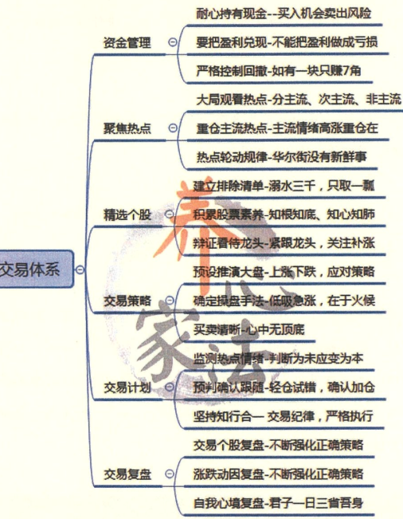

P70

## 韭皇超短

妖股的几个阶段: 个股->板块->情绪->反哺

首板：进攻容易防守难

## 团老师

一进二的节点：

2. 题材龙头断板次日的一进二
3. 

补涨龙 买强不买弱，能买一字，绝不买换手

## 洋神

快速拉伸，才能留得住筹码

它是怎么找到相同的 图形的，凭记忆？ 还是有工具

剑桥科技 230525


几万块炒股的没必要分仓，但是一定要看准，一定要有纪律性

模式一定要精进


打基础，要有基本功啊！！


洋神比较擅长做补涨


补涨需要结合市场的预期---预判的能力


龙头每天都给你买的机会，你参与了几个？？

## 板哥

https://www.bilibili.com/video/BV1ug41187tT/

如果后排跟风都顶一字的话，那一旦前排分期，后排会立马猝死。因为筹码断层了，一旦高标分期，后排分歧很难撤退，会走如跌停的极端走势，因此，后排走换手上去是最好的

医疗：容量大，和指数相关，需要和指数共振才能上涨，而信创等容量较小，指数较小的波动对其影响很小


短线盯盘：

1. 个股异动
2. 板块是否联动
3. 板块核心个股
4. 涨幅版、涨速榜
5. 

## 爱在冰川

## 高老师

### 人物分析

1. 会思考：深度思考
2. 有毅力：不管是玩游戏，还是做股票，或者其他事情。不达目的不罢休。“玩不到黄金就一直玩”
3. 行动力：能付诸行动，做股票前期每天复盘到5点，每天休息少。

股票能有多难？能比高考244名还难？说白了就是没有付出努力罢了。

### 零散

谷歌大模型
未联想到360


高老师：

本周 
周一高新发展负反馈
高新发展是做多的风向标


通化金马
反指
联合税务
整合生态


今天应该做
AI容量大票


对大环境的把控


基本功不到位

那个板块是正指
那个是反指


每个板块的核心是什么


不要学模式战法

判断大环境和情绪


行动力不足

**钱能解决大部分问题，所以需要解决钱的问题**


天塌了高个子的顶着


真诚是必杀技

有桃花，不出去溜达，也遇不到

### 听课20240128

买了3888的课程，不便宜，一定要学到东西


短线的核心：**赚钱效应**--资金的合力的体现

所以核心是资金的**<u>合力</u>**


元旦的一波：清源股份

12-25，扛着压力，3板，带着大盘往上走

走出来5板后，打出来赚钱效应。 --- 就是周三的换手板。这是合力

“看最高板没用”

27号清源抗住了分歧，

和亚世光电应该是最强的两字票

当时：算力、光伏，周四算力开出来就G了，所以剩下光伏

当时只剩光伏能和大盘共振了，这里只要大盘往上拉，就可无脑上光伏。

清源起来，把MR也带起来了，亚世光电回封。

清源带起来了 做多情绪。

这里有增量资金，能够容纳两个主线，没有形成互卡的格局

8000亿就能维持双主线行进

光伏起来，有踏空的资金，MR高标亚世光电也封住了，所以资金抢了五方光电  -- 周四确认了双主线-- MR + 光伏

29号五方光电把所有MR板块都拉起来了

元旦前和后可以理解为两波资金

元旦后2号，立鼎光电快速上板，直接把五方的预期卡掉了，五方兑现。为什么--前后两波资金没有达成共识，选的标的不一样。

这里有分歧，同时也产生了新的方向：尚纬股份、宝塔实业--- 军工、核电、化工，达成了合力

1-3智微智能反包，这里是形成和合力：元旦前的一波资金2号大跌，货肯定没出完

4号其他核心标的开得不好，直接做智微智能

5号智微智能卖公司：成交额接近实际流通？买不完

5号智微智能死掉，直接空仓，这两波资金做的票不能碰

同时另外一字票起来了：长白山，这是另外一波资金

因此长白山是上车点

3板长白山是一个上车点，why？ 其他的都是1、2波直接做的

长白山是一个新东西，本来不应该走超过3板，这里超预期了。同时消息发酵--南方小土豆

5号日久和雅博股份 都是地天，后者更强：MR的补涨太过于名牌了，雅博带动光伏，分时上也是雅博更强。

8号一定要盯这两只票--他们是做多情绪的代表。日久开出来就死，雅博高妙。这里雅博没买到，可以买清源股份。

另外还需要做长白山：短信做多情绪的体现，结合大盘、最高版


量化最活跃的地方：机器人、自动驾驶


8号高老师点了浙江世宝：试量化因子、活不活跃

**量化：助涨助跌，但是没有主动性**

浙江世宝动了：涨速榜上思进智能、爱仕达都可以做。

还有爱康科技，把大盘带起来了（LV国家队），所以也是10号观察的核心--雅博2.0


11号，鸿蒙集体高潮，这里是国家队的手法---只有鸿蒙能引领大盘往上走，光伏这些已经审美疲劳了，没有人跟。必须要引导新一点的题材。

这种大规模的板块移动，一定是国家队的手法，其他人没有这样的这样的实力。

11-深桑达A、高新发展

因此11号可以做鸿蒙的套


12号：深桑达、高新发展都走不出来，核心走不出来，就可以空仓 --- 高新发展代表整个短线做多的情绪。

尾盘有人翘高新发展（**这里大手笔翘班，非常重要**），华立股份也是一字。这也是国家队的手笔，说明还是想用华为来护盘。这里华力是核心


15号：华力高妙。14负反馈是中兴商业，15给了修复。拉高新发展，大港股份，半导体--国家队

16：核心华立股份，走不出来，空仓

17：华力给了地天--雅博3.0，因此盯着华立股份，做华立股份。  同时，高新、华立这些票代表着AI方向，需要关注。

18：AI方向剑桥启动，核心标的+容量载体

22：核心剑桥走不出来，空仓。 （老龙不过三）

23：核心剑桥修复，无脑做

24：中字头上海起来了，把剑桥推起来了，本来尾盘应该是跳水的。

25: 2425环境好做。24是普反行情。

26：分歧，去弱留强，需要做核心。中粮资本、中成股份，往核心大票一趟，非核心的小票都死得惨。 策略是买点后置，看中字头还是上海强，下午是上海强，因此这样做上海--上海贝岭

只有主升行情，20CM才好做。震荡行情20CM非常难做。

20CM只是10CM的套利。

明天29：周五本来应该有分歧，上海、中字头分歧，但是分歧不够，34板太多，那分歧一定是留到了明天，一定是大分歧。做核心的回封。 

看竞价，核心：腾达科技、上海贝利（套）、中粮资本、长江投资、中视传媒、中华企业

中字头应该走的更远，上海一直还一直，进不去，进去就是A杀

如果两天线都走不出来，那可能有新方向：信创。南天信息、英飞拓（为什么起这个？和之前的一样，有人预期分歧，不想做中字头、上海，因此做了信创的引领。和之前的一样，分歧的预期）。南天英飞拓也可能是特发的套，到底是不是新方向，看明天的走势

计划：买点后置，等待 上海、中字头PK，活下来的回封/地天


**这一套思路，需要理清楚，让大家给你抬轿子。对合力、对赚钱效应的追求**

**需要深入理解**

需要判断当天短线做多的情绪。

锚定点：当天什么票能代表短线做多、做空的情绪


什么龙头首音、术的层面 都没有太大的用。


央企市值管理消息：也有可能是卖公司，这个消息带来了足够的承接资金，看一下有没有公司出货就知道了

国家目前最大的问题：化债，这里把中字头拉起来，出货，然后把钱用来化债。


A股没有价值投资，只有价值投机


陆冲？新国家队？白手套？帮国家赚钱？

“49年入国军”

## 落叶知秋


钱才能给人最真实的自信--知秋

“不耻下问“：问了别人不会，也没损失什么，别人解答了不就赚了。--- 说实话你的思维太傻逼，你这种思维才是正确的。

一年一倍很简单：**管住手+正确的时间点跟随**

2023做两倍也是很简单的：往几个大票里面一趟-剑桥科技、中旭际创、塞力斯。。。可惜你没挣钱。

## 涛涛EXE

最穷苦的时候只有几十块钱。
这些做出来的人都经历过苦难。


行情是可以被定义的？

都是行情给的，而不是手法。一种手法在一种行情有效，在另一种行情可能无效。23年上半年小鳄鱼下半年LV。

## g界孙悟空

#### 拆一笔经典做盘手法

2024-02-03：https://mp.weixin.qq.com/s/_zAkMjwEG_EalhRhVPQbJg

拆解这个上海凤凰的经典大资金做盘手法

## 元子

连板看腾德

容量看LV


2024-03-19：单薄要断，走二波，高新发展，LV？

## 92科比

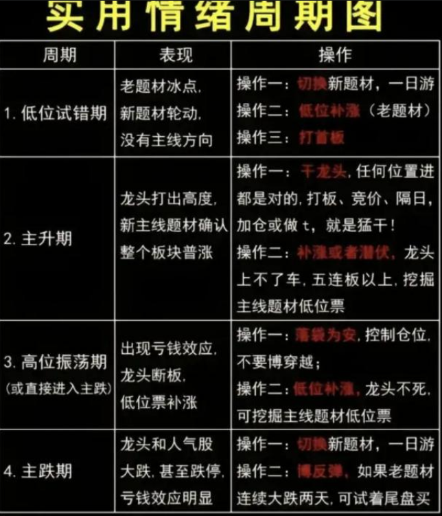

1，短线的核心
短线最核心的东西就是**人气带来的流动性溢价**，仅此而已。
2，短线操作思路的核心
龙头、补涨、切换。
3，绝大部分趋势股，都是披着外衣的投机股。但是，不少朋友对投机本质意识不清楚的。都是高位信了[中远海控](https://androidstatic.taoguba.com.cn/mSearch?searchContent=中远海控&type=2)，信了[天齐锂业](https://androidstatic.taoguba.com.cn/mSearch?searchContent=天齐锂业&type=2)，信了[军工](https://m.taoguba.com.cn/quotes/gn/军工)，信了诸多吹大故事的逻辑。最终由于不止损，一波的回撤，是相当大的。甚至，不少人拿的杠杆做的趋势，都有爆仓的风险。
4，资本害怕没有利润或利润太少，就象自然界害怕真空一样。一旦有适当的利润，资本就胆大起来。如果有 10%的利润，它就保证到处被使用；有 20%的利润，它就活跃起来；有 50%的利润，它就铤而走险；为了 100%的利润，它就敢践踏一切人间法律；有 300%的利润，它就敢犯任何罪行，甚至冒绞首的危险。
5，**股票就是筹码交换的游戏**。所谓的逻辑和基本面，就是用了骗取更多接力筹码的吹票手段。我们看透本质唯一做法，只能是在接力的时候，一定要看这个故事是否有更多的人来接盘。
6，补涨的心理逻辑
（1）
看到龙头不停涨，自己又不愿意追高，但却又很想参与。这时该题材是加分项，但随着高度增加而变减分项，如果此时有个低位人气品种（没有高位的减分）干柴烈火，想一想，踏空是不是比套牢还难受一一眼红效应。
（2）龙头把题材的逻辑演绎的淋漓尽致，那么补涨身上的标签自然被大众熟知，所以减少了分歧的过程，直接一致，这也是为什么补涨都异常凌厉一一模仿加速。
（3）做龙头的资金，赚了大钱，他是直接抽身离去？还是考虑在这个让他赚大钱的题材属性里继续折腾？一一赚钱效应溢出。
（4）除了在见顶那天接盘的资金，其他不愿意追高的资金亏钱了吗？有大面积的板块资金亏钱了吗？很想参与但没参与的人都还在场外，那么亏钱效应并没有大规模扩散一一亏钱效应并不显现。
（5）有些人连板不买，不愿意追高，但如果龙头出现断板，甚至调整20-30%之后，他们很愿意低吸，这就是追高买点不舒服，一定跌下来才舒服，所以我个人认为反包也是一种补涨。
总结：龙头断板时，赚钱的人想继续赚，而亏钱的人并没有扩大面积，所以补涨有了天时地利人和的环境。
一定得等到补涨都结束，想参与的人都参与了，想低吸的人都低吸之后，所有人都开始亏钱，才会进入主杀阶段。
7，补涨结束的征兆
1）做低位补涨的，不但没有利润，隔日开始亏损；
（2）做龙头低吸反包的，不但没有反包，继续亏损，甚至核按钮。
参与高位和低位的资金都开始亏钱，那么亏钱效应会扩大。此时原来题材属性变成减分项，拥有原来属性的股票杀跌凶猛。
接下来，进入切换试错期，但凡没有原来题材属性的股票和板块，都是资金愿意尝试的板块，直至试出新的资金聚焦点。
8，关于切换
切换的本质是改变共识，改变共识得有一个契机一一存量的萎缩（老周期的资金不断亏钱，不断被淘汰）和增量的加入（新周期的资金不断涌入），这里的新，一定是相对老的概念，完全不同的东西才是新。
改变大众共识一定发生在存量（老人、老周期）萎缩，受到惨痛教训之后，因此主跌之后才能真正寻找到不同的品种。
如果说四个阶段中，补涨和切换很难识别，但主升和主跌段却容易识别，那么就耐心等待主跌，主跌之后必定有切换的蛛丝马迹。
9，补涨与切换的区别
（1）周期区别。
补涨必定是在一轮情绪发酵高潮过程中的延续，不断延续，大前提是这轮周期没有岀现巨大的亏钱效应（主升+高位震荡两个阶段）；
而切换，必定是出现在情绪大幅受挫，受伤之后（主跌段之后的试错期）；
（2）形态区别。
补涨，一定是在当前和之前的炒作中，逻辑或者共性的发散过程（可以是同题材，可以是不同题材但有共性）；
而切换，一定是当前和之前的炒作完全不同，或者大部分不同，不同共性才能聚集起新的人气，因为老的共性都在散发亏钱效应（敌人的敌人就是朋友，一定要与敌人不同）

（3）高度不同。
补涨，因为资金畏高，所以必定会选择低位炒作，并且演绎方式更为激烈，更为暴利，[凯撒旅业](https://androidstatic.taoguba.com.cn/mSearch?searchContent=凯撒旅业&type=2) 对于[王府井](https://androidstatic.taoguba.com.cn/mSearch?searchContent=王府井&type=2) 的补涨9个一字板（同题材）；[光启技术](https://androidstatic.taoguba.com.cn/mSearch?searchContent=光启技术&type=2) 对于[中航沈飞](https://androidstatic.taoguba.com.cn/mSearch?searchContent=中航沈飞&type=2) 的补涨7个极致缩量加速板，等等。
而切换，因为在主跌之后，资金在回避亏钱效应，百废待兴的寻找新的聚焦点，有可能在此时有部分标的已经走出来30%-50%的涨幅，甚至部分前期独立的当前有二波预期，都可以作为切换目标，大的前提就是一定与之前的核心不同。
（4）成功率
补涨，在识别大的环境范围下，强调眼[快手](https://xueqiu.com/S/01024?from=status_stock_match)快，抢好东西；成功率较高，难在稍慢一步就买不到。
而切换，需要不断尝试，不断失败，强调的是控制仓位去感受，去找新的聚焦点，很有可能是你比市场还先找到方向，但市场还没来，导致自我怀疑。
所以切换的定义，必须要与之前的东西完全不同（或大部分不同）。切换阶段，为的是买新炒作周期的龙头，也就是涅盘讲的找预期差预判买。
当然，补涨和切换并不能非常明晰的区分清楚，尤其是在过程中，以为是切换，其实是补涨（有些共性在盘中没发现，盘后复盘才发现），都是回头看才能将其定义。
10，如何做预判？每一轮赚钱周期，亏钱周期的转化，多总结，多回顾。**市场的选美眼光，其实变化不大的**。所谓的预判，就是抓住市场可能会喜欢的去买入。
11、**中位股的风险最大**
做股票主要由三点：要么绝对的高位，要么绝对的低位，中位股的风险最大。高位就是做龙头。低位就是做首板或者一进二，要么就是做切换。切记切记不要去做中位股，**中位股是最危险的，尤其是在三进四、四进五时，淘汰率是非常高的**，如果没有十足的把握和逻辑，而去做中位股，你的账户是很难趋于稳定的。
12，如何寻找盈利的突破点
在方法上找到突破点，而不是在个股上。
13，新题材介入的最好时机，一个题材的内容并不是很重要，但一个题材岀现的时机很重点。当高位出现分歧或低位已经打出赚钱效应的时候，新题材往往是一个非常好的接入点。
14，养家老师的语录帮助最大，大家也可以去多理解。
15、题材炒作的时长
**一个大级别的题材炒作通常是一个半月到两个月**的时间。
16、量价与图形分析
这个东西没有一个固定的标准，把**大量的市场上走出来的票，去大量翻，大量去阅读，把它的量和图形都记忆下来。那你就知道哪个图形是好的，哪个量是可控的，这都是要去大量记忆的**。很多人企图去量化短线这么做，其实这个是很难实现的，它都是一个很模糊的、很动态的的东西。
17、确定龙头的常见模式
常见模式就是反包二板，确定龙头低位。好的妖股都是换手走出来的，一路换手，一路分歧，你看好，我不看好，这样才能走出来。一旦大家都认为好，都去顶一字的话，一般就不会走太远。
18、反包二板通常是个好的买点
**一字板打开之后，如果有一到两天的换手，再反包起来，反包第一个是栏板,第二个是加速板，一般是个好的买点。反包二板可以确认一个股票的二波启动，反包首板，第二天可能会被闷杀。很多大游资都有打反包二板的惯。**
19，超短的止损
超短做的是隔日，当股票的走势与自己的预期不一致的时候，一定要杀伐果断，坚决止损。即使后面该股票又涨起来了，但这波上涨和你的预期是没关系的，不要因为这个而去否认之前的止损行为。
20，要不断的修正自己的错误
在股市做短线，你需要**不断的去否定自己，不断的去修正自己的观点**。如果你这个人很固执，很执着，自命不凡，那么你在股市里是走不出来的。股市就是个经常打脸的地方，一旦打脸了，你就要修正自己的观点。
21，关于题材的持续性
持续性需要题材不断的有新闻发酵，赚钱效应不断的延伸。通过今天的赚钱效应看明天的行情，明天的赚钱效应看后天的行情。只需要判断明天能参与什么题材就行了。要想看到更远的行情，那是不切实际的。超短是做隔日的，今天打的板就是为了赚明天的钱，除非明天超预期了，那么可以多拿一天。
22，怎么根据主流题材来操作
在主流题材亏钱的情况下，可以切换注册制次新、可转债、超跌，也可以切换一些新的题材，主流赚钱效应出来以后，可以做一些低位的补涨，只要这个票够低价，够小盘一定会有人给你接力的，同题材的中位股是亏钱效应最高的。
23，第二天不涨停基本都会卖
第二天不涨停，基本都会走，除非一些有地位的龙头股，不涨停的话，如果看好反包，可以锁一下仓。
24，买龙头的好处
**龙头有多条命，有反包机会，有二波机会**。
25，妖股大多是低价股
妖股大多是低价股才容易走出来，低价为王。
26，怎么判断赚钱效应与亏钱效应
看“昨日涨停股今日表现”。昨日涨停的今天都基本没有溢价，那就是亏钱效应。昨日涨停的今天溢价多，那就是赚钱效应。
27，什么是股性
股性就是需要回顾它的历史，连板的成功率、每次涨停的溢价率、每次涨停后的放量大不大，这就是它的股性。
如果你一个股票每次涨停都能给打板的人吃肉，那么它下次涨停的时候就会有更多人来打板。如果一个股票每次都能连板，那么下次它的涨停就会有人来接力，这就是形成于大家每个人心里的东西，就会形成一个股票的股性。
28，高位核按钮对低位的影响
高位核按钮对低位影响不大，高位龙头挂了，有时反而有助于低位补涨。
29，什么是弱转强
**当天烂板一般第二天竞价会很低，但是开盘后买盘很凶，溢价预期很低的股票第二天表现优异，就是弱转强**，第三天可能强转强，一般是卖点，因为很可能后面就是强转弱。
30，如何看待尾盘拉涨停
尾盘偷鸡板，这种也算是弱板，然后竞价低开之后直接就往上扫了，这种也属于弱转强。
31，弱转强的买卖点
取决于你的预期，每个人预期不一样，卖点就不一样。弱转强不喜欢竞价高开，竞价高开属于做盘的迹象太明显了，弱转强不是体现在竞价上，而是被买上去的，弱转强只能扫板，因为是缩量的，容易买不到。
32，涨停板的接力
缩量板和一字板对接力的资金是很不友好的，一般你第二天就不想接，因为里面好多获利盘。昨天是个换手栏板，今天弱转强后接力的人反而会多一点，市场更加热衷于换手，死亡换手一般是不会弱转强的，死亡换手就是换手率超过70%。
33，地天板可以打吗
如果是合力很强的地天板可以打板，因为有超高人气，题材持续性看赚钱效应，6个板以上的票都会出现弱转强。
34，怎么学做龙头
<u>参与龙头需要体验一下，把感觉记录下来，下一次自己就有感觉了，不断去体验市场，不断去修正自己，三五个周期下来的话，就知道什么时间点做龙头，什么时候做切换</u>。
35，如何复盘
首先把当天涨停的股票过一遍，然后再看看昨天涨停的股今天的溢价，再看看这些涨停的股票,有没有非常有欲望的，然后再看看首板的票有没有什么新闻，根据新闻去挖掘一些票之类的，这些都是要做的功课。
36，形成对股票的世界观
首先模式是正确的，不能走弯路，不能没有模式。你要不断的去试错，你要经常看你的交割单，哪些东西是让你挣钱，哪些东西是不能让你挣钱的，你要不断的去修正和调控自己。股票做的好的人肯定是个总结能力很强的人，他能找到规律，能找到自己擅长的东西。我常说“大道无形”，做短线的人，首先要有个对短线的世界观，比如世界观里要有“龙头”、“补涨”、“切换”三个大主题，然后再往里面填东西。首先“龙头”里面要填：龙头的成交量怎么看？龙头的换手怎么看？历史上有多少龙头？多少人气？你都要回顾，龙头的筹码交换、成交量各方面的东西，**经历过的龙头都要去总结**，把这块东西填满你的理解力。然后再进入下一步“切换”，做低位怎么选股？补涨是什么时机？在出现亏钱效应做补涨？还是在高位赚钱效应最好的时候做补涨？你把它们出现的时机都记录下来，都把他们理解出来。然后再说“切换”，你回顾一下，当年每一次可转债炒作起来的时机点，每一次当时的市场环境，包括上一波注册制新股炒出来的时机点，包括前几年还炒过的高送转的时机点，都要去理解，再把下面这个题填满。每一环节都填满了，你就形成了一个对股票的世界观，这个世界观里面，你再套在每天的盘面里面去理解。[顺控发展](https://androidstatic.taoguba.com.cn/mSearch?searchContent=顺控发展&type=2) 是龙头的时候，你在龙头的世界观里怎么理解这个。很多人可能没有参与顺控，但你不能没有参与它，就忽视它，它整个走出来的过程，它每个板的图形，每个板的氛围，你都要试着去理解它，哪怕今天一个顺控不能提高你对龙头的理解，那么下一个龙头再出来，你也可以回顾一下之前的君正、[东方通信](https://androidstatic.taoguba.com.cn/mSearch?searchContent=东方通信&type=2)、[贵州燃气](https://androidstatic.taoguba.com.cn/mSearch?searchContent=贵州燃气&type=2)，所有这些有地方的龙头当初的氛围是怎么样的，你反复的去博弈自己，反复的让自己理解出来，你不能去偷懒，这些东西都填充在你大脑里面。就会让你有些“大道无形”的感觉，这种感觉到了，你就买了。做的好的游资就是这样说的，不可能说有一本书可以告诉你什么时机什么时候可以买。不会的，感觉到了，就买。那么这个感觉是怎么出来的，就是这么长时间，不断的去研究龙头琢磨的，细节是总结出来的。那做“补涨”也是一样，什么时期做不了？每个题材都有补涨，那什么时候去做？什么时候去挖掘？补涨的图形是什么？这是要长时间积累的，然后把整个炒股世界观填满了,那你就非常厉害了。
37，关于悟道
悟道不是一天就可以点成功的。你长期做股票，你突然发现自己假如可以3个月都赚钱，或者6个月都赚钱了，且账户曲线趋于稳定了，就是悟道了。有时候对于很多人来说，暴涨并不一定是好事，暴跌肯定也不好了，但是稳定是最重要的，慢就是快，因为复利是很可怕的。
38，悟道的表现形式
每个阶段该怎么应对，每次回撤都可控了，自己有把握了，长期坚持下来，自己越来越自信了，亏了知道怎么赚回来，慢慢自己就有正反馈，只要每个月没有大起大落，每次亏损的那个坑都能起来，自己越来越有把握，就算悟道了。所以反对梭哈，梭哈大亏会让你心态崩了，祝福大家能走出来，不要心急

# 宏观

## 宏观分析

### 2023-09-04

当前两个重点的问题：

- 房地产和地方债务的问题
- 汇率的问题：汇率降低，北向资金不会净流入

## 底

### 市场底

如何判断？

1. 恐慌盘
2. 人人都预期市场底来了，市场底一定没来

### 政策底


## 宏观指标

### CPI

消费者物价指数（CPI），涵盖全国城乡居民[生活消费](https://baike.baidu.com/item/生活消费/6416933?fromModule=lemma_inlink)的食品烟酒、衣着、居住、生活用品及服务、交通和通信、[教育文化](https://baike.baidu.com/item/教育文化/1919630?fromModule=lemma_inlink)和娱乐、[医疗保健](https://baike.baidu.com/item/医疗保健/5996450?fromModule=lemma_inlink)、其他用品和服务等8大类、262个基本分类的商品与[服务价格](https://baike.baidu.com/item/服务价格/2945302?fromModule=lemma_inlink)

居民消费价格指数（Consumer Price Index，简称 CPI），它是度量一组代表性消费品及服务项目价格水平变动程度的相对数，用来反映城乡居民所消费商品及服务价格水平变动情况的宏观经济指标，CPI 报告期为月度


调查方法

采用[抽样调查方法](https://baike.baidu.com/item/抽样调查方法/1503752?fromModule=lemma_inlink)抽选确定调查网点，按照“定人、定点、定时”的原则，直接派人到调查网点采集原始价格。数据来源于全国31个省（区、市）500个市县、8.8万余家[价格调查](https://baike.baidu.com/item/价格调查/5343581?fromModule=lemma_inlink)点，包括商场（店）、超市、[农贸市场](https://baike.baidu.com/item/农贸市场/10873619?fromModule=lemma_inlink)、服务网点和互联网电商等

计算公式

CPI=（一组固定商品按[当期价格](https://baike.baidu.com/item/当期价格/2401779?fromModule=lemma_inlink)计算的价值除以一组固定商品按[基期价格](https://baike.baidu.com/item/基期价格/1318088?fromModule=lemma_inlink)计算的价值）×100%


作用：

1. 反映通货膨胀 ( 紧缩 ) 的程度。通货膨胀是指流通中的货币数量超过经济实际需要而引起的货币贬值和物价水平全面而持续的上涨。测定一定时期通货膨胀（紧缩）程度有不同的方法，但应用最普遍的就是通过物价指数（CPI 或PPI），即以物价总水平上涨率（即物价指数减去基数 100% 的结果）作为通货膨胀率。严格地说，CPI 或 PPI 并不等于通货膨胀率，因为 CPI、PPI 都只反映了它们调查对象的价格变化，而不能代表全社会所有商品的价格变化，但从这两个指标的变化中，可以看出价格变动的大趋势。一般将 1%—3% 的年度 CPI 上涨率称为爬行的通货膨胀，将 3%—6% 的年度 CPI 上涨率称为温和的通货膨胀。超过10% 的物价上涨率应引起重视。我国从 1985 年开始统计全国的 CPI, 从 1985 年至2019 年的数据来看，CPI 最高涨幅出现在 1994 年，年度涨幅为 24.1%。下图是2000 年至 2019 年共二十年的 CPI 年度走势，除了 2002 年、2009 年 CPI 分别比上年下降 0.8% 和 0.7%，其他年份 CPI 涨幅从 0.4%—5.9% 不等。
2. 用于国民经济核算。在 GDP 核算中，通常使用居民消费价格总指数及分类指数，对相关现价总量指标进行缩减，剔除价格变动因素的影响，实现不同时期经济指标之间的可比，从而计算不变价增长速度。
3. 可用于计算货币购买力。CPI 的倒数通常被视为货币购买力指数，即货币购买力的变化与 CPI 的变化成反比关系。

### UBI

**无条件基本收入**（英语：Unconditional Basic Income），简称 UBI ，又称为**全民基本收入**（Universal Basic Income）或**基本收入**（Basic Income），[[1\]](https://zh.wikipedia.org/wiki/無條件基本收入#cite_note-1)是指没有条件、资格限制，不做[资格审查](https://zh.wikipedia.org/w/index.php?title=資格審查&action=edit&redlink=1)，每个国民或成员[[注 1\]](https://zh.wikipedia.org/wiki/無條件基本收入#cite_note-2)皆可定期领取一定金额的[金钱](https://zh.wikipedia.org/wiki/金錢)，由政府或团体组织发放给全体成员，以满足人民的基本生活条件，包括食物、居住、教育、医疗、[公用事业](https://zh.wikipedia.org/wiki/公用事業)等基本花费，借由经济的保障，以落实基本人权[[2\]](https://zh.wikipedia.org/wiki/無條件基本收入#cite_note-3)。无条件基本收入与最低工资的区别在于不需要工作也可以获得该收入，而最低工资是以参加工作为前提条件获得的最低收入。目前没有政府组织或团体在国家层面实施这一政策，但在一些国家有定点实验或相应的政治讨论

### TMT

**TMT分别代表：**

**科技**技术、**媒体**媒体、**电信**电信。

– **Technology** 指的主要是以互联网科技（IT）为主体的计算机技术。

– **Media** 指的主要是以互联网、固定互联网、移动互联网为载体的新媒体。

– **Telecom** 指的是为互联网提供基础设施的服务。


TMT产业是以**互联网等**媒体为基础，将高科技公司和电信业等行业链接起来的**新兴产业**。

# 文章阅读

超短交易的本质就是一个旁氏骗局，索罗斯曾说过，经济史就是永无止尽的上演假话和谎言，而不是真理。要获得财富，做法就是认清其假象，投入其中，然后在假象被公众认知之前退出[游戏]

## 七条定律

一，七条定律：

1，在明确了股票进入上升通道中的每一次回调都是上车的机会，股价不会一直涨，适当的是回调是为了更好的蓄力。

2，只要股票的上升趋势没有改变，那么即便是股价下跌也是可以进场的。

3，一旦明确了股票是进入下降通道，那么中途的每一次反弹都是给到出货的机会，趋势走坏的个股想要反弹起来那是相当不容易的，这样的票不要死拿，不仅亏钱浪费时间还会搞坏心态。

4，当股票趋势不明朗时，每一次的上涨就是减仓的理由，突然的上涨可能是主力骗炮，也有可能就是渣男，不上也不下横着不动，预期浪费时间还不如趁早离场。

5，当股票趋势不明朗，上涨无力时，即便是跌的再多，也不是你抄底的理由，可能底还在十八层，最为明智的选择就是观望。

6，当股价下降趋势已经明确，即便是在看好也要等出现企稳之后再考虑进场。

7，当股价经过长时间的横盘或者是下跌后开始反转，即便是解套了也要守住，长期的下跌，横盘很有可能是主力的洗盘行为，春天很快便会到来。

二，四个不要:

1，不要侥幸，不论你炒股多久，都要记住你永远是市场的学生，当你认识到自己错了，那就要勇于认错，果断离场，不要抱有任何幻想，也不要用补仓来挽救。

2，不要逆势，炒股一定是要顺势而为的，你就是市场的一粒沙尘，蚂蚁与大象做对，你觉得谁厉害？

3，不要冲动，对于每一次操作都要有计划的进行，想要达到什么样的目标，接受的亏损程度是多大都要有一定的预期，一旦到了就要果断的止盈止损，切记不要紧靠一腔热血操作，冲动是魔鬼。

4，不要频繁操作，炒股要有自己的交易体系，不要想着今天买明天卖，这样不仅浪费高昂手续费，还可能拣了芝麻丢了西瓜，想想是不是如此？

三，三个坚持：

1，坚持学习，技术，指标都要学，但是不能盲目，选择自己容易学懂的用精就可以了，技术不在于多，有两三个好用的便足够。

2，坚持只赚认知内的钱，超出认知范围的，那就放弃吧，只做自己看的懂的。

**坚持满足的原则，炒股切记贪婪，盈利的票什么时候卖都是对的，不要奢求卖到最高点**，就是巴菲特也做不到，纸上富贵终究不是真，到了手里才是真实的


# 股票知识

## 基础知识

### 分类

我国：

- A
- B
- H
- N
- S

最常见：沪深京A股:

- 60开头： 上证A 股
- 0开头：深圳A股
- 3开头：创业板(去证券公司开通)
- 688开头：科创板(最低50W资金)
- 8或4开头：北京A股

### 涨跌幅

A：

- 0/60开头的：10%
- 3创业板：20%
  - 新股第一天 44%(68除外)
- 68：前五个交易日无限制，后面 20%
- ST股：亏损股， 5%
- 8/4：首个交易日无限制，后面30%
- 

### 分时图

白线：分时图走势，时间-价格图

### 分时均价

分时均线也称[成本均线](https://baike.baidu.com/item/成本均线/1562388?fromModule=lemma_inlink)。分时均线由[均价线](https://baike.baidu.com/item/均价线/8608134?fromModule=lemma_inlink)和分时股价线两条线组成，均价线由黄色线表示，分时股价线由白色线表示。

与[K线图](https://baike.baidu.com/item/K线图/85028?fromModule=lemma_inlink)上以每天[收盘价](https://baike.baidu.com/item/收盘价/648023?fromModule=lemma_inlink)作为[统计](https://baike.baidu.com/item/统计/221142?fromModule=lemma_inlink)依据的[均线](https://baike.baidu.com/item/均线/547175?fromModule=lemma_inlink)不同，均价是以盘口总[成交额](https://baike.baidu.com/item/成交额/2773465?fromModule=lemma_inlink)除以盘口总[成交量](https://baike.baidu.com/item/成交量/649336?fromModule=lemma_inlink)的运算方式测算当前每一股的平均[成交价](https://baike.baidu.com/item/成交价/460586?fromModule=lemma_inlink)，十分精确地统计出当前所有参与者的综合[持仓成本](https://baike.baidu.com/item/持仓成本/8439203?fromModule=lemma_inlink)。因此，有了这条[均价线](https://baike.baidu.com/item/均价线/0?fromModule=lemma_inlink)，我们就可以在盘面做一些简单的推理**：**

1.当股价持续在均价线上方[运行时](https://baike.baidu.com/item/运行时/3335184?fromModule=lemma_inlink)，表明市场预期较好，[买盘](https://baike.baidu.com/item/买盘/11034643?fromModule=lemma_inlink)踊跃，当天介入的大部分投资者都能赚钱，这是盘口强势特征；

2.当股价持续在均价线下方运行时，表明市场预期较差，[卖盘](https://baike.baidu.com/item/卖盘/11034651?fromModule=lemma_inlink)踊跃，当天介入的大部分投资者都亏钱,属弱势特征；

3.当均价线从低位持续上扬时，表明市场预期提高，投资者纷纷入场推进股价上涨，综合[持仓成本](https://baike.baidu.com/item/持仓成本/0?fromModule=lemma_inlink)不断抬高，对股价形成支撑；

4.当[均价线](https://baike.baidu.com/item/均价线/0?fromModule=lemma_inlink)从高位持续下挫时，表明市场预期较差，投资者纷纷离场迫使股价下跌，综合持仓成本不断下降，对股价形成压制。

一般来说，昨天收盘价是今天盘口多空力量的[分水岭](https://baike.baidu.com/item/分水岭/2651375?fromModule=lemma_inlink)，如果开盘后半小时内均价线在昨天收盘价上方持续上扬，那么，该股属极强势且当天收出中长阳的概率较大；开盘后半小时内均价线在昨天收盘价下方[持续创新](https://baike.baidu.com/item/持续创新/3905712?fromModule=lemma_inlink)低，该股属极弱势且当天收出中[长阴](https://baike.baidu.com/item/长阴/1078148?fromModule=lemma_inlink)的概率较大。

均价线是超级短线实战的一个重要研判工具，它与[分时走势](https://baike.baidu.com/item/分时走势/6824478?fromModule=lemma_inlink)交叉错落，如影随形，临盘运用因人而异，特别当一轮极端炒作的主升浪行将结束之时，盘口拉高的股价突然一改强势上攻个性，击穿均价线后大幅回落，此后如果均价线失而复得，得而复失，则是[超短线](https://baike.baidu.com/item/超短线/166934?fromModule=lemma_inlink)出局信号。


### 除权除息


### 新股、次新

新股就是指刚发行上市正常运作的股票。次新股是指已经上市一段周期的，分为远端次新和近端次新。

一般涨幅较好的都属于近端次新，远端次新如果没有太大的题材或业绩支撑，很难走出一波像样的行情。

上市半年内可为新股 ，上市半年以上到一年多的可作为次新股。实际上，所指的时间不是绝对的只是一个大约区间。

一般次新股是上市半年以内的股票，由于在行情低迷时新股发行价格较低，因此当行情变好时，次新股由于套牢盘会比较少容易受到追捧。次新股暴涨的原因包括近期市场无热点，资金缺乏去处，而次新股盘子小风险小吸筹较为容易的特点，所以蜂拥进入次新股板块。另外就是庄家可以抱团热炒次新股，通过对敲的方式，其目的或为割韭菜。

### 限售股

A市场的限售股，主要由两部分构成：一类是股改产生的限售股；另一类是新股首次发行上市(IPO)产生的限售股。

### 融资融券

融资：借钱

融券：借股票


两融余额：融资余额、融券余额

1. 融资余割：投资者每日融资买进与归还借款间的差额
2. 融券余额：每天收盘后累计发生的向券商借股票卖出尚未还全的折算额

融资余额若长期增加时，表示投资者心态偏向买方，市场人气旺盛，属强势市场；反之则属弱势市场。

融券余额增加，表示市场趋向卖方；反之则趋向买方。

### 老鼠仓

**老鼠仓**，指[基金经理](https://zh.wikipedia.org/wiki/基金经理)等人用自有资金买入[股票](https://zh.wikipedia.org/wiki/股票)后，用[基金](https://zh.wikipedia.org/wiki/基金)里的客户资金（如自己控制的机构资金，[证券投资基金](https://zh.wikipedia.org/wiki/证券投资基金)资金）拉高相应股票价格后，通过出售个人事先购买的股票进行[套利](https://zh.wikipedia.org/wiki/套利)的行为。这是一种以损害客户利益为手段自肥的[犯罪](https://zh.wikipedia.org/wiki/犯罪)行为。 老鼠仓是一种营私舞弊，损公肥私的腐败行径，具体指庄家在用公有资金拉升股价之前，先用自己个人（机构负责人，操盘手及其亲属，关系户）的资金在低位建仓，待用公有资金拉升到高位后个人仓位率先卖出获利，与腐败干部别无二致，取自谚语：硕鼠硕鼠，无食我黍，故名老鼠仓。

### 股息率

**股息率**（[英语](https://zh.wikipedia.org/wiki/英語)：Dividend yield）的定义是[每股股息](https://zh.wikipedia.org/wiki/股息)（现金股利）除以[每股股价](https://zh.wikipedia.org/wiki/股價)[[1\]](https://zh.wikipedia.org/wiki/現金殖利率#cite_note-1)[[2\]](https://zh.wikipedia.org/wiki/現金殖利率#cite_note-法意研究部2012-2)，通常以[百分比](https://zh.wikipedia.org/wiki/百分比)表示。

例：现金股利为1元，股价20元，则股息率为5%；若来年配息仍为1元，股价已至25元，则股息率降为4%。

若股票的股息率大于[定期存款](https://zh.wikipedia.org/wiki/定期存款)的[利率](https://zh.wikipedia.org/wiki/利率)，一般会称为“**定存概念股**”

### 交易所

#### 北交所

BUG：大股东减持无限制。
如果游资太激进，那大股东就把公司卖给你

## 指标

### 现手&总手

总手是指当日开盘时到即时这段时间内的股票成交量总数量

现手是指现时买卖双方达成的成交量。所以总手是指到当前的所有成交量。对于一只股票最近的一笔成交量叫现手，从开盘到即时的成交量叫总手。

现手累计数就是总手数，即成交量

总手数与流通股数的比称为换手率

总手与内盘、外盘的关系是：总盘=内盘+外盘

量比是衡量相对成交量的指标。它是开市后每分钟的平均成交量与过去5个交易日每分钟平均成交量之比。

量比=现成交总手/〖(过去5个交易日平均每分钟成交量)×当日累计开市时间(分)〗


```text
如果甲下单5元买100股，乙下单5.01元卖300股，当然不会成交。5元就是买入价，5.01 就是卖出价。

这时，有丙下单 5.01元买200股，于是乙的股票中就有200股卖给丙了(还有100股没有卖出去)，这时候，成交价是

5.01元，现手就是2手即200股，显示2，显示的颜色是红的。

还是上面的情况，如果丁下单5元卖200股，于是甲和丁就成交了，这时候成交价是5元，由于甲只买100股，所以成交了100股，现手是1，颜色是绿的。更多股票知识请访问棒槌网

因此，主动去适应卖方的价格而成交的，就是红色，叫外盘。主动迎合买方的价格而成交的，就是绿色，叫内盘。
```


### 内盘与外盘


### 量比


## K线

#### 大长腿

股票在当日运行过程中，下探幅度很大，收盘时股价最终回归到开盘价或高于开盘价，此时在K线图中将反映出很长的下影线

特征：具有一定实体，下影线明显较长，至少是实体幅度的一半以上；没有上影线，或者上影线较短

一般说，产生下影线的原因是多方力量大于空方力量而形成的。带有下影线的K线形态，可分为带下影线的阳线、带下影线的阴线和十字星。要精确的判断多空双方力量，还要根据不同的阶段做出判断

1、处于相对低位的长下影线，称之为“大长腿”，也叫“定海神针”，是见底的确认性信号；

2、处于相对高位的长下影线，称之为“空方试探”，是股价即将大幅下跌的确认性信号

#### 常见K线形态


https://zhuanlan.zhihu.com/p/90282474

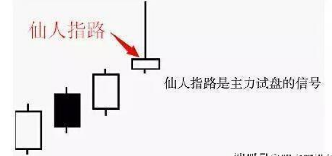

## 基金

从二季度开始基金赎回幅度逐步加大，加上2024年初就是之前3年限售基金可以赎回，基金的赎回压力只会更加的大。而我们看看几个大市值股票的融资强度，[贵州茅台](https://xueqiu.com/S/SH600519?from=status_stock_match)195亿的融资，[宁德时代](https://xueqiu.com/S/SZ300750?from=status_stock_match)86亿，[牧原股份](https://xueqiu.com/S/SZ002714?from=status_stock_match)现阶段是74亿，今年最高的时候是115亿左右，今年从50跌到现在的31，看趋势还有很大的下跌空间。所以接下来还是谨慎对待市值超过2000亿的股票，这些大市值能享受这个溢价并不是因为业绩有多优秀，而是过去基金抱团和外资净买入所导致的虚高。随着抱团瓦解，基金赎回潮的袭来，加上外资持续流出，这些过去的龙头最少也需要3到5年才能恢复上涨趋势。从2022年算的话，最少明年才能调整完，而贵州茅台，宁德时代这类型下跌空间可以用增长去弥补，而一些跟风的后排肯定是从哪里来回哪里去的
链接：https://xueqiu.com/2247489483/263999955

## 量化

### 量化投资

#### 基本概念

美国的前五大对冲基金全部都是量化投资，美国量化策略在股市中的占比超过70%


#### 发展历史


#### 编程 & 机器学习

对于量化金融来说，主流的编程语言有Python、R、MATLAB、Java、C++等。从开发难度而言，Python、R、MATLAB相对比较简单，Java和C++比较难；从运行速度来说，C++是最快的，因此常用于高频交易。

从量化资源而言，Python的资源要比R和MATLAB要更多，这也是因为Python在量化投资领域更为主流。


通过开发算法模型等方式吧

#### 量化识别

1. 分时坑坑洼洼上蹿下跳--图狗啃的
2. 没有大单：一般没有超过5万
3. 板块：超导、减速器、食品饮料、环保

#### 场内、场外

场内是指在证券交易市场交易的股票。

场外则相反，是证券市场、债券市场等交易的。

场内基金：是关联股票的，因此是T+1的，

场外基金：则是T+0的

## 指数

上证50，茅台占比18%

沪深300，茅台占比6%

### 深圳成指

深证成份股指数（简称深证成指）与深证综合指数（简称深证综指）均是深圳证券交易所编制和发布的股价指数。深证成指是一种成份股指数，是从深圳证券交易所挂牌上市的所有股票中抽取具有市场代表性的40家上市公司的股票作为计算对象，并以流通股为权数计算得出的加权股价指，综合反映深交所上市A、B股的股价走势；深证成指的基日为1994年7月20日，基日指数定为1000点，于1995年1月23日试发布，1995年5月5日正式起用。深证综指以深圳证券交易所挂牌上市的全部股票为计算范围，以计算日总股本数（即发行量）为权数加权计算股价指数，综合反映深交所全部A股和B股上市股票的股价走势；深证综指以1991年4月3日为基日，基日指数定为100点，1991年4月4日开始发布。除了上证股价指数、深证成指和深证综指之外，深沪交易所还根据投资者需求编制了沪深300、上证50、中小板指、创业板指、B 股指数（上证）、成分B 指等，分别反映不同范围的股票价格变动。

深圳A指：深圳综指中的A股部分？

## ETF


# 书籍阅读

## 狙击涨停-短线打板高手技术进阶

### C1-涨停盘口语言

#### 集合竞价抓涨停

##### 集合竞价

股价涨停是一种市场买力极强、多头占据绝对优势的交易行为，它的意义主要有三种：吸筹、拉升和出货

在这段时间里申报的所有价格都是平等的，不需要按照时间优先和价格优先的原则交易，而是按最大成交量的原则来确定股票的价位

三个基本原则：高于集合竞价产生的买入申报全部成交；低于集合竞价产生的卖出申报全部成交；等于集合竞价产生的买入或卖出申报，根据买入申报量和卖出申报量的多少，按少的一方申报量成交

(1)9:15—9:20这5分钟可以委托买卖，也可以撤销委托的单子，所以在这个时间段看到的匹配成交量可能是虚假的。很多主力在这个时间段大单买进股票制造强势假象诱导投资者买入，然后主力在9:19:59之前撤单，因此在这个时间段要多关注最后几秒钟主力撤单情况

(2)9:20—9:25这5分钟可以委托买卖，但不能撤销委托的单子，了解这个时间段的竞价才有意义。所以，投资者这5分钟一定要看准后再委托单子

(3)9:25—9:30这5分钟不叫集合竞价时间，但是电脑在这5分钟接受买卖委托，也可接受撤单，但不做处理。对于高手而言，可以在这5分钟换股票，如集合竞价卖出股票后，资金在9:25就可利用，可在9:26买进另一只股票。

9：25-9：30不能挂单也不能撤单，指的是交易所对证券公司，在这5分钟里，股民可以正常下单，但只是暂存在券商的系统里，9：30才提交到交易所

##### 竞价选股方法

如果某只股票前一天是上涨走势，收盘时没有成交的买单量很大，当天集合竞价时又跳空高走，并且买单量也很大，那么这只股票发展为涨停的可能性就很大

分析研究集合竞价时，务必结合该股前一天收盘时所滞留的买单量


集合竞价选强势股思路：

1. 9:25集合竞价结束，选择量比前30
2. 涨幅2-4%
3. 配合热点概念，板块个股利好消息，MACD、K线形态必须是做多形态，均线多头，流通盘较小
4. 关注第一单的多空力量和开盘后的3笔成交是否持续超大多单。第一单是买入还是卖出，反映的是主力在开盘阶段买入意愿的强度；而是否持续超大单买入，则反映的是主力的介入意愿是持续的，还是以高开拉出出货空间。
5. 选择涨幅不大的个股，防止拉高出货，最近有涨停板的更佳。涨停板是主力进场和甩开成本区间的盘面表现，近期有过涨停板的往往意味着主力阶段性布局的完成
6. 抓住放量过前头的、跳空过平台，连续下跌突然放大量高开的个股


集合竞价抓涨停：

1. 选择市场热点--情绪
2. 流通盘较小
3. 股性活跃，基本面不差
4. 比较强势的庄家股


集合竞价买入：快准狠

1. 快：涨幅榜、量比
2. 准：几分钟分析完毕，非一日之功
3. 狠：看准后，不犹豫

##### 竞价抓板

使用量比：VR

开盘后每分钟的平均成交量与过去5个交易日每分钟平均成交量之比

量比虽然是越大越好，但是超过70的时候未必是好事，要防止大换手率高位出货，第二天大幅低开，进去不见得会有收获。


反转跳高竞价买入法：

反转跳高买入条件：前一天跌幅超过4%，当日开盘价跳高开盘3%以上。集合竞价期间量增价升更佳，第一手巨量成交优先。

买入方法：集合竞价期间反复快速翻看涨幅3%以上的个股（在2%~4%之间做弹性处理，越接近3%越好），看前一天的跌幅，如果跌幅在4%以上（越大越好），马上盯住，快速下单。然后在9:24:30左右确认买入（以防最后时刻开盘价下杀，不符合反转跳空模式）。这是一个非常好的超短线套利手段，投资者应多加关注、试验，关键是第一时间得买入，以免追高。必须集合竞价期间买入

##### 集合竞价核心战法

集合竞价需要观察什么？主要关注**成交量、高开幅度和竞价分时**，观察盘中量能是否放大、分时形态以及市场承接。这里竞价分为两种情况考虑。

1. 成交量：集合竞价成交量放大到和首板爆量相同最佳，最差也要到一半。
2. 高开幅度。高开幅度为3%~5%或7%~9%有一定价值。如果竞价高开在6%左右是鸡肋，既不如高开7%~9%证明强势，也不如高开3%~5%位置相对安全

总结：二板集合竞价，高开幅度越大，成功率越高。主要观察成交量、高开幅度和竞价分时。

#### 挂单、密度、速度

分时涨停盘口要素包括大单挂单、成交密度和上涨速度三方面。大单挂单的出现，表明主力向涨停发起进攻的信号；成交密度的大小则反映出主力发动攻击后，市场的响应程度；而上涨速度的快慢，则提示该股的涨停属于什么性质（吸筹、拉升或出货）的涨停

##### 大单挂单与成交

一般大盘股在2000手以上，中盘股在800手以上，小盘股在200手以上

大单挂单可分为四种情形：**压盘式挂单、托盘式挂单、夹板式挂单和连续式挂单**。

1. 压盘式挂单：这种挂单方式在委卖档中，连续出现三档以上的大卖单，其目的是想让市场知道该股上方抛压很大，让盘中散户选择抛出，这是主力在拉升前进行最后的试盘
2. 托盘式：连续几档大买单
3. 夹板式：上有抛压、下有支撑
4. 连续式

##### 成交密度与涨停

成交

密度是指股价拉升中所出现的成交频率，在一分钟的单位时间里成交的紧密程度

一般而言，成交密度越大，说明参与者越多，成交越活跃，涨停的概率就越大；反之，则越小

##### 上涨速度与涨停

速度越快，盘面气势越强，表明主力决心越大

上涨速度有两种走势：跳跃式上涨、斜坡式上涨

1. 跳跃式上涨是指股价在经过一段盘整之后，突然摆脱盘整区域而快速上涨。这种"跳跃"往往是用一两笔大单快速敲开挂在上方的大卖单，然后一路扫去，股价呈现出跳跃性的上升。分时图呈现出一条接近90度的上冲线直至涨停，经常形成分时"跳空"现象。有时候，往往也会上冲到某一价位时继续盘整一段时间，然后再次"跳跃"直至涨停，呈现波段式拉升。
2. 斜坡式上涨是指股价从某一个价位起涨后，中间没有明显的停顿，沿着一定的角度推升。这种上涨看似没有跳跃式上涨的速度快，但由于其上涨途中没有明显的盘整平台，所以总体的上涨速度也很快。它与跳跃式上涨的区别是：跳跃式上涨好比撑竿跳，斜坡式上涨如同爬楼梯，前者充足底气，一气呵成，后者运筹帷幄，步步为营。


大单挂单、成交密度和上涨速度三者之间是一种相互关联、相互渗透的关系。在大多数情况下是同时出现或交替出现的，但在特殊条件下，只要一两个要素出现，也可以使股价涨停。

#### 盘口性质与技巧

涨停板是一种**股价剧烈波动的极限形态**，可以在任何大盘背景下发生，但每一次的涨停都会透露出不同的语言含义：**<u>吸筹、拉升、洗盘或者出货</u>**，这就是涨停板的性质。只有看透涨停板的不同性质，才能进行正确的操作。

##### 涨停板与K线

1. V型反转的K线形态中，初期放量的涨停板，其性质是**吸筹**。在涨停分时形态上多为震荡型涨停和阶梯型涨停。
2. 低位平台用无量涨停板向上突破的，往往属于拉升或上涨的性质。在涨停板分时形态上多为脉冲型涨停、阶梯型涨停和一字型涨停。
3. 股价经过一段小幅上涨行情之后，在一个较高的盘整平台发生的涨停，通常多为洗盘性质。其涨停的分时形态多为震荡型涨停、T字型涨停和凹字型涨停
4. 在较高的价位（任何K线形态）的放量涨停，都可视为出货性质的涨停。其涨停形态为震荡型涨停、斜坡型涨停和凸字型涨停。

##### 缩量涨停与放量涨停

**缩量涨停说明市场筹码锁定性好，后市还有可能继续涨停；而放量涨停是筹码松动的表现，量放得越大，后市下跌的概率就越大**。所以一旦看到缩量涨停的股票，就应该放心持有；看到放量涨停的股票，就要小心谨慎，做好随时出局的准备。

**<u>放量涨停继续上涨、缩量涨停转下跌</u>**的现象较多见，这是**游资的一种崭新的操作手法——滚动式操作法**

**几个游资不谋而合运作一只股票，在筹码总量不变的前提下，游资之间进行筹码换手，股价在滚动中上升，无论大盘怎样变换，该股仍然按既定方针向上运行，成交量始终稳定在高换手，直到该股走完一波行情为止。所以，一旦成交量萎缩下来，股价就会下跌**，这是因为游资主力已经铩羽而归，股价无人关照。

在高位出现缩量涨停，说明盘中换手不积极，主力凭着自己的实力顶板拉升，一旦不能成功顶板，就容易引发筹码松动，所以遇到这种情形时，在缩量涨停的次日出现惯性高开或冲高时应坚决离场。

##### 涨停后的操作绝技

逃顶OR拿住利润，非常重要

三个问题：一是要不要继续持有？二是要不要卖出？三是要不要换股操作？原则上，该股第二天继续涨停的或在高位盘整的，可以继续持有；该股第二天冲高回落的或直接低开低走的，应该卖出；该股第二天表现平平的或发现了其他能够涨停的股票，就要考虑换股操作

##### 涨停链接操作法

涨停链接操作法是指当已经拥有一档涨停板的股票时，在涨停的当天抛出，然后再买入一档有机会也能在当天涨停的股票，这就要用涨停时间错位法，进行准确的买卖操作

(1)卖出一波式脉冲型涨停股票，买入两波式涨停或阶梯型涨停的股票。(2)卖出小斜坡型涨停股票，买入大斜坡型涨停或震荡型涨停的股票。(3)卖出阶梯型涨停板股票，买入震荡型涨停板股票。(4)混合型卖出（脉冲型、小斜坡型、阶梯型），混合型买入（大斜坡型、震荡型、阶梯型、后市脉冲型）


**涨停板现象是能在任何大盘背景下发生的一种股价剧烈波动的现象，读懂了涨停板的盘口语言，是正确操作涨停股票唯一的最佳捷径。涨停板固然与其基本面、消息面有着重要的因果关系，但这种因果关系是通过盘口语言表现出来的。盘口语言是股票波动的终端语言，挂单决定成交，成交决定分时，分时决定K线，K线决定形态，形态决定浪形，浪形决定趋势……正确解读涨停板的盘口语言，就是站在股票交易金字塔的塔尖，大有一种"会当凌绝顶，一览众山小"的豪情和自信，经常抓住涨停板的股票，会使自己的投资生涯快乐无比、光彩照人**


### C2-涨停板类型

#### 首板

##### 首板盘面性质

消息首板：

事件驱动型首板，重大消息刺激


复牌首板：

恢复上市 OR 临时停牌


整理首板

股价经过一段上涨或下跌行情后，往往进入短期整理阶段，这时也经常出现首板。这种板由于运行趋势不明显，大多属于脉冲走势，所以持续性不强，谨慎参与。整理可分低位整理和高位整理两种

低位整理。低位整理首板也叫企稳首板。这种涨停本质上只起到企稳作用，属于底部脉冲式走势，而不是启动上涨信号

高位整理。股价经过一段时间上涨后，在高位出现震荡，形成一个整理盘区，这时也经常出现涨停，但股价往往难以形成向上突破，甚至成为一种诱多走势。


转势首板

转势首板应该重点关注。股价构筑底部后，主力准备工作就绪，技术形态趋向多头，成交量开始放大，盘面渐渐由弱转强，这时出现的涨停具有转强性质，这是短线投资者重点关注的个股。盘面弱势的个股，按道理应该继续弱势调整，但是股价却拉上涨停，这就是走强，说明有主力在做，就可以跟进。


加速首板：

盘面由弱转强后，均线系统呈多头发散，技术上支撑股价上涨，题材热点得到认可、发酵，市场人气得以提升，股价容易出现快速上涨，此时出现的首个涨停具有拉升加速性质，这是短线投资者重点狙击的对象。


##### 捕捉首板方法

强势板块龙头：

龙头能够带动板块，其他股形成强力助攻，调动市场情绪，第二天收盘高溢价

当买不到龙头时，可关注强势板块的次龙头。由于龙头打出绝对空间之后，往往是一字板上涨，将普通散户拒之门外，这样资金就会挖掘补涨龙头。买不到龙一，可以买龙二。重点是挖掘与龙头有相关属性的、能够出现跟风强势板的个股。


题材叠加次新：

在近年的实盘操作中，次新＋题材成为市场的宠儿

操作方法：竞价抢筹技巧。这个方法有利有弊，因为很多短线爆发力强的个股来源于此，当然风险也比较大，尽量在市场转强的时候用这一战法，注意叠加市场热点、题材，这样成功率更高，否则容易犯错，这方面需要大家平时多看多练、多思考


老龙反弹首板:

老龙头调整后反弹拉板，这个逻辑主要是利用之前妖股的人气，短期超跌回踩到位，在市场没有新的主流炒作或者主流炒到高位分化的时候，比较容易出现龙回头，老龙妖股的超跌反弹，大部分都是脉冲走势，持续性都不强，但是也会有出现连板走势的牛股

操作方法：跟踪最近几个月有代表性的龙头股，当调整后出现首板的时候，打板进入的成功率很高。

必须是首板涨停的时候进去，不能去追涨，追涨风险很高。


技术操作要点：

1. 关键要看成交量与主力资金净流入是否同步放大。成交量大，主力净流入少，不要参与。只有成交量与主力净流入量相匹配才能做首板。
2. 挂单动作一定要快
3. 打板时，挂单后随时注意买一档封单情况，一旦出现筹码松动，立即撤单，如原来有8000手，瞬间就降到1000多手，此时要将光标放在撤单确认键上，感觉要打开，马上按撤单，等它再次回封后再挂单。
4. 次日如果高开7%以上，在集合竞价9:24:58卖出；如果高开3%以上，可暂持
5. 次日必须高开，低开直接放弃。因为集合竞价能反映市场的承接能力、抛压大小。涨停的个股，次日开盘理应高开，才代表承接力较强；若低开，代表抛压较大，即使盘中有冲高，也非常容易被砸


##### 低位首板战法

低位首板是指股价经过长期下跌之后，在阶段性低位位置，出现近期首个具有标志性的涨停。任何牛股都是从低位首板开始的，但低位首板不一定都会成为牛股

两个前提：低位和首次涨停，必须同时具备

三个步骤：个股选择出来之后，首先确定该股是否契合当前市场热点、消息或者政策。其次，看看流通市值多少，市值越低拉升相对来说越容易。最后，分析公司基本面如何，业绩是否连续增长，估值是否合理，是否存在减持或者解禁等不利因素。将上述这三点综合起来，作为对该股后期走势的一个辅助判断


买入条件：必须同时具备以下五个条件

1. 题材丰富：符合市场热点
2. 流通盘小
3. 基本面没问题
4. 价位不高
5. 盘面抛压轻


首板创造机会的同时，也存在许多风险，毕竟能够走出连板的个股只是其中的少数，绝大多数个股首板之后就出现调整

下列几种首板应谨慎买入：

1. 弱势首板
   1. 30日均线下行
   2. 股价运行趋势下降，不具备上涨气势
   3. 不符合市场热点、情绪
   4. 量能不足，脉冲式波动
2. 超跌回抽板
3. 下跌企稳板
4. 盘面整理板
5. 弱势跟风板
6. 冷门股首板


#### 换手板

##### 换手板

换手板的本质就是**接力或弱转强**，所以也叫接力板。换手就是分歧，有分歧才有换手，而结果如果上板了，就是分歧转一致。换手的市场含义就是筹码交换。

理论上的换手板或接力板，就是热点板块中强势股一字板或连续一字板后，盘中出现震荡，之后股价又涨停。**一字板次日开盘涨停，但盘中一度开板，一部分不看好的人卖出，一部分看好的人买入，筹码充分换手，成本抬高后又涨停，叫换手板（T字板）**；同理，**一字板次日不以涨停价开盘，只是高开几个点，让不看好的人离场，让看好的人入场，筹码充分换手，成本抬高后又涨停，让行情走得更远，叫接力板（实体板**


- **分歧**就是多空双方对后市股价走势所持观点不统一、有差别，双方观点比率越接近5:5，分歧就越大，表现在盘面上就是大幅震荡或调整，**成交量放大**
- **一致**就是市场观点向多空某一方明显倾斜，思想差别缩小、趋向统一，表现在盘面上就是快速涨停或直接一字板（空头市场形式相反），**成交量缩小。**

分歧的同时其实就是一种换手，**通过分歧完成了筹码的转移换手，其中最关键的要素就是量、价、势、形**，或许有的人看到的是分歧，而本质是接力，很多牛股原先分歧很大，最后变成一致，换一个角度思考就是接力完成，完成了筹码的转移。所以归根到底，就是**筹码的转移**，这是不变的本质。

**<u>没有换手就没有高度</u>**，**缩量板是不可靠的**，因为缩量板的筹码都在下方，整体成本没有提高，先手入场的筹码可以随时卖出，这不利于个股打开上涨空间，**只有通过不断的换手，让外部增量资金入场，才能将市场的整体成本都提高**，这样就会向上扩展空间。所以，几乎所有的妖股都是一路换手上涨的，才会短期内出现数个涨停板的个股

盘面上，应该注重成交量和筹码结构，以及市场地位，是否为核心个股

##### 换手板分类

换手板分为**加速板接力**和**放量分歧转一致**板接力两种方式


加速板接力是最好掌握的模式，原理就是利用一致性进行套利

接力基本遵循一个原则，前一日放量，如果遇到连续缩量的个股，原则上以观望为主，因为筹码已经断层，中间没有换

加速板接力的K线量能规律，放量—缩量—放量—缩量，每一次缩量板之后，溢价都会非常高，这种模式的战法，就是买在一致，打在缩量。这样就有了一个不错的套利空间

还有一种加速板，叫作**反包加速**板，大家也应该经常看到。前一日放量分歧冲高回落，场内博弈筹码充分换手，不存在巨大的获利盘。隔日由于消息刺激一致性变强，盘口表现为跳空高开，快速拉升涨停，属于弱转强，分歧到一致，这种板一样存在高溢价

大致原理就是判断**个股筹码是否断层**，没有断层的话，找超预期的盘口介入就可以


**放量分歧转一致板接力**，连板数量要求比较低，选择一个板以上的个股都可以。最好的接力分时就是放量震荡到午盘，然后一条直线拉板，参与安全性大大高于加速板接力。通常游资想出货的话，一般早上就已经出了，因为早上流动性最好，所以对于早上砸不死的、分时反而很稳定的个股应当重

放量分歧转一致，特别是一字板之后的放量分歧，只要筹码承接充分，次日大多会有溢价机会

技术要点：

1. 股性好的个股，上板可以不讲逻辑。但股性一般的个股，一定要有逻辑，否则不要接力
2. 天地板在其为日内龙的时候可以打板，但其为跟风的时候，一定不要入场
3. 毫无热点之时，直线板可以触发做多情绪。热点太多之时，远离直线板
4. 只有龙头，才能无视筹码断层，享受市场给予的超额溢价，非龙头筹码断层，一定不要早上去接力，如果有放量分歧转一致板，才可以考虑接力
5. 消息套利板，只做第一个上板的龙头，龙二、龙三一定要放弃


##### 换手板形式

日线换手：

日线换手是指涨停板没有连续下去，在日K线上出现断板，经过短期的洗盘换手后，股价重新走强，再次涨停，开始新的上涨行情。日线换手包括两种类型：一是单日K线换手；二是多日K线换手（区域换手）


单日K线换手。其分为以下两种情况。

第一，之前连续无量的一字板，然后开板收出放量震荡K线，接着出现平量的修复形态，股价再次涨停，这是日线接力的一种方式，说明有新资金进场接力筹码。

第二，连续的实体涨停阳线后，开板震荡，成交量放大，涨停断板，经过短暂的整理后，股价接力涨停，开启新的上涨攻势


多日K线换手。多日K线换手（区域换手）是指股价经过首轮拉升后，进入洗盘换手，构成一个整理区域，换手成功后股价再次向上突破。区域换手时间10个交易日以内为佳，最长不要超过20个交易日


分时换手：

分时换手的概念。分时换手也叫日内换手，通过分时盘面震荡完成换手接力，让盘中短线筹码离场，又让场外新资金进入，当日换手后，当日就上板

分时换手形式。一般情况下，**<u>日内换手分为两种形式：一是板上换手，二是震荡换手</u>**

第一，板上换手。这种换手是指主力将股价拉升至涨停后，反复开板震荡，故意不封板，直到尾盘才封盘

第二，震荡换手。这种换手是指主力并没有将股价直接拉涨停，而是在盘中上下震荡，或逐波推高股价，最后将股价封于涨停状态。震荡换手又可以分为推升式换手、波段式换手、平台式换手、打压式换手等多种形式。

##### 分歧和一致

分歧分类：

1. 筹码分歧：日内分歧、日线分歧
2. 题材分歧


分歧和一致的转换：

**对于个股的涨跌，本质上就是情绪的周期作用，就是分歧与一致的循环运动**

一只题材强势股，一般启动时是有分歧的，常常收出放量长阳线。然后再出热门题材消息，接着盘面上大概率是一致的情绪，之后就是接连加速缩量板。当情绪一致几日后，就会开始出现分歧，获利盘需要兑现，出现盘中抛压砸盘，关键就看承接能力

分歧后可能还有分歧，因此有些股票连续放量分歧，宽幅震荡，收出几天的上下影K线。分歧后也可能继续转一致上攻，有些股票分歧日当天或其后完成情绪转折，分歧转一致，那么继续走强的逻辑表现就是弱转强，缩量加速。

这就是分歧与一致的逻辑，买卖点就在于：**<u>买在分歧，卖在一致。说具体一点就是：买在分歧转一致的弱转强情绪点，卖在一致转分歧的强转弱情绪点</u>**。但是，分歧转一致后可能还有分歧，一致转分歧之后也可能日内立马转一致，因此，究竟弱转强的情绪点是否最佳买点，强转弱的情绪点是否最佳卖点，这还要看大盘、板块、题材、个股等整体氛围，做进一步综合分析。

分歧板就是出现了放出巨量的行情，换手率非常大，市场的多空都非常严重导致的结果。一致板则是缩量的涨停板，没有多少卖单，买方一发力，就直接逼上涨停板，市场一致看好这只个股的涨停，后续也没有多少的抛压出现。


##### 分歧转一致模式

强势股盘面要求：

1. 个股冲高回落后，日内完成调整，最后走高至涨停
2. 个股冲高后继续高走，直至涨停

目标2板股的上板形式就明确了：**<u>开盘冲高＋回落承接＋点火上板</u>**

两个买点：涨停打板、分时低点低吸


选股基本条件：

1. 流通市值<100亿元，分时流畅，非庄非机构型
2. 首板非缩量新高，非反包板
3. 2板涨停价附近，非套牢区，非前高长上影线，非前高大阴线。
4. 冲击2板当日，个股高开冲高，涨幅>4%
5. 股性较好，次日非低开闷杀，非大阴线


二板打板模式：

2板不打T字板与秒板。这两类情形，在"强势行情＋强势题材"才有接力价值，其他场合熬不过当日的分歧，或者次日没有资金接力，无溢价

换手>昨日50%，冲板则准备打回封。

换手>昨日90%以上，则可以打首封

首板过后，主流板块、分支板块、强势个股等都会有大致的看法，次日2板是对逻辑的确认


##### 常见换手位置

1. 密集成交区换手。股价在某一个区域出现长期震荡或者巨大换手时，就会形成一个筹码密集成交区域，这个区域堆积的筹码越多，对后市股价上涨构成的阻力就越大。
2. 遇前高压力换手
3. 在均线附近换手
4. 利用整理形态换


#### 空间板

##### 空间板

空间板是指一段时间内市场所打造出来的连续**涨停板数量最多的高度股**。这是一个参照物，也可以说是市场的空间龙头股，主要指涨幅大、连板多

根据空间板的性质，可以将其划分为以下三种：

1. 有情绪刺激意义的空间板，称为主动空间板。对资金情绪有很强的调动作用
2. 没有情绪带动性的空间板，称为被动空间板。大多数都是对标补涨个股，由于行情强势，机缘巧合被动撑起来的空间板
3. 在被动空间板之下的实际空间板，称为隐形空间板。也就是说，一旦被动空间板炸了，那么能上位的就是隐形空间板

市场每天都会有一个空间高度最高的板，这个板就是中级周期空间板

个股溢价的来源有：①板块效应。这里指的是跟风股的数量。②个股筹码。一般来说，被顶一字板的数量越多，人气就越差，场外资金就越不愿意进场接力。③个股地位。除了各种各样的分类之外，纯粹的高度本身也是市场地位的体现

空间板在超短线中有两个含义：一是它是板块龙头股（所以它要根据板块情况来享受溢价）；二是它是高位股（人气股），它与其他高位股之间有联动性

#### 卡位板

##### 卡位板

什么叫卡位板？走强的龙头股刺激同板块低位个股补涨，游资为了获取先手溢价而发动**低位个股在同一天先于龙头股涨停的一种盘面表现形式。**

"卡位"这个词来源于足球或篮球，就是通过预判提前占据有利的位置。在股市中大家经常说的卡位，就是指占据先手，在原有龙头存在的情况下，出现被特停或涨不动时，第二天出现了新龙头。比如，前一天的龙二或者龙N，第二天率先涨停，这就是卡位，成功抢占龙头股的地位，于是就把这种现象称为卡位龙头，或者龙头股被其他股抢位了

卡位板，相当于题材日内龙头，这不影响题材龙头，题材龙头仍然是总龙头。在启动时间上，卡位板一般比龙头晚一两天。

卡位的目的是什么？是获得高溢价。一般情况下，把同板块当天率先涨停的个股当作龙头，同一个板块第二天想要去做接力，那么大部分人的选择是去接力龙头。第二天有人愿意接力，才会产生溢价，这就是卡位的由来

卡位板其实是一种正常的盘面现象，没有阴谋论的原因，本质是市场多样化。超短线资金炒作，大都有"宁做龙头，不做跟风""宁在龙头哭，不在跟风笑"之类的说法，超短线资金更在乎题材的等级制度

卡位板往往生命周期短，介入卡位板很讲究时间，最好在启动期当天发现、当天介入，这样有一定的主动性。

分时卡位更像是一个博弈原则，前排的龙头品种往往过于明牌，溢价会比较高，关注度也较高，而后排的跟风品种，往往溢价低、关注度低。但是，市场存在盛极而衰的可能性，龙头一口气加不上来，筹码结构走差后，就容易直接走弱，但是跟风的品种往往由于筹码结构更好，所以存在成为后起之秀的可能性


卡位龙头分时图具有以下特征。(1)前期龙头被下砸。(2)新晋龙头在逆袭。(3)龙头之间分时图差异越大，卡位龙头爆发力越强。


所以，成功的交易技术，具有排他性，越是具体，越容易被颠覆。这句话要记住，**在打造交易系统的时候，多想想，你的系统能不能被其他人轻易模仿。如果能，赶紧扔掉；如果不能，才有价值，系统的打造，已经成功了一半。**


#### 烂板

什么叫烂板股票？通俗地讲就是很烂的涨停板。股价涨停封板以后经常开板，有时也是勉强封板，甚至在尾盘开板跳水而最终没有封板，这样的板就很烂，就叫烂板股票

涨停板强弱比较：

**按硬度级别：一字板当然是最强的，然后是T字板、高开秒板、实体强势板**等，这很好理解，越是买不到的，当然硬度就越强。得不到的才是最好的，这就是人性

按封板时间，肯定是越早越好，早盘板比尾盘板溢价率显然更高

按分时强度，越流畅越好，一波直线封板比二波、三波封板更好，封单越多越好

按涨停后的封板，不开板的肯定比开板的强得多，一次开板比多次开板要强。


烂板盘面特征：

日K线是涨停的大阳线，但是在分时走势中，封板后又破板，或反复开板，收盘前又恢复了涨停板，封盘时封单不大。具体来说：封板很烂，但并不弱势，股价没有明显回落，依然保持强势


烂板原因：

1. 抛压太重
2. 主力出货
3. 利好出尽
4. 市场不认同
5. 非龙头股
6. 大盘跳水
7. 主力吸货


烂板之后无非就是三种走势：**跳空高开、低开高走、低开低走**


烂板出妖股的理论依据：烂板换手后走出来的健康筹码，具体有四个条件：烂板、爆量、抢筹、空间板

健康筹码的持仓成本势必平均，没有太多获利兑现，无太多上方就近套牢。只有持仓成本相近的筹码，才会有稳定内在结构，稍微点火即可上涨。


#### 反包板

什么是反包？通常是指强势股涨停或连板后，调整一天或几天，然后再度强势涨停，收盘超过前高，包住前面调整K线的盘面形态。

反包含义，就是当股价分歧调整后，能够很快出现弱转强回升，并覆盖前面的调整K线。前面回调K线称为调整线，后面回升K线称反包线。反包战法运用在超短线成功率极高，风险系数较小，深得超短线投资者的喜爱

市场机理：反包的本质其实就是由弱转强。它是龙头股的快速洗盘手法，也是聚集人气最快的方法

反包目的：阴线被阳线覆盖，目的很显然是洗掉不坚定的浮筹

通常反包形态结构是第一天涨停（或涨幅大于7%的大阳线），第二天收阴线（调整线），第三天反包涨停（反包线）


强势反包技术特征：

1. 反包涨停之前有连续的涨停动作
2. 反包避免完全涨停
3. 板块人气股，市场认可热点
4. 上方筹码不能太集中
5. 涨停封单要大

买入条件：

1. 竞价低开，低开幅度最好不超过3%，开盘后迅速拉升，速度越快越好，立即翻红的最佳。
2. 竞价低开，开盘后回落，但是很快就被大单拉起，放量穿过开盘价
3. 竞价高开，开盘后回落，然后再次迅速直线拉升，重新站在开盘价之上
4. 竞价高开，开盘后拉升，股价穿过前一天的成交均价线。
5. 反包涨停当天缩量涨停，封涨停时间越短越好
6. 反包涨停高开力度越强越好，实体越短越好，最好是一字板涨停

买入后涨停即为成功，如果买入后没有涨停，出现阴线形态，第二天无论出现什么走势，最好离场


首阴反包：

1. 个股必须是近期连续上涨的龙头股或妖股，且处于主升浪阶段
2. 个股必须是近期连续上涨的龙头股或妖股，且处于主升浪阶段
3. 首阴当日呈缩量调整（一字板或T字板除外），表明资金没有出逃迹象。反包阳线放量上攻，成交量和换手率偏大，表明市场分歧大，资金接力，容易拉出更高的高度
4. 首阴的次日股价回踩5日或10日均线后，出现快速放量拉升，若缺口不补更为有效
5. 要有一定的市场关注度和独立性。有关注就有人气，独立性代表不会被市场其他高度股压制
6. 首阴当日的筹码必须承接健康，不出现单边下跌的分时走势，分时承接有力代表有资金看好，在持续低吸
7. 首阴隔日的竞价必须是爆量平开或高开，爆量代表市场资金认可度高，平开或高开代表超预期
8. 分时图显示成交密集放量，并快速站上均价线。分时图呈现连续N型上攻态势，上攻角度越陡峭，攻击力越强
9. 反包之后的次日，密切注意攻击强度，如果早盘继续有巨量封板则继续持有，反之，在攻击力度衰竭初期便可减仓，破位攻击结构可全部离场。
10. 最重要的一点，核心筹码未动。核心筹码严格来说，是根据日内分时形态，结合分时量能，再根据换手和日K线的压力支撑，综合得出来的一个筹码区间

不少妖股，都经过首阴反包走势。

市场本身就是在玩击鼓传花的游戏，赚钱氛围高涨的时候资金喜欢接力


#### 出货板

##### 龙回头出货板

龙回头的前提必须是龙，如果不是龙，何谈龙回头之说。这个龙，是市场认可的龙，是市场选择出来的龙头股，市场地位明显。龙头股大致分为这样几个阶段：**启动—发酵—加速—分歧—反包—龙回头。**

龙回头：龙头股在完成几个超短期上涨阶段之后，高位反包后回调，然后向上反抽的一个动作状态。


龙回头的前提、定义、性质和原因：第一，前提——必须是市场认可的真龙。第二，定义——市场地位明显，具有号召力，能聚集市场人气，能引领市场运行方面的股票。第三，性质——在热点逻辑结束后，强势股一个向上反抽动作。第四，原因——一是市场情绪氛围高涨，行情余波未尽；二是主力没有完成出货，借反抽高点撤退。


### C3-涨停基本规律

#### 涨停时间规律

##### 开盘即涨停

开盘涨停（一字板或T字板）就是开盘价就是涨停价

分为两大类：**一是盘中没有开板的涨停（一字板）；二是盘中有开板的涨停，这种涨停按收盘状态又分为收盘回封的涨停（T字板）**和收盘没有回板的情形。

1. 一字涨停。一字涨停就是全天的最高价、最低价、开盘价、收盘价，这4个价位均处于涨停价形态
2. T字涨停。T字涨停就是从涨停价开盘后，在全天交易中涨停板被打开，而收盘又回封的涨停形态。通常涨停开板时间越短，表明股价走势越强

##### 开盘秒板涨停

秒板就是开盘后在瞬间拉到涨停板或者瞬间压到跌停板，"秒"表示速度非常快，一笔或者几笔单子直接封板。这类股有三个特征：

- 一是时间快，通常在1分钟内涨停，真正的强势股在开盘后**20秒**钟之内就会上板封盘；
- 二是大幅高开，**高开幅度在5%以上**，如果开盘幅度不高，秒板就有困难；
- 三是**拉升瞬间成交量要大**，低量不可能产生秒板，只有主力用巨量资金才能上板并成功封板（这瞬间，必须用巨量买单吃掉卖单），且封板后立即缩量。

这是一种非常激进的走势，属于日内龙头，当天封板次日大多有溢价，但有时候也"吃面"，如果当天炸板，亏损大多超过5%。做这种秒板股只能提前扫板，不能考虑回封，因为好的股往往买不上，有的开板后也会回封，但差的开板后就不回封了，这会导致较大亏损。

这类板需要对个股题材、股性、大盘赚钱效应以及市场氛围有较强的理解和判断，更需要多次实盘验证、反思、总结和改进这种手法


如何理解**<u>题材、股性、赚钱效应、市场氛围</u>**？

题材：所属题材与突发消息紧密联系，简单地说，就是概念正宗，这类股容易引爆行情，但这还远远不够，因为每个人对突发消息的解读及个股题材的理解不同，特别是大资金和小资金，而决定股价走势的往往是大资金。只有得到大资金关照，题材可靠，流通市值适中，板块领涨，且第一个冲向涨停的个股才能大概率成为日内龙头。

股性：这个比较好理解，如果该股过去有三连板及更多连板记录，当过板块龙头，且涨停后能让打板盈利，则说明该股股性好，打板成功率高，甚至可以开盘竞价买入。买这类股的前提是题材靠谱（不需要很正宗），连板发生在近期，**能让打板者有记忆**。

赚钱效应：这一点其实也好判断，如近期秒板个股第二天高开高走，出现连板，且成为板块龙头，出现很高的赚钱效应，这时打板成功率还是很高的。

市场氛围：这个需要参考大盘指数，有无持续热点，若属于题材股空档期，可根据题材的力度选择是否打板，若是临近变盘，也是值得一试的。

##### 开盘5分钟内涨停

开盘2分钟内涨停。通常这类股票，要么当天有利好消息公布，要么主力有备而来，在前一天就对股票制订了周密的拉升计划。反映在盘面上，往往是开盘量比大幅增加，少则比平时高出几倍，一般会高出十几倍或20倍之多，极端情况甚至会达到上百倍。

开盘2分钟就快速涨停的股票，其不确定性是很大的。有的可能连续涨停，有的可能当天就会大跌。过于快速地封上涨停，在涨停板没有被打开以前，并不能完全准确地反映市场中投资者真实的买卖意愿。只有涨停被打开过之后，投资者的买卖意愿才能较为真实地表现出来。除非股价走势处于较为安全状态，或是对题材炒作强度及股票估价有较为准确的判断，才可以考虑在涨停价买入开盘几分钟就冲击涨停的股票。否则，还是等到涨停板被打开之后，再根据股价的具体表现决定是否介入，才较为稳妥


开盘后3~5分钟内涨停。这种涨停形态，在所有涨停类型中是真正具有较大操作价值的形态。在市场人气较为旺盛时，每天最先冲击涨停，且收盘也封住涨停的股票，不少都是在开盘3~5分钟内首次冲击涨停的


##### 开盘15分钟内涨停

在大盘不是特别强势的市场环境下，最先冲击涨停的股票，往往是在开盘后5~15分钟内首次冲击涨停，这是常态下最常见的涨停形式之一。


##### 开盘30分钟内涨停


#### 涨停技术形态规律

##### 三角形突破

在股市运行中，会出现类似三角形的整理形态，它包括对称三角形、下降三角形、上升三角形这三种形态，无论哪种形态，突破原理是一样的

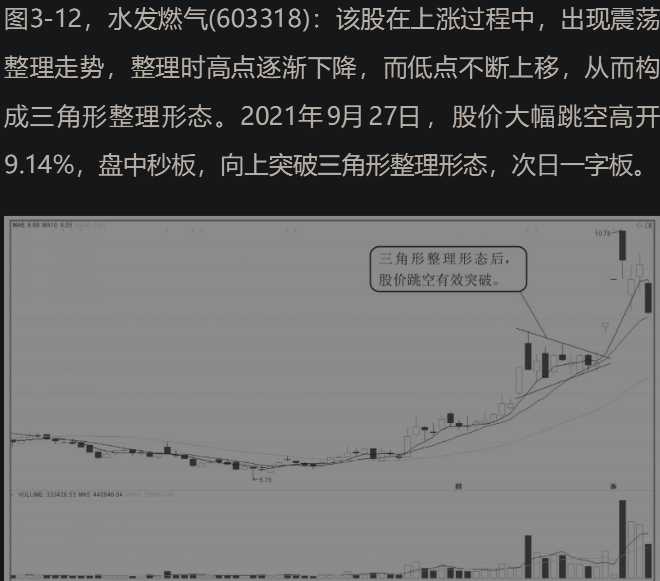

##### 楔形整理加速

和三角形整理不同，楔形整理的高点和低点连线呈现逐渐收敛的形态，同时高点和低点都是逐波上升或下降的，股价在这两根连线之间运行，随着整理的延续，股价震荡的幅度越来越小，最终选择向上或向下突破。同样，在大势向好的情况下，向上突破的概率大一些，反之则反。

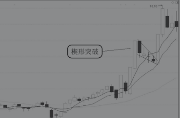


##### 箱体整理突破

在箱体整理中，股价在一定的空间范围内运行，高低点连续呈水平状运行。随着整理的延续，成交量通常会逐渐萎缩，在箱体的末端会选择突破方向。通常情况下，箱体整理的时间越长，那么向上或向下突破的动能就越强。

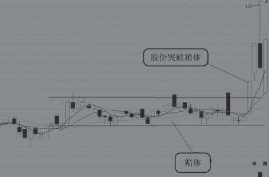


##### 旗形整理突破

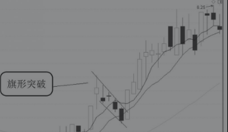


##### 均线系统突破

最重要的是30日均线，它是股价走势的灵魂线。股价在30日均线下方时，短中线都是一道坎，有很强的阻力，需要通过不断的洗盘、放量才能突破；股价在其上方时，30日均线是短中线的一道有力防线，有很强的支撑


均线黏合。这是某一段时间段内市场平均持仓成本相同或相近的标志，如某只个股的5日、10日、30日均线黏合在一起，那么就表明在这30天时间里，该股票的市场平均持仓成本基本一致，同时也表明多空处于相对平衡的状态，通常成交量出现萎缩甚至地量。此时，只要有资金流入，多头稍加发力就能打破这种平衡，将股价大幅推高，甚至出现涨停


多头发散。均线向上发散是股价加速上涨的标志，股价离短中长均线越来越远，5日、10日短期均线上升的角度变得越来越陡峭，在这个过程中最容易出现涨停

##### K线形态突破

- 早晨之星。这个K线组合是股价见底的强烈信号，在形成早晨之星当日以及之后的几个交易日往往会出现极端的上涨走势，特别是同时出现一个向下跳空缺口和一个向上跳空缺口的情况
- 板上之星。一根涨停大阳线或者涨幅7%以上的大阳线之后，次日出现一根跳空高开的十字星或者带有上下影线的小实体K线（阴阳不限），这是主力短线强行建仓或洗盘的标志，是否回补跳空缺口并不重要（当然留有跳空缺口不回补更好），当日成交量成倍放大，那么短线通常还有上升的空间，甚至还会再次出现涨停。
- 仙人指路。出现仙人指路的K线位置往往在前期高点、历史最高点、前期成交密集区等关键位置，这往往是主力试探上方压力和强势洗盘的动作，目的是顺利突破这些位置的压力。仙人指路如同股价上涨的指示灯，指明了股价短线上涨的方向，在收出仙人指路K线次日往往就会出现强势涨停的走势。
- 

##### 缩量回踩颈线

颈线是头肩底、双底、W底等形态高点的连线，股价要有效突破，就必须放量突破颈线位。通常情况下，在突破颈线位之后，往往还有一个回踩颈线位确认突破有效性的动作，这个过程是缩量的。回踩确认成功的标志就是股价再度放量拉升，在这个时候往往会出现涨停的大阳线。缩量回踩可以应用于所有突破后的回抽确认过程。


#### 敏感位置涨停规律

##### 短期严重超跌个股

超跌

##### 面临前期高点个股

当股价运行到前期高点附近时（离前期高点10%以内），最容易出现涨停突破的走势。因为随着股价的不断拉升，前期套牢盘逐步解套，该抛的会选择抛出，该留的会继续持股，当股价接近前期高点时，主力往往会选择试盘，减少前期高点套牢盘的抛压，最后为了以示做多的决心，往往涨停突破前期的高点。


其他：

1. 次新
2. 高送配分红
3. 重大消息利好
4. 复牌补涨潜力股
5. 

### C4·涨停分时走势

#### 涨停分时盘口解读

##### 拉升基本波形

股价拉升中的分时波形有很多种，有直线流畅的，有上蹿下跳的，有平坦呆板的，有代表性的是圆角波、尖角波和锯齿波这三种基本类型

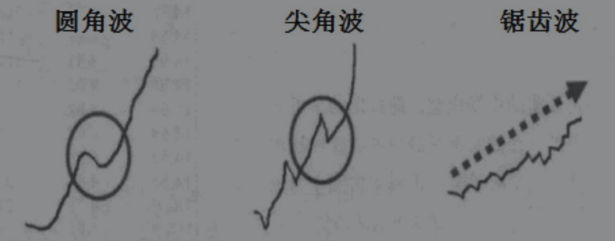


圆角波：

这种波形攻击性强，持续性一般，大多为市场行为。通常出现在洗盘后拉升或持续拉升阶段，往往换手充分，主力控盘良好，股价处于良好的强势上涨阶段

圆角波的特征是在每一波的上涨或下跌中，都会出现一个"圆角"。这种圆角是由买卖双方从不平衡逐渐到平衡的过渡


尖角波：

这种波形攻击性强，持续性好，大多为主力行为。通常出现在拉升过程中，在小盘股、热门股中较多见，股价处于持续上涨阶段


锯齿波：

这种波形攻击性弱，持续性好。多为机构股的盘口语言，在盘升行情中较多见，经常出现在大盘股、冷门股之中，表明主力处于吸筹、洗盘、推升阶段


##### 阶梯型涨停

阶梯型涨停是指在分时图走势上，股价不是一步到位，而是呈现类似阶梯形态的运行方式。股价在达到涨停前，出现一段或两段横盘整理，在不断抬高的平台上让市场充分换手，洗出获利盘，引出套牢盘，以达到垫高市场平均持筹成本的目的，为即将攻击涨停作铺垫准备。

阶梯型涨停有两大形态：高位阶梯型涨停、低位阶梯型涨停。

##### 斜坡型涨停

斜坡型涨停是指在分时图走势上，股价基本沿着一条近似45度角向上盘升，中间没有明显的停顿，成交量也稳定平衡，中途没有明显的忽高忽低现象，其盘口一个重要特征是连续式挂单频繁出现。这种连续式挂单大多是上下基本对称的盘口，说明参战资金众多，多空双方显得势均力敌，但股价还是不断向上，说明这些大单挂单是真实被吃掉的，多头主力略胜一筹。

斜坡型涨停有两大形态：大斜坡型涨停和小斜坡型涨停。

##### 震荡型涨停

震荡型涨停是指股价在奔向涨停板途中，分时图出现大幅波动的特征，成交量比其他类型的涨停走势要明显地放大；大单挂单形式一般没有特定模式，往往是几种挂单形式交替显现。震荡型涨停走势通常属于主力吸筹或出货的两段性走势，其操作难度较大，但把握恰当，其利润也是较为丰厚的。

两大形态：高位震荡型涨停、低位震荡型涨停

##### 脉冲型涨停

脉冲型涨停板是指股价在一段平淡的盘整后突然拔地而起，分时图出现巨大的脉冲波直奔涨停板。这种走势往往是冰火两重天，在盘整时期少有大单挂出，盘口显得苍白、淡静，而一旦大单挂出，就会立即被横空出世的买盘以迅雷不及掩耳之势迅速扫光上方的卖盘，股价以达到接近90度的极致涨速冲向涨停板

两大形态：一波式横盘型脉冲、两波式横盘型脉冲


#### 涨停板分时规律

##### 分时基本波形

一波拉涨停

二波拉涨停

三波拉涨停


高开回档涨停：


先抑后扬涨停

收敛突破涨停


拉升蓄势涨停

强势推进涨停

大幅震荡涨停

两级台阶涨停

#### 十种涨停分时实盘图谱

在分析涨停板市场含义时，从技术角度出发，一要看K线形态、量能变化；二要看分时形态。有的时候，K线形态、量能变化很重要，而有的时候，分时形态更重要，这既取决于每个人的交易理念，也取决于市场的环境。如果从事超短线交易，那么涨停分时图形态无疑是最重要的；如果从事中短线交易，K线形态、量能变化，则相对更重要一些。


##### 高开一波秒板

高开一波秒板有三个特点：第一，大幅高开；第二，迅速涨停；第三，热炒概念

##### 高开缓冲封板

高开缓冲封板形态是指个股当日高开幅度较大，至少在4%。开盘后，股价在开盘价附近横向运行一段时间，没有明显回落，也没有明显拉升，即在盘中高点横盘运行。随后，股价快速拉升，冲击涨停板，并成功封板。

##### 拉高整理一波封板

拉高整理一波封板，也称"游弋于均价线之上的一波封板"，开盘后就出现一波强势拉高，随后股价一直游弋于均价线上方而不回落。经过一段时间的休整之后，股价再度出现了一波流畅的拉升，并封于涨停板。


##### 冲板后短暂裂口

冲板后短暂裂口形态是指个股在快速、流畅上冲至涨停板后，并没有立即封牢涨停板，而是先出现了一个极为短暂、回落幅度很小的裂口，随后才正式封牢涨停板至收盘。


##### 稳步攀升游弋封板

稳步攀升游弋封板是指个股开盘较为平静，未出现大幅度波动，随后在盘中稳步攀升、午盘前后上冲涨停板，但并未封死涨停板，股价游弋于涨停板附近。"稳步攀升"主要有两种表现形态：一种是持续地、缓缓地上行，呈45度角推高状；另一种是在较长的时间段内出现了几波流畅拉高，使得个股盘中涨幅较大。


##### 0轴启动横游封板

0轴启动横游封板是指个股以接近上一日收盘的价位开盘。早盘阶段，个股在这一价位附近向上快速运行，经几波上涨之后，股价触及涨停板，却并没有封板，随后股价长时间停留于盘中高位、横向运行，之后股价封住涨停板。


##### 阶梯式涨停板

阶梯式涨停板是指个股经一波流畅上行后，股价达到了盘中高点，然后是横向运行一段时间，而股价没有出现明显回落，这称为上一个"台阶"；接着，个股又经一波流畅上行达到盘中新高，再横向运行，这是再上一个"台阶


##### V型裂口减压回封

V型裂口减压回封是指个股在早盘阶段就牢牢封住涨停板。在封板过程中，由于受大盘、板块下跌拖累或主力因素影响，于中盘时间段出现了一个V型小裂口，持续时间较短，回落幅度较浅，V型裂口之后，股价再度牢牢封住涨停板，且全天再无开板现象。


##### 首尾上冲涨停板

首尾上冲涨停板是指个股的开盘较为平静，但开盘之后立刻快速上冲，上涨幅度在5%左右。股价基本处于涨停价与开盘价中间的位置，维持一段时间的横向运行，然后股价再次出现一波拉升并成功封板。这里的"首"好理解，就是开盘不久先出现一波拉升；这里的"尾"不专指尾盘拉升上板，也包括午后再度一波封板。

##### 整理后流畅尾盘板

整理后流畅尾盘板有两个特征。首先，从日K线图来看，个股持续地横向震荡整理，上下震荡幅度不大。其次，持续整理后的某个交易日，出现了尾盘封板的分时走势。当日尾盘的封板过程是股价离涨停板较远，在连续大单扫盘的推动下，出现了极为流畅的拉升，快速上板封涨停，并且是一次性封板（或者是短暂停留，随后牢牢封板）。


### C5·短线选股

#### 正确选择股票

##### 看资金流向选股票

资金流向至关重要——资金流向代表大资金的动向，即市场的热点

板块轮动其实就是资金流向轮动而产生的盘面效果

行情启动必须有资金涌入，从成交额上观察资金流向的热点：每天成交量、成交额排行榜前20名的个股就是资金流向的热点。观察的重点是这些个股是否具备相似的特征或集中于某些板块，并且占据成交榜的时间是否够长，时间长短和对资金吸引的力度的大小是否成正比

空头市场中大盘成交量比较低迷时，部分大盘股占据成交榜的前列，而这些个股的量比又无明显放大，则说明此时大盘人气涣散而不是代表资金流向集中

选股时需要注意资金流向集中性，从涨跌幅榜观察资金流向的波动性

如何发现主力已经出手？这需要看涨跌幅榜。最初发动行情的涨幅居前、成交量放大的个股，往往最具备示范效应，因为资金具有轮动性。主力只会做抬轿的事，而不会干解放的活儿。

**<u>大幅上涨后放量下挫</u>**的，则不在此列

##### 看运行趋势选股

在股市中的**阻力位和支撑位**就是"关口"，关口的种类：

1. 历史关口：因某种市场因素导致股价在某阶段形成的相对的高、低点。一般情况下，其距离当前时间越近，就越不易被突破；相反，则可能难以成为阻力位和支撑位
2. 密集区关口。股价涨跌起伏，在某阶段形成的虽小但波动频率相对较大的区域，一旦被成功逾越，行情将顺势展开。
3. 心理整数关口。一般逢5和0的整数价位，在投资者心理有一种阻力作用，或认为其暂不可逾越，或认为一经逾越则势不可当，但往往是心理因素大于实际。 如3000点
4. 技术关口。该概念内涵较复杂，"关口"概念本身就属于技术分析范畴，所以通常要看其具体用在何处，如技术指标位置、形态分析、波浪理论或其他分析等

涨跌趋势交替循环：

1. 当股价由某个次低点向上运动，并成功突破前期高点时，再度向下一般会在前次高点以上得到支持，即不会重返前次高点以下；而一旦确定在前次高点以上获得了支持，则极有可能再次创新高，反复循环直至终结。
2. 上升趋势形成的重要特征：股价在长期以来的下跌趋势中成功向上突破某一个历史低点，且再度下行时未跌破创新低点。
3. 上升趋势结束的演变过程：股价在有规模地创新高后跌破前次高点，进一步下跌至前次上升行情展开时的起点，再度上升无力创新高，然后再度下跌时跌破前度低点，反复循环直至终结


##### 看时间选股票

想要在股市中赚钱，只有先学会看盘，才能过渡到分析，然后选择有获利机会的个

看盘方法：

1. 9:00—9:15的准备。短线投资者要做好操作计划，开盘后立即查看委托买卖笔数的多寡，研判大盘究竟会涨会跌。一般而言，如果开盘委买单大于委卖单2倍以上（如买单1万手，卖单5000手），则显示买气十分旺盛，上涨胜算较大，短线可考虑买进；相反，若卖单大于买单2倍以上，则代表空方卖盘十分强大，当日沽空比较有利，开盘后立即卖出手中筹码，逢低再补回。  观察大盘的气势强弱，在涨跌幅榜中注意涨停板或跌停板家数的增减。由于A股市场常有追涨杀跌投机风气，越涨越追涨、越跌越杀跌。因此，发现大盘涨停板家数由几家迅速增加至多家，代表大盘气势强劲、上涨有力，并有继续上涨的可能，必须择机立即抢进
2. 9:25是集合竞价时间。这是每个交易日的第一个买卖时机，主力借集合竞价跳空高开拉高抛货，或跳空低升打压进货，这是常见现象。
3. 9:30—10:00是第二次进、出货时机
4. 11:30，收盘前为买入卖出股票第三次时点
5. 3:00开盘，注意上午炒作的热门股走势。若成交急剧放大，股价徘徊不上，当心主力在抛货或会有较大的回调。
6. 14:00—14:30，为"T+0平仓盘"时间。这是因为上午T+0买入的资金，要拉高抛货，此时为第四次抛售时机，股价容易出现当日最高价、次高价。因为，这时主力若出完货就有可能打压股价，不再护盘。
7. 14:30—15:00，为全天最后一次买卖股票时机
8. 收盘后做好梳理工作，从**<u>大单入手</u>**寻找大资金意图，把**消息面、基本面**理个思路。查看**当日股市涨跌榜**，分析**大盘及个股**情况，注意**成交最大的个股榜及涨幅最大的股票群**，看主力是在抛货还是在进货。周末，关注**外盘**走势、消息动态，分析宏观面、基本面及技术面，分析本周大盘与个股走势，预测未来走势，确定操作方案。
9. 星期一效应和星期五效应。星期一收盘股价收阳线还是阴线，对全周交易影响较大。因为多（空）方首战告捷，往往乘胜追击，连拉数根阳线（阴线），应予警惕。星期五收盘也很重要，关系到周线的阴阳。它不仅反映当日的多空胜负，也反映当周的多空胜负

##### 看盘面选股票

短线好股票的识别方法

(1)买入量较小，卖出量较大，而股价不下跌的股票。(2)买入量、卖出量均小，而股价轻微上涨的股票。(3)放量突破趋势线、均线、形态等重要压力位的股票。(4)前一天放巨量上涨，次日仍然放量强势上涨的股票。(5)大盘下跌时微涨或抗跌，而大盘横盘时加强涨势的股票。(6)遇个股利空消息，放量而股价不跌的股票。(7)有规律且长时间小幅上涨的股票。(8)无量（缩量）大幅急跌的股票（指在技术调整范围内）。(9)送红股除权后又上涨的股票，这类股票的市场形象和股性


短线差股票的识别方法：

(1)买入量巨大，卖出量较小，而股价不上涨的股票。(2)买入、卖出量均较小，而股价不上涨的股票。(3)放量向下突破下挡重要支撑位的股票。(4)前一天放巨量下跌，次日继续下跌的股票。(5)遇个股利好消息，放量而股价不涨的股票。(6)大盘上涨而个股不涨或小涨，大盘调整而个股加速下跌的股票。(7)个股流通盘大，而成交量很小的股票。(8)盘面经常出现异动，而股价没有明显上涨的股票。(9)除权送红股后，放量下跌的股票。


##### 按计划选股票


##### 按原则选股

1. 趋势选股：
2. 分批原则
3. 底部原则
4. 风险原则
5. 强势原则
6. 题材原则
7. 止损原则
8. 


##### 十类股票的选择策略

如何选择股性优异的股票？

性好的股票，股价活跃，大市升时它升得多，大市跌时人们会去抄底


如何选择有潜力的低价股？


如何选择新上市的股票？


如何选择强势产业的股票？


如何选择便宜的"实质股"？


如何选择高成长股？


如何选择大盘股


如何选择中小盘股？


如何选择资产重组股？


#### 利用热点题材选股

##### 根据市场热点选股

热点是指在某一特定时间内被市场热炒的板块或个股。这些在特定时间内被炒作的股票，称为热门股


热点发展过程：

第一阶段：从单一热点发动行情，此阶段的热点持续时间较长。第二阶段：由单一热点扩散到多极热点，其持续的时间较短。假如市场出现多个热点同时疯炒的时候，要注意大盘是否在走最后一浪。第三阶段：热点转移和消退阶段，这一过程持续的时间更短。一般而言，当能炒的板块都被轮炒一番之后，大盘往往就会进入休整期，以孕育下一个单极热点。如此循环往复。

关键点：

1. 消息
2. 资金流向
3. 观察股价上涨过程中是否出现急速拉升和集中放量
4. 龙头
5. 

题材：

1. 发现要早
2. 进入要适
3. 新题材
4. 真实性


热点持续性：

1. 对大盘的带动效应
2. 对板块的带动
3. 热点启动的次数
4. 龙头股的阻力位


捕捉热点题材：

1. 业绩预期
2. 政策支持
3. 资产重组
4. 增资配股、送股分红
5. 控股或者收购

##### 选择热点龙头股

如何识别龙头股

1. 从热点切换中辨别龙头个股。通常大盘经过一轮恐慌性急跌后，会切换出新的热点板块
2. 用放量性质识别龙头个股。个股的放量有攻击性放量和强势股补仓性放量两种。如果个股出现连续3日以上放量，称为攻击性放量；如果个股只有单日放量，称为补仓性放量。龙头个股必须具备攻击性放量特征。
3. 曾经是龙头的个股，经过充分调整后也可以卷土重来。

龙头股基本条件

1. 龙头股必须从**涨停板**开始。不能涨停的股票不可能做龙头
2. **龙头股一定是低价的，一般不超过10元**。只有低价股才能得到投资者的追捧，成为大众关注的龙头
3. **龙头股流通市值要适中**，适合大资金运作，大市值股票和5000万以下的袖珍盘股都不可能充当龙头。(30-100? 圣龙、捷荣、常山、鸿博、拓维)
4. 龙头股必须同时满足日线KDJ、周线KDJ、月线KDJ同时低价金叉
5. 龙头股通常在大盘下跌末端，市场恐慌时，逆市涨停，提前见底，或者先于大盘启动，并且经受大盘一轮下跌考验


龙头股分析方法：

1. 价格
2. 成交量
3. 市场影响力
4. 板块效应
5. 资金性质


龙头买卖技巧：

实盘操作中，要学会只做龙头，只要热点，只做涨停，选择操作的个股，要求同时满足三个条件。

1. 周KDJ在20以下金叉。
2. 日线SAR指标第一次发出买进信号。
3. 底部第一次放量，第一个涨停板。


##### 换手、成交量选股

换手率是一定的时间范围内某只股票的累计成交股数与流通股数的比率

70%的股票换手率基本都在3%以下，因此3%也就成了一个分界点

当一只股票换手率在3%~7%时，则属于相对活跃状态；在7%~10%时，属于强势股；在10%~15%时，为主力密切操作；超过15%时，如果能持续多日则大概率成为大黑马股

50%死亡换手，

换手率的使用通常有以下五大原则：

1. 低位换手率非常高的，并不意味着主力在吸货，尤其是股价还在下跌趋势时
2. 股价翻了1~2倍时，在某一段时间换手率开始增加，看起来好像充分换手洗盘，有时其实却是主力在拉高出货
3. 拉升的时候，如果一只股票当天的换手率超过了10%（新股和次新股除外），通常就表明主力在盘中开始活动了
4. 密切关注一些不合理的回调，若大单成交少，散单成交多，那么很明显主力在压低吸筹。
5. 行情初始阶段，某只股票连续3天以上换手率较大，平均在10%以上，股价连续飙升，这时候就要注意，可能是板块中领涨的股票。


成交量反映供需关系。当供不应求时，人潮汹涌，都要买进，成交量自然放大；相反，供过于求，市场冷清，买气稀少，成交量势必萎缩。

影响成交量变化的七大要素：

1. 成交量温和放大，伴随股价小幅上涨，这种组合是上涨的前兆，后市一般会连拉出几根大阳线。
2. 如果10日内平均成交量非常接近一致，表示主力上攻之前成交量已调整到位，浮筹已清除干净
3. 当日成交量非常重要，它记录了当日多空双方在争夺中所投入的资金及消耗的力量
4. 成交量放大伴随股价上涨，回档时跌幅不大且成交量急剧缩小，这种组合表示持股者惜售，预示着大行情即将产生
5. 5日成交量均线低于10日成交量均线，表示近期内成交量一直在萎缩，而后成交量突然放大并伴随股价上涨，超过5日或10日的成交均量，这通常是主力的试盘行为，在回档中赶快买入，大幅拉升即将开始
6. RSI指标显示底背离时，成交量放大，5日成交均量超过10日成交均量，表示主力此时出少进多，底部承接盘踊跃、买气旺盛，大底即将出现，最佳买入时机已到来。
7. 前一阶段，成交量一直呈缩量形态，K线横盘整理，每日起伏很小，而后成交量突然放大，表明大行情来临，股价很快上涨。


选择强势股：

1. 题材优先
2. 量比和涨幅优先
3. 大形态优先
4. 冲击涨停的时间优先
5. 分时走势优先
6. 板块效应优先


##### 黑马股选择技巧

黑马股是指价格可能脱离过去的价位而在短期内大幅上涨的股票

异军突起


特征：

1. 低起点
2. 远景题材
3. 动力


##### 反弹行情选股技巧

容易反弹的10类股票：

1. 超跌
2. 下跌快、跌幅深
3. 无量下跌
4. 定位偏低的次新股
5. 活跃的小盘股
6. 领先反弹的个股
7. 利空大打击大幅下跌个股
8. 主力关照
9. 利好传闻受大盘拖累
10. 绝对价位低的三线股


##### 筑底行情选股技巧

筑底是指股价运行没有持续上涨或下跌的趋势，而是呈现出水平方向或倾斜运动


##### 尾盘选股技巧

收盘前半小时


### C6·打板高手进阶

#### 抓涨停的思想境界

##### 打板前的功课

1. 复盘：当天走势回顾和总结
   1. 指数
   2. 涨跌幅榜
   3. 持仓自选
2. 看资讯
3. 看资金流向：个股资金净流入、大单金流入
4. 做笔记

##### 心态

1. 不能犹豫：好板从启动到涨停就几分钟时间，不能犹豫不决
2. 平和：坦然
3. 止损心态
4. 

##### 打板三种方法

决定对个股打板之前，一定要对大盘、热点、个股有很好的把握，只在大概率能赢的情况下才进行打板，这样才能享受打板带来的高收益，否则，盲目打板、冲动打板、情绪打板都会吃大亏。正确的打板方法主要有三种。


扫板：

逻辑清楚了，觉得能够涨停的，就可以在涨停之前直接扫单进去，不用等到涨停之后才考虑打板

为什么？因为在最后拉涨停之前，成交量已经超过近期最大成交，盘中浮筹已经清洗得非常干净，上方根本没有抛压，涨停以后大概率不会开板，所以这时候应该去抢筹，这就是"扫板"。这时候，就算没有买到，也能排到一个相对靠前的位置，成交概率很大。所以，成交量已经放得足够大时，可以选择直接扫板入场


排板：

如果逻辑清晰，盘中异动上板概率很大，成交量也放出来了，但是还有部分浮筹没有被洗出来，如涨停价还有大单没有被吃掉，临门一脚需要有人来踢。这时候就需要等待大单彻底被人吃掉，然后再进场排队，这就是"排板"。事实上，很多股票涨停之后有开板现象，这是排板进场的时机。所以，在成交量不是特别大的情况下，要等待最后封盘的时候排


回封：

当逻辑没有问题时，在盘中第一次涨停后，但成交量还不够，盘中还有短线浮筹，就有可能还会砸盘，所以这时需要观望。当涨停板被砸开后，就要看下面的承接能力，如果逻辑足够强，短线浮筹基本离场，且有资金愿意拉涨停，那就是典型的分歧转一致，回封涨停板就是买点。所以，成交量不够的时候，要等炸板回封再买。

#### 打板心经和技巧

对于个股而言，无非是由弱转强（止跌）、由中势转强（突破）、由强转更强（加速）


盘中即时发现的打板机会参与方法。这主要是针对上文提到的第二类操作，其具体方式是：把市场所有板块题材按照涨速排序（涨速榜），这样盘中就可以及时观察到异动的板块，当盘中观察发现某板块题材出现联动性走强时，迅速找到它们中的领涨股，加入自选观察，同时注意观察该板块的技术形态，结合联动性强弱对板块上攻的强度及持续性做出判断。若强度足、持续性预期够强，则立刻挂单，龙头一旦上板，则瞬间买入，如暂时未成交则可继续排队。


打板操作的核心在于：在众多的涨停板之中准确地辨别出共识最大、认可度最高的那只涨停板个股


打板不仅要求基本功扎实，盘面技术精湛，还要有敏捷的反应能力和独特的思维方式，是一项非常高超的操作模式，因此新手并不适合打板操作。

打板分为很多种：T字板、反包板、换手板、1进2板、2进3板、首板、首阴板等，打板应有严格的执行能力，有自己的一套操作系统。


打板十大经验:

1. 充足的准备
2. 封板的时间，原则上在上午的10点半之前上板是最好的。
3. 如果碰到行情火爆，上板的股票一定要是巨量封死之后，不再打开，不让人有跟进的机会；在行情疲软的时候，往往会板上打开，换手后再次封板，这时介入的风险相对就小一些，因为换手后的主力成本也是非常高的，第二天的抛压就会比较小
4. 资金分配
5. 历史上中低价股成为龙头的可能性比较大，而且大部分的暴拉龙头都是游资主导的。
6. 分时走势上，封板时直线快速拉升，不给其他人机会的涨停质量较好，但由于属于抢盘封板，所以主力的成本也比较高，第二天拉高才能出货
7. 涨停板有很多，如底部第一板、小阳堆积后进入主力的第一板等，都是值得研究与参与的。当然大家要记住：弱势不要乱追板。题材都还没有弄明白，看到开盘冲板就追，那样很容易落入别人的圈套之中。
8. 打板最好是选择历史股性活的股票，如果股票从来没有涨停过的，历史股性相当呆滞，最好不要出击，这种股票连板的可能性小，风险大。
9. 如果第一天没有买进，非要第二天去买涨停的话，建议晚上一定要看一下龙虎榜，看打板的是哪些游资营业部，有些游资的口碑是很差的，其他游资只要看它进来了，第二天开盘就砸，所以这样的情况是要回避的。
10. 最重要的一条就是，一定要提前做好功课，第二天追板的时候心里明白追的是什么题材，这个题材会不会持续等。


打板注意事项：

1. 不打龙头，打跟风板
2. 打板时机错误
3. 不打独苗板
4. 思考过于主观臆测能上板而在涨停前提前买入
5. 打板次日遇到利空消息 --- 文一科技
6. 一旦买错或买入后表现不及预期，未能及时了结卖出，造成亏损扩大化的同时错过好机会，心态失衡。买错后抱有幻想不及时止损是最坏事的习惯，不仅会买错时亏更多还会错过其他机会，其根源在于思维受到情绪化控制，认识不到机会成本及操作的长期性、整体性。
7. 缺乏耐心，经不住诱惑，二流机会出现时便急于出手，等到真正的一流极品机会出现时却没有资金进场
8. 缺乏主线思维，看盘抓不住重点，打了一些次主流、支流、莫名其妙的涨停板


#### 打板逻辑和优势

打板是超短线操作的精髓

打板理念就是做龙头股，挣第二天的收益，第二天不涨停就走。


##### 超短线打板选股技巧

日内市场最先打板的品种

同一题材和板块率先涨停的品种

连续涨停的品种

连续涨停横盘后再次涨停的品种（二波行情）


优质板日内盘面特征

1. 封板时间越早越好
2. 开板次数越少越好或不开板
3. 封单数量适中即可：涨停封单的数量适中即可。太小了不太稳定，也不能因为量很大而高枕无忧。通常有几万手或十几万手就好。太小了很容易开板，打击游资参与的士气，太大了有可能是引诱游资排板，途中悄悄撤单诱多。
4. 用形态系统测量上涨空间


打板与低吸半路板：

1. 连续涨停后出现短期横盘整理
2. 连续涨停后日内盘中出现波动
3. 


#### 短线打板技巧

打板的四大法则：

1. 板块异动、关注龙头
2. 板处下单、随时出击：涨停价买入
3. 不板不买、动手要快，不要犹豫
4. 永不满仓、多练盘感


打板的五种模式：

1. 板上买
2. 埋伏板
3. 半路板： 板哥就是这种模式吧，盘中观察，选择强势板块的强势个股，半路接入，日内就有大肉
4. 钢丝板：反复开板，勉强封住
5. 隔日板
6. 


不能打的板：

1. 冷门股
2. 巨量板：爆量，意味着严重分歧
3. 反弹板：这里的反弹板指的是强势股见顶回落后，在没有超跌的情况下（最大跌幅低于30%），而出现的第一个反弹涨停
4. 空头排列股的板：均线等空头发散
5. 不打莫名其妙的板


#### 短线打板战术


#### 弱转强技术精要

什么是弱转强呢？通常是前一天出现烂板或弱势，对第二天的行情预期不高，普遍认为低开或继续弱势表现，如果第二天盘面该弱不弱，反而出现超预期走强，甚至直接高开上板，并且开盘后的分时也是进一步超预期拉升，这种情况就是弱转强

基本含义：弱转强的弱，是一种情绪上的弱，常见形式是烂板，也可以是没有跟风助攻等预期上的弱势。弱转强的强，实际上就是一种超预期，大家都知道烂板很差，次日按常理会低开下跌，结果次日却大涨，这种超预期会引来短线资金追捧，进而容易出现弱转强走势。


弱转强的八种形态

1. 放量烂板次日高开涨停:最常见. 烂板出妖股
2. 尾盘弱势板次日高开涨停
3. 大长腿后次日转一致
4. 炸板后次日高开涨停
5. 放量大阴线后反包. 主力反包的特点有三：一是龙头股的快速洗盘手法；二是聚集人气最快的方法；三是K线不走连板结构，这是躲避监管最有效的战法
6. 题材超预期
7. 游资一家独大次日高开

TODO

### C7·强势股操作技巧

#### 强势股的启动特征

1.均线黏合蓄势：

在股价启动之前，时常会有某些较为明显的走势特征表现出来

比如，股价要想大涨通常至少 要站在5日、10日均线之上，量能一般也会经历一个从不断萎缩再到 开始放大的过程。

有些股票由于试盘，还会在分时走势上留下较为明 显的痕迹，发现这些较为有规律性特征的股票，就可以重点地持续关 注。

均线黏合蓄势，多条均线处于黏合状况，至少说明了两点。 （1）市场中的投资者在一定时间内的持筹成本趋于一致。 （2）股价很可能到了变盘的时点，即将产生方向性突破选择

均线黏合现象要注意两个前提：对于之前已经大幅上涨的股票，应防 止之后可能出现的大跌；对于前期没有大涨过的股票，就要留意可能 出现的大涨行情。


2.盘面强者恒强：

逆势走强：逆势是指个股不随大盘走势，在大盘下跌时，拒绝下跌或小幅下跌， 在大盘处于盘整或小涨的情况下，涨幅远远强于大盘走势。出现这种 现象，往往是实力强大的主力在积极介入的外在表现。因此，能够逆 势逞强的个股，十有八九后续都会有较为出色的表现。


走势独立：逆势走强"和"走势独立"，从字面理解，意思似乎差不多。其实不 然，逆势走强是指个股和大盘的走势之间做比较；这里的走势独立是 指个股和具有高度关联性的板块之间做比较，个股的走势，明显独立 于板块的情况


3.主力拉升试盘：

主力在拉升之前，通常要对目前投资者的持筹心态、市场的抛压程度 和追涨意愿以及是否有其他主力存在较大干扰等各种情况进行测试， 以便确定当前是否具备拉升条件。


早间试盘：

早间试盘是指主力在开盘不久，就对股价进行快速的拉升。在拉升过 程中，通过盘面表现的各种状况，来判定当前拉升的时机是否成熟。


尾盘试盘：

尾盘较为真实的试盘拉升，通常必须满足三个条件：一是 一波流畅的上涨幅度通常在3%以上；二是持续上涨的时间一般不应低 于3分钟；三是次日股价必须稳定在尾盘收盘价或最高价上方。否 则，投机骗线的概率就较大了


4.量价背离打压：

当股价下跌时，许多投资者都会出现一定的恐慌，但并不是所有的人 都会卖出，仅有少数人在股价快速下跌之初抛售股票，大多数人在股 票下跌时或下跌以后都会以观望为主，因为股票下跌往往来得突然， 而更多时候投资者总觉得价位远没有达到自己的心理预期价位，所以 在跌势里投资者一般不会轻易卖出筹码，当然投资者更不愿意在股价 下跌时买进，那么就可能出现股票下跌时交投不活跃的状态。

股价下跌时成交量不活跃，说明没有人卖出的同时也没有人买入，也 就是通常所说的股价无量空跌。


5.跌停洗盘回升：

如果主力为了吸纳大量的廉价筹码， 时常会利用普通投资者对跌停板这一恐惧心理来进行相反的操作，刻 意向下打压股价，逼迫投资者交出手中的筹码，从而达到自己的吸筹 目的。

一般来说，主力通过跌停板洗盘具有突发性、巨量性和短暂性，也就 是跌停来得太过突然，同时伴随巨大的成交量，但是跌停之后股价往 往就开始大幅拉升或者是高开高走


6.量能突然萎缩：

股价运行是有一定规律的，在涨幅达到一定程度后，主力就会进行洗 盘，以顺利清理浮筹，提高投资者的持股成本，从而减少后续拉升阻 力的目的。而量能不断萎缩，或已经不能继续较大程度缩小，或是突 然比前一天大幅萎缩，通常就是洗盘即将结束的标志。

在技术上掌握以下几点：一是股价趋势必须向上运行，横向、下行不 宜使用；二是股价回调到30日均线附近，且30日均线保持上行状态； 三是前期成交量保持恒量活跃状态，不宜使用于巨量后的缩量；四是 股价累积涨幅不大，主力洗盘性质。


7.十字横盘蓄势

十字星就是开盘价和收盘价差距很小的K线，通常表示在目前的价位 多空双方暂时达成平衡。在大多数情况下，仅仅根据一根十字星，是 难以得到较有价值的信息的，必须结合股价整体趋势、十字星所处位 置以及对应的量能等多种情况来分析，才具有较大的意义，而在经过 了一波拉高之后，多日收出十字星的特殊形态，就具有了非同寻常的 意义了，它时常就是即将大涨前的征兆。


#### 强势股的顶部形态

强势股的顶部特征，一是要求股价在短中期内具有较大的涨幅， 这样见顶的准确率才会较高；二是这些常见的顶部形态可以用于任何 类型的股票，且对于市场中较为活跃的题材股来说，更为适用

##### 单一结构顶部形态

1．高位阴线大跌

高位阴线大跌是指股票之前经历了较大幅度的上涨，突然某一天 出现了一根跌幅达到7%以上的大阴线，若是在大阴线的前几天，还出 现过涨停板、跳空高开以及短期快速大幅的拉升等情况，那么见顶的 概率就较高了


2．巨量跳空阴线

在高位出现了长影线，有时候收盘价也不一定就是下跌的。这同 样也是一种值得警惕的顶部信号。尤其是伴随着近期突然放大的天 量，当天还是以跳空开盘的状态出现，那么股价构筑顶部的概率就更 高了。

提示：天量是一个相对的概念，是对于同一只股票而言的， 主要是和该股的历史水平做比较，不同的股票没有太大的可比性。通 常大盘股、绩优股、高价股的换手率较低，而短线较为活跃的题材 股、次新股、小盘股的换手率往往较高。


3．高位放量滞涨

一般情况下，在阶段性低点的成交量基本上都是较小的，出现近 期放大量的现象往往就是离阶段性的顶部不远了。道理很简单，不管 是上涨还是下跌，如果成交量不异常放大，主力通常是不容易大举出 货的。当然，这需要一些很有耐心的主力将出货的时间拉得较长，以 便使投资者难以发觉。这种情况大多数出现在中长线个股中，在短期 热门股中是较少出现的。相反，若是放出较大的成交量，股价却没有 明显地上涨，就有主力出货的嫌疑了，应引起大家的高度警惕

提示：高位放量滞涨就是股价经过长期炒作后，已经处于相 当的高度（或已经翻了数倍），然后在一段较短时期内出现成交量不 断放大而价格却停滞不前的情况，这种现象表明主力出货的概率较 大。当然也有另一种情况，在股价突破重要压力位时，也会放出巨 量，但股价总体涨幅较小。放量滞涨分为高位放量滞涨和低位放量滞 涨。

（2）低位放量滞涨。低位放量滞涨指的是股价在较低的位置出现 成交量放大，而股价却一直不涨的或是涨幅非常小的情况。碰到这样 的股票，应多加关注，主力一次试盘失败，还会长时间低位盘整，一 旦时机成熟或碰到利好，实现向上有效突破重要压力，配合成交量的 放大，这只股票就是未来的大牛股。

##### 组合结构顶部形态

1.大幅震荡＋长上影线

股价经过大幅上涨之后，在顶部阶段往往会出现大幅震荡。在初 期时，主力一边出货，一边在股价跌到一定程度时，再适当地向上拉 升股价。这样操作，对于主力而言，至少会有两个明显的好处：一是 可以尽量将股价卖在较高价位；二是可以在一定程度上麻痹投资者， 以便于自己高位出货。


2.两阴夹一阳

在股价连续大涨之后，先是出现了一根大阴线，接着又出现了一 根大阳线，股价波动幅度明显加大，显示出投资者的分歧开始增大， 或是主力已经有了较为明显的出货行为。但是，仅仅依据这两根大起 大落的K线，还不能较为准确地判断股价顶部是否可能形成。这样， 第三天的股价走势就显得异常关键了，若是不能创出新高，则走势就要小心了，若是收出跌幅超过7%的大阴线，则见顶的概率就会明显增 加，形成了两阴夹一阳的形态。

3．双长上影阴吞阳

为了顺利达到出货的目的，主力在最初出货时，往往不会一直地 大举抛售筹码，会顾及市场投资者的感受，希望能够使投资者较晚地 发觉到股票的大势已去，主力从而就可以实现利润的最大化。 要达到这个目的，主力通常就要在股价跌得较多时，适当地拉抬 一下股价，这样在当天的K线上就会出现较长的上影线。若在短期大 涨之后，先是出现了一根有较长上影线的中阳线，之后又出现一根有 较长上影线的阴线，且这根阴线的跌幅至少在7%，一举将前面的中阳 线全部吞没，就形成了双长上影阴吞阳的形态，这时就要格外小心 了


4．跌破盘整平台

主力为了有利于出货，往往会在顶部区域来回震荡，使得投资者 对于股价的上下波动产生一定的适应心理，从而可以在之后大肆出货 导致股价大跌时，尽量能迷惑投资者。

但是，不管是多么隐蔽的手法，都会露出破绽的。投资者可以根 据股票的整理形态是否依然保持良好来进行鉴别。若股票跌破了近期 的整理平台，应该坚决回避，这可能是形成顶部较为可靠的危险信号 之一。


##### 异常走势顶部形态

1．趋势股的加速大涨

主力之所以一反常态地快速拉升，无非就是想吸引众多投资者的 目光，使得更多的投资者抵挡不住快速获利的诱惑，加入该股的炒作 中来，而主力正好胜利大逃亡，将大量的筹码卖在高位，从而为一轮 完整的炒作画上完美的句号。

2．前高附近频繁长上影线

顶部形态多种多样，有的股票冲高之后，就快速大幅下跌；有的 股票在一个区间内，盘整一段时间，最后破位下跌。但是，不管是何 种形态，要想较准确地判断出顶部是否形成，就必须等到股价达到一 定程度的跌幅之后才可以定论。


3．上升规律被打破

只要经过认真的观察，就会发现很多股票都有一定的规律可循， 而市场中最为活跃的强势股更是如此。这些规律一般包括：每一波的 **上涨幅度和时间；回调的支撑位和调整时间；短期拉升的持续性；拉 升时机**等


4．多日不能再创新高


5．创新高后回调过度

#### 机构抱团股操作技巧

A股市场机构化是未来发展的必然趋势，所以了解判断个股是否 有机构投资者入驻，以及机构股的盘口特征和行为，对实盘操作十分 重要。


抱团股基本特征:

1. 确定性强: 逻辑硬
2. 行业龙头
3. 盈利能力强
4. 高估值、低换手
5. 机构持股比例高


机构选股逻辑：

1. 行业。与游资炒概念、热点不同，机构投资者（以基金为代 表）参与时往往需要业绩逻辑驱动——行业或者个股未来的业绩增长 预期，所以大家会看到很多根据利润来算估值模型的行业分析报告。
2. 研报
3. 市值
4. 


机构信息梳理：

1. 股东信息--主力持仓
2. 历史龙虎榜
3. 


机构股盘口特征：


### C8·涨停次日战法

#### 把握涨停溢价机会

##### 个股溢价的产生

1. 情绪
2. 逻辑
3. 

##### 溢价的逻辑关系

领涨溢价、跟风溢价

从溢价产生的因果来看，分为领涨溢价、跟风溢价。

领涨溢价，龙头股的溢价来自跟风，也就是说，它的上涨引发了 题材个股的跟风情绪的波动。

跟风溢价，跟谁的风？无非就是其他股票，要么是同板块的，要 么是其他板块的。也就是说，从盘面逻辑因果上来看，其他股票的上 涨引发了该股的涨停，这种就叫跟风溢价


正向溢价、反向溢价：

正、反向溢价——**指数、题材、个股**多重分类。 将情绪溢价分为正向溢价与反向溢价。何为正向溢价？就是指数 或题材，或者说至少是题材与个股的方向是相同的。平常所说的龙头 与跟风这种题材溢价就是正向溢价。何为反向溢价？就是指数或题 材，或者说至少是题材与个股的方向是相反的。可以看出，在指数与 题材两个指标中，更加看重题材这个指标。

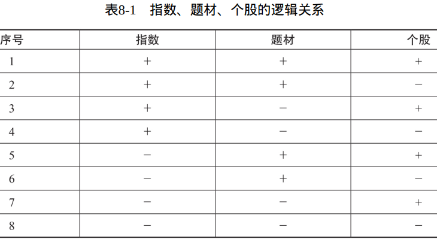


##### 溢价的基本类型

1. 题材溢价：板块效应。题材溢价是最简单，也是最确定的。 龙头股与题材的这种关系是超短线其他关系的基础，跟风都走得那么 好，龙头股应该走得更好。
2. 模式溢价：示范效应。模式溢价指的是当某一个模式有赚钱 效应时，资金会模仿。比如次新--盟固利。 从图形方面来说。比如，最近流行"次新股＋大长腿"这种模 式，过了一段时间流行"龙头股＋反包板"的模式，又过了一段时间流 行"空间板＋均线10日线抄底"的模式。
3. 氛围溢价。这个好理解，就是整个盘面题材炒作非常好。
4. 筹码溢价。个股如果非常硬也会产生溢价。比如，封单量非 常大，封板时非常坚决，这样第二天也会享受到盘口的气势溢价。这 种盘口强势股表现为，抛压下封板之后不开板，筹码不松动，属于硬 板
5. 逆势溢价。逆势溢价与转势溢价，在指数与题材方面都是负 的，也是反向溢价。它能够产生溢价的理由是：当日指数与题材都这 么惨的时候它还不死，所以次日当指数与题材为正时，那么它就更应 该是正的
6. 转势溢价。转势溢价与逆势溢价不同，转势溢价股突出 了"逆转"，也就是说，对题材或指数其他个股有带动作用，逆势股未 必有带动作用，
7. 综合溢价
8. 

#### 涨停溢价概率分析

##### 涨停蕴藏溢价

以短线投资 者所说的溢价就是次日能赚多少，中、长线投资者所说的溢价更多是 一个波段能赚多少。

涨停板为什么有溢价？这就要明白涨停板的作用。涨停板的主要 作用在于：**阻断交易**。当交易被"阻断"后，会给市场情绪创造一个"无 法证伪"的日内预期差

比方，**<u>一只股票是在开盘5分钟封涨停板的龙一，意味着后面的 235分钟无法证伪的想象。此时资金认为是该股的"科技属性"引导了资 金买入，这样就会带动"科技属性"的第二只股票涨停。而第二只股票 涨停则是在开盘30分钟内，随后会接连引起更多个"科技属性"的股票 出现涨停，或者是异动，这就是板块效应</u>**

前面涨停的股票则是板块的龙头，后来涨停的股票都是跟风，而 跟风股又会反过来加强龙头股的涨停。所以，跟风股越多，龙头股溢 价就越高。

##### 溢价三种类型

第一类：指数的溢价。

第二类：板块的溢价

第三类：市场情绪和启动时间的溢价

##### 溢价幅度分析

竞价预期是对个股第二天开盘高度的预判，也就是市场所有的交 易者，经过一夜的复盘思考和情绪沉淀，最终给出个股的正负溢价。

对竞价预期的准确率是建立在对整体盘面的解读，以及个股在市 场中地位解读的基础上。比如，如果是一般性的独立涨停，正常溢价 在1%左右；如果是板块老题材，板块涨停5只，那么板块龙头溢价通 常在5%，后排小弟依次递减；如果是当日新发酵题材最先涨停的板块 龙头，当天板块涨停超过8只，那么龙头第二天至少会有7%的溢价， 甚至直接开一字板

一般散户需要关注哪方面的溢价？主要有总龙头溢价、板块龙头 溢价、同板块涨停时间卡位溢价、主流板块溢价、市场情绪的周期性 溢价、板块启动正溢价、板块退潮负溢价、指数溢价（前一天尾盘跳 水或反转，对应第二天低开或高开），以及消息面利空和利好对个股 的正负溢价。

其他影响预期的因素有股性、流通盘大小、图形和筹码结构、封 板时间、封板次数、封单大小、分时图型、买入席位溢价，这些很难 做量化处理，但也会影响次日溢价

如果做预期的准确率可以提高到八成以上，才有应对超预期或者 不及预期情况的基础，而高准确率是需要一些基础认知做铺垫的。最 重要的是对当天整体盘面的理解，谁是龙头，谁是主流，谁在卡位， 叠加时间和空间，这是不可分割的整体。还有如庄游股的特性、消息 面的解读等

总之，**预期和盘面不符时，找出认知和市场出现偏差的原因是第 一步**，接下来才是**根据原因修正交易计划**。建议**每天对市场人气最足 的1~3只股票做预期**，然后**不断修正认知，这是水磨功夫，急不来。 这是理解市场的过程，或者说是把自己想象中的市场修整到和真实市 场同步的过程**

##### 烂板溢价分析

遇到涨停烂板，不要纠结个股，要看板块预期，它才是决定个股 有没有溢价的关键。烂板后次日有没有溢价，怎么看？直接看题材所 处的情绪周期，但情绪周期很复杂。换句话说，直接看题材是继续发 酵，还是延续退潮

烂板，烂的虽然是个股的板，但更重要的还是资金对板块的预 期，个股走势反而是其次。个股烂，但逻辑牛，也能弱转强。

##### 捕捉溢价方法

市场中，不管是庄家、游资还是散户，在股市里要的就是溢价， 尤其是短线投资者，希望有快速获得溢价的能力。这里从多层次分析 一下涨停次日溢价问题。

1. **辨识度和稀缺性**。如何做涨停次日才有溢价？最重要的就是 一直强调的辨识度和稀缺性。龙头战法就是要做最具辨识度的龙头， 龙头股是市场中最核心的标的
2. 分析板块强度。如果个股没有辨识度和稀缺性怎么办？那就 看板块的强度，一般来讲强板块强龙头的溢价率最高
3. 挖掘潜在龙头。根据上述几点提前挖掘潜在龙头才是关键： **一是题材多不多，是不是涉及主流题材；二是图形好不好，是不是处 于上升形态；三是筹码结构稳不稳，是不是筹码集中且没有断层；四 是分时走得强不强，是不是庄股走势；五是封单大不大，表明了资金 的态度**。
4. 尾盘竞价低吸。很多时候，尾盘竞价低吸也不失为一种套利 手段，当次日主线明朗，知道主力资金攻击方向的时候，选择热门板 块中看好的个股，在尾盘竞价低吸，尤其是当日有向上冲板或者试盘 动作的个股。

##### 封板与溢价

1. 打板要比半路、低吸的确定性更高。 低吸、半路需要更大的 格局和功底，通常失败率相对极高
2. 竞价一字板的个股不要轻易去顶。很多时候如果顶进去，要 不次日补跌，要不当日就炸板。
3. 选择回封入场。减少"吃面"概率最好的方式就是不做第一次 封板，而是等封板后看封单强弱，如大单强封，但主力为了洗盘，炸 板后再回封，这个回封是参与的最佳时机。这种操作成功率极高，当 然也容易错过一些质量好、气质佳的硬板
4. 当日封板强，次日没溢价的情况也很多，其中有些不是人为 因素造成的。

#### 涨停次日操作技巧

##### "好板"不怕追高

什么叫好板？一是打板有溢价的，二是能够带动其他个股上涨 的。从盘面来说，涨停最早、封盘最稳、抛盘最小的涨停板就是"好 板"，这种涨停板短线利润最大，可是涨停当日不容易追到

选股要求：

1. 大势环境
2. 题材持续性
3. 股价位置

买点：

涨停次日最理想的走势就是跳空高开、有缺口，开盘后快速拉 升，同时缩量。投资者只要关注缺口的支撑力度、上升的角度和幅度 以及成交量的变化就可以。高开的幅度在3%~7%最佳，在开盘之后大 角度拉升，第一波拉升角度最好大于80度，最好是走出一波式涨停， 这样就可以在涨停价位置挂单追涨。

如果是多波式上涨，需要关注均价线的支撑力度，以及每一波的 拉升力度和成交量

##### "炸板"低吸机会

炸板（包括烂板）出现的原因有多种，最常见的原因就是主力筹 码不够，不是龙头个股。在次日，因为止损盘的涌出，这类个股通常 会直接低开，盘中会大幅震荡

选股：

（1）尽量选择均线系统多头排列、面临前期高点、历史高点的个 股，以及当前热门大题材的个股。 （2）次日股价不能跌破炸板当日的最低点。 （3）次日杀跌过程中的成交量一定要明显萎缩。 （4）如果上升趋势良好，均线系统呈现多头排列，最好是发散过 程中，那么股价不能有效跌破5日均线

这类个股可以选择分批低吸，在次日当止损盘杀出第一个低点之 后，成交量萎缩，股价企稳，站上当日均价线，盘中股价不再创新低 时，就可以开始少量试探性买入。

##### 继续涨停骑大牛

打板后最理想的走势莫过于次日大幅高开8%以上直接冲板，或直 接以一字板开盘，然后盘中牢牢封住涨停板，同时跟前一个交易日相 比成交量明显萎缩（表明筹码已经被主力锁定）、持平或小幅放大。 遇到这种走势，应该坚定锁仓，拿住自己手中的筹码，不轻易出手， 不见天量不走人。

##### 反复开板不久留

在股价不同的位置出现反复打开涨停板的情况，其意义是不相同 的。 在低位区域，股价涨停之后，次日出现反复打开涨停板的情况， 表明主力对筹码控制程度不够，或者借大盘走势吸筹，主力故意挂少 量的封单，获利盘和解套盘蜂拥出局，将涨停板多次打开。 在股价拉升前，主力为了洗去浮动筹码，往往会在关键位置走出 反复打开涨停板的情况；在主升阶段，因为人气旺盛，主力会选择边 拉边出，然后造成涨停板反复打开的情况；在股价高位区域，出现反 复打开涨停板的情况，往往是主力出货的行为。

##### 次日T+0操作

所谓T+0操作，就是当日高抛低吸同等数量筹码的操作方法，如 果差价比较大，那么不管是顺向T+0（先买后卖），还是逆向T+0（先 卖后买），一旦操作成功，就能降低持股成本，进一步增加利润。

##### 次日跌停快跑路

在涨停之后，因为重大利空、特停等原因，复盘之后往往会出现 补跌的走势，最极端的走势就是直接跌停开盘。特别是在弱势市场 中，最容易出现这种极端的走势

对于这种走势，投资者只有快速跑路，而且越早挂单越好，跟一 字涨停挂单一样，在当晚消息出来之后，先仔细阅读公告，如果消息 利空比较严重（比如股票被ST、重组中止等），就要去挂跌停价跑 路，不要有任何的幻想。如果消息偏空，可以集合竞价观察走势，如 果巨量"卖一"位置有很大的封单，那么挂跌停价跑路，否则，可以在 盘中观察，反弹时高抛


#### 次日高开八种走势

##### 高开高走，涨停

涨停板只要封得够死，涨停的时间早（最好在早盘）， 最好是缩量涨停，那么就以持股为主。如果是在尾盘勉强封涨停，同 时成交量大幅放大，可以选择以涨停价高拋。

高开迅速涨停，有两个特点：第一，大幅高开；第二，迅速涨停。

##### 高开高走，不涨停

涨停次日，高开高走，但不涨停，可能是上方遭遇到抛压，后市有调 整要求，遇到这种情况，先逢高抛出观望为宜；也可能是主力有意而 为之，为的是清洗获利盘，为后市拉升扫清障碍，正所谓"不涨停、 涨不停"，遇到这种情况，可以持股待涨或减仓。

那么如何分辨是主力有意而为，还是确实受到出货抛压？可以借助筹 码分布来查看。如果是已经突破筹码峰，那么可能是主力洗盘，后市 还有上升空间，只要成交量不出现大幅放大，

##### 高开高走，回落

对于强势涨停的个股，在涨停次日高开高走，往往会冲击某个高点或 涨停附近后回落。面对这种走势，高抛是主要策略。


##### 高开低走，涨停

高开低走、涨停，这是游资接力的典型走势，一批游资趁股价高开然 后大肆出货，并将股价打压下来之后，另一批游资强力买入，然后接 力涨停。这种走势往往出现在大牛股之中，在接力涨停之后，后市还 有一定的上升空间。

##### 高开低走，破均线

髙开低走、破均线，这是一个明显的出货信号，因为均价线是当日股 价强弱的分界线，一旦有效跌破均价线，意味着主力已经无心护盘， 大势已去，那么就应及时卖出股票，为了防止出现再次回升涨停的走 势，最好的策略是分批减仓。

判断是否有效跌破均价线的方法很简单，只要是放量跌破，在短时间 内（比如30分钟）不能拉回到均价线上方，那么就认定为有效跌破； 如果是缩量跌破，在短时间内很快拉回到均价线上方，那么还不能算 有效跌破，继续持有观察。

##### 高开低走，不破均线

髙开低走是获利盘出逃，或者是主力借机洗盘造成的，如果主力后市 还想做高股价，那么就必须死守均价线，不能轻易跌破均价线，虽然 高开低走，但是至少在收盘前还得站上均价线。

面对这种走势，盘中股价只要不是大幅波动，下跌过程中成交量大幅 放大，投资者就可以选择继续持股，或者在盘中高抛低吸，做T+0操 作，否则都是以高拋为主。

##### 高开震荡，涨停

在涨停次日，股价高开之后震荡，只要股价没能有效跌破均价线，往 往就是蓄势的表现，最终的目的还是向上突破，甚至涨停。

##### 高开震荡，不涨停

在涨停次日，股价高开，围绕均价线震荡是比较常见的走势，这是多 空双方有分歧的表现。如果成交量出现成倍增长，比如放大1倍以 上，只收出一根小阳线，那么就要小心了，需要在收盘之前高拋；如 果成交量没有出现成倍增长，那么可以选择高抛，也可以选择继续持 股。另外，还有一种情况就是成交量出现成倍增长，但是收出一根十 字星或很小实体K线，那么可能是"板上星"K线组合，只要缺口不补， 短线还有上升空间。

#### 次日低开八种走势

##### 低开高走，涨

低开高走，涨停，这是最理想的走势，这种走势意味着有新的资 金介入，只要冲涨停板后封得住，那么后市可以看高一线，往往会走 出短线大牛股，可以继续持股待涨。如果在冲击涨停板之后，不能封 板，或者是早盘封板，尾盘被砸开，表明有资金在边拉边出，那么就 要谨慎了，可以选择在涨停价附近清仓或减仓

##### 低开高走，不涨停

低开高走，不涨停，这是有资金介入的迹象，但是主力并不急于 拉涨停板，吸引更多的跟风盘；或者是股价遇到了前期成交密集区、 前期高点等阻力位置，出现短期的震荡整理。只要是最高点或次髙点 收盘、成交量不出现成倍放大，还可以继续持股待涨；反之，就要减 仓或清仓观望。

##### 低开高走，回落

在涨停次日，如果股价低开高走，然后冲高回落，这可能是主力 的拉高出货行为，投资者需要提防，在回落过程中要及时清仓

##### 低开低走，冲涨停

这是一种非常极端的走势，通常出现在大牛股的启动、中途换手 或最后疯狂阶段，分时走势中大多以快速拉升为主，各个时段都有可 能突然出现拉升。

对于这种走势，投资者选择走还是留的依据很简单：只要股价还 没有被恶炒，处于中低位区域，那么就可以继续持股；相反，如果股 价被恶炒，短期涨幅非常之大，那么就要清仓观望，把刀口舔血的机 会留给别人

##### 低开低走，破均线

低开低走，破均价线，这是比较弱的走势形态。短线投资者以高 抛清仓为主，不要有任何的幻想。

##### 低开低走，不破均线

这里的不破均价线是指股价在盘中大部分时间都站在均价线之 上，同时股价在向下跌破均价线时明显缩量，向上突破均价线时明显 放量。 股价低开低走，虽然形势严峻，后市不妙，但是不破均价线又让 市场看到一丝曙光。投资者在涨停次日面对这种走势时，可以一颗红 心、两手准备，一边可以在均价线之上减仓，一边可以留底仓继续观 察。

##### 低开震荡，冲击涨停

在涨停次日，股价低开，围绕均价线震荡是相对弱势的表现，同 时又表明多头在进行抵抗，特别是向上突破均价线放量、向下跌破均 价线缩量的情况。一旦出现放量拉升甚至冲击涨停，那么主力蓄势做 多的意图就显而易见了，在冲击涨停后只要不出现大幅度的回落，短 线投资者就可以放心持股。

##### 低开震荡，不涨停

涨停次日出现低开震荡，但是不涨停的走势，表明主力还在做相 应的整理，可能是蓄势，也可能是最后的洗盘。如果成交量保持相当 的水平或者放大，那么就要高抛；如果成交量出现明显的萎缩，表明 杀跌动能不足，股价并没有跌破5日均线，同时短期均线系统保持多头 排列，那么短线还有上升空间，投资者可以继续持股

#### 涨停出货五种手法

主力利用涨停板 出货比较常见的手法有以下五种。

##### 一字板开盘出货

借利好消息一字涨停开盘，但是在开盘后不久就被巨量打开，股 价出现高开低走，这是比较经典的出货手法。正所谓"利好出尽就是利 空"，在利好消息出来后，主力都不敢牢牢封住涨停板，那么无疑就是 出货

##### 先挂单，后撤单

先挂单，后撤单，这种出货走势往往发生在股价短线大幅上涨的 时候，股价在盘中刚刚涨停之后，主力会挂出比较大的单子，利用大 封单造成主力实力强悍的假象。随着追涨热情的高涨，大量的跟风者 会积极追涨停板，封单越来越大，这时主力突然快速撤单，原本封单 有数万手，突然变成了一两万手，此时会连续出现千手的大卖单。

在打开涨停板之后，往往还会继续封死，封单再次继续增加，当 达到一定的程度后，主力再度砸盘出货。当日涨停板会出现反复开、 封的情况，而且成交量往往会出现天量，这是主力出货的明显标志。

##### 冲涨停板后出货

利用前一天涨停的惯性，在盘中对倒冲涨停或接近涨停，然后慢 慢震荡回落出货，这也是主力比较常见的出货走势。这种出货走势经 常出现在早盘或尾盘：在早盘，在上一个交易日股价涨停的情况下， 股价顺势大幅高开，然后吸引打板者跟风，在冲击涨停板后，开始震 荡出货，几分钟就被打开，盘中股价开始逐波回落；在尾盘，主力利 用对倒拉升股价，将股价推至涨停板之后出货，股价应声回落，次日 股价大幅低开。 对于这类出货走势，只要是涨停板封得不够坚决，那么就要清仓 或减仓，一旦有效跌破均价线，就要全部抛出。

##### 早晚板中途回落

早晚板中途回落就是在早盘和尾盘封涨停板，然后在中途打开涨 停板回落，这种走势也是一种主力借涨停出货的征兆。

##### 次日跌停到涨停

这和低开震荡、冲击涨停的走势相比，在涨停次日出现从跌停到 涨停是最极端的走势——地天板，表面上是上演了大逆转，实际上在 大部分情况下是主力在利用涨停板出货。

这种极端的走势如果出现在股价暴涨之后，往往是因为主力没有 完成出货，同时遭遇利空打压，而进行拉高出货的行为，投资者不用 有任何幻想，冲高必须清仓，最迟次日离场。这种走势如果出现在股 价的底部区域，那么短线还有上升空间，可以继续持股。

#### 分时N型与倒N型

涨停板次日高开后的分时N型波上攻走势与倒N型波出货走势分析 对于短线操作非常重要

##### N型上攻走势

N型上攻走势就是开盘后股价先是快速上冲，然后又快速回落， 随即又快速拉升，分时图上呈现一个N型走势。这说明开盘后股价遭 遇抛压，但随即又被买盘托起，显示多头力道强大，当日看涨或走 强

这种类型是一种多头力量在开盘后的一小段时间里先抑后扬的走 势，其目的是在高开之后迅速来一个短暂洗盘，把昨天的短线获利盘 快速洗出来，所以看到在整个N型交投过程中成交量也呈现出一种下 跌量小、上升量大的现象。

##### 倒N型出货走势

主力高开是为了吸引跟风盘进行出货，显示空头力道 强大，当日看跌或走弱。

一般而言，在倒N型的走势中有以下四个盘口特征。 （1）开盘后股价直接回落。 （2）如果有冲高，一般不会超过1分钟就迅速掉头向下。 （3）在向下的过程中有一次反抽，但是其反抽的高度极其有限， 一般不会超过开始下跌长度的1/2就会迅速回落，从而形成了一个倒N 型走势。

### 后记

股市走势千变万化，涨停个股千姿百态，投资者分析能力千差万别。

股市有风险，任何技术都不是绝对的，希望大家将本书中的技术技 巧、方法策略、投资理念、思维逻辑，在即时行情中随机应变，活学 妙用，切不可用固定的模式去生搬硬套

在实盘操作中，投资者应不 断积累经验、探索规律、感悟股性，逐步形成一套适合自己的捕捉涨 停的技法，只有这样才能在瞬息万变的市场里，用敏捷的思维能力对 市场作出弹性的分析和处理，达到融会贯通、应变自如，在瞬息万变 的股市中立于不败之地。

2023-11-12 粗略读完


# 工具

## 软件

### 同花顺

https://help.10jqka.com.cn/faq/front/1/main#2-%E6%80%BB%E4%BD%93%E9%83%A8%E5%88%86

https://www.10jqka.com.cn/ex_info/man_html/f1-2.htm

#### 快捷键

```text
F3(03)        上证大盘
F4(04)        深证大盘
F10(10)        看公司资讯
F5(05)        切换分时、K线
F6(06)        看自选股
F12        委托下单
Insert       加入自选股
Delete       删除自选股
enter       切换类型（列表、分时、K线）
Esc       返回上一画面
F1        成交明细
F2        价量分布
F7        个股全景
F8        分析周期
F9        
F11        基本资料
Ctrl+4        四股分时/K线同列
Ctrl+9        九股分时/K线同列
Ctrl+6        十六股分时/K线同列
Ctrl+F6        大字报价
Ctrl+F8        多周期图
Ctrl+F11        财务图示
Ctrl+F12        期货下单(或港股下单)
Ctrl+D       大盘对照
Ctrl+F       公式管理器
Ctrl+H       查看港股关联代码
Ctrl+L       两股对比
Ctrl+R       查看所属板块
Ctrl+T       分笔走势
Ctrl+Z       缩放右侧单元表
.+1        卖一价买入
.+2        卖二价买入
.+3        卖三价买入
.+4        卖四价买入
.+5        卖五价买入
.-1        买一价卖出
.-2        买二价卖出
.-3        买三价卖出
.-4        买四价卖出
.-5        买五价卖出
[行情报价]
0+Enter       沪深指数报价
00+Enter       沪深领先指数
03+Enter(F3)        上证领先
04+Enter(F4)        深证领先
        
1+Enter       上海Ａ股行情报价
2+Enter       上海Ｂ股行情报价
3+Enter       深圳Ａ股行情报价
4+Enter       深圳Ｂ股行情报价
5+Enter       上海债券行情报价
6+Enter       深圳债券行情报价
7+Enter       上海基金行情报价
8+Enter       深圳基金行情报价
9+Enter       香港证券行情报价
002+Enter       中小板行情报价
300+Enter       创业板行情报价
        
60+Enter       沪深Ａ股涨幅排名
61+Enter       上海Ａ股涨幅排名
62+Enter       上海Ｂ股涨幅排名
63+Enter       深圳Ａ股涨幅排名
64+Enter       深圳Ｂ股涨幅排名
602+Enter       中小板涨幅排名
603+Enter       创业板涨幅排名
        
71+Enter       上证新闻
72+Enter       深证新闻
73+Enter       券商信息
        
KFSJJ       开放式基金
LOF       LOF基金
ETF       ETF50分析
80+Enter       沪深Ａ股综合排名
81+Enter       上海Ａ股综合排名
82+Enter       上海Ｂ股综合排名
83+Enter       深圳Ａ股综合排名
84+Enter       深圳Ｂ股综合排名
802+Enter       中小板综合排名
803+Enter       创业板综合排名
        
06+Enter(F6)        自选报价
006+Enter       自选同列
51~58+Enter       自定义板块51~58报价
Ctrl+F6        大字报价
XKT+Enter       星空图
        
90+Enter       多窗看盘
91+Enter       主力大单
92+Enter       阶段统计
93+Enter       强弱分析
94+Enter       板块分析
95+Enter       指标排行
        
41+Enter       股本结构
42+Enter       财务数据
43+Enter       财务指标
44+Enter       基金周报
45+Enter       股东变化
        
666+Enter       中证系列指数报价
700+Enter       期货行情报价
800+Enter       外汇行情报价
888+Enter       股指期货报价
999+Enter       上证系列指数报价
[K线页面]
Enter       [K线页面]切换键
Ctrl+Enter       历史分时(在K线窗口)
左键双击        历史分时(在K线窗口)
05+Enter(F5)        分时走势
01+Enter(F1)        历史成交
07+Enter(F7)        个股全景
08+Enter(F8)        切换分析周期
10+Enter(F10)        公司资讯
11+Enter(F11)        基本资料
Ctrl+Q       向前复权
Ctrl+B       向后复权
Alt+1        一图组合
Alt+2        二图组合
Alt+3        三图组合
Alt+4        四图组合
Alt+5        五图组合
Alt+6        六图组合
Alt+9        九图组合
M1+Enter       1分钟K线
M5+Enter       5分钟K线
M15+Enter       15分钟K线
M3+Enter       30分钟K线
M6+Enter       60分钟K线
D+Enter       日K线
W+Enter       周K线
MO+Enter       月K线
S+Enter       季K线
Y+Enter       年K线
SPACE       鼠标当前位置信息地雷内容
↓        缩小K线
↑        放大K线
Ctrl+→        光标快速右移10个周期
Ctrl+←        光标快速左移10个周期
Ctrl+Alt+→        光标快速右移30个周期
Ctrl+PageUP       向上翻页时向主站重新请求数据
Ctrl+PageDown       向下翻页时向主站重新请求数据
Home、End       定位光标到分时窗口最左、最右
+、-        切换右侧功能标签
*、/        切换右侧功能标签上一层标签
右键选择区域        区间统计（与K线放大）
[分时页面]
Enter(双击)        技术分析
05+Enter(F5)        技术分析
01+Enter(F1)        成交明细
02+Enter(F2)        价量分布
07+Enter(F7)        个股全景
10+Enter(F10)        公司资讯
11+Enter(F11)        基本资料
SPACE       鼠标当前位置信息地雷内容
↓        增加连续多日分时
↑        减少连续多日分时
Home、End       定位光标到分时窗口最左、最右
+、-        切换右侧功能标签
*、/        切换右侧功能标签上一层标签
右键选择区域        区间统计（与K线放大）
[列表页面]
Enter(双击)        [列表页面]切换键
Ctrl+4        四股分时同列
Ctrl+9        九股分时同列
Ctrl+6        十六股分时同列
→        向右移动列
←        向左移动列
01+Enter(F1)        成交明细 
02+Enter(F2)        价量分布
07+Enter(F7)        个股全景
10+Enter(F10)        公司资讯
11+Enter(F11)        基本资料
        
其它快捷键
Esc        返回上一画面
Backspace       返回上一画面
Insert       加入自选股
Delete       从自选股中删除
Ctrl+A       自动翻页
Ctrl+G       股灵通
        
Ctrl+K       查看快捷键列表
Ctrl+M       输出到图片
Ctrl+N       新建
Ctrl+S       保存页面
Ctrl+W       全屏显示
空格键        调出信息地雷内容
Scroll Lock       锁定主图光标时间轴
Alt+Z       快速隐藏(默认)
Shift＋F1        这是什么？(跟随帮助)
Alt+F4        退出程序

```

### Lv2

# 复盘

## 历史事件

### 2015股灾

5月26日，汇金减持工行和建行，金额分别为16.29亿和19.06亿元。

6月12日，上证达到5178点，当天证监会发布《关于加强证券公司信息系统外部接入管理的通知》，决定清理场外配资。

6月15日，按照证监会通知要求，各大券商开始清理非机构类个人投资者的配资业务账户。上证指数一天内下跌超100点，跌幅2%。

6月23日，上证指跌破60日线，最低4264点，相比最高点跌去18%。

6月26日，上证指当日大跌7.04%，两千股跌停。股灾确认。

6月27日，央行实施定向降准0.25个百分点，安抚市场。

6月29日，证监会一日之内连发两文安抚市场情绪。当天两市1500+跌停。此后7.2、7.3均千股跌停。上证指跌穿120日线。

7月4日，救市组合拳颁布：21家证券公司出资不低于1200亿元投资蓝筹股ETF。IPO暂停。
7月5日，央行宣布多种流动性措施支持证金。
7月6日，A股高开低走，当晚超700家公司停牌。
7月7日，A股超1700支跌停，创业板几乎全数跌停。当晚两市半数公司停牌。
7月8日，两市1400余家停牌公司之外，超1300个股票跌停。当天央行发言人重申无限流动性支持证金。国资委要求央企不得减持所控股上市公司股票。保监会提高险资投资蓝筹股票监管比例。证金公司表示将加大中小市值股票购买力度。证监会要求大股东及董监高半年内不得减持。

7月9日，公安部会同证监会排查恶意卖空。上证反弹5.76%，千股涨停。股灾第一阶段结束，两市持续暴跌三周。

此后的两个月，为股灾的第二段，基本上是轮着复牌补跌，然后救流动性。期间又多次千股跌停，甚至两千股跌停。这一阶段，国家队投入超过1.5万亿，到当年3季报时，证金、汇金赫然在1365家上市公司的十大股东上。

到2016年初，由于熔断的虹吸作用，A股的杀估值被加速，在一个月杀出了底部，之后便是漫长的逐步出清过程。伴随着这个出清过程，一方面是政策引导的价值投资运动，以及不愿意参与这一模式的题材炒作。

而2018年内部是供给侧改革，外部是加息和毛衣战，市场再度寻底。此后几年大家都很熟悉了，是赛道为代表的动能转换，伴随疫情扰动，一直被公募推高到2021年年中。此后是伴随美元加息周期的漫长价值回归过程，同时市场风偏向科技向和小盘不断提升，做美股的映射。

周期角度看，从15年大牛市，到牛市股灾出清，再到修复，再到两次加息和外部环境变化，再到疫情可控的繁荣顶峰，再到出清，再到现在的股灾。其实都是一个均值回归的过程。固然现在有流动性的问题、预期悲观的问题、外部扰动加剧的问题，但就市场本身来看，只要估值出清到位了，市场还是会逐步恢复理性的。
而当前我们依旧处在流动性危机中，这次国家队用的是托而不举的添油战术，估计也是考量微盘股依旧高估的因素。静观其变吧

## 2023每日复盘

### 08

#### 2023-08-11

| 项目     | 详情                                                         |
| -------- | ------------------------------------------------------------ |
| 时间     | 2023-08-11 周五                                              |
| 持仓盈亏 | 周四割肉离场，只保留深南，日内-2%,与大盘持平                 |
| 市场分析 | 三大指数都跌超2%，4500+下跌<br />原因：管理层小作文频繁，边际效用越来越低，昨晚出了100+1政策，对流动性的积极作用微乎其微，反而被指看中了散户账户上剩余的零钱。没有任务实质性的利好，导致市场情绪发泄，券商砸盘领跌。 |
| 板块题材 | 医药板块持续，地产板块修复                                   |
| 个股分析 | 科源医药20CM4连板<br />赛力医疗4板<br />地产4股涨停          |
| 消息面   | 国务院发布吸引外资<br />国务院是不是误会了外资不来的根本原因啊？ 我来提示一下吧： 1）与俄罗斯结盟 2）打台湾 3）私营部门铁拳 4）来自美国的禁令 5）对外资进行政治胁迫，如内容审查、辱华构陷、强迫接受一中政策 6）最高层指示呼风唤雨朝令夕改 7）缺乏法制与自由的经商环境 8）内需骤降 9）全球经济供应链关系的重新塑造 10）香港五十年不变的政策的废止 11）在外资和私营企业设立党组织机构<br />本质是信任危机<br /><br />目前的困局：<br />1.美国是真在脱钩<br />2.需求萎靡，疫情的创伤还没有恢复<br />经济增长的三驾马车：外贸、消费、投资 都疲软<br /><br /><br />中植暴雷<br />碧桂园债务危机 |
| 明日预测 | 医药板块走弱低开，科源、赛力短板但不翻绿。<br />地产走弱<br />信创修复<br />券商走弱<br /><br /><br />有下行的惯性，大盘低开回调收绿 |

#### 2023-08-15

| 项目     | 详情                                                         |
| -------- | ------------------------------------------------------------ |
| 时间     | 2023-08-15 周一                                              |
| 持仓盈亏 | 深南 0.46%                                                   |
| 市场分析 | 大盘低开，震荡，尾盘收跌0.34%<br />7420缩量<br />如昨日预测，惯性下跌，到支撑位，触底反弹。 |
| 板块题材 | 医疗板块较弱，赛力高开低走收红，龙头行情基本结束，明天估计下跌<br />信创如期修复<br />算力、软件走强，鸿博、首都在线等封板<br />**数据确权**：确定数据的权利属性--权利主体，谁能使用，数据管理、共享、数据孤岛 浙数文化 |
| 个股分析 | - 南凌科技20cm，专用网络，符合周末吸引外资条例中的VPN相关信息，同时是算力、互联网等概念<br />- 朗威股份：服务器机柜<br />- 五洲：医疗器械，**出口**，不受国内反腐影响！！！ 板哥这些人就是这么抓涨停的，两天40cm了，牛逼的人随便挣钱---情绪+行情规律/次新、补涨<br />- 大力转债：没时间盯盘，不然能整几个点 |
| 消息面   | 没什么大消息，港股证券协会发声取消印花税，北京商报也表示可以参考。市场的消息边际效用越来越低，这些消息没有太大的实际意义，不会有实际利好，作用有限 |
| 明日预测 | 算力、CPO、互联网持续走强，但是绝不会有一波强势行情，当做修复。<br />信创同理，没拿先手，<br />明天预期大盘反弹，看能不能开仓<br />没有明确的思路和标的---理解力太弱 |

#### 2023-08-16

| 项目     | 详情                                       |
| -------- | ------------------------------------------ |
| 时间     | 周三                                       |
| 持仓盈亏 | -1600 做转债，最高，站岗，多少次了！！！！ |
| 市场分析 |                                            |
| 板块题材 |                                            |
| 个股分析 |                                            |
| 消息面   |                                            |
| 明日预测 |                                            |

#### 2023-08-17

| 项目     | 详情                                                         |
| -------- | ------------------------------------------------------------ |
| 时间     | 2023-08-18 周四                                              |
| 持仓盈亏 | -3600 昨天尾盘追进去的 苏州规划<br />傻逼操作。<br />苏州规划和山水比德，两个票都是10多个点，但是都没有封板，也没有触版，这种票：第二天极大可能低开。<br />**封板的票第二天绝大可能有溢价<br />不封板的票，第二天绝大可能低开，亏钱概率非常大** |
| 市场分析 | 低开，低走，修复，收红0.4%<br />RMB汇率跌破7.3 、0.14        |
| 板块题材 | 三个新板块：<br />1.机器人/减速器<br />2.军工<br />3.汽车    |
| 个股分析 | 盟固利--太TM强了，要是一开始就做这个票，不断低吸高抛。。。<br />机器人板块个股涨势非常好，昊志机电，丰力智能，中大力德 |
| 消息面   | 无关键信息                                                   |
| 明日预测 | 机器人应该有调整，有可能开启新的行情                         |

#### 2023-08-24

| 项目     | 详情                                                      |
| -------- | --------------------------------------------------------- |
| 时间     | thr                                                       |
| 持仓盈亏 |                                                           |
| 市场分析 | 日本-核废水<br />禁止进口日本水产拼<br />利好国内水产行业 |
| 板块题材 |                                                           |
| 个股分析 |                                                           |
| 消息面   | 美国延长中美科技合作<br />                                |
| 明日预测 | 周五买最强板块必有溢价<br />水产继续                      |

#### 2023-08-25

黑色星期五，A股大跌

#### 2023-08-27

周日，大利好，四个层面政策：

1. 印花税减半---非常超预期
2. IPO减缓
3. 高管减持收紧
4. 融资保证金

对A股的定义做了一定的调整


转载

zhongyinzhuanzai 中银转债，强赎回？小心 no

恒生ETF

恒银一定巨单封死

周五涨停的今天一定买不到

券商、互联网金融 买不到

买到了性价比好吗


明天有人卖吗，应该不会有人会卖

银行不会有太大的利好

中字头

如果明天证券都能坑的话，就不用做了

明天看证券，量最大的票，看有没有换手

东财：一字板

如果东财都不涨停的话，说明大资金都不认账

那个成交量大去那个，跟着大资金走

千股涨停


明日：

- 可转载、
- 北交所、
- 港股通
- ETF 必须做


消息原文：

> 8月27日周末，财政部、证监会、三大交易所均官宣重大政策调整，其中主要包括印花税利好，包括IPO、再融资、两融、减持等政策，可谓四箭齐发。有市场人士称，“涨停的气氛已经烘托到这了”。
>
> 首先是财政部。为活跃资本市场、提振投资者信心，财政部发布消息称，**自2023年8月28日起，证券交易印花税实施减半征收。**
>
> 紧接着，证监会也发布三则政策调整。
>
> **一是对优化IPO、再融资作出新的监管安排。**
>
> 其中，根据近期市场情况，阶段性收紧IPO节奏，促进投融资两端的动态平衡；对于金融行业上市公司或者其他行业大市值上市公司的大额再融资，实施预沟通机制，关注融资必要性和发行时机；突出扶优限劣，对于存在破发、破净、经营业绩持续亏损、财务性投资比例偏高等情形的上市公司再融资，适当限制其融资间隔、融资规模。
>
> 此外，证监会引导上市公司合理确定再融资规模，严格执行融资间隔期要求。审核中将对前次募集资金是否基本使用完毕，前次募集资金项目是否达到预期效益等予以重点关注。严格要求上市公司募集资金应当投向主营业务，严限多元化投资；房地产上市公司再融资不受破发、破净和亏损限制。
>
> **二是证监会进一步规范股份减持行为。**
>
> 证监会表示，上市公司存在破发、破净情形，或者最近三年未进行现金分红、累计现金分红金额低于最近三年年均净利润30%的，控股股东、实际控制人不得通过二级市场减持本公司股份。控股股东、实际控制人的一致行动人比照上述要求执行；上市公司披露为无控股股东、实际控制人的，第一大股东及其实际控制人比照上述要求执行。
>
> 同时，从严控制其他上市公司股东减持总量，引导其根据市场形势合理安排减持节奏；鼓励控股股东、实际控制人及其他股东承诺不减持股份或者延长股份锁定期。据了解，证监会正在抓紧修改《上市公司股东、董监高减持股份的若干规定》，提升规则效力层级，细化相关责任条款，加大对违规减持行为的打击力度。
>
> **三是对融资融券作出安排。**
>
> 为落实证监会近期发布的活跃资本市场、提振投资者信心的一揽子政策安排，促进融资融券业务功能发挥，更好满足投资者合理交易需求，经证监会批准，上交所、深交所、北交所修订《融资融券交易实施细则》，将投资者融资买入证券时的融资保证金最低比例由100%降低至80%。此调整将自今年9月8日收市后实施。
>
> 对此，财联社记者采访了首席经济学家、策略分析师、专家学者以及市场分析人士。在他们看来，一系列政策调整充分体现了中央对活跃资本市场的坚定态度和呵护股市的信心决心，释放了重大积极的政策信号。其中，本次印花税的降低有望进一步提升A股成交量，这也是活跃资本市场的前提。总体看，对资本市场充满信心。

#### 2023-08-28

| 项目     | 详情                                                         |
| -------- | ------------------------------------------------------------ |
| 时间     | 2023-08-28                                                   |
| 持仓盈亏 | -1w+                                                         |
| 市场分析 | 昨天极好的消息<br />奈何今天一致性太高<br />高开低走，高开5%，收%1，堪比大跌<br />外资流出，主力流出<br />高开套了不少人<br />4大利好都没太大用<br />政策底已经到了，不可能再有更利好的政策了<br />市场底没到<br /><br />早盘开这么高，为什么干竞价打板？？？<br />开这么高，谁来接力，哪里来的资金<br />最好的情况下，也没有多少溢价<br />还是对利好的期待太大了<br />期待越高，失望越大<br /><br /><br />早盘如果做冠中转债的话还能挣钱<br />为什么会重仓杀入证券，现在看来真是一个极其失败的操作<br /><br />买在分歧，卖在一致<br />期待太高，一致性太强了，利空<br /><br /><br />金融战<br /><br />国家队什么时候进场<br /><br /><br />没有形成自己的理解和模式<br /> |
| 板块题材 | 房地产---放开融资限制                                        |
| 个股分析 | 大多数都是高开低走，低开高走的才是好票                       |
| 消息面   | 无重大消息                                                   |
| 明日预测 | 券商要下砸了，今天套牢太多了<br />明天不会有资金接力的，你要是主力，你给人抬轿？给人解套？不可能。<br />东财和同花顺都得下砸了<br />明天要不要出货？<br />后天会修复吗 ?<br /><br /><br />明天是关键的一天，不过站不住，继续往下砸，那就要真正寻找市场底了，3050？<br /> |

#### 2023-08-29

| 项目     | 详情                                                         |
| -------- | ------------------------------------------------------------ |
| 时间     |                                                              |
| 持仓盈亏 | 这么好的行情，都能亏损，那真是做的太差了--蛮神<br />-5k 操他妈 |
| 市场分析 | 普涨，                                                       |
| 板块题材 | https://i0.hdslb.com/bfs/new_dyn/bfa18d5c82333be84a98f986eddb939b96092341.png@1036w_!web-dynamic.webp |
| 个股分析 |                                                              |
| 消息面   | 华为的新机Mate 60 Pro:<br />1.卫星通信 (信号接收增益--内置天线，射频方向)<br />2.5G回归<br /><br /><br />科创板：降低入市门槛 |
| 明日预测 | 射频:swdz <br />机器人明天分歧<br /><br /><br /><br /><br />华力创通、利和兴（低开吸管），思特威，wjcx(射频)<br /><br /><br />大盘小幅高开，低走，收绿<br /><br />华为概念走强<br />地产分化<br /> |

#### 2023-08-30

|          | 详情                                                         |
| -------- | ------------------------------------------------------------ |
| 时间     | 2023-08-30                                                   |
| 持仓盈亏 | +100                                                         |
| 市场分析 | 小幅高开低走，勉强收红，和昨天的预测差不多                   |
| 板块题材 | 半导体、数据要素、机器人                                     |
| 个股分析 | 拓维信息                                                     |
| 消息面   | 华为                                                         |
| 明日预测 | 华为、算力<br />机器人<br />算力和数据要素轮动？<br />华为一进二 小票<br /><br /><br />大盘：绿，外资流出，主力流出，华为概念继续 |

#### 2023-08-31

| 项目     | 详情                                                         |
| -------- | ------------------------------------------------------------ |
| 时间     | 周四                                                         |
| 持仓盈亏 | 无操作                                                       |
| 市场分析 |                                                              |
| 板块题材 | 医药：板块弱的回抽<br /><br />地产、券商退潮，不要买<br />消费有异动 |
| 个股分析 | 昨天复盘的格林达，蛮神买了<br />我没买<br />另外中富电路、华是科技昨天都有复盘，复盘还是有用的，能提前做推断，而不是临时 |
| 消息面   | TSL model3，猛电池                                           |
| 明日预测 | 光刻机：福晶科技, 来茂光学<br /><br />冠石科技<br />博城股份<br />盛辉集成华为芯片继续发酵<br /><br />尾盘买最强<br />机器人回流<br />半导体弱分期<br />芯片：冲高回落<br />中富电路明天至少有10个点溢价 |

### 09

#### 2023-09-01

| 项目     | 详情                                           |
| -------- | ---------------------------------------------- |
| 时间     | 周五，周末尾，但是月初                         |
| 持仓盈亏 | -                                              |
| 市场分析 | 大盘 +0.28，7千亿缩量。预期收绿未兑现          |
| 板块题材 | 消费--认房不认贷、降低存量利率，简洁利好大消费 |
| 个股分析 | 看着中央商场涨上去的                           |
| 消息面   |                                                |
| 明日预测 |                                                |

#### 2023-09-03

| 项目     | 详情                                                         |
| -------- | ------------------------------------------------------------ |
| 时间     | 周末复盘                                                     |
| 持仓盈亏 |                                                              |
| 市场分析 |                                                              |
| 板块题材 |                                                              |
| 个股分析 |                                                              |
| 消息面   | 量化、程序化限制<br />北交所交易门槛降低，推广<br />房事：多个城市认房不认贷，北京上调房价，取消优惠，普调1%<br /><br />当前两个重点的问题：<br />1.房地产和地方债务的问题<br />2.汇率问题<br /><br /><br />**中国人：生活有一种无形的压迫感，感觉有后面有一条狗在追**，感觉为了父母的眼光，为了中华名族，，，范围忽略的最重要的东西---自己<br />这就是枷锁<br />人生就像一场游戏，大闹一场，欢洒而去 |
| 明日预测 | 消费必定分歧，板块轮动，<br />地产修复，数据要素 or 机器人修复，更倾向于前者 |

#### 2023-09-04

| 项目     | 详情                                                         |
| -------- | ------------------------------------------------------------ |
| 时间     | 周一                                                         |
| 持仓盈亏 | -                                                            |
| 市场分析 | 量化被监管，今天没怎么出来                                   |
| 板块题材 | 软件 / 鸿蒙<br /><br /><br />为什么华为下午拉？怕砸？怕量化。周末为什么为考虑到，没深度思考 |
| 个股分析 | 润和<br />软通<br /><br /><br />华力创通--冲高回落，买点，错过了<br />东日易盛--看到家居上涨，预料到了，但是没入手<br /><br />宏昌转债：大好的挣钱机会，没把握 |
| 消息面   | 华为销售火爆<br />期货大宗交易上涨<br />家居换新             |
| 明日预测 | 蓝箭电子会涨<br />半导体是修复预期<br />华为：庚星股份，慈星股份，融捷技术 中富电路 华力创通<br />华为冲高<br />PC端软件：软通动力，小鳄鱼进去了<br />诚迈科技：放量的话可以看看<br />光刻胶：华懋科技<br />金现代：软件开发<br />光刻胶清洗：蓝英装备<br />冠石科技<br />华为太一致了就不要做了<br /><br /><br />半导体、光刻胶(龙头容大感光) |

#### 2023-09-05

| 项目     | 详情                                                         |
| -------- | ------------------------------------------------------------ |
| 时间     | 周二                                                         |
| 持仓盈亏 | -                                                            |
| 市场分析 | 外资留存60，内资流出300<br />大盘-0.7，弱<br />量化又回来了--狗币 |
| 板块题材 | 光伏<br />华为概念分歧，但还算强，冲高回落，因为资金量不够，缩量的环境下没支持<br />光刻胶<br />尾盘也拉了环境 |
| 个股分析 | 蓝箭电子：昨晚复盘到了，蛮神也说了必涨，但是竞价没进，高走回落，没盯盘，没参与。复盘不够，早上盯盘不够，反应慢。<br />华力创通：华为核心，今天游资很多去了，之前没参与，这种核心得参与<br />帝尔激光：光伏受影响 |
| 消息面   | BC电池                                                       |
| 明日预测 | 华为的票明天要埋人<br />和华为有关的票，没涨过的<br />华力创通：要杀一波，不着急买<br />铭普光磁：今天尾盘水下拉起来，很独特，红开往上拉的话可以观察<br />华为没走完，低吸<br />华力能走出来，做补涨，**明天有新东西，新龙？看首板，早上突然加速的**<br /><br />凯格精机：半导体、盘子小<br />特发信息<br />三维通信：卫星、华为<br />索贝德：卫星<br />航天智装：卫星<br />航宇微：卫星，观察，没量<br />神宇股份<br />冠石科技：逻辑好，量在放大，今天高开低走，洗盘？ 下杀就进<br />云煤能源：煤矿走出了龙头，2板了，明天预期2进3 |

#### 2023-09-06

| 项目         | 详情                                                         |
| ------------ | ------------------------------------------------------------ |
| 时间         | 周三                                                         |
| 持仓盈亏     | -100 转债                                                    |
| 市场分析     |                                                              |
| 板块题材     | 半导体、光刻胶强势<br />                                     |
| 个股分析     | 华力创通的补涨：卫星、军工<br />爽了股份：卫星<br />涨停票很多都不是R，资金在规避量化融券 |
| 消息面       | 两家公司违规减持，结果如何？<br />国企禁用苹果----为什么你看到这个消息不敏感，没有预料到苹果会下跌，此刻苹果下跌3%<br />港澳台解除地产销售：可以到大陆买房 |
| 昨日预期兑现 | 华为、半导体很多票都走强，昨天全部复盘到了：<br />冠石科技：超预期<br />华力创通：超预期<br />铭普光磁：不符预期，昨天尾盘异动，今天低开震荡，是否洗盘？<br />华为方向的预测正确<br />凯格精机：预期内<br />特发信息：预期内<br />三维通信：平<br />索贝德：超预期<br />航天智装：预期<br />航宇为：预期<br />神宇股份：20CM超预期<br />云煤能源：不达预期，未封板 |
| 预期         | 冠石科技一进二<br />半导体明天分歧<br />华为方向内部轮动，没涨的：金现代， 今天半导体、卫星，明天？<br />有色轮动<br />消费不会轮动<br />盛路通信：卫星，今天的索贝德大涨<br />国博电子：卫星<br />光刻胶：龙头往上顶，后排分歧<br />电竞、游戏 入奥利好：电魂网络、顺网科技、浙数文化、盛天网络，低开可以买<br />我乐家居：地板开<br />豪尔赛：位置比较低，新增华为概念<br />N威尔高：新股，下杀一点再观察<br />中贝通信：4亿订单，算力利好，利通电子<br />卫星明天加强预期 |
| 反思         | 为什么不买华力？为什么买不到核心的票                         |

#### 2023-09-07

| 项目         | 详情                                                         |
| ------------ | ------------------------------------------------------------ |
| 时间         | 周四                                                         |
| 持仓盈亏     | -                                                            |
| 市场分析     | 大跌1%，外资流出80，内资流出300+<br />美国科技大棒？没看到消息<br /> |
| 板块题材     | 华为 补涨，偏软件<br />                                      |
| 个股分析     | 柯力传感：六位传感器<br />张角高科：光刻机                   |
| 消息面       | 汇率新高--利好相关出口公司<br />华为全联接大会-920<br />我乐家居：违规减持，看怎么处理，如果买入，那就是高抛低吸，散户买单，公司业绩大好。<br />海力士内存：美国，中芯国际，长江存储替代 |
| 昨日预期分析 | 冠石科技一进二:yes<br />半导体明天分歧:yes 大分歧<br />华为方向内部轮动，没涨的：金现代，(还行，没跌) 今天半导体、卫星，明天？no<br />有色轮动：no<br />消费不会轮动：yes<br />盛路通信：卫星，今天的索贝德大涨: 没跌<br />国博电子：卫星，小跌<br />光刻胶：龙头往上顶，后排分歧：yes<br />电竞、游戏 入奥利好：电魂网络、顺网科技、浙数文化、盛天网络，低开可以买: yes，电魂网络小幅高开没买，尾盘收红，受大盘影响太大，买了确实会亏<br />我乐家居：地板开， no 高开低走跌停<br />豪尔赛：位置比较低，新增华为概念，no，不够强，但是跌幅小，正常<br />N威尔高：新股，下杀一点再观察，下杀了，不够多<br />中贝通信：4亿订单，算力利好，利通电子：大盘影响<br />卫星明天加强预期 |
| 预期         | 存储 > 光刻胶修复<br />科特智能：K线好盘子小，华为概念<br />荣科科技：位置低，华为概念<br />修复预期：强、弱，鸿蒙/光刻机/卫星导航<br />弱修复或者继续下杀，惯性杀，外资肯定继续做空 |
| 反思         | 宏昌股份：5分钟内，+15到-5，再到+3<br />真牛逼，转债要盯盘，这种买在搞定日内-20 |
| 问财选股     |                                                              |

#### 2023-09-10

| 项目                 | 详情                                                         |
| -------------------- | ------------------------------------------------------------ |
| 时间                 | 周日                                                         |
| 持仓盈亏             |                                                              |
| 市场分析             |                                                              |
| 板块题材/情绪面      |                                                              |
| 个股分               |                                                              |
| 消息面               | RMB汇率继续跌<br />2023.9.12 问界新 M7 发布会<br />融券限制  |
| 昨日预期分析         | 昨日是否兑现                                                 |
| 个股预期             | 明天华为最后一个买点，周二兑现<br />北向<br />先锋电子：芯片+智能燃气表，核心票，继续板，星闪<br />海格通信：卫星<br />航宇微：卫星<br />张江高科：分歧？板？300亿盘子大<br />冠石科技：中位票，走不出来是最危险的，<br />华力创通：大佬走了一些，没溢价了<br />捷荣：8板了，明天会有新高吗？<br />光洋股份：庄股，机器人，震荡<br />华映科技：冲高回落 |
| 板块预期             | 半导体分歧<br />旅游：10-1，华天酒店<br />光刻胶分歧<br />北向继续流出<br />卫星继续强势，周二卖点 |
| 反思                 |                                                              |
| 问财选股             | 九转选股                                                     |
| 星闪<br />非核心逻辑 | 无线连接技术<br />创耀科技<br />雷柏科技<br />初灵科技       |
| 工业元宇宙           | 天源迪科                                                     |

#### 2023-09-11

| 项目            | 详情                                                         |
| --------------- | ------------------------------------------------------------ |
| 时间            | Monday                                                       |
| 持仓盈亏        | -                                                            |
| 市场分析        |                                                              |
| 板块题材/情绪面 | 华为强分化                                                   |
| 个股分析        | 涨停板分析：                                                 |
| 消息面          | 特斯拉<br />超级计算机<br />阿尔特：智算中心                 |
| 昨日预期分析    | 昨日是否兑现                                                 |
| 预期            | 雷柏：不会连板<br />医药分歧，卡位上来的<br />华为半导体修复？ |
| 反思            |                                                              |
| 问财选股        |                                                              |

#### 2023-09-12

| 项目            | 详情                                                         |
| --------------- | ------------------------------------------------------------ |
| 时间            | 周二                                                         |
| 持仓盈亏        | -100 深南电路清了，空仓了，深南-24点                         |
| 市场分析        | 7000亿成交了                                                 |
| 板块题材/情绪面 | 无人驾驶、华为汽车概念                                       |
| 个股分析        | 涨停板分析：<br />龙江交通：东北发展<br /><br />特斯拉DOJO 计算平台<br />减肥药<br />无人驾驶试点 |
| 消息面          | 两岸融合发展，                                               |
| 昨日预期分析    | 昨日是否兑现                                                 |
| 预期            | 情绪预期：<br />围绕华为发酵：光刻机的供货、材料、部件---维科精密<br />轮动：卫星，很多手机都要做卫星通话<br /> |
| 反思            |                                                              |
| 问财选股        |                                                              |

#### 2023-09-13

| 项目            | 详情                                                         |
| --------------- | ------------------------------------------------------------ |
| 时间            |                                                              |
| 持仓盈亏        |                                                              |
| 市场分析        |                                                              |
| 板块题材/情绪面 | 福建板块                                                     |
| 个股分析        | 涨停板分析：                                                 |
| 消息面          | 华为5.5G<br />德国放松华为5G？<br />利好滤波器               |
| 昨日预期分析    | 昨日是否兑现                                                 |
| 预期            | 5.5G：<br />美格智能、通宇通讯、新亚制程、海格通信-反包<br />普利特<br />新天科技<br />神思电子 |
| 反思            |                                                              |
| 问财选股        |                                                              |

#### 2023-09-14

| 项目            | 详情         |
| --------------- | ------------ |
| 时间            | 周四         |
| 持仓盈亏        | -            |
| 市场分析        | 弱           |
| 板块题材/情绪面 | 大盘弱，抱妖 |
| 个股分析        | 涨停板分析： |
| 消息面          | 工业互联网   |
| 昨日预期分析    | 昨日是否兑现 |
| 预期            |              |
| 反思            |              |
| 问财选股        |              |

#### 2023-09-17

| 项目            | 详情                                                         |
| --------------- | ------------------------------------------------------------ |
| 时间            | 周日                                                         |
| 持仓盈亏        |                                                              |
| 市场分析        |                                                              |
| 板块题材/情绪面 | 减肥药                                                       |
| 个股分析        | 涨停板分析：                                                 |
| 消息面          | 特斯拉一体化构筑<br />减肥药<br />金帝股份：上市首日融券做空<br />物联网大会 |
| 昨日预期分析    | 昨日是否兑现                                                 |
| 预期            | 中广核技：一进二<br />大盘修复，继续下杀                     |
| 反思            |                                                              |
| 问财选股        |                                                              |

#### 2023-09-18

| 项目            | 详情                                                        |
| --------------- | ----------------------------------------------------------- |
| 时间            |                                                             |
| 持仓盈亏        |                                                             |
| 市场分析        |                                                             |
| 板块题材/情绪面 | 汽车<br />3D打印3个票---一体化铸造概念？                    |
| 个股分析        | 涨停板分析：<br /><br />华力创通：-4-+15--5<br />东方锆业： |
| 消息面          |                                                             |
| 昨日预期分析    | 昨日是否兑现                                                |
| 预期            | 汽车分歧                                                    |
| 反思            |                                                             |
| 问财选股        |                                                             |

#### 2023-09-19

| 项目            | 详情                                                         |
| --------------- | ------------------------------------------------------------ |
| 时间            |                                                              |
| 持仓盈亏        |                                                              |
| 市场分析        |                                                              |
| 板块题材/情绪面 | 医药<br />中俄合作<br />减肥药                               |
| 个股分析        | 工业母机--华东数控<br />龙江交通<br />易明医药               |
| 消息面          |                                                              |
| 昨日预期分析    | 昨日是否兑现                                                 |
| 预期            | 高斯贝尔<br />四川长虹-算力？<br />德石股份：跟着石油涨<br /><br />一进二：华东数控 易明医药 |
| 反思            |                                                              |
| 问财选股        |                                                              |

#### 2023-09-20

| 项目            | 详情                   |
| --------------- | ---------------------- |
| 时间            |                        |
| 持仓盈亏        | -                      |
| 市场分析        | 5600地量               |
| 板块题材/情绪面 |                        |
| 个股分析        | 涨停板分析：           |
| 消息面          |                        |
| 昨日预期分析    | 昨日是否兑现           |
| 预期            | 一进二：<br />金禄电子 |
| 反思            |                        |
| 问财选股        |                        |

#### 2023-09-21

| 项目            | 详情                                              |
| --------------- | ------------------------------------------------- |
| 时间            | 周四                                              |
| 持仓盈亏        | -                                                 |
| 市场分析        | 大盘-0.7%<br />继续地量 5千亿+                    |
| 板块题材/情绪面 | 华为修复                                          |
| 个股分析        | 涨停板分析：29                                    |
| 消息面          |                                                   |
| 昨日预期分析    | 昨日是否兑现                                      |
| 预期            | 医药 工业母机修复<br /><br />明天的首板一定要重视 |
| 反思            |                                                   |
| 问财选股        |                                                   |

#### 2023-09-24

| 项目            | 详情                                                         |
| --------------- | ------------------------------------------------------------ |
| 时间            | 周末复盘                                                     |
| 持仓盈亏        |                                                              |
| 市场分析        | 周五市场 强修复<br />CPO、算力大涨<br />外资流入70亿         |
| 板块题材/情绪面 |                                                              |
| 个股分析        | 涨停板分析：                                                 |
| 消息面          | 新型工业                                                     |
| 昨日预期分析    | 昨日是否兑现                                                 |
| 预期            | 华东数控-工业母机<br />华为分歧<br /><br /><br />一进二：高斯贝尔 3<br />新亚电子 2<br />科力尔 1<br />合金投资<br /><br /><br />节前效应，不太想做<br />明天大盘还是看空 |
| 反思            |                                                              |
| 问财选股        |                                                              |


#### 2023-09-25

| 项目            | 详情                                 |
| --------------- | ------------------------------------ |
| 时间            | 2023-09-25 周一                      |
| 持仓盈亏        | -                                    |
| 市场分析        | 外资流出60                           |
| 板块题材/情绪面 |                                      |
| 个股分析        | 涨停板分析：                         |
| 消息面          |                                      |
| 昨日预期分析    | 昨日是否兑现                         |
| 预期            | 天永智能<br />大连友谊<br />亚威股份 |
| 反思            |                                      |
| 问财选股        |                                      |

### 10

#### 2023-10-09

| 项目            | 详情                                                         |
| --------------- | ------------------------------------------------------------ |
| 时间            | 双节回归                                                     |
| 持仓盈亏        | 双一科技-9，风电，逻辑不够强，买入时虽然勉强涨停，第二天低开低走，回调幅度实在是大，后续估计也会走弱 |
| 市场分析        |                                                              |
| 板块题材/情绪面 |                                                              |
| 个股分析        | 涨停板分析：<br />联得装备 华为汽车概念 20cm                 |
| 消息面          | 塞力斯 订单超预期，利好华为汽车概念-供应商，<br />减肥药 有消息说副作用 |
| 昨日预期分析    | 昨日是否兑现                                                 |
| 预期            | 华为汽车：永贵电器<br /><br /><br />减肥药，众生药业<br />汽车债 最稳<br />华为汽车开的高的话消息，周五很多资金进去了，高开的话有很大的抛压---828 |
| 反思            |                                                              |
| 问财选股        |                                                              |

#### 2023-10-10

| 项目            | 详情                                                         |
| --------------- | ------------------------------------------------------------ |
| 时间            | 周1                                                          |
| 持仓盈亏        | 双一+1，银之杰(听群里老师的，买点不好，)                     |
| 市场分析        | 早盘，三大指数砸的猛--消费不及预期<br />但后面神秘资金护盘，回升到-0.4<br />热点挣钱效应太强了<br />65个涨停<br /><br />10多个20cm<br />闻所未闻<br />北向1小时砸70亿 |
| 板块题材/情绪面 | 华为概念--汽车、液冷充点<br />减肥药<br />消费电子           |
| 个股分析        | 涨停板分析：                                                 |
| 消息面          | 算力利好--6部门发布公告                                      |
| 昨日预期分析    | 昨日是否兑现                                                 |
| 预期            | 汽车分歧<br />算力<br />消费电子持续<br />充电桩只能做前排的两个票，有资金为什么不顶前排 |
| 反思            | 为什么双一科技这种垃圾你去追涨<br />今天这么好的华为汽车线，这么强的挣钱效应，你不跟<br /><br />傻逼<br />没有欲望<br /><br />我佛不度傻逼 |
| 问财选股        |                                                              |

#### 2023-10-11

| 项目            | 详情                                                         |
| --------------- | ------------------------------------------------------------ |
| 时间            | 2023-10-11                                                   |
| 持仓盈亏        | -100 双一出了，错误的追涨，逻辑不够，第二天大幅低开          |
| 市场分析        | 46股涨停，挣钱效应还在华为线<br />减肥药退朝                 |
| 板块题材/情绪面 |                                                              |
| 个股分析        | 涨停板分析：                                                 |
| 消息面          |                                                              |
| 昨日预期分析    | 昨日是否兑现                                                 |
| 预期            |                                                              |
| 反思            | unstoppable复盘，一篇文章，100元付费，200多人查看<br />人家一篇文章比你一个月挣得还多<br />会挣钱的人<br />比不会挣钱的人<br /><br />哎，现实就是如此<br /><br /><br />为什么你挣不了钱？？？？？ |
| 问财选股        |                                                              |

#### 2023-10-12

| 项目            | 详情                                                         |
| --------------- | ------------------------------------------------------------ |
| 时间            |                                                              |
| 持仓盈亏        | +3 南大光电。群里老师推荐，这些票都有特点，连续几天上涨      |
| 市场分析        | 外围消息利好，美国年内不加息？                               |
| 板块题材/情绪面 | 1.医药：昨天杀得厉害，没想到今天拉这么猛<br />2.华为：华力创通，呼家楼、炒股养家强力拉升，明天要么大涨，要么大跌。<br />3.消费电子、卫星、芯片、光刻胶 |
| 个股分析        | 涨停板分析：41                                               |
| 消息面          |                                                              |
| 昨日预期分析    | 昨日是否兑现                                                 |
| 预期            |                                                              |
| 反思            |                                                              |
| 问财选股        |                                                              |


#### 2023-10-15

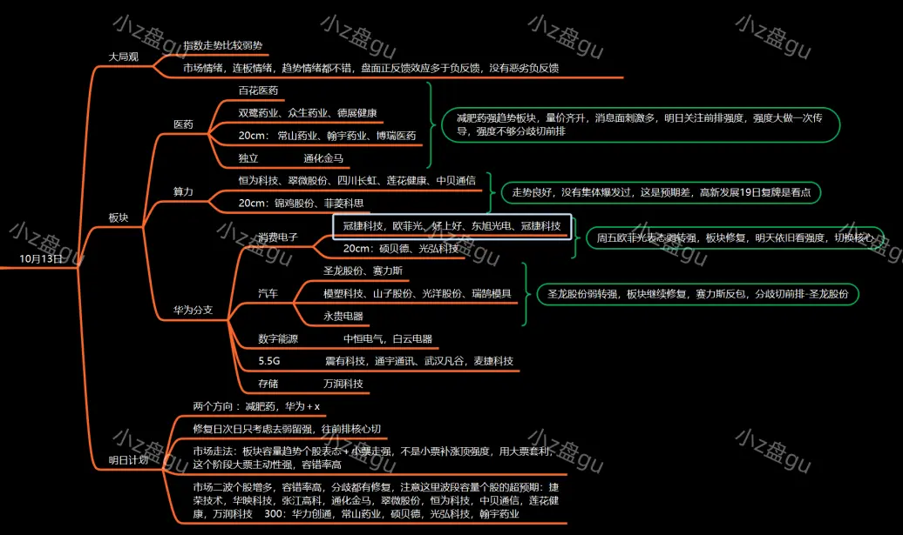

| 项目            | 详情                                                         |
| --------------- | ------------------------------------------------------------ |
| 时间            |                                                              |
| 持仓盈亏        |                                                              |
| 市场分析        |                                                              |
| 板块题材/情绪面 |                                                              |
| 个股分析        | 涨停板分析：                                                 |
| 消息面          |                                                              |
| 昨日预期分析    | 昨日是否兑现                                                 |
| 预期            | 高新发展 复盘看点：未复盘<br />圣龙股份：7版<br />申菱环境：放量下跌，没幅度<br />蜂助手：-<br />翰博高新：-<br />浙江仙通：华为汽车，冲高回落，走势不错，明天汽车回分歧吗<br />东方国信：图形不错，大模型概念， |
| 反思            |                                                              |
| 问财选股        |                                                              |

#### 2023-10-16


| 项目            | 详情                                                         |
| --------------- | ------------------------------------------------------------ |
| 时间            |                                                              |
| 持仓盈亏        | +100<br />欧菲光：13个点<br />可惜只有一手<br />早盘不算爆量，前日分歧转一致爆量的一半<br />整体放量，高开下跌。<br />早盘高开应该出掉，昨天预期应该是分歧，盘子这麽大应该注意<br />尾盘有资金抢筹，看明天消费电子的走势了，个人感觉很难，震荡为主 |
| 市场分析        | 大盘收3073，创业板新低<br />受中东乱局影响，石油、黄金、白银走强<br />诞生了很多首板，50+涨停，但是出手点不多。明天很多都会杀掉<br />今天量还行 8k |
| 板块题材/情绪面 | 1. 华为概念：算力消费电子 超充 华鲲振宇<br />2. 石油石化<br />3. ST板块：最近ST为什么这么强，ST天山快翻倍了（创业板ST涨停板已经调整为20CM了）<br />汽车<br />医药：减肥药、创新药，强度不够 |
| 个股分析        | 涨停板分析：54<br /><br />圣龙股份：7版，明天是考验了，大概率断板，华为汽车SLS<br />医药的几个核心标的 百花双路应该继续顶<br /> |
| 消息面          | 北京什么会来着，影响不大                                     |
| 昨日预期分析    | 昨日是否兑现                                                 |
| 预期            | 大盘 明天走修复<br />华为概念继续分歧了，只能看核心标的<br />另外就是看其他方向能不能走出来，华为+X还有什么没炒过<br />不管是医药还是华为，感觉都走向尾声了，按目前的题材肯定没有持续性，有没有新的方向比较关键，<br /><br /><br />明天做什么？？？？<br />看什么板块能发酵起来吧，另外能不能做一些低吸 |
| 反思            | 涛涛Exe 30倍，真牛逼，不知道用了多少时间<br />如果100万起步的话，有3kw了<br />羡慕、牛逼<br /><br /><br />这两波错过了太多：<br />常山药业、华力创通 看着上去的，一直不出手<br />冠石科技，很好的买点，没入场<br /><br />上半年的AI也完美错过<br /><br />所以一定要转变思路<br />主升行情不管怎么买都不错，不会让你亏钱。<br />因为有两个板了所以不敢去，简直愚蠢乳猪<br /><br /><br />挣钱效应就在高位<br /><br />这是市场规律，这是人性 |
| 问财选股        |                                                              |

#### 2023-10-17

| 项目            | 详情                                                         |
| --------------- | ------------------------------------------------------------ |
| 时间            | 周二                                                         |
| 持仓盈亏        | -100<br />天源迪科<br />15->2<br />冲高回落<br />亏了10个点<br />还好买得少<br /><br />这个操作是在是务必失败<br />想的是搞20CM<br />当时看到这个票高开高走，就无脑进去了<br />是在是大错特错<br /><br /><br />首先：昨天已经是电风扇行情了，医药、华为都走弱，今天虽然有修复，但是也不会有很好的挣钱效应<br />其次，这个是软件板块，虽然昨天有华为钱包、支付的消息，但是这个票不是核心标的<br />再者，这个完全是临时决定，没有足够的考量，没有预期，完全是跟风<br /><br />愚蠢如主，必败无疑<br /><br /><br />明天这个板块也不会强势的，高标可能有溢价，其他的都是走弱预期，这个票也是高位，得清仓 |
| 市场分析        | 预期是大盘修复<br />今天低开低走，午后护盘资金入场，拉红<br /><br />缩量7300<br /><br />涨停28跌停6<br /><br />一些高标出现严重的亏钱效应<br />百花医药一字跌停---消息驱动 |
| 板块题材/情绪面 | 卫星导航修复，能否再次走强<br />石油化工---中东局势<br />圣龙股份8板，抗住了，超预期，也是大盘弱导致的资金抱团，明天就不一定了，封板难度极高<br /> |
| 个股分析        | 涨停板分析：                                                 |
| 消息面          |                                                              |
| 昨日预期分析    | 昨日是否兑现                                                 |
| 预期            |                                                              |
| 反思            |                                                              |
| 问财选股        |                                                              |

#### 2023-10-18

| 项目            | 详情                                                         |
| --------------- | ------------------------------------------------------------ |
| 时间            | 周三                                                         |
| 持仓盈亏        | +40<br />天源迪科                                            |
| 市场分析        | 受美国芯片，限制出口高端芯片到中国<br />算力、CPO大跌<br />国产替代稳健<br /><br />大盘大跌 收3058<br />500股上涨<br /><br /> |
| 板块题材/情绪面 | 圣龙9板，把汽车带起来了，超预期<br />塞力斯封板<br />北汽蓝谷、比亚迪<br /><br /><br /><br /><br />华为汽车、华为支付、国产替代 |
| 个股分析        | 涨停板分析：<br />板哥满仓：<br />昨天低吸塞力斯：15+<br />今天低吸常山药业：10<br />ST天山：5+<br />君逸数码：15+<br />好上好：5+<br /><br /><br />“今天可太舒服了”<br /><br /><br />从捷荣开始明显感受到一些票取拉涨停过于便宜过于简单了<br /><br /><br />太尼玛强了<br /><br />这些高位高标也是敢低吸，<br />对行情对的理解，对情绪的判断太准了<br /><br />行情差高标抱团<br /><br /><br /><br /><br />四川长虹 |
| 消息面          |                                                              |
| 昨日预期分析    | 昨日是否兑现                                                 |
| 预期            | 一带一路什么时候表现，这两天有会议<br />华为+一带一路？      |
| 反思            | 什么是情绪，什么事热点？华为这波，你看清了吗 <br />华为：汽车、芯片、卫星、光刻、支付、算力、、、、这些题材，任何一个，买在主升，都大挣钱啊..........。懂了吗，懂了吗懂了吗<br /><br /><br />华为华为华为 |
| 问财选股        |                                                              |

#### 2023-10-19

| 项目            | 详情                                                         |
| --------------- | ------------------------------------------------------------ |
| 时间            | 周四                                                         |
| 持仓盈亏        | +50<br />卖出天源迪科：冲高大回路，卖在零轴<br />这个操作不行，追高行为，反思<br /><br />买入腾龙股份，买点不好，可以卖的更低，这也说明这个股票不及预期。<br />不过尾盘还是封板，明天应该不会亏钱，有可能会低开，本来以为是圣龙的补涨。明天圣龙看还能不能强势。<br /> |
| 市场分析        | 大跌1.74，<br />外资流出100+<br />3000+下跌<br />权重大跌<br />茅台罕见下跌5个点<br />国家队有尝试护盘，但是这个量明显没有作用<br /><br />26涨16跌 |
| 板块题材/情绪面 | 圣龙是这波的周期龙，10板<br /><br /><br />美国芯片封锁政策，高端显卡，GPU被限制出口<br />今天芯片大涨<br />卫星修复 |
| 个股分析        | 圣龙：10板<br />真视通：4板，华鲲振宇<br />上海沪工：3板，卫星<br />瑞贝卡：3板，华鲲振宇<br />文一科技：3板 芯片<br />浩物科技：2，华为汽车<br />腾龙：2，华为汽车<br /><br />新发展，收够80%华为鲲鹏还是什么的股份，早盘一字，百亿封单<br /><br />钟鹤四社：1，卫星<br />北特科技：华为汽车<br />大港股份：芯片<br />微信瑞：芯片<br />寒武纪：芯片<br />海立股份：芯片<br />新洁能：芯片：<br />锦龙股份：证券<br />江特电机：锂电池<br />盈方微：芯片<br />协和电子：汽车零部件<br />蓝箭电子：芯片，这个没追<br />铖昌科技：卫星<br />晋拓股份：汽车零部件：<br /><br /><br />真视通、盈方微、江特、大港、文一科技封单大一些<br />这几个继续板的预期大一些<br /><br /><br /><br /><br />跌停：医药、减肥药<br />常山<br />光洋<br />好上好<br />常山北明<br />万润<br />恒为<br />通化金马<br />德展<br />莎普爱思<br />百花<br />双路<br /><br /><br />亏钱效应、退朝 |
| 消息面          | 一带一路 会议                                                |
| 昨日预期分析    | 昨日是否兑现                                                 |
| 预期            |                                                              |
| 反思            | 周期<br />需要迎合<br />顺势而为-----重要<br />大家都很悲观的时候，反而是修复的时机<br />超跌反弹 |
| 问财选股        |                                                              |

#### 2023-10-21

| 项目            | 详情                                                         |
| --------------- | ------------------------------------------------------------ |
| 时间            | 2023-10-20                                                   |
| 持仓盈亏        |                                                              |
| 市场分析        |                                                              |
| 板块题材/情绪面 |                                                              |
| 个股分析        | 涨停板分析：                                                 |
| 消息面          |                                                              |
| 昨日预期分析    | 昨日是否兑现                                                 |
| 预期            | 市场底还没来：没有恐慌盘<br /><br /><br />富瑞特装：趋势票、天然气 |
| 反思            |                                                              |
| 问财选股        |                                                              |

#### 2023-10-24

| 项目            | 详情                                                         |
| --------------- | ------------------------------------------------------------ |
| 时间            | mon                                                          |
| 持仓盈亏        | - 误操作                                                     |
| 市场分析        | 沪指、深指、创指、科创50都下跌1个多点以上<br />沪指盘中跌两个点<br /><br />收2939<br />已经大跌了几天了，<br />况且今天北向休息<br /><br />接下来应该还会往下探，不断磨底<br /><br />去年10月份的底部是2885，这个位置应该是个支撑位，很可能会接近甚至跌破这个位置？<br />现在信息实在是不足 |
| 板块题材/情绪面 | 华为概念、卫星、华为汽车<br />                               |
| 个股分析        | 真视通早上给机会了<br />高新发展文一一字<br />12B抱团高标<圣龙<br /> |
| 消息面          | 中央汇金会救市吗？<br />有这些钱，用来化债效果是不是更好，化解系统性的一些风险，地产、城投、、、不太懂。感觉希望不大，去年的时候有汇金吗，也没有，国家队大出手，还是15年，动用万亿资金。但是那时候不一样吧，其他基本面不差，<br /><br />富士康被查：征地+税收问题<br />国家为什么这时候出手：<br />1. 郭台铭不听话？台湾大选国民党没有合力，不能与鸣金当抗衡，不符合大陆战略。因此要敲打一下？另外郭台铭之前强势表态不受大陆威胁<br />2. 台企、外资在逐渐跑路？这个站不住脚，别人跑路，你这时候清算，不符合逻辑<br /><br /><br />搞笑点：高兴的时候36天IPO，不高兴时依法依规查办<br /><br />影响：<br />1.加速外资流出，这样没有法治的环境难以生存<br />2.后面看空<br /><br /><br />今天工业富联一字跌停，3000亿的票，一字跌停，太恐怖了<br /><br /><br />富士康工业互联网股份有限公司，成立于2015年3月6日，于2018年6月在A股上市，股票简称：工业富联，股票代码：601138，总部位于广东省[深圳市](https://baike.baidu.com/item/深圳市/11044365?fromModule=lemma_inlink)。<br /><br /><br />巨无霸，这几年制造了万亿的外汇<br />每年营收几千亿<br /> |
| 昨日预期分析    | 富瑞特装，趋势票首绿-4<br />                                 |
| 预期            | 圣龙继续顶<br />真视通、文一科技、高新发展继续<br /><br />一进二：福日电子、白云电器、朗迪集团？？<br />欧菲光：今天强势往上顶，虽然开板了，但是还是有一定承接。明天如果还有增量资金入场的话，估计还会震荡上行，或许复制今天的走势， |
| 反思            | 熊市，少动多看                                               |
| 问财选股        |                                                              |

#### 2023-10-24

| 项目            | 详情                                                         |
| --------------- | ------------------------------------------------------------ |
| 时间            |                                                              |
| 持仓盈亏        |                                                              |
| 市场分析        |                                                              |
| 板块题材/情绪面 |                                                              |
| 个股分析        | 涨停板分析：                                                 |
| 消息面          | 科大讯飞：跌停，学习机文章“侮辱领导人”，就毛，说他没心胸，发起文革搞很多人，包括功成。他说得没问题，这个环境真他妈有毛病。内容审核方向利好<br />王石：怀恋赵紫阳--很多人，都不满习，GB<br /><br />万亿国债：防灾，利好基建？ |
| 昨日预期分析    | 昨日是否兑现                                                 |
| 预期            | 恒润股份<br /><br /><br />算力：明天分歧，但是后面还会继续走 |
| 反思            |                                                              |
| 问财选股        |                                                              |

#### 2023-10-25

| 项目            | 详情                                                         |
| --------------- | ------------------------------------------------------------ |
| 时间            |                                                              |
| 持仓盈亏        | +3：<br />1.打板恒润：早盘开板了，买入的，前几天真视通也是，开板没有买入，错失良机。恒润这个票：算力+风电，4亿的封单，还是很强的，相对昨天放量，7%换手，当前三板，明天还是涨停的预期，如果早盘不够强，那就要离场了。<br />2.威派格：乡村振兴、污水处理、净水，算是基建水利概念，早盘自选的票就他没涨停，看着上涨就买入了，尾盘回落，还小亏，这就是杂毛。明天估计很难了。<br /><br /> |
| 市场分析        | 高开低走，0.4 ，接近9千亿<br />                              |
| 板块题材/情绪面 | 基建<br />算力<br />华为概念、汽车<br />其他：卫星、地产     |
| 个股分析        | 64涨停，市场情绪较高<br />圣龙14板<br /><br /><br />今天最可惜的是C天元，开10个点没上，结果午后从40%直接拉升，最高140%，收74%<br /><br />为什么没上？觉得开得高了，没胆量。对这个逻辑没有信心。今天明显最强的就是基建，开出来就那麽多涨停，这个次新+基建（装配式建筑），逻辑很正，而且C票没有涨停限制，不像其他票一样，顶到20CM就没办法了，这个票上有非常大的操作空间，资金没地方去就回来这里。因此这个是绝佳的机会，就像当初的盟固利一样（盟固利更多的是情绪，这个票是当前特殊利好的强硬逻辑）。<br />错过了真实太可惜了。明天估计会低开，今天进去的资金会抢跑，但是也不会回吐太多的利润，如果还有增量资金敢进场，那更是有极大的利润。<br />板哥买了这个票，重仓35%，盘中就已经翻倍了，太NB了。<br /><br /><br />以后一定要注意这种机会！！！ N字头的不一定有机会，但是C字的，在特殊利好下有极大的利润空间。<br /><br />你看今天另一个消费电子的C票，冲高回落，没有板块利好，顶部上去的。况且今天这麽多涨停，没有足够的资金往上顶。<br /><br /><br /><br /><br />之前比较强势的苏州规划、深圳锐捷倒是一般。为什么？大家都知道，过于名牌了，资金没有选择去做。 |
| 消息面          | 文一科技两联跌停，财报利润造假 立案<br />李佳琦：底价协议，和京东、小杨哥这些利益冲突，直播电商简直是 非常不健康的产业<br /><br />全国捕狗，真你妈无语，好点的把狗送到服务站，这尼玛条件不好的直接杀，，，天朝什么奇葩，<br />除息不放假，真你妈大傻逼，还你妈发文论证真确幸，还有什么胡锡进这种大傻逼，<br /><br /><br />开源鸿蒙PC端？怪不得今天软通动力、荣科科技、恒为这些软件票涨幅不错 |
| 昨日预期分析    | 云南城投 一字？洋。确实一字<br /><br />基建：非常强势<br />云南城投：<br />化债20CM<br /><br />苏州规划！高开低走 |
| 预期            | 前排的基建一字。后排的断板走弱。<br />算力分歧<br /><br />明天万亿国债的影响还会持续吗？明天高开低走？骗炮？<br />继续寻找市场底？<br />分歧预期<br /><br /><br />高新：股份收购还没过，但是没出否定结果就没关系，继续一字、极度缩量<br />圣龙：继续，高位抱团，天天超预期 N<br />真视通：仅次于圣龙，搞辨识度，继续 Y<br />龙州股份：一字 Y<br />云南城投：断板 Y<br />恒润：板 Y<br />韩建河山：板 N<br />龙泉：板 Y<br />青龙管业：板 Y<br />舜宇：5-10 N<br />冠龙节能：10 N<br />三维通信：板 N<br /><br /><br />大盘弱预期，转债？ |
| 反思            | 舜宇股份这个票，早盘高开低走，尾盘封板了，有点可惜，题材很正中 ，当时洪灾的时候没怎么涨，今天没进去，有点可惜。----逻辑逻辑逻辑<br /><br /><br />国债：首先是放水，刺激经济，通胀。<br />央行不能直接给政府发钱，于是政府发行国债，央行已经投资人购买。<br /> |
| 问财选股        | 天元天元天元，昨天蛮神也说了天元，睡着了没有听，真你妈无语。<br /> |

#### 2023-10-26

| 项目            | 详情                                                         |
| --------------- | ------------------------------------------------------------ |
| 时间            | 2023-10-26                                                   |
| 持仓盈亏        | +275<br />卖出威派格<br />卖出恒润股份                       |
| 市场分析        | 大盘低开震荡收红 +0.48<br />挺挺超预期的，站上了5日线。北向买入12亿<br /> |
| 板块题材/情绪面 | 情绪：63<br /><br />华为汽车<br />华为概念<br /><br />华为有不少首板，圣龙断板后，除了不少补涨<br />基建：多个一字，前排买不到，龙泉、青龙、龙州、冠龙、巴安水务、<br />三季报<br />卫星<br /><br /><br /> |
| 个股分析        | 另外就是各个热点题材中的龙字辈：龙州、龙泉、冠龙、天龙、     |
| 消息面          |                                                              |
| 昨日预期分析    | 昨日是否兑现                                                 |
| 预期            | 板：<br />宁波高发<br />顺控发展<br />龙州股份<br />冠龙<br />巴安水务<br />龙泉股份<br /><br /><br /><br />趋势票：索贝德<br />陕西大华<br />龙韵股份<br />龙磁科技 |
| 反思            | C天元，今天有远超预期，30开，50收，40%<br />元超预期<br />昨天进的人很多都没有拿得住<br />80死亡换手，机遇和风险并存<br /><br />聚赛龙：这种趋势票，要是每天10日线附近低吸，也挣不少<br /> |
| 问财选股        | 近4天连续上涨 + 热点题材                                     |
| 大神交割单      | 顽主学习                                                     |

#### 2023-10-28

| 项目            | 详情                                                         |
| --------------- | ------------------------------------------------------------ |
| 时间            | 周五 周末复盘                                                |
| 持仓盈亏        | -                                                            |
| 市场分析        |                                                              |
| 板块题材/情绪面 | 医药：14涨停，前排继续，后排分歧走弱<br />康弘药业：1进2<br />凯因科技：断板，5%<br />誉衡药业：1进2<br /><br />三季报业绩：11板<br />这种逻辑不够强硬，时效性非常有限。业绩极其超预期的能走多个板，其他的都难<br />顺发恒业：6进7？每天都是换手板，筹码结构健康，但低位筹码更多，如果有人砸，低位获利盘可能会跟风，形成很大的抛压，没有增量资金的话很难晋级，另外最近高位都有很强的亏桥效应--真视通等。不能买<br />亚翔集成：板，华为、中心、半导体，强，可以接入<br />芭比食品：弱，断板<br />老凤祥：断板<br /><br /><br />华为汽车：10板，前排的继续，有分歧，<br />宁波高发：一字<br />江淮：5点高开，不一定封得住，盘子太大了<br />启明信息：板<br />凯众股份：栏板？<br />鹏翎股份：断，20cm难<br />北特科技：断<br />一汽解放：相对后排了<br />江铃汽车：断<br /><br /><br />汽车零部件：7板<br />天龙股份：板<br />热为股份：断<br />盾安环境：断<br /><br /><br />锂电池：7板<br />圣阳股份：圣阳股份：不能弱转强，那就断了<br />科达利：不看好，上方压力太大了<br />西藏矿业：断<br /><br /><br />芯片：5板，<br />张江高科：消息刺激，上方压力也大，55获利，不买<br />gzmb: 趋势票，也在高点了，不买<br />东方嘉盛：下午才拉，不看好<br /><br /><br />水利：4板，<br />龙洲股份：6近7？板？有分歧，周五爆量了，不安迪板就算可以了<br />冠龙节能：水下开，<br />龙泉股份：爆量，杀<br />青龙管业：强赚强？OR核<br /><br /><br />华为：3板<br />高新：一字？7板了，该开板了？<br />新亚制程：板<br />淳中科技：断<br /><br /><br />医疗卫星平台经济 |
| 个股分析        | 涨停板分析：<br /><br />阿为特：京，一天10倍                 |
| 消息面          | 超导有消息<br />登子见王，中美关系缓和，利好A，外资可能止跌<br />巴以冲突<br />**美军**刚刚对**叙利亚**境内的伊朗代理人进行了空袭。<br /> |
| 昨日预期分析    | 昨日是否兑现                                                 |
| 预期            | 亚翔集成<br />宁波高发<br />高新发展：<br />新亚制程<br /><br /><br />减肥药 CRO 继续观察<br />新能源超跌反弹？宁德时代周五表现极好 |
| 反思            | 捷荣：二波，因为有大资金在赌华为，百亿资金，赌华为能走三个月。所以不能让捷荣死掉。 |
| 问财选股        | 北特科技                                                     |
| 顽主交割单      | 最好的学习资料<br />大舅走了2023-10-30                       |

#### 2023-10-31

| 项目            | 详情                                                         |
| --------------- | ------------------------------------------------------------ |
| 时间            |                                                              |
| 持仓盈亏        |                                                              |
| 市场分析        | 万亿成交<br />机构干活<br />短信更难<br />不再抱团<br /><br />没有出手点 |
| 板块题材/情绪面 | 消费电子<br />减肥药：业绩驱动<br />医药<br />创新药！！     |
| 个股分析        | 涨停板分析：<br /><br />光弘科技 --核心标的，为什么没介入<br /><br />真视通：跌停，代表高标，最近高标顶部上去，大盘环境好了<br />龙州股份：勉强封板，巨量，明天低开<br />启明信息：一字，明天有预期，<br />亚翔集成：一字<br />利通电子：算力，重大消息<br />瑞达医疗：<br />铭科精技：跌停：获利了解<br />捷荣，跌停翘班，被动，受益于消费电子，因为下午翘班的，看到了消费电子走强，资金才会介入，不能参与<br />江辉汽车：高开低走，汽车板块代表，弱势，副反馈。爆量<br />阿为特：跌停，昨天挣钱，也出不来，明天还会跌，极度缩量，出不来很难受。<br />首都在线：算力20 |
| 消息面          | 中英时尚：黑科技芯片？有人吹，明天看一下<br />华为营销平台: 手机营销，智度股份<br /> |
| 昨日预期分析    | 昨日是否兑现                                                 |
| 预期            | 仙乐健康<br />强力新材<br /><br />半导体医药分歧<br />算力看能不能走强<br />汽车分歧<br />维信诺：逻辑好<br />智度股份<br />天龙股份<br />创新药<br />世纪华通：算力<br />东方材料：算力+化工材料<br />雅创电子<br />飞荣达：<br />轮动卫星？<br /> |
| 反思            | 没有出手点<br />是复盘不到位<br />没有预期<br />还是怎么回事<br />盘中没时间观察<br />怎么办<br /><br />早起？集合竞价早盘！！！ |
| 问财选股        |                                                              |
| 顽主交割单      | 最好的学习资料                                               |

#### 2023-10-31

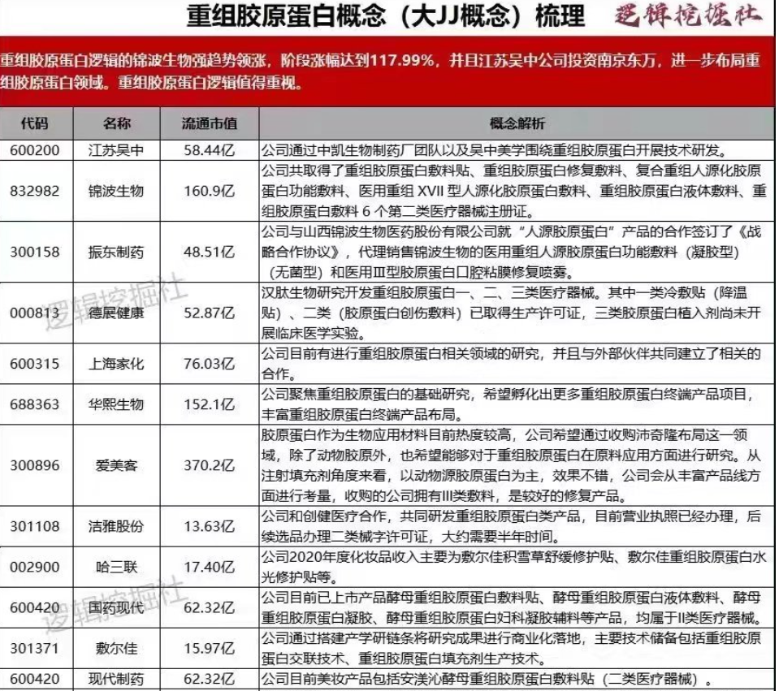

| 项目            | 详情                                                         |
| --------------- | ------------------------------------------------------------ |
| 时间            |                                                              |
| 持仓盈亏        |                                                              |
| 市场分析        | 外资大流出，65亿                                             |
| 板块题材/情绪面 | 情绪转换<br /><br />芯片：<br />亚翔集成：板<br />东方嘉盛：换手板、<br />深科技：板、万业企业<br />海立股份<br /><br /><br />汽车零部件：<br />天龙断<br />跃岭股份：板<br />凯迪股份、腾龙 断<br /><br />辅助生殖：<br />江苏吴中一字<br />其他断<br /><br />地产：消息，断<br /><br />医药：誉衡药业：板<br />龙津药业：换手板？难<br /><br /><br />华为概念：高新继续<br />智度股份板<br />联建光电水下-5开<br /><br />跨境电商：跨境通板 |
| 个股分析        | 精博生物<br />zdzy<br /><br /><br />大JJ概念：<br />江苏吴中：晚上高管辟谣，没有该男士项目<br />重组胶原蛋白<br /><br /><br /><br />龙洲股份：代表 高标分歧，强负反馈。高位票危险<br />誉衡医药：创新药，超预期<br /><br /><br />房地产：3板，消息刺激，不碰<br /><br />天龙股份：超预期<br />东方嘉盛：明天板？<br />腾龙股份：上塘路，硬顶，赌明天华为汽车修复预期。危险<br />天箭科技：卫星 |
| 消息面          | 大JJ高管，重组胶原蛋白 应该会走强<br />新疆自贸区<br />      |
| 昨日预期分析    | 昨日是否兑现                                                 |
| 预期            | 医药分歧<br />医美：福瑞达<br />重组蛋白：洁雅股份<br />跨境通：中美关系，跨境电商<br />弘信电子：算力核心标的，高位观察<br /><br /><br /><br />巨子生物、爱美客、华熙生物、福瑞达等多企业布局<br />佰仁医药<br /><br />恒瑞医疗：中军<br /><br />友阿股份：一字<br />跃岭股份 |
| 反思            |                                                              |
| 问财选股        |                                                              |
| 顽主交割单      | 最好的学习资料                                               |

### 11

#### 2023-11-01

| 项目            | 详情                                                         |
| --------------- | ------------------------------------------------------------ |
| 时间            |                                                              |
| 持仓盈亏        |                                                              |
| 市场分析        |                                                              |
| 板块题材/情绪面 | 汽车零部件：<br />天龙：高标情绪<br />松芝股份：<br /><br /><br /><br />华为概念：<br />亚翔集成<br /><br /><br />医药商业：<br />百洋医药<br />赛龙医药：脱离板块了，走独立线路，5板预期<br />**脱离板块走强**<br />医药要成为主线，必须要有高度票<br /><br /><br />超导：<br />国缆检测<br />百利电气<br />永鼎股份<br />这几个老票<br /><br />永鼎转载<br /><br /><br /><br />联建光电：超预期，17点。水下开，预期对的，但是后面拉得太猛，明天还是水下开，预计走弱 |
| 个股分析        | 涨停板分析：                                                 |
| 消息面          |                                                              |
| 昨日预期分析    | 昨日是否兑现                                                 |
| 预期            | 高新发展：比开板<br />开板会吸资金<br /><br />鸿利智汇：逻辑<br />江苏吴中：不及预期，高开低走，明天看能不能反包<br /> |
| 反思            | 拉超导的时候就应该买国缆检测                                 |
| 问财选股        |                                                              |
| 顽主交割单      | 最好的学习资料                                               |

#### 2023-11-02

| 项目            | 详情           |
| --------------- | -------------- |
| 时间            |                |
| 持仓盈亏        |                |
| 市场分析        |                |
| 板块题材/情绪面 |                |
| 个股分析        | 涨停板分析：   |
| 消息面          |                |
| 昨日预期分析    | 昨日是否兑现   |
| 预期            | 海特生物       |
| 反思            |                |
| 问财选股        |                |
| 顽主交割单      | 最好的学习资料 |


#### 2023-11-06

| 项目            | 详情                                                         |
| --------------- | ------------------------------------------------------------ |
| 时间            |                                                              |
| 持仓盈亏        |                                                              |
| 市场分析        |                                                              |
| 板块题材/情绪面 | 传媒：地位推高位<br />紫天科技20cm<br />天威视讯<br />中文在线<br />掌阅科技<br />龙韵股份<br /><br /><br />证券：<br />方正证券<br />景龙股份<br />太平洋<br /><br />消费电子：空有广度，没有高度，没有辨识度票<br />维信诺<br /><br /><br /> |
| 个股分析        | 龙韵股份<br />中文在线：容量，早上确认了地位<br />华闻集团：早上没有确认地位，不能买<br />腾龙股份：博弈补涨，庄在里面<br /> |
| 消息面          |                                                              |
| 昨日预期分析    | 昨日是否兑现                                                 |
| 预期            | 龙字辈：每个题材都带弄，跨天龙<br />游戏短剧：天威视讯<br /><br />最近连板小票<br />天龙、天威核心<br /><br /><br />现在在博弈跨年行情，不能怂，格局打开<br /><br />长江投资<br /><br />瑞欣股份 |
| 反思            | 主动性<br /><br />新龙分歧老龙避险<br />跨天龙都是主板的<br />上升期的第一次分歧 不要跑<br /><br /><br /><br />不下注，怎么挣钱<br />主升期空仓，退潮期猛干--你不亏钱谁亏钱<br />模仿和切换：龙+题材<br />一定要参与 |
| 问财选股        |                                                              |
| 顽主交割单      | 最好的学习资料                                               |

#### 2023-11-07

| 项目            | 详情                                                     |
| --------------- | -------------------------------------------------------- |
| 时间            |                                                          |
| 持仓盈亏        |                                                          |
| 市场分析        |                                                          |
| 板块题材/情绪面 | 算力：<br />恒润<br /><br /><br />CPO：<br />            |
| 个股分析        | 天龙：缩量                                               |
| 消息面          |                                                          |
| 昨日预期分析    | 昨日是否兑现                                             |
| 预期            | 算力要走主升？<br /><br /><br />做汽车补涨、往算力核心切 |
| 反思            |                                                          |
| 问财选股        |                                                          |
| 顽主交割单      | 最好的学习资料                                           |


| 项目            | 详情                                                         |
| --------------- | ------------------------------------------------------------ |
| 时间            | 2023-11-07                                                   |
| 持仓盈亏        | 踏空                                                         |
| 市场分析        |                                                              |
| 板块题材/情绪面 | 消费电子：<br />CPO<br />新易盛、<br />兆龙互连<br />森远股份<br />中旭际创<br /><br /><br />算力：<br />高新发展<br />很润股份<br />朗威股份<br />鸿博股份：老龙<br /><br /><br />汽车零部件：天龙股份-椅子加速<br /><br /><br />短剧：天威视讯椅子加速<br /><br />证券：方正 独苗<br /><br />芯片：东方嘉盛、福晶科技、文一科技，世名科技<br />光力科技<br /><br /> |
| 核心标的        | 亚翔集成：半导体<br />恒润:<br />天威视讯<br />东方嘉盛：超预期<br />方正证券<br />浙江正特：外毛，钟没<br /><br /><br /><br />龙字辈 |
| 消息面          |                                                              |
| 昨日预期分析    | 昨日是否兑现                                                 |
| 预期            |                                                              |
| 反思            |                                                              |
| 问财选股        |                                                              |
| 顽主交割单      | 最好的学习资料                                               |

#### 2023-11-08

| 项目            | 详情                                             |
| --------------- | ------------------------------------------------ |
| 时间            |                                                  |
| 持仓盈亏        |                                                  |
| 市场分析        |                                                  |
| 板块题材/情绪面 |                                                  |
| 个股分析        | 天龙：缩量                                       |
| 消息面          |                                                  |
| 昨日预期分析    | 昨日是否兑现                                     |
| 预期            | 小米汽车：北汽蓝谷<br />芯片：一直没有加速<br /> |
| 反思            |                                                  |
| 问财选股        |                                                  |
| 顽主交割单      | 最好的学习资料                                   |

#### 2023-11-09

| 项目            | 详情                          |
| --------------- | ----------------------------- |
| 时间            |                               |
| 持仓盈亏        |                               |
| 市场分析        | 龙字辈 大跌<br />高位亏钱效应 |
| 板块题材/情绪面 |                               |
| 个股分析        | 天龙：缩量                    |
| 消息面          |                               |
| 昨日预期分析    | 昨日是否兑现                  |
| 预期            |                               |
| 反思            |                               |
| 问财选股        |                               |
| 顽主交割单      | 最好的学习资料                |

#### 2023-11-12

| 项目            | 详情                                                         |
| --------------- | ------------------------------------------------------------ |
| 时间            |                                                              |
| 持仓盈亏        |                                                              |
| 市场分析        |                                                              |
| 板块题材/情绪面 | 高标负反馈：<br /><br />煤炭：正常小炒作，冬抄煤<br /><br /><br />光伏：受益中美贸易？<br /> |
| 个股分析        |                                                              |
| 消息面          | 中美关系：会谈<br />利好外贸，但是不是新消息了，早就还是涨了，而且是名牌，可能是利好出尽，高位出货。<br />鸿蒙不兼容安卓：各公司开始招募安卓 |
| 昨日预期分析    | 昨日是否兑现                                                 |
| 预期            | 光伏<br />鸿蒙<br />传媒修复？<br />次新消息？<br />中美：外贸、跨境电商<br />中文在线：海外APP？如果超预期，看补涨：海看股份<br />芯片？ |
| 反思            |                                                              |
| 问财选股        |                                                              |
| 顽主交割单      | 最好的学习资料                                               |

#### 2023-11-14

| 项目            | 详情                                                         |
| --------------- | ------------------------------------------------------------ |
| 时间            |                                                              |
| 持仓盈亏        | -3% * 400 * 2 宁波海运<br />航运、中俄贸易、一带一路<br /><br />这笔交易很失败。<br />心路历程：看好中美缓和，利好外贸、航运、跨境贸易等。早上长江投资一字，sbs集合竞价高开秒板，强度非常可观，代表外贸的强度。另外宁波远洋、海通发展快速封板，代表航运的走强，因此买入了张速较快的宁波海运。高开冲高回落震荡。板块也只有两只票涨停，强度一般，这笔交易较为失败。另外换手7太低，盘子较大了，不是好的标的。<br />明天开会不会冲高<br /><br />// 基本没冲高，平开低走，没出货也是莫大的错误<br /><br />另一个遗憾的是开创电器：早盘开出来一路冲高，没来低级买就封板了，以为没机会了，但是，10；44咋开一个大口子，13%，这时候没有买入，为啥？开板很不及预期，表名强度不够。<br />不过这票逻辑真不错：外贸、跨境电商、次新、盘子小<br />今天换手60，死亡换手，封单3.5kw<br />强度感觉还可以，明天有溢价，就算低开，也会修复了，比较题材在不断发酵明天大肉都有可能。<br /><br />// 预期对了，20CM，2板，昨天要是买入则是大肉，太可惜了。 就像今天一样，前排的不买，进追高 |
| 市场分析        | 8600放量<br />指数高开低走回升，大盘受3046<br /><br />华为概念<br />外贸<br />AI<br />汽车零部件---这个容量真实大，抄了这么久，不断挖掘，每天一堆首板。<br /> |
| 板块题材/情绪面 | 市场情绪：58<br />涨停50<br />跌停：<br /><br /><br /><br />短剧：天威、中文高开低走，都是面，今天介入都是亏钱的<br /><br />汽车零部件：东安动力、统一股份 三板下杀，亏钱效应。代表改板块的剧烈退草<br /> |
| 个股分析        | 高标：皇庭国际 杀<br />好美国家：6板预期<br />西洛科学：断板？有希望5板，换手上去<br /><br />宁波远洋：今天最先上班的，封单量大，缩量加速，题材逻辑好，明天打板<br />长江投资：继续板，可以会放一些量<br /><br />运煤能能源：垃圾<br /><br />创智教育：鸿蒙概念，观察一下，明天板预期<br /><br /><br />今天软通动力很强，中军都20CM，60亿成交<br />没上是在没胆量<br />当然这种大票定得太高，也没有参与的机会<br /> |
| 消息面          | 中美缓和<br />                                               |
| 昨日预期分析    | 昨日是否兑现                                                 |
| 预期            |                                                              |
| 反思            |                                                              |
| 问财选股        |                                                              |
| 顽主交割单      | 最好的学习资料                                               |

#### 2023-11-14

| 项目            | 详情                                                         |
| --------------- | ------------------------------------------------------------ |
| 时间            |                                                              |
| 持仓盈亏        | -100<br />宁波海运：竞价开出来冲到了成本价，没出，幻想着还会起来。另一方面2受太少了没感觉。要是20万就有感觉了。 明天看吧，中美看能签出来什么协议吧，如果降关税，外贸增加，还是有机会<br /><br />打板长江投资：早上看到开板了，就进去了，毕竟昨天还是外贸的龙二，结果今天收5，远远不及预期。同时爆量了，除非消息刺激。哎，主力净量倒数第二，应该没了，明天低开<br /><br /><br />追高荣科科技：没赶上早上的20CM买点，追了这个。互联网医疗 华为鲲鹏。买点也差得很，单纯的最高。<br />1. 临盘决定 X<br />2. 情绪操作 X<br />明天看有没有溢价吧，华为、鸿蒙，大科技线还在继续。 |
| 市场分析        | 9k亿 放量250<br />市场情绪：54<br />涨停：38<br />跌停：1    |
| 板块题材/情绪面 | 前些时候的高标巨幅亏钱效应算是过去了<br />华为概念：是在是太强了，太吃酒了，一直没参与，一直以为到收尾了，一直强势：20左右涨停，大量高标，巨幅上涨<br />1. 九联科技：20CM板，//-4<br />2.传智教育：一字<br />3.达华智能<br />4.思特奇<br />5.至正股份:// 分歧 转强<br /><br /><br />芯片：<br />皇庭国际：6板，坚果 300万全仓，板哥不会也进的这个吧<br /><br />银宝山新：龙二，但是强度一般，断板预期<br />文一科技：太尼玛强了，昨天调整，今天继续板了，明天不信还能板。<br /><br /><br />算力：<br />思特奇：早上强势封板，没来得及，明天二班预期？也有大肉<br />汇纳科技：<br />几个北交所大肉<br /><br /><br />人工智能：<br />豪美新材：6板<br />达华智能<br />汇纳科技<br />云从科技<br /><br />汽车零部件<br />外贸：<br />开创电器：超预期<br />三柏硕：<br />宁波远洋：T子或者继续加速<br /> |
| 个股分析        |                                                              |
| 消息面          |                                                              |
| 昨日预期分析    | 昨日是否兑现                                                 |
| 预期            | 文一科技：已经成为妖股了<br />创智教育：加速<br />九联、开创：10点左右<br /><br />一进二：<br />福晶科技：缩量、筹码解构不错，枫丹大，量太大，调整预期<br />延华智能：一进二<br />汇纳科技：很难进，大肉有的<br /><br />杨卓金泉：逻辑不够，断板预期，警官枫丹赞比很大<br />至正股份：底部筹码过多，有点危险的，分歧预期 |
| 反思            |                                                              |
| 问财选股        |                                                              |
| 顽主交割单      | 最好的学习资料                                               |

#### 2023-11-15

| 项目            | 详情                                                         |
| --------------- | ------------------------------------------------------------ |
| 时间            |                                                              |
| 持仓盈亏        | -50？ 出了宁波海运<br />荣科科技、长江投资 没出 傻逼<br />融科算是调整吧，还好。<br />长江不行了，贸易这个条线不行， |
| 市场分析        | 万亿<br />市场情绪：64<br />涨停：57<br />跌停：0<br />大盘：高开，回落，再高走，W型 |
| 板块题材/情绪面 | 1.芯片8865<br /><br />- 皇庭国际：7B，一字，板哥、坚果哥满仓涨停。缩量加速，明天继续板，<br />西陇科学：换手上去的，昨天就以为要断板，这种是真的超预期，换手上去的，筹码结构好，5B/6, 明天继续？<br />银宝山新：4B加速，预期板<br />至真股份：放量大长腿，尾盘拉上去的，明天危险元成股份：2/3，板预期？<br />宏昌电子：加速，筹码不太好，底部筹码过多，面临分歧<br />铂科新材：20CM，有肉预期<br />一事通：20CM：20CM，肉预期<br /><br /><br />2.华为概念：6908<br />创智教育：加速，板预期<br />多伦科技：加速预期、<br />延华智能：加速<br />恒为科技：板预期<br />江铃汽车：肉，板？<br />法本信息：<br /><br />太他妈多了，华为太尼玛牛逼<br /><br /><br /><br />3.算力6349<br /><br />恒为<br />美格智能：班预期<br />远道天下：大肉<br /><br />4.汽车零部件：5284<br /><br />威唐工业：20CM，大肉，<br />5.锂电：5213 |
| 个股分析        |                                                              |
| 消息面          |                                                              |
| 昨日预期分析    | 昨日是否兑现                                                 |
| 预期            |                                                              |
| 反思            |                                                              |
| 问财选股        |                                                              |
| 顽主交割单      | 最好的学习资料                                               |

#### 2023-11-16

| 项目            | 详情                                                         |
| --------------- | ------------------------------------------------------------ |
| 时间            |                                                              |
| 持仓盈亏        |                                                              |
| 市场分析        | 量能：<br />市场情绪：<br />涨停：<br />跌停：<br /><br />标准分歧日 |
| 板块题材/情绪面 |                                                              |
| 个股分析        |                                                              |
| 消息面          |                                                              |
| 昨日预期分析    | 昨日是否兑现                                                 |
| 预期            |                                                              |
| 反思            |                                                              |
| 问财选股        |                                                              |
| 顽主交割单      | 最好的学习资料                                               |

#### 2023-11-19

| 项目            | 详情                                                         |
| --------------- | ------------------------------------------------------------ |
| 时间            |                                                              |
| 持仓盈亏        |                                                              |
| 市场分析        | 量能：<br />市场情绪：<br />涨停：<br />跌停：               |
| 板块题材/情绪面 | 半导体“HMB 、 CPO                                            |
| 个股分析        | 南京熊猫：巨量，低开预期<br /><br /><br />芯片：12<br />银宝山新：6B，半导体+华为汽车，超预期，换手板，12%封单，明天继换手，或者分歧，底部筹码也非常多。板块加持，预期继续板<br />西陇科学：7B8T，光刻胶+阿尔祖海默，换手，板预期？能突破8板吗，<br />远望谷：首板，芯片+车联网，车联网3个板，板块强度不强，断板预期<br />光华科技：芯片-先进封装，一进二？no？<br />亚威股份：存储芯片、光刻胶，2晋三，换手上去的，非常漂亮，章盟主买2<br />华海诚科：大肉，688，HBM概念，一进二？难<br />赛腾股份：HBN+苹果，盘子大150，封单太低，断板预期<br />中富电路：先进封装+华为，大肉，有可能板<br />永吉股份：芯片，逻辑不够硬，断板预期<br />太极实业：HBM，盘子大150，和海力士合作，逻辑强啊，一进二<br />宏昌电子：HBM：4天3板，深水拉起来，板<br />联瑞新材：688，大肉，盘子大120，难板<br /><br /><br />汽车零部件：<br />统一股份：零部件+液冷服务器，感觉逻辑不硬，3换手板了，继续板？<br />跃岭股份：零部件+光芯片，逻辑不硬，断板<br />奥特佳：小米+华为+汽车热管理，板预期，A哥买<br />亚普股份：趋势票，底部筹码太大，断板预期<br />浙江世宝：无人驾驶+零部件，板？<br />江铃汽车：断板预期，低开？<br />丰华股份：断<br />福达股份：断<br />亚世光电： 外贸+，证伪，没有实质性外贸利好<br /><br /><br />网红经济、抖音概念：<br />广博股份：板，二进三，抖音+文化传媒，逻辑其实不硬，CPA下载推广而已，就是简单的营销合作//但是就是他妈的涨停，你讲什么逻辑，有什么用<br />佳友科技：分歧预期，20二连了<br />省广集团：逻辑硬，2晋三<br />引力传媒：断板<br /><br /><br /><br />机器人概念：<br />大亨股份：一进二？难<br />科力尔：一进二<br />附加股份：机器人+外贸，断板，低开<br /><br /><br />外贸：<br />三波所：元超预期了，包子回来了，没实际利好，地板开// 猜对了地板开，但是妈的走了一个地天，卧槽<br />四通股份：断 // B 准地天<br />上海三毛：断<br /><br /><br />汽车类：<br />海马汽车，一进二，无人驾驶  // 冲高回落<br />隆鑫通用：断<br /><br /><br />华为概念：<br />延华智能：断<br />多伦科技：地天，断板，低开<br /><br /><br /><br />锂电池：<br />宝明科技：短板<br />鑫科材料：断<br /><br /><br />其他：<br />南京熊猫：脑机+卫星，4板，预期强分歧，低开 // 一字，太硬了<br />鑫瑞达：一进二？VR，难<br />直真科技：算力+华为，断板，低开 //B <br />路畅科技：断板<br />剑桥科技：一进二？CPO<br />富通信息：断板 |
|                 | HBM？<br />HBM（High Bandwidth Memory）即高带宽存储器<br />SpaceX试飞，成功<br /> |
| 昨日预期分析    | 昨日是否兑现                                                 |
| 预期            | HBM：<br />供应商：<br />华海诚科<br />雅克科技<br />太极实业<br />代理：<br />香农芯创<br />商洛电子<br /> 基板：中富电路、科翔股份、满坤科技<br />3D封装：华海诚科、中富电路<br />环氧塑封料：华海诚科、飞凯材料、宏昌电子、一事通、联瑞新材 |
| 反思            |                                                              |
| 问财选股        |                                                              |
| 顽主交割单      | 最好的学习资料                                               |

#### 2023-11-20

| 项目            | 详情                                                         |
| --------------- | ------------------------------------------------------------ |
| 时间            | 2023-11-20                                                   |
| 持仓盈亏        | +50<br />预期错了：<br />省广：预期比引力预期高，因为周五引力下砸一个大缺口，才回升封板，而省广回封非常快，没有下砸，封单大，封板更早，而且省广逻辑更应。因此觉得圣光才是龙头，引力是跟风杂毛。<br />但是今天的盘面却大大相反，省广冲高回落，引力快速换手上班。<br />why？？？<br /><br />省广集团11月20日主力（dde大单净额）净流出6.07亿元，涨跌幅为0.75%，主力净量(dde大单净额/流通股)为-5.30%，两市排名5077/5079。<br /><br /><br />省广盘子太大：116，引力只有1/3<br />省广筹码结构不好：双峰，底部筹码过多<br /><br /><br />卖点不好：省广冲高没出<br />引力5个点卖了，卖飞<br /><br />没挣钱，哎<br /><br /><br />其他没操作，盘中难以抉择 |
| 市场分析        | 量能：9273，放量千亿<br />市场情绪：70<br />涨停：59<br />跌停：0<br />大盘红开，地走，大幅冲高，收0.46,<br /> |
| 板块题材/情绪面 | 周末发酵HBM，太一致了，早盘直接兑现，除了高位标的，其他全部死<br /><br />涨停分析：<br /><br /><br />汽车零部件：这个题材太强了。<br />跃岭股份：爆量大篮板，明天低开低走，死 // 低开弱转强，尾盘炸板又回封<br />圣龙股份：2B，老龙，断板预期 // 加速<br />奥特佳：弱转强，封单大，但底部筹码也非常多，明天可能还有一板<br />同益股份：换手上去的，4B了，还有一板，也比较难，有分歧，分歧预期，断板  // 天地大面<br />jql: 搜班，一进二？有点难 // 一字加速<br />三祥新材：枫丹流弊，一进二 <br />天安新材：断板预期<br />大业股份：断板<br />一并科技：封板不错，尾盘强抽风板，一进二？难 // 换手上板<br /><br /><br /><br />芯片：8<br />亚威股份：继续加速一字 // T<br />银宝山新：7进8？ 分歧 // 加速，卡掉了西陇科学<br />宏昌电子：低开 断<br />西陇科学：超预期，10板？<br />湘邮科技：断板<br />和远气体：断板<br />兴森科技：一进二 // 大面<br />至正股份：大篮板，低开5个点<br /><br /><br />机器人：<br />科力尔：加速  // 篮板<br />赛为智能：大肉，<br />五洲新春：断板<br />日发精机：断<br />附加股份：2进3？断板<br />八方股份：断板<br />中重科技：断板<br /><br /><br /><br />算力：3<br />电子秤：加速<br />直真科技：超预期，3板了，三进四，难<br />智微智能：一进二 // 面<br /><br /><br /><br />脑机：<br />南京熊猫：继续加速 // mian？<br />创新医疗：趋势+板，，，，断板预期<br /><br /><br />外贸：四通+三柏硕<br />都是地天<br />明天杀掉，不会加速的<br /><br />// 操，都上板了<br /><br /><br />抖音：<br />广播股份：3近似？<br />引力传媒：分歧<br />// 都板了 |
| 个股分析        | 银宝山新---风向标<br />因为他强度够，其他的票才能起来<br />红茶电子、圣龙股份，这些都是被银宝山新带动的<br /> |
| 消息面          |                                                              |
| 昨日预期分析    | 昨日是否兑现<br /><br />HBM分歧<br />短剧回流                |
| 预期            |                                                              |
| 反思            | 最近很多趋势票没有抓住<br />最近挣钱效应在连板<br />表现在弱转强<br /><br /><br />穿越龙：文一、天威、中文 |
| 问财选股        | 主力净额<br />趋势票                                         |
| 顽主交割单      | 最好的学习资料                                               |

#### 2023-11-21

| 项目            | 详情                                                         |
| --------------- | ------------------------------------------------------------ |
| 时间            | 21                                                           |
| 持仓盈亏        | -12<br />三六五网：早盘强势冲高的时候买入，没成交，以为会强势封板，所以没撤单，认为不会回落，但是不久后就回落了，收盘还小亏。<br />题材上看是 地产+文化传媒，但不管哪个题材，都是跟风。明天 冲高回落，低开？<br />买点太差了，太被动了。<br />早盘的一彬科技，还有另外一个票，没上。<br />早盘10分钟太重要了。<br /><br />昨天选的趋势票 都大跌<br /><br /><br />引力和省广，双双涨停，太尼玛痛了 |
| 市场分析        | 量能：9981<br />市场情绪：57<br />涨停：52<br />跌停：1 至正股份<br />外资流入：1.42<br />上涨家数：1510<br /><br /><br />大盘冲高，最高0.7，然后大幅回落，收绿，原因疑似彭博社发布消息，央行将控制信贷风险？？？ |
| 板块题材/情绪面 | 挣钱效应：<br /><br />汽车零部件：8<br />jql: 2-3 换手板<br />奥特佳：断板预期，分歧，底部筹码太多了 <br />圣龙股份：二波，3-4？ 难//板了，超预期<br />三祥新材：换手板<br />跃岭股份：今天反包，明天板预期，筹码结构较好，有承接 // 跌停，被yingbsx带下来了？<br />一彬科技：2进3？ // yes<br />亚普股份：断<br />康泰股份：尾盘拉，断板预期 --板<br /><br /><br />地产：5<br />大龙地产：板<br />深圳页A：1-2<br />荣盛发展：断<br />金科股份：断<br />slkj: 有意思，20天趋势，小步慢跑，明天分歧调整<br /><br />创投：4<br />九鼎投资：断 --ban<br />深赛格：1-2<br />jxzy:断<br />中迪投资：低开低走<br /><br /><br />化工：3<br />山东华鹏：1-2 盘子小 逻辑不够硬 -- 大面<br />花园新村: 断<br /><br /><br />外贸：3<br />四通股份：换手板 --断<br />三柏硕：8板了，分歧预期，可能大面，四通补上去，或者杀跌 -- 地天，超预期<br />通达创智：断<br /><br /><br />抖音：3<br />引力：板<br />广播：分歧，断板？或者换手上去  -- 也是地天，卧槽<br />省广集团：超预期，反包，断板，<br />看板块走势吧<br /><br /><br />文化传媒：3<br />严三科技：断，盘子太大了<br />智度股份：板 -- 断<br />中广天择：断，低开 -- 板<br /><br /><br />医药-基因疗法：3<br />贝瑞基因：1-2<br />舒泰神：大肉  --面<br />禾元生物：肉 -- 大面<br /><br /><br />教育：2<br />btgf: 断<br />czjy: b? -- 跌停<br /><br /><br />AI:2<br />朗玛信息：大肉，可能涨停，大模型备案<br />联特科技：大肉<br /><br /><br />芯片：2<br />亚威股份：4-5？<br />银宝山新：分歧预期，被三柏硕卡掉，还是卡掉三柏硕？后者  -- 跌停<br /><br />其他：sxyx:分歧 -- 加速<br />电子秤：分歧<br />展鹏科技：换手板 -- 加速<br />科力尔：低开面<br />仁东控股：1-2？ -- 面<br />伟时电子：断 -- 板<br /> |
| 个股分析        |                                                              |
| 消息面          |                                                              |
| 昨日预期分析    | 昨日是否兑现                                                 |
| 预期            | 大盘预期：<br />板块预期：<br />个股预期：监控哪些股         |
| 反思            |                                                              |
| 问财选股        | 主力净额<br />趋势票                                         |
| 顽主交割单      | 最好的学习资料                                               |

#### 2023-11-22

| 项目            | 详情                                                         |
| --------------- | ------------------------------------------------------------ |
| 时间            |                                                              |
| 持仓盈亏        | -20<br />三四五王没操作，傻逼                                |
| 市场分析        | 量能：<br />市场情绪：<br />涨停：<br />跌停：<br />外资流入：<br />上涨家数： |
| 板块题材/情绪面 | 挣钱效应：<br /><br />亏钱效应：                             |
| 个股分析        |                                                              |
| 消息面          |                                                              |
| 昨日预期分析    | 昨日是否兑现                                                 |
| 预期            | 大盘预期：<br />板块预期：<br />个股预期：监控哪些股         |
| 反思            |                                                              |
| 问财选股        | 主力净额<br />趋势票                                         |
| 顽主交割单      | 最好的学习资料                                               |


#### 2023-11-23

| 项目            | 详情                                                         |
| --------------- | ------------------------------------------------------------ |
| 时间            |                                                              |
| 持仓盈亏        |                                                              |
| 市场分析        | 量能：8754<br />市场情绪：53<br />涨停：50<br />跌停：8<br />外资流入：-30<br />上涨家数：940 |
| 板块题材/情绪面 | 挣钱效应：<br /><br /><br />文化传媒:<br /><br />天威视讯：妖股，继续板<br />引力：板<br />广博股份：板？分歧？水下拉起来，断预期<br />中广天择：板？<br />思美传媒：1-2<br />龙版传媒：分歧<br />吉视传媒：duan<br /><br /><br />汽车零部件：<br />圣龙：板<br />三祥新材：板<br />jql:duan<br />一彬科技： 板？ 分歧转一致？<br />坤泰股份：断<br /><br />hsgf:断<br />sldz: 1-2<br />统一股份：地天，继续板？<br /><br /><br />芯片：<br />亚威股份：板<br />元成股份：分歧断<br />实益达：断<br />太极实业：板？断<br /><br /><br />深圳：<br />生振业A：继续加速<br />深赛格：Ban<br />怡亚通：断<br /><br />消费电子：<br />伟时电子：断<br />惠威科技：断<br /><br />jrjs:板<br />座椅科技：板<br /><br /><br /><br />亏钱效应：<br />银宝山新<br />丰华股份<br />延华智能<br />利通电子<br />西陇科学<br />龙高股份<br />传智教育<br />皇庭国际<br /> |
| 个股分析        |                                                              |
| 消息面          | 鸿蒙 借壳上市？                                              |
| 昨日预期分析    | 昨日是否兑现                                                 |
| 预期            | 大盘预期：<br />板块预期：<br />个股预期：监控哪些股         |
| 反思            |                                                              |
| 问财选股        | 主力净额<br />趋势票                                         |
| 顽主交割单      | 最好的学习资料                                               |

#### 2023-11-26

| 项目            | 详情                                                         |
| --------------- | ------------------------------------------------------------ |
| 时间            |                                                              |
| 持仓盈亏        | -20<br />三四五王没操作，傻逼                                |
| 市场分析        | 量能：<br />市场情绪：<br />涨停：<br />跌停：<br />外资流入：<br />上涨家数： |
| 板块题材/情绪面 | 挣钱效应：<br /><br />亏钱效应：                             |
| 个股分析        |                                                              |
| 消息面          | 药<br />                                                     |
| 昨日预期分析    | 昨日是否兑现                                                 |
| 预期            | 大盘预期：<br />板块预期：<br />个股预期：监控哪些股         |
| 反思            |                                                              |
| 问财选股        | 主力净额<br />趋势票                                         |
| 顽主交割单      | 最好的学习资料                                               |

### 12

#### 2023-12-02

| 项目            | 详情                                                         |
| --------------- | ------------------------------------------------------------ |
| 时间            | 周五 无操作                                                  |
| 持仓盈亏        |                                                              |
| 市场分析        | 量能：8341<br />市场情绪：57<br />涨停：50<br />跌停：2<br />外资流入：-50<br />上涨家数：2992 |
| 板块题材/情绪面 | 挣钱效应：<br /><br />人工智能：<br />信雅达：Pika技术，文本描述，视频生成，“抄女儿”--董事长二女儿是pika核心技术人员，高才生。一字预期<br />日海智能：无人驾驶+AI，尾盘拉升，预期不高，断板？--板，加速<br />网点软件：AI视频，封单不算多，pika这个能抄多久，预期不高，断板预期 -- 加速<br />光迅科技：容量票，光模块+激光雷达+华为，概念多，5%左右<br />力盛体育：AI体育+VR教育。断板预期<br />皖通发展：断板预期<br />金桥信息：断板<br />南兴股份：1进而 -- 面<br />万兴科技：大肉<br /><br /><br /><br />平台经济：<br />南京商旅：继续加速，逻辑看不太懂，国资？<br />返利科技：PDD+AI，一进二？有点难 -- 加速<br />苏豪鸿业：断板 --板<br />三力士：断板<br />引力传媒：断板 -- 板<br />焦点科技：断板<br /><br /><br />文化传媒：<br />中广天择：换手板 --加速<br />因赛集团：大肉 -- 二连 太强了<br />龙板传媒：断板，不看 -- 板<br />果麦文化：AIGC 大肉<br />上海电影：断板，低开<br /><br /><br />汽车零部件：<br />启明信息: 断板<br />金龙汽车：肉，断板<br />东安动力：加速？还是被砸？不太可能被砸，昨天进去的资金，如果砸的话真不了钱的，所以还得拉 -- 对的<br />西上海：断板<br /><br /><br />游戏：游族网络：三体，一进二 -- 断<br />盛天网络：大肉<br />姚记科技：12<br />昆仑万维：大肉，连板？盘子大不可能<br /><br /><br />智能驾驶：<br />威帝股份：面：筹码结构太差了，二级分化  --地天<br />高鸿股份：一进二？-- 断<br />晋拓股份：4-5？地天上去的，还有肉，封单强，走加速 -- 大面<br /><br /><br /><br />食品饮料：<br />良品铺子：断板 -- 板<br />惠发食品：6板预制菜，逻辑不够强，断板，面了，昨天封单不强 -- 板，类地天，<br />有友食品：断板<br /><br /><br />其他：<br />大连圣亚：2-3 -- 断<br />融发核电：一阳穿4线，1-2---有消息？ 面<br />伟时电子：板<br />高新发展：断<br /><br /><br />亏钱效应：<br /><br /><br /><br /><br /><br />中字头拉升，护盘？<br />国家队入场护盘，拉的科技<br />中字头在平铺，能持续吗？<br />这些资金靠得住吗？<br /><br /><br />--- 搞不住，它不是做慈善的<br /><br /><br />-- 预期命中率太低了 |
| 个股分析        |                                                              |
| 消息面          | 平准加仓科技股？<br /><br /><br />江淮汽和华为合作，但是江淮完全颇为了，谁回去动这麽大的套牢盘，没预期 |
| 昨日预期分析    | 高新发展：砸，没放量，<br /><br /><br />816产业链<br /><br />鸿博股份、浪潮信息<br />AI确认的话 切 |
| 预期            | 大盘预期：<br />板块预期：<br />个股预期：监控哪些股<br /><br /><br />万兴科技<br />姚记科技<br />游族网络<br /><br /><br />看AI/视频生成这块的走势，如果强势，就跟 |
| 反思            |                                                              |
| 问财选股        | 主力净额<br />趋势票                                         |
| 顽主交割单      | 最好的学习资料                                               |

#### 2023-12-04

| 项目            | 详情                                                         |
| --------------- | ------------------------------------------------------------ |
| 时间            | 2023-12-04                                                   |
| 持仓盈亏        | -60？<br />恒盈科技：打板<br />明天有溢价，金融科技+人工智能，一进二难度有点大<br />应该不会低开的。<br /><br />西上海：大面，还好只买在1.5左右，收-1.5，明天看能不能冲高，冲高赶紧出掉。<br />这个票二班的话面临前高<br />伟时电子、日海智能还没死，看明天还能不能修复<br />板块是比亚迪 |
| 市场分析        | 量能：8500<br />市场情绪：58<br />涨停：54<br />跌停：2<br />外资流入：-14<br />上涨家数：2226<br /><br />大盘-1.6 |
| 板块题材/情绪面 | 挣钱效应：<br />AI：8<br />信雅达：继续加速<br />日海智能：加速 -- 大面<br />昂立教育：换手板<br />网点软件：换手 --大面<br />因赛集团：肉 --面<br />汇洲智能：断 <br />贝仕达克：肉 --米娜<br />村中科技：断<br /><br /><br />汽车零部件: 太过于强了 板块，<br />东安动力: 加速板，第一天分歧没进去，错失3个班<br />安凯汽车：板？江淮华为利好的小股  --面<br />苏豪鸿业：板 --面<br />引力传媒：继续顶 --面<br />联络互动：低开 <br /><br /><br />文化创美：<br />中广天择：继续加速<br />中视传媒：断<br />龙版传媒：继续板？概念不错，贺龙家+知识产权+数字确权<br /><br /><br />国企改革：<br />中公高科：板<br />江苏舜天：板？<br />空港股份：断<br /><br /><br />智能驾驶：<br />威帝股份：今天地天，13亿资金进去，明天这部分资金应该不会直接砸，但是底部还有很多筹码，其中的一部分看到不及预期是会立场的。低开？蛮神说低开的，我说红开吧 -- 地天地<br />中光学：断<br />索菱股份：断<br />银之杰：肉<br />深桑达A：今天犹豫没上，觉得国资、信创这些概念逻辑不正，今天是算力+数据要素 -- -2<br />恒盈科技：肉 -- 尾盘拉板<br /><br /><br /><br />风电：<br />神力股份：断<br />正威新材：板？封单大 --面<br /><br /><br />氢能源：<br />国机通用：国企改革，一进二<br />蓝科高新：：低开<br /><br /><br />VR：<br />罗曼股份：板<br />亿道信息：板？<br /><br /><br />食品饮料：<br />惠发食品：核按钮<br />良品铺子：断<br /><br /><br /><br /><br />亏钱效应： |
| 个股分析        |                                                              |
| 消息面          |                                                              |
| 昨日预期分析    | 昨日是否兑现                                                 |
| 预期            | 大盘预期：<br />板块预期：<br />个股预期：监控哪些股<br /><br /><br />微信老师吹的票，观察：<br />中科曙光<br />三人行<br />人民网<br />智微智能<br />神州数码<br />威星智能<br /><br /><br /><br />美芝股份：5日线<br />华达科技<br /><br />正威新材 |
| 反思            |                                                              |
| 问财选股        | 主力净额<br />趋势票                                         |
| 顽主交割单      | 最好的学习资料                                               |

#### 2023-12-05

| 项目            | 详情                                                         |
| --------------- | ------------------------------------------------------------ |
| 时间            |                                                              |
| 持仓盈亏        | -50？                                                        |
| 市场分析        | 量能：8320<br />市场情绪：42<br />涨停：39<br />跌停：2<br />外资流入：-75<br />上涨家数：651 |
| 板块题材/情绪面 | 挣钱效应：<br /><br />亏钱效应：                             |
| 个股分析        | 通化金马、圣龙股份、东安动力                                 |
| 消息面          | 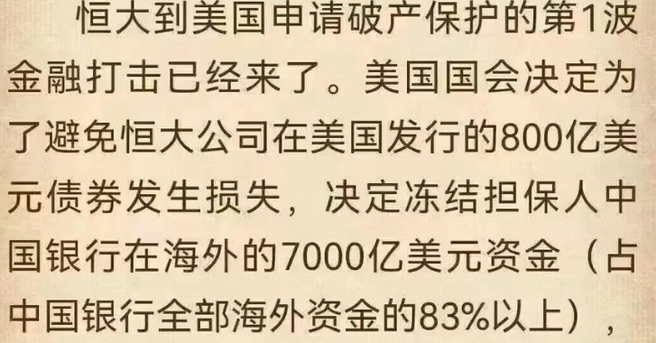 |
| 昨日预期分析    | 昨日是否兑现                                                 |
| 预期            | 大盘预期：<br />板块预期：<br />个股预期：监控哪些股         |
| 反思            |                                                              |
| 问财选股        | 主力净额<br />趋势票                                         |
| 顽主交割单      | 最好的学习资料                                               |

#### 2023-12-10

| 项目            | 详情                                                         |
| --------------- | ------------------------------------------------------------ |
| 时间            | 周末复盘                                                     |
| 持仓盈亏        | -100<br />5个点买入C锦江，收-2<br />买入逻辑：新股，筑底预期。+国企改革<br />预期差：真能跌，11.25块破发了。<br />明天看有没有修复吧 |
| 市场分析        | 量能：9600<br />市场情绪：34<br />涨停：33<br />跌停：13<br />外资流入：<br />上涨家数：1316 |
| 板块题材/情绪面 | 退潮日，中位股普遍杀跌<br />亏钱效应：<br />国机通用：盐湖提锂杀跌<br />西陇科学：等等不写了<br /><br /><br />挣钱效应：<br /><br /> |
| 个股分析        |                                                              |
| 消息面          | 1.高层会议：明年经济工具：稳中求进<br />2.11月CPI数据：同比环比-0.5%，差预期下跌，通货紧缩，不乐观。 |
| 昨日预期分析    | 昨日是否兑现                                                 |
| 预期            | 大盘预期：<br />板块预期：<br />个股预期：监控哪些股<br /><br /><br />AI容量票，小仓位试错<br />如果放量，有一定持续性 |
| 反思            |                                                              |
| 问财选股        | 主力净额<br />趋势票                                         |
| 顽主交割单      | 最好的学习资料                                               |

#### 2023-12-11

| 项目            | 详情                                                         |
| --------------- | ------------------------------------------------------------ |
| 时间            |                                                              |
| 持仓盈亏        | -50<br />开仓五方光电：盈利3个点，超预期了，追得有点高了<br />清仓C镜江：垃圾次新 |
| 市场分析        | 量能：9115<br />市场情绪：53<br />涨停：39<br />跌停：1<br />外资流入：32<br />上涨家数：3913<br /><br /><br />昨天CPI PPI的“超预期”，体现在早盘低开猛烈下杀，外资猛砸，到2932.<br />午后猛拉，情绪回暖，神秘资金入场，拉证券。<br />收2991<br /><br /><br />不是市场合力<br />但是量能足够<br /><br /><br />情绪先于指数修复 |
| 板块题材/情绪面 | 挣钱效应：<br />国企改革、文化传媒、人工智能、证券、VR/AR/MR、汽车零部件<br /><br />亏钱效应： |
| 个股分析        | <br />苏州科达：一直加速，多模态，三板，<br />南京公用：T，天然气+国企改革，<br />四川金顶：弱转强，国企改革+氢能源，4板<br />文投控股：换手板，4B<br />亿道信息：换手板<br />龙版传媒：反包大长腿，<br />出版传媒、国脉文化：<br />恒盈科技：金融---国家队，风向标、证券<br />圣龙股份：+东安动力<br />世纪天鸿：AIGC <br />旺达软件：多模态<br />五方光电：VR<br /><br /><br /><br />最关键的票：<br />恒盈科技：国家队，为什么没有龙虎榜<br />龙版传媒：最有辨识度的，7天6板，<br /><br />浙商证券：风向标<br /><br /><br />旺达软件--一定是卖点：竞价<br />深远股份：股性太好了 |
| 消息面          |                                                              |
| 昨日预期分析    | 昨日是否兑现                                                 |
| 预期            | 大盘预期：<br />板块预期：<br />个股预期：监控哪些股         |
| 反思            |                                                              |
| 问财选股        | 主力净额<br />趋势票                                         |
| 顽主交割单      | 最好的学习资料                                               |

#### 2023-12-12

| 项目            | 详情                                                         |
| --------------- | ------------------------------------------------------------ |
| 时间            |                                                              |
| 持仓盈亏        |                                                              |
| 市场分析        | 量能：<br />市场情绪：<br />涨停：<br />跌停：<br />外资流入：<br />上涨家数： |
| 板块题材/情绪面 | 挣钱效应：<br /><br />亏钱效应：                             |
| 个股分析        |                                                              |
| 消息面          |                                                              |
| 昨日预期分析    | 昨日是否兑现                                                 |
| 预期            | 大盘预期：<br />板块预期：<br />个股预期：监控哪些股         |
| 反思            | 永远做核心，今天核心是哪些，做了吗<br /><br />高老师：信雅达最有性价比 |
| 问财选股        | 主力净额<br />趋势票                                         |
| 顽主交割单      | 最好的学习资料                                               |

#### 2023-12-13

| 项目            | 详情                                                         |
| --------------- | ------------------------------------------------------------ |
| 时间            |                                                              |
| 持仓盈亏        | -10，几乎打板 南京公用，不太好，明天看有没有溢价，估计要低开或者平开，冲高一定要卖。 |
| 市场分析        | 量能：7685<br />市场情绪：42<br />涨停：36<br />跌停：1<br />外资流入：-100<br />上涨家数：1360 |
| 板块题材/情绪面 | 挣钱效应：国企改革、北交所、机器人、AI、医药<br /><br />机器人：特斯拉机器人利好 optimus gen2<br /><br />亏钱效应：雪龙集团<br />南京商旅：低开高走，下杀，还是不敢挑战监管。<br />中迪投资：大面<br /> |
| 个股分析        | 按时间线：<br />南宁百货：国资 一字加速 3B，换手板<br />苏州科达：多模态 AI，加速，5B，明天换手<br />音飞储存：国改+机器人，今天没上，亏了，预期4B<br />珠江钢琴：国改，断板？2近3？断？<br />博信股份：国改 脑机+AI，3B，加速/换手板<br />通化金马：妖股，量化+深股通+方新侠，老庄控盘，主力净额5e，明天有不小溢价<br />文投控股：顶着大利空，换手6B，明天还能顶得住吗，低开？<br />四川金顶：6B，地产，弱转强，放量换手板预期，不过触发10天100%偏离<br />南京公用：尾盘炸了，龙虎榜，全是拉萨天团买入，明天卧槽难了，估计低开了，亏钱走。<br />拓新药业：唯一20CM，明天肉。<br />引力传媒：龙版传媒明天估计没了，引力补上去？<br />巨轮智能：机器人，1-2<br />杭齿前进：低开<br />克劳斯：机器人+国改，1-2<br />云顶科技：多模态，方巨量换手，断板？<br />汉王科技：多模态，2-3难，呼家楼，有预期<br /> |
| 消息面          |                                                              |
| 昨日预期分析    | 昨日是否兑现                                                 |
| 预期            | 大盘预期：<br />板块预期：<br />个股预期：监控哪些股         |
| 反思            | 永远做核心，今天核心是哪些，做了吗                           |
| 问财选股        | 主力净额<br />趋势票                                         |
| 顽主交割单      | 最好的学习资料                                               |

#### 2023-12-16

| 项目            | 详情                                                         |
| --------------- | ------------------------------------------------------------ |
| 时间            |                                                              |
| 持仓盈亏        | - 大龙地产，1个点，                                          |
| 市场分析        | 量能：<br />市场情绪：<br />涨停：<br />跌停：<br />外资流入：<br />上涨家数： |
| 板块题材/情绪面 | 挣钱效应：<br /><br />热力：京能热力、杭州热电<br />亏钱效应： |
| 个股分析        | 奥飞娱乐：元梦之星，游戏不知道怎么样，但是宣传的钱是花出去了，这些和奥飞相关。<br /> |
| 消息面          |                                                              |
| 昨日预期分析    | 昨日是否兑现                                                 |
| 预期            | 大盘预期：<br />板块预期：<br />个股预期：监控哪些股<br /><br />地图+国资<br /> |
| 反思            | 永远做核心，今天核心是哪些，做了吗                           |
| 问财选股        | 主力净额<br />趋势票                                         |
| 顽主交割单      | 最好的学习资料                                               |

#### 2023-12-18

| 项目            | 详情                                                         |
| --------------- | ------------------------------------------------------------ |
| 时间            |                                                              |
| 持仓盈亏        |                                                              |
| 市场分析        | 量能：<br />市场情绪：<br />涨停：<br />跌停：<br />外资流入：<br />上涨家数： |
| 板块题材/情绪面 | 挣钱效应：<br /><br />亏钱效应：                             |
| 个股分析        | 开盘啦笔记<br />                                             |
| 消息面          |                                                              |
| 昨日预期分析    | 昨日是否兑现                                                 |
| 预期            | 大盘预期：<br />板块预期：<br />个股预期：监控哪些股         |
| 反思            | 永远做核心，今天核心是哪些，做了吗                           |
| 问财选股        | 主力净额<br />趋势票                                         |
| 顽主交割单      | 最好的学习资料                                               |

#### 2023-12-19

| 项目            | 详情                                                         |
| --------------- | ------------------------------------------------------------ |
| 时间            |                                                              |
| 持仓盈亏        |                                                              |
| 市场分析        | 量能：<br />市场情绪：<br />涨停：<br />跌停：<br />外资流入：<br />上涨家数： |
| 板块题材/情绪面 | 挣钱效应：<br /><br />亏钱效应：                             |
| 个股分析        | 开盘啦笔记<br />                                             |
| 消息面          |                                                              |
| 昨日预期分析    | 昨日是否兑现                                                 |
| 预期            | 普反溢价<br />高老师：引力传媒 早上点的火<br />银宝山新：PEEK<br /> |
| 反思            | 永远做核心，今天核心是哪些，做了吗                           |
| 问财选股        | 主力净额<br />趋势票                                         |
| 顽主交割单      | 最好的学习资料                                               |

#### 2023-12-24

| 项目            | 详情                                                         |
| --------------- | ------------------------------------------------------------ |
| 时间            | 周五                                                         |
| 持仓盈亏        | +8<br />广博股份：8个点追的，早盘平开，几个大单定上去了，强度不错，所以追了，早上封单几个亿，很强。但是午盘一度大炸板，收盘300万封板。<br />网红经济唯一的活口了，也有跨境电商、文具、广告营销等盖帘。<br /><br />板块也是退潮了，明天低开预期，冲高兑现了。 |
| 市场分析        | 量能：7000 放量下跌<br />市场情绪：30<br />涨停：20+<br />跌停：60+<br />外资流入：<br />上涨家数：1000 |
| 板块题材/情绪面 | 挣钱效应：<br /><br />光伏：<br />中科云网：4/3 光伏叠加退潮的文化传媒。主力流出5kw。光伏板块强度还可以，周五没有黑天鹅的话资金会有更多流入。这个票还有预期，不过明天要有一波分歧的，能不能换手往上走。-- 面<br />清源股份：纯光伏，同上，看能不能换手板了，估计要挂，50%获利，上方压力挺大 -- 板<br />振邦智能：储能+机器人，换手底6，庄？上方没有套牢盘，流通11亿，不看<br /><br />锂电池：<br />世龙实业：强度挺高，周五加速，看3板<br />令牌科技：超跌，锂电+国改，换手很低，20CM 2连了，分歧预期，<br />沧州明珠：断<br /><br />次新：<br />永达股份：T字板，短信高标，4B，分歧预期，看能不能弱转强，修复短线情绪。<br />金帝股份：1仅2？<br /><br /><br />消费电子：<br />捷荣技术：博弈跨年妖逻辑，有人接力吗，版？<br />宇环数控：断板，低开<br /><br />地产：<br />亚振家居：新零售 智能家居，3B了，底部筹码太秘笈了，不参与，<br />科学发展：换手板？<br /><br />其他：<br />中欣氟材：5t4b，低开预期，PEEK20CM有表现，周四分歧，周五修复，明天能不能走强？<br />亚世光电：3进4？<br /><br /><br />航运：中东航运事件利好<br />海通发展：板<br />楚天龙：断板，5%，数字人民币概念，一进二？<br /><br />亏钱效应：<br />盘中发布游戏行业整改提案。<br />游戏及相关板块闪崩，<br />从而带崩整个大盘。<br />腾讯-12，网易-24，几千亿市值瞬间蒸发。<br /> |
| 个股分析        | 开盘啦笔记<br />                                             |
| 消息面          |                                                              |
| 昨日预期分析    | 昨日是否兑现                                                 |
| 预期            | 大盘预期：<br />板块预期：<br />个股预期：监控哪些股<br /><br /><br />板块叠加：<br />聚赛龙<br />楚天龙<br />龙韵<br />威龙股份<br />腾龙股份<br /><br /><br />游戏右腹<br /><br /><br />光伏：<br />跨年妖高潮：银宝山新、捷荣技术<br />游戏小修复：但是基本面已经坏了，不能买。<br /><br />抱团+跨年高标博弈 |
| 反思            | 永远做核心，今天核心是哪些，做了吗                           |
| 问财选股        | 主力净额<br />趋势票                                         |
| 顽主交割单      | 最好的学习资料                                               |

#### 2023-12-25

| 项目            | 详情                                                         |
| --------------- | ------------------------------------------------------------ |
| 时间            | 圣诞节                                                       |
| 持仓盈亏        | 360<br />达华智能：                                          |
| 市场分析        | 量能：6081 极致缩量<br />市场情绪：37<br />涨停：33<br />跌停：22<br />外资流入：休市<br />上涨家数：1809 |
| 板块题材/情绪面 | 挣钱效应：<br /><br />亏钱效应：<br /><br /><br /><br />秋神：1600<br />高老师：6300，今天8个点盈利<br />操作：亚世光电 龙虎榜。 欧晶科技、360、龙头股份<br />亚世光电：一笔200多<br />银宝山新：7点<br />龙头<br />360<br />天威7个点<br />五方光电：4点<br />欧晶：4个点<br /><br />预判次新一定起不来<br /><br />高老师有天赋，也太努力了，精力太旺盛了，通宵还能早起<br />12月没亏钱，至少转6位数。12月赚麻了，估计2千万<br />天津两套房2200。12月赚得快比之前的总和了<br /><br />涛涛：亿道信息<br /><br /><br />亿道信息、欧晶科技 --最简单<br /><br />龙韵：标准弱转强<br /><br /><br />纯粹的高标博弈，就不看逻辑了<br /><br /><br />早盘游戏的烟雾弹一出来，资金不敢去做，那选项只能是高标了。<br />高老师内幕消息：今天国家队来接游戏了，怎么接的，看不懂---下午在翘板，他们也怕了<br /><br /><br />破冰龙？？？<br />捷荣：92科比被洗出去了，单纯是洗盘，把92洗出去<br /><br />银宝山新：无人驾驶<br /><br /><br /><br />超跌反弹，第三天一般都是很难的。<br /><br />明天光伏回流。<br /><br />明天淘汰赛，估计活下来3只--银宝山新、捷荣、天威<br />高标肯定有天地。27号拼刺刀，28号活下来的继续。<br /><br />明天两条出路？<br /><br />被按下去的这个，N字头？<br /><br /><br />亚世光电：指数共振的首板！！！！MR不是核心。<br /><br /> |
| 个股分析        | 开盘啦笔记<br />                                             |
| 消息面          |                                                              |
| 昨日预期分析    | 昨日是否兑现                                                 |
| 预期            | 大盘预期：<br />板块预期：<br />个股预期：监控哪些股<br /><br /><br /><br />龙字辈都是反指，高位抱团<br />如果明天大盘向上，这里一定是会土崩瓦解的，大量的抛压。<br />光伏是博的指数反弹，还有预期。<br />360是一个风向表，明天看能不能带领大盘往上反攻。<br /><br />高老师买了360.<br /><br /><br /><br /> |
| 反思            | 永远做核心，今天核心是哪些，做了吗                           |
| 问财选股        | 主力净额<br />趋势票<br />macd底背离                         |
| 顽主交割单      | 最好的学习资料                                               |

#### 2023-12-26

| 项目            | 详情                                                         |
| --------------- | ------------------------------------------------------------ |
| 时间            |                                                              |
| 持仓盈亏        | 360，达华智能都出了，亏了几十块钱，开门黑。<br /><br />这两个今天都是震荡，大盘修复的话，应该有小幅上涨空间。 |
| 市场分析        | 量能：6099 无量<br />市场情绪：34<br />涨停：37<br />跌停：9<br />外资流入：0<br />上涨家数：662 |
| 板块题材/情绪面 | 挣钱效应：<br />蔚蓝生物：一字加速，换手板，医药板块<br />世龙实业：4B，放巨量<br />永达股份：地天，太牛逼了<br />龙洲股份：龙字辈2B<br />天威视讯：2B，<br />亚世光电：5B，换手<br />清源股份<br />双向股份<br />只是痛<br />银宝山新：断板，避免异动<br />万泰生物：低开<br /><br /><br />亏钱效应：<br /><br /><br /><br />龙韵 最后的买点<br />真视通 量化<br />高老师 420个 今天<br />高老师：情绪大师，说话太牛逼了，太会说了<br />银宝山新：尾盘大笔买入，明天反包，今天这样就没有异动了，就是异动的预期<br /><br />三柏硕：复活甲<br /><br /><br />双像股份<br />华映科技<br /><br />360今天是调整<br />明天北向来拉AI？<br />指数一旦翻转，高标一定会土崩瓦解<br /><br />明天游戏修复？冰川网络，叠加业绩。美股网易，只要不跳水，明天冰川网络<br />塞力斯 |
| 个股分析        | 开盘啦笔记<br />                                             |
| 消息面          |                                                              |
| 昨日预期分析    | 昨日是否兑现                                                 |
| 预期            | 大盘预期：<br />板块预期：<br />个股预期：监控哪些股         |
| 反思            | 永远做核心，今天核心是哪些，做了吗                           |
| 问财选股        | 主力净额<br />趋势票<br />macd底背离                         |
| 顽主交割单      | 最好的学习资料                                               |

#### 2023-12-27

| 项目            | 详情                                                         |
| --------------- | ------------------------------------------------------------ |
| 时间            |                                                              |
| 持仓盈亏        | -100 三七互娱。<br />昨天晚上网易反馈不错。<br />冰川网络有利好。<br />早上冰川开得太高了，9个点<br />看到了三七互娱，前期跌得够多，以为要修复，就上了。<br /><br />傻逼，也是临盘决定，绝对的赌博思维。<br />今天北向也没拉游戏。吃-5%<br />明天看游戏拉不拉，得除了，这个没有多大预期<br /><br />达华智能今天5个点，可惜昨天出了，但是没毛病。<br /><br />天天亏钱 |
| 市场分析        | 量能：6368<br />市场情绪：54<br />涨停：29<br />跌停：17<br />外资流入：30<br />上涨家数：3668 |
| 板块题材/情绪面 | 挣钱效应：<br /><br /><br /><br />亏钱效应：                 |
| 个股分析        | 开盘啦笔记<br />                                             |
| 消息面          |                                                              |
| 昨日预期分析    | 昨日是否兑现                                                 |
| 预期            | 大盘预期：<br />板块预期：<br />个股预期：监控哪些股         |
| 反思            | 永远做核心，今天核心是哪些，做了吗                           |
| 问财选股        | 主力净额<br />趋势票<br />macd底背离                         |
| 顽主交割单      | 最好的学习资料                                               |

#### 2023-12-28

| 项目            | 详情                                                         |
| --------------- | ------------------------------------------------------------ |
| 时间            |                                                              |
| 持仓盈亏        | -40                                                          |
| 市场分析        | 量能：8800<br />市场情绪：69<br />涨停：60+<br />跌停：10<br />外资流入：140<br />上涨家数：4400+<br /><br /><br />竞价起来：<br />银宝山新：自啥，这条线无了<br />然后9点30即，算力、食品无了。<br />拉的是金属、光伏，说明这里需要看多大盘，而其中最重要的的共振板块是光伏。直接做多光伏<br /><br /><br />隆基绿能1700亿都涨停。<br /><br />上一波 长安汽车，带出来了东安动力<br />这一波 隆基绿能，能带出啥？<br /><br /><br />算力被杀得狠：高新发展都被按跌停了<br /><br /><br />光伏：今天这麽大钱进来，这些钱是哪里来的，游资、短线资金、散户？？？NO，一定是大机构、国家队、大资金，这麽多钱，放量2千亿，肯定需要做很久，不会一两天出不去的<br /><br /><br />起爆点、共振的时候，仓位要推出去。<br /><br /><br /><br />高老师：光伏<br />清源股份<br />欧静<br />隆基绿能<br />赛伍技术<br />金刚光伏<br />今天赚了700多，太流弊了<br /><br />大盘共振的时候，10分钟就把光伏仓位推出去了。<br />时间点在哪里，分析<br /><br /><br />今天收益率低于5个点都不及格<br /><br /><br />光伏这块，金刚光伏、欧晶科技 跳不过。<br /><br /><br />今天为什么不买光伏？？？？<br />为什么反应不过来？<br />基本功就是为了这种情况的？今天就是送钱的！！！！！<br /><br /><br />这个时间点，是非常合适的，弹簧已经被压到极致了。<br />之前两天缩量到6000，已经没有量，跌不动了<br /><br />老赛道：跌了两年了，这个地方上涨阻力很小。<br /><br /><br /><br />今天盯盘，看到了为什么不买？为什么不买？为什么不买？<br />沪深300ETF<br />光伏ETF<br /><br /><br /><br />光伏：前排一致 |
|                 |                                                              |
| 板块题材/情绪面 | 挣钱效应：<br /><br />亏钱效应：                             |
| 个股分析        | 开盘啦笔记<br />                                             |
| 消息面          |                                                              |
| 昨日预期分析    | 昨日是否兑现                                                 |
| 预期            | 大盘预期：<br />板块预期：<br />个股预期：监控哪些股         |
| 反思            | 永远做核心，今天核心是哪些，做了吗                           |
| 问财选股        | 主力净额<br />趋势票<br />macd底背离                         |
| 顽主交割单      | 最好的学习资料                                               |

#### 2023-12-30

| 项目            | 详情                                                         |
| --------------- | ------------------------------------------------------------ |
| 时间            |                                                              |
| 持仓盈亏        | -                                                            |
| 市场分析        | 量能：8226<br />市场情绪：77<br />涨停：62<br />跌停：1<br />外资流入：-5<br />上涨家数：4101 |
| 板块题材/情绪面 | <br />软通动力--鸿蒙<br />看到智微智能的封板后，做一个周末鸿蒙发酵的预期。<br /><br /><br />五方光电：下周核心<br />上塘路最近参与了所有的核心<br /><br /><br />高老师：1Y<br />**做当前环境下，最赚钱的--情绪<br />短线资金可以当做一种情绪<br />这笔资金需要板块承接<br />预判这笔资金下一步承接的板块。<br />切换的时候会先抢占目标板块的高标<br />**<br />不是一个板块走出来了，你才去时候诸葛分析，而是要分析走出来的原因。<br />一定要思考，深度思考，思考背后的深层次原因，高老师这个人太牛逼，做什么都深入研究、深入思考，学习！！<br /><br />高老师半年就做起来了，一开始认识票、认识板块、各题材核心标的，然后看情绪，看当前环境下的核心票，思考行进的逻辑。<br /><br />建立短线框架：<br />1. 认识短线票：什么是短线票(游资、合力)，什么是庄股/机构(eg:德业股份)，什么是量化<br /><br /><br /><br /><br />上周：先是做跨年预期，高位抱团，做银宝山新。<br />银宝山新死掉后，说明跨年一定做不出来。<br />那下一个板块是什么？<br />当前大盘连跌，跌破2900，这个地方一定有一个反弹，而光伏和指数是在共振的，这个地方指数反攻，光伏一定是跳不过了。而光伏的高标是三板的清源股份。<br />短线过来是一定会切入这个想对高标的。<br />那为什么不切入MR？因为MR已经涨了一段时间，高标亚世光电表现出了疲态。所以这个地方资金不会切入MR。<br />一定会切入和大盘共振的光伏高标清源股份。清源股份是第一买入股<br /><br />周二：亚世光电先封板，但是跟风补涨不太行，亚世光电尾盘有漏单断板的预期，但是尾盘高老师点火补涨双象股份，后者的确定性反推了亚世光电，确保二者同时上板，强度能够保证。因此周三二者直接秒板，是标准买点，这里不管大盘如何，二者都会强势，后面也能走更远。<br /><br /><br /><br />智微智能：三板，来起来了鸿蒙，周五软通动力等涨停。<br /><br />高新发展：周四放量跌停，周五低开，是买点，一定会翻红。<br /><br /><br /><br />五方光电是亚世光电的地位承接。<br /><br /><br />挣钱效应：<br /><br /><br /><br />清源股份、亚世光电：大盘不行的时候是情绪核心，大盘起来，会更强<br /><br />亏钱效应： |
| 个股分析        | 神马电力：光伏+电网，像是庄股，三班还加速，筹码结构太难看了，底部大量筹码，还不换手，不看好，这种不参与。<br />闽发铝业：同上，走加速，光伏+汽车零部件，不给还手，筹码垃圾，不参与。<br />赛伍技术：光伏+POE掩膜+显示屏材料+BC电池，超跌，<br />凯龙股份：光伏+民爆，加速，核心<br />中科云网：光伏核心，这种票筹码很堪忧啊，底部太多筹码，换手不够，看有没有增量资金继续承接，否则底部出货压力很大。<br />智微智能：鸿蒙核心，有换手，继续看<br />龙洲股份：龙字辈，最后一个龙了，不看<br />清源股份：光伏绝对核心，7板<br />统一股份：汽车零部件+名称<br />亚世光电：高标，被监管，不要挑战监管，兑现预期。<br />五方光电：亚世光电挂了后，最强补涨，比立鼎光电要好<br /><br />歌尔股份：MR中军，苹果<br />立鼎光电：补涨<br />风语筑：MR低位补涨，叠加ARGC、传媒<br />联建光电：ME 20CM<br />国星光电：ME地位补涨，耿峰<br />尚纬股份：换手板，低位MR<br />中欣氟材：PEEK独苗<br />万泰生物：反包，九价<br /><br /><br />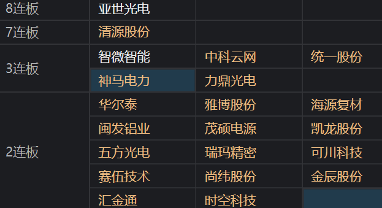<br />预期：<br />亚世光电：挑战监管，不看<br />清源股份：现在去追涨很晚了。周二必然分歧，如果在0轴以下能介入吗？<br />智微智能：鸿蒙有发酵，有低点的话介入。<br />中科云网：清源股份继续往上，光伏这条线没结束，中科网云如果能换手上去的话，可以继续顶。筹码结构这样，资金真的会继续往上顶吗。但是清源股份三班也是，这里0轴下买入<br />统一股份：<br />神马电力：光伏共振的先锋<br /><br />凯龙股份：最强2板，明天一字预期<br /><br /><br />机器人：周末利好<br /><br /><br />大新闻 在支付宝，买国企，浙江国资、杭州国资，在哪儿<br />支付宝的股权挂在那个国资公司下，实控人是那个地方国资。(不是中央国资)，<br /><br /><br /><br />分化，中位股做第一次淘汰。<br />MR：高低切，亚世光电断，五方一字加速<br /><br /><br />身体太虚了<br />结束导管<br />锻炼身体<br />一滴都不能用，积攒日月之精华<br /> |
| 明日计划        | 清远：如果0轴一下，低吸<br />浙江/杭州国资：支付宝概念<br />机器人板块首板<br />分化，中位股做第一次淘汰<br />3-4：智微智能、中科云网<br />2-3：凯龙股份、五方光电、赛伍技术<br /><br /><br />这个计划大部分没有兑现。二进三三进四全部错误。<br />昨天大多数人都以为五方光电会上板，亚世光电会G，清源股份可能板。<br />都错了，真理在少数人手中。<br />立鼎光电反而走强，把五方卡掉。 |
| 消息面          |                                                              |
| 昨日预期分析    | 昨日是否兑现                                                 |
| 预期            | 大盘预期：<br />板块预期：<br />个股预期：监控哪些股<br /><br />欧运集装线？<br /><br />买：<br /> |
| 反思            | 永远做核心，今天核心是哪些，做了吗<br />问题思考：<br />1.为什么五方光电是下周核心？<br /><br /><br />2.上塘路最近参与的票，情绪大师？<br /><br />3. 五方光电和双象股份的关系，为什么周四要离双象股份，仅双象股份。<br />周四 亚世光电 上板后，双象股份的位置很尴尬，中位股，没太理解。<br />亚世光电如果顶着监管走，走出来那就是独立行情。走不出来地位补涨是五方光电，不是双象股份，为什么？五方光电之前冲过一轮，然后杀下来，筹码更集中，底部无筹码，而双向底部有大量筹码。<br /><br />为什么不是立鼎光电？周四分时图：五方光电先往上冲，到8个点左右的时候立鼎光电才开始冲。说明资金先选择的五方光电，立鼎光电做的跟随。虽然只差了几分钟，但是一定存在这个主次关系。 |
| 问财选股        | 主力净额<br />趋势票<br />macd底背离                         |
| 顽主交割单      | 最好的学习资料                                               |

## 2024每日复盘

### 01

#### 2024-01-02

| 项目            | 详情                                                         |
| --------------- | ------------------------------------------------------------ |
| 持仓盈亏        | +148<br />中电环保 8.8%<br />买入逻辑：早上，核电几个一字，开出来很强，桑伟股份、合锻智能、利伯特，于是看核电板块，之前的老龙中电环保开3个点，直接上。<br />可惜仓位太低了，必须要退仓位啊。 |
| 市场分析        | 量能：7878<br />市场情绪：61<br />涨停：52<br />跌停：2<br />外资流入：-52，主力-270<br />上涨家数：2876 |
| 板块题材/情绪面 | 情绪行进方向，先人一步<br />市场梯队(超短2板及以上是核心)<br />一进二<br />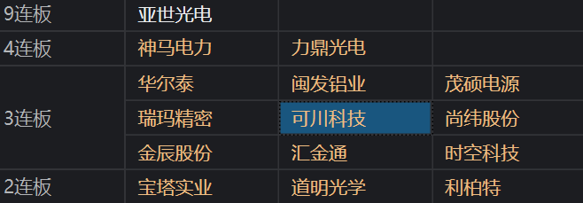 |
| 个股分析        | 昨天2进3很多：9<br />亚世光电：冰川说过，周45大盘反攻，涨停很多。今天开出来杀中位股，各板块的高标龙头反而更强。压实还能顶吗？？？散户的力量，高标希望买，但是地位的需要游资引导。<br />神马电力：高开回落在封板，尾盘漏大单，封单不强，不主动。明天断板。<br />立鼎光电：太强势了，卡掉了五方光电，板。地位筹码多，明天也是面临分歧，可能会走一个换手板。<br />华尔泰：断<br />闽发铝业：尾盘偷袭，不看<br />茂硕电源：板，换手<br />瑞玛精密：几天都没放量，该放量了吧，板。<br />可川科技：板？<br />尚纬股份：板<br />时间空间：换手板<br /><br /><br />宝塔实业：板<br />道明光学：断<br />利伯特：一字<br /><br /><br /> |
| 消息面          |                                                              |
| 昨日预期分析    | 昨日是否兑现<br />                                           |
| 预期            | 大盘预期：<br />板块预期：<br />个股预期：监控哪些股<br />高标断板，高低切，1进2 |
| 反思            | 永远做核心，今天核心是哪些，做了吗<br />在大局观下，结合板块分析个股、情绪、资金行进方向。<br />只看个股的封单、涨停时间、炸板与否，是没用的 |
| 问财选股        | 20CM补涨                                                     |
| 明日计划        | 3-4：茂硕电源、瑞玛精密、可川科技、尚纬股份、时空科技<br />2-3：宝塔实业、利伯特<br />1-2：合锻智能<br /><br /><br />只有尚纬股份进4，可川科技地天被砸，<br />2-3全中，其他都是大面/地板。 |

#### 2024-01-03

| 项目            | 详情                                                         |
| --------------- | ------------------------------------------------------------ |
| 持仓盈亏        | -180+<br />常山药业4个点买，收1<br />陇神戎发：14点买，收10  |
| 市场分析        | 量能：7375<br />市场情绪：46<br />涨停：45<br />跌停：8<br />外资流入：16<br />上涨家数：1866 |
| 板块题材/情绪面 | 情绪行进方向，先人一步<br />市场梯队(超短2板及以上是核心)<br />一进二<br />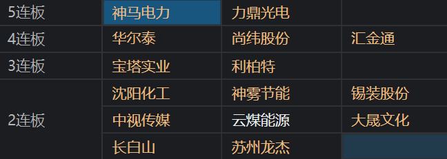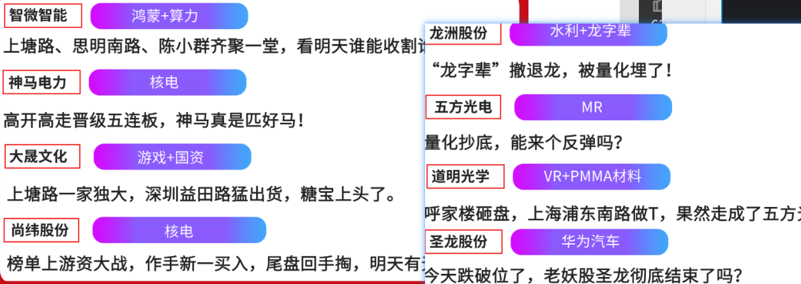<br /><br /><br />神马电力：没想到啊，筹码结构这么垃圾还能顶<br />日久光电：一字预期，如果不一字就有问题，派面<br />立鼎光电：挂，<br />华尔泰：挂<br />尚纬股份：挂<br />汇金通：进5<br /><br />宝塔实业：3-4<br />利伯特：G<br />沈阳化工：G<br />中视传媒：2-3<br />苏州龙杰：军工，2-3<br /><br />只有利伯特和日久光电 晋级了 |
| 个股分析        |                                                              |
| 消息面          | 军工：伊朗发生爆炸，估计是美、以色列 捣蛋<br />哈马斯的武器：发现很多是中国制造。<br />这是军工板块强势 |
| 昨日预期分析    | 昨日是否兑现<br />                                           |
| 预期            | 大盘预期：<br />板块预期：<br />个股预期：监控哪些股<br />高标断板，高低切，1进2 |
| 反思            | 永远做核心，今天核心是哪些，做了吗<br />在大局观下，结合板块分析个股、情绪、资金行进方向。<br />只看个股的封单、涨停时间、炸板与否，是没用的 |
| 问财选股        | 20CM补涨                                                     |
| 明日计划        | 宝塔实业<br />中视传媒<br />苏州龙杰<br />福莱新材           |

#### 2024-01-04

| 项目            | 详情                                                         |
| --------------- | ------------------------------------------------------------ |
| 持仓盈亏        | -100<br />常山药业止顺，下午拉到6个点，气死我了<br />另一个票也出了，服了，错误的买卖。 |
| 市场分析        | 量能：6734<br />市场情绪：40<br />涨停：39<br />跌停：8<br />外资流入：-40<br />上涨家数：1781 |
| 板块题材/情绪面 | 情绪行进方向，先人一步<br />市场梯队(超短2板及以上是核心)<br />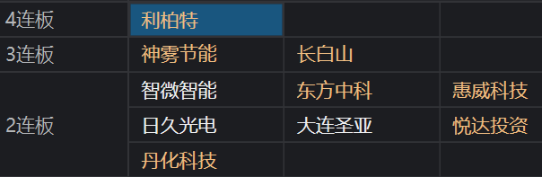<br />利伯特：G<br />生物质能：3-4，三板就两个，这里应该有一个会晋级的，不太可能全部挂了这样连板高度就完全压制了。神雾节能盘子小一些，比长白山主动，更看好。<br />长白山：G<br />当然，这里有另外一种可能：利伯特晋级5板，无四板。<br />不论是唯一三板还是唯一四版，这里资金都会炒作一个唯一性。<br /><br /><br /><br />智微智能：上塘路，进3，上塘路6kw，怎么出货，预期不太高<br />东方中科：同样鸿蒙，进3<br />惠威科技：盘子小，消费电子，观察，可能进3<br />日久光电：消费电子，缩量加速，糖宝6kw，分歧<br /><br />这四个票，两组，鸿蒙和消费电子，互为对手盘，如果没有太多增量资金，就是相互卡的局面。<br /><br />大连圣亚：不看好，<br />悦达投资：进3<br />丹化科技：不看好<br /><br /><br />可川科技：昨天准地天，今天地天，巨量换手，明天也面临一定分歧，如果MR板块有修复的了，可能继续板。<br />银宝山新：看做超跌吧，不可能有4波了<br />龙江交通：东北板块的代表，辨识度不错。不看<br /><br /><br />一进二<br />英力特：搜班顶一字，获利盘不出，说明都看好。实际流通15亿。观察，能否走出一个欢说板。<br />天元只能：走的氢能晕+次新，次新有几个票了，环境这么差，会不会又去炒作次新？  观察吧<br />鼎龙科技：这个位置没有性价比了，分歧预期。<br />朝阳科技：实际流通9亿，7千封单，难板，有溢价。<br />亚华电子：鸿蒙20CM，晚上出澄清，明天低开抢跑了。<br />延华智能：178结尾票，昨天晚上刚说，几天鸿蒙概念，直接上班，看能不能1-2<br /> |
| 个股分析        |                                                              |
| 消息面          | 冷锻                                                         |
| 昨日预期分析    | 昨日是否兑现<br />                                           |
| 预期            | 大盘预期：<br />板块预期：<br />个股预期：监控哪些股<br />高标断板，高低切，1进2 |
| 反思            | 永远做核心，今天核心是哪些，做了吗<br />在大局观下，结合板块分析个股、情绪、资金行进方向。<br />只看个股的封单、涨停时间、炸板与否，是没用的 |
| 问财选股        | 20CM补涨                                                     |
| 明日计划        | 智微智能<br />东方中科<br />惠威科技：艾琳：安迪板预期<br />日久光电<br />悦达投资<br />可川科技<br />英力特<br />天元智能<br />朝阳科技<br />延华智能<br /><br />机器人方向--新的题材 |

#### 2024-01-05

| 项目            | 详情                                                         |
| --------------- | ------------------------------------------------------------ |
| 持仓盈亏        |                                                              |
| 市场分析        | 沪深创科京 -0.85，-1 -1.45 <br />量能：7363，增量10%，哪里来的，国家队拉的高股息银行？？<br />市场情绪：26<br />涨停：24<br />跌停：8<br />外资流入：<br />上涨家数：483 |
| 板块题材/情绪面 | 情绪行进方向，先人一步<br />市场梯队(超短2板及以上是核心)<br />一进二<br /> |
| 个股分析        | 长白山：最高标，4B，东北旅游概念，周末发酵，周一必有溢价。能突破5板吗，5板两个交易日没有了，有往上走的预期，一定会放量，这个位置底部筹码会松动的。只能靠换手承接往上走。<br />大连圣亚：周末发布澄清冰雪概念占比不到1%，但是短信不看这个。周五是比长白山强度更高一些的，一方面是身为低一个板，更有性价比，另外盘子更小，因此走了加速。如果长白山成功晋级5板，那大连圣亚也能晋级4板的，是一个反推作用、带动作用。如果长白山没成功。大连圣亚成为旅游的独苗的话，可能会晋级4板的。<br /><br />东方中科：92科比、作手新一，机构除了1个多亿，鸿蒙概念。<br />智微智能：周五这两个票跑了很多大单的。“卖公司”。为什么说卖公司？一方面18亿流通，18成交，龙虎榜上没有大单，都是散户在玩？第二是，看筹码分布，十大流通股东肯定减持，不然底部的筹码为什么几乎快没了？？大于5%的股东，应该也有通过转融通借出去，减持的。<br />这两个票，游资还会去顶吗，如果有更多的抛压怎么办？所以肯定都是逐渐出货为主的。所以这两个票暂时不会介入的。东方中科断板的预期，智微智能可能也要收绿的。这个位置谁敢去点火？<br /><br />延华智能: 2-3应该没问题，周五回封没上错过了，可惜。如果东方中科智微智能都不行，这个票更有唯一性。<br /><br /><br />日久光电：死亡换手，拉了一个地天，（利伯特地天没成功），明天都要强跑了，这个位置，如果有增量资金进来的话，还可能稳一稳。但是拉地天时，进来的资金，平均成本应该在10个点以下。这些资金肯定都是要获利出出具的。上塘路买了5kw，它能顶着压力继续买吗，不可能。所以这个票肯定要低开的，可能会有冲高诱多，然后回落。<br />虽然有消费电子的利好，国外有个什么CES的消费电子的会议的。但是这个地方是没有太大作用的。看空。 <br /><br /><br />日久和中科都挂了，那大连圣亚肯定要晋级了，然后反推长白山上板。<br /><br />思进智能：冷锻 一体化雅座，周五封的很差，继续板的可能很低了。<br />宏盛花园：游资+量化打板，巨量封单，近端次新+电网+国改+智能制造。板预期，加速顶一字。<br /><br /><br />宝塔实业：地天，朝鲜向韩国发射2百炮弹，军工利好<br />亚华电子：次新，20CM 2板，低开，像板哥这种，不竞价摁个半仓？这麽多的利润垫。<br /><br /><br />亚华电子、智微智能、延华智能、东方中科都是鸿蒙，也取决于这个板块，如果延华能带起来的话，起一些补涨，有一些1-2，其他票可能还有承接。<br /><br />之前的高标清源股份、亚世光电 都哼住了，没有负反馈。<br /><br /><br /><br />首板分析：<br />新纶新材：固态电池。 固态电池这个收利好消息，周五走的可以，三板，2个一字。这个板块应该没走完的，新纶晋级预期<br />金龙羽：走得更强，锂电+电线，如果板块不行的话，可能会吧新纶卡掉。<br />德福科技：次新+锂电，会不会复制上一个20CM，如果板块走强的话也会往上走，不管怎么样，明天有大肉的。<br />智迪科技：20CM，很强<br />雷柏科技<br />澳洋健康：1-2，养老<br />天娱数科：消息驱动，2板预期？<br />雅博股份：光伏+国改+电池，有辨识度，应该有一家的，可能板<br /><br /><br /><br />卖公司：这么多换手，哪里来的。<br />卖公司有哪些途径<br /><br /><br />长白山：龙虎榜，二股东卖公司，二股东不是二股东了<br /><br />今天前排的都在卖公司。智微智能<br />东方中科 延华智能 机构卖了1亿<br />方式：10大股东，把股票通过转融通，融券卖出<br /><br /><br />元旦后除了高股息和次新，前排都在卖公司<br /><br />国资公司：找机构去接，权力，<br /><br />不良资产<br /><br /><br />金帝股份，上市第一天就融券卖出<br /><br /><br />想限制减持很简单，一个机制，一个程序而已，为什么？因为这里面牵扯到利益了，这些狗东西的利益。<br /><br /><br /><br />上海溧阳路  遇到别格局<br /><br /><br /><br />昨天晚上 高老师 腾讯会议 188<br />周四为什么智微智能是核心。<br />为什么是标准的补涨。<br />错过了<br /><br /><br /><br />科创竞争不过北交所<br /><br /><br />原油宝 事件<br /><br /><br />长白山：周五这个位置，一般人是不敢参与的，一定是场内资金在买。周末南方小土豆消息发酵，周一肯定有溢价。<br />亚世光电 为什么 不如清源股份：压实有补涨，都买补涨去了，清运没补涨，还有一定空间。另外就是亚世光电快严重监管。<br /> |
| 消息面          |                                                              |
| 昨日预期分析    | 昨日是否兑现<br />                                           |
| 预期            | 大盘预期：<br />板块预期：<br />个股预期：监控哪些股<br />高标断板，高低切，1进2 |
| 反思            | 永远做核心，今天核心是哪些，做了吗<br />在大局观下，结合板块分析个股、情绪、资金行进方向。<br />只看个股的封单、涨停时间、炸板与否，是没用的 |
| 问财选股        | 20CM补涨                                                     |
| 明日计划        | 大连圣亚3-4<br />长白山4-5<br />延华智能、宏盛花园2-3 --全部G<br />1-2：新纶新材、金龙羽、澳洋健康、雅博股份<br /><br />金龙羽低开，然后往上，新纶新材高开，然后直接兑现，往下。<br />澳洋健康直接死<br />雅博股份太强了，博的是指数共振光伏回流，博的是这个预期，尽管大盘大跌，越跌越有这个预期。所以走强，把清远都带上班了。<br /><br /><br />大盘：修复，至少若修复，可以买指数、RTF<br />大盘预测完全错误。光头光脚大英县。 |

#### 2024-01-08

| 项目            | 详情                                                         |
| --------------- | ------------------------------------------------------------ |
| 持仓盈亏        | -700<br />延华智能：昨天的计划，预期1-2，结果死掉。也是收板块、权重影响。软通动力低开下行，智微智能预期的下跌，把延华也带下来了。冲高直接被砸，然后下行。<br />龙虎榜上，佛山系居然买了一个亿，这麽多或明天怎么办，是不是要拉高掩护出货，肯定要亏钱的，今天就已经亏了不少了，至少5个点，关键是看最总亏多少了。 所以明天应该不会直接砸，直接砸那就按地板了，当然也取决于其他，比如量化，你不砸别人砸。所以明天挺危险的。按目前的情绪，直接按地板也是可能的。如果冲高，那就走掉。<br />量化居然也打板买入几千万，早盘那个脉冲，直接把量化骗进去，所以量化也不是眉笔都真钱。<br /><br />1/4仓位抄底科创板ETF，这他妈不是底部啊，ETF都能砸3个点，亏了67百。真你妈服了。昨天A说的抄底船业半只，真你妈服了。这个地方预测都错了。<br />明天看吧，如果有修复，看出掉，还是拿着等修复。<br /><br />这个地方基金出货，很麻烦，明天可能继续下跌。<br /><br /><br />天天亏钱，卧槽了 |
| 市场分析        | 沪深创科京：股灾：-1.4 -1.8 -1.7 -2.8<br />量能：6570 -10%<br />市场情绪：30<br />涨停：33<br />跌停：11<br />外资流入：-43<br />上涨家数：368<br /><br />盘面实在是太难看了，跌破2900，收2887<br />连板的就6只票<br /><br /> |
| 板块题材/情绪面 | 情绪行进方向，先人一步<br />市场梯队(超短2板及以上是核心)<br />一进二<br />https://t.10jqka.com.cn/circle/296384/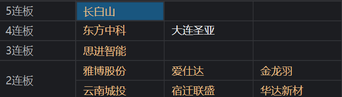 |
| 个股分析        | 长白山：看能不能打开高度吧，也是好几天没高度了吧，能不能突破6板。这个位置明天肯定有分歧的，像高老师这种，肯定选择先兑现。如果有足够的承接的话，才能往上周，不过这个位置很难了，没有性价比；----预测错了，没有分歧。顶了一字。昨天顶着监管，今天给一字符合预期。作手心意买一。<br /><br />有没有可能强势上板，升职一子，也有可能。明天你大连圣亚死掉，成为唯一东北概念+唯一高标，可能会继续顶。--- 诶这个预测是对的，一字。不过大连圣亚秒板。<br /><br />大连圣亚：按昨天的预期，大连圣亚秒板，然后反推长白山上板。为什么不做？？？？？？？？？？ 明天应该G掉了。<br />东方中科：A、秋都上了，后者重仓，鸿蒙的高标独苗了，盘子不小，不过实际流通41(融券？), 大连圣亚挂了，这个地方有5板的话只能是东方中科了。资金一定会做这个唯一性，能不能成的话看博弈了，60%的概率吧。--- 错了，大连圣亚 跟着长白山 晋级，<br /><br />思进智能：按连板梯队的说法，也应该板，今天一个大长腿，死亡换手，明天看吧，不成也是可能的，这时候4板空出来了。那长白山能顶也是可以的，当然压制到3板也是可能的，看盘面。 --- 前者，进了4板<br /><br />雅博股份：继续板，今天太强了。--- 死掉<br />爱仕达：算是准地天，弱转强吧，感觉会G。 --- 跟机器人，板<br />金龙羽：G<br />云南：G<br />宿迁联盛：什么玩意，<br />话大学城：G |
| 消息面          |                                                              |
| 昨日预期分析    | 昨日是否兑现<br />                                           |
| 预期            | 大盘预期：<br />板块预期：<br />个股预期：监控哪些股<br />高标断板，高低切，1进2 |
| 反思            | 永远做核心，今天核心是哪些，做了吗<br />在大局观下，结合板块分析个股、情绪、资金行进方向。<br />只看个股的封单、涨停时间、炸板与否，是没用的 |
| 问财选股        | 20CM补涨                                                     |
| 明日计划        | 雅博股份<br />爱仕达<br />东方中科<br /><br />1-2：<br />南京熊猫<br />鱼鹰股份？<br />证通电子<br />浙江世宝<br />西陇科学<br /><br /><br />机器人很多票都懂了，有老龙浙江世宝、银宝山新，也有首板，重点关注 |

#### 2024-01-09

| 项目            | 详情                                                         |
| --------------- | ------------------------------------------------------------ |
| 持仓盈亏        | 追高 昊志机电，亏好几个点，草了。<br />没看到百胜智能？？？<br />创业板ETF 涨上去后回到零轴。<br /> |
| 市场分析        | 沪深创科京 2893 0.2, 0.27, 0.37, -0.19<br />量能：6700 +2%<br />市场情绪：54<br />涨停：44<br />跌停：6<br />外资流入：0.18<br />上涨家数：3421<br />连板：6/33 |
| 板块题材/情绪面 | 情绪行进方向，先人一步<br />市场梯队(超短2板及以上是核心)<br />一进二<br /><br />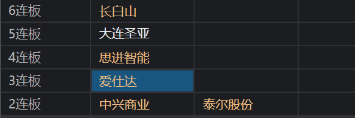<br />这个梯队太有意思了，2板以上都是相互卡，唯一性。<br /><br />中国中免：冲了脏听后回落，这里是大部分增量资金了，以及隆基绿能，其他地方不会有更多的增量资金了<br /><br /><br />东方中科：低开安迪板，昨天还涨停，为啥？资金获利出局，为啥要出局，因为没有获利空间了，为什么没有，因为增量资金没有了，增量资金取哪里了，游资取对手盘长白山，这里有长白+大连圣亚，情绪更好，有板块效应。竞价开出来就定胜负了<br /><br />长白山：昨天顶着监管走出来，今天就应该开一字，卡掉了对手东方中科。明天？会不会复制今天的东方中科。现在6板，今天没有分歧，明天一定要分歧的，很难经济7板。如果有增量资金的话，可能会走一个换手板。另外如何大盘继续猛跌，这里也是抱团的目标。开出来看，指数和个股的强度<br /><br />大连圣亚：前几天反推长白山，今天长白山带动大连圣亚。长白山四，则四<br /><br />思进智能：高开秒吧，没上。今天是机器人板块的龙头。肯定会继续搬的<br />爱仕达：和丝巾 复制今天 长白山+大连 的走势。分别进4进5.。明天可能最高的板了。5板。<br /><br /><br />中兴商业：长白山 地位补涨，如果长白山死掉的话，可能挂掉。当然这里可能和泰尔同时竞技三板、<br />泰尔；晋级，机器人核心标的<br /><br /><br /><br /><br /><br />大盘：收十字新，下跌中继，可能还会有部分反弹<br /><br />机器人板块：<br />昨天浙江世宝上板，带领了不少机器人，所以今天无脑做机器人！！！！！！！！！！！！！！！！！！！！！！！！！！！！！！！<br /><br />机器人是量化在引导<br /><br />明天机器人怎么看？这麽多资金进来，不会离场，后排的肯定有回落。<br />前排的有梯队，有不少二板的。<br /> |
| 个股分析        | 高老师：长白山、雅博、思进智能、冠石科技、晋拓股份、大连圣亚、三丰智能、百胜智能、艾丝妲、<br />北交所里面没量化<br />高老师又尼玛通宵，早盘还能聚精会神盯盘，这人太尼玛强了。<br /><br /><br />1月，到9号，大账户盈利53个点，小账户盈利78个点， 算4kw仓位吧，挣了2kw，卧槽，太牛逼了<br />4000到6200，只需要7天，卧槽<br /><br />神人，<br /><br /><br />周1：高老师是怎么判断明天是机器人的？从哪些标的分析的，用了哪些方式？？？ |
| 消息面          |                                                              |
| 昨日预期分析    | 昨日是否兑现<br />                                           |
| 预期            | 大盘预期：<br />板块预期：<br />个股预期：监控哪些股<br />高标断板，高低切，1进2 |
| 反思            | 永远做核心，今天核心是哪些，做了吗<br />在大局观下，结合板块分析个股、情绪、资金行进方向。<br />只看个股的封单、涨停时间、炸板与否，是没用的<br /><br /><br />机器人，昨天计划提到了，说要关注，为什么不做好？？？？<br />竞价直接买ETF不香吗，20CM反映快点不好吗？？？ |
| 问财选股        | 20CM补涨                                                     |
| 明日计划        |                                                              |


#### 2024-01-10

| 项目            | 详情                                                         |
| --------------- | ------------------------------------------------------------ |
| 持仓盈亏        | -100<br />                                                   |
| 市场分析        | 沪深创科京：2877 -0.54，-0.55，-0.43 -0.74<br />量能：6470<br />市场情绪：42<br />涨停：42<br />跌停：11<br />外资流入：20<br />上涨家数：1122<br />连板晋级率：12/44 |
| 板块题材/情绪面 | 情绪行进方向，先人一步<br />市场梯队(超短2板及以上是核心)<br />一进二<br /><br />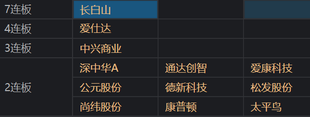<br />思进智能和大连圣亚死掉后，5/6板断了<br /><br />长白山：杂拌到零轴回封，放巨量，明天肯定死了，低开，忘地板按。--- 高开震荡回落，算强势了，目前已经被监管了，必死。今天欢说50%换手，进去的人真实傻逼<br />爱仕达：机器人今天就是去弱留强，爱仕达百万封单，明天肯定要兑现了。<br />中兴商业：零售+东北，晋级，最高版4板<br /><br /><br />深中华A：锂电+黄金+两轮车？看不太懂，主要跟的锂电。2-3<br /<br /><br />2-3：公元股份、爱康科技、桑伟股份<br />1-2：麦趣尔、惠发食品 |
| 个股分析        |                                                              |
| 消息面          |                                                              |
| 昨日预期分析    | 昨日是否兑现<br />                                           |
| 预期            | 大盘预期：<br />板块预期：<br />个股预期：监控哪些股<br />高标断板，高低切，1进2 |
| 反思            | 永远做核心，今天核心是哪些，做了吗<br />在大局观下，结合板块分析个股、情绪、资金行进方向。<br />只看个股的封单、涨停时间、炸板与否，是没用的<br />高老师：深度思考、分析<br />竞价！ |
| 问财选股        | 20CM补涨                                                     |
| 明日计划        |                                                              |

#### 2024-01-11

| 项目            | 详情                                                         |
| --------------- | ------------------------------------------------------------ |
| 持仓盈亏        | +400 科创板ETF                                               |
| 市场分析        | 沪深创科京：2886 0.3 1.47 2 1.6<br />量能：7121 +10%<br />市场情绪：64<br />涨停：56<br />跌停：0<br />外资流入：<br />上涨家数：4336<br />连板晋级率：12/38 很高了 1/3 |
| 板块题材/情绪面 | 情绪行进方向，先人一步<br />市场梯队(超短2板及以上是核心)<br />一进二<br /><br />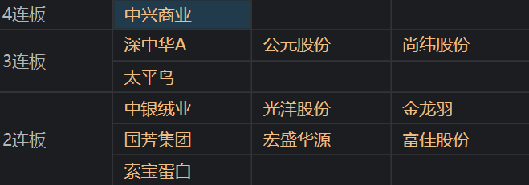<br /><br />公元股份：最核心，为什么？？？<br />我自己分析：<br />1.竞价涨停委买第一，9个亿，无比强。<br />2.大盘起来时，第一个共振的涨停板？最强的涨停板，有引导作用<br />3.开启新的方向：年报预征板块<br /><br /><br />国家队进攻方向<br />锂电、中字头<br /><br /><br />今天拉锂电和上周四拉光伏是一样的。明天不能放量、不能拉阳线的<br /><br />新东西？<br />1.年报增长：这一定是一个线<br /><br /><br />今天中兴商业比板，昨天也预料到了，高老师昨天也确认了，原因再分析：1. 唯一4板<br />2. 和公园股份一样，开启新方向：年报增长。<br />3. 竞价委买3亿，强度无敌。<br /><br /><br /><br /><br />光伏已经G了<br />锂电起来的原因：这里大盘已经快十底部了，反弹必然要借助一些板块，为什么不是光伏？光伏上一波拉过了，已经炒烂了，太铭牌了，不太可能。而锂电早上就有票顶，板块也没有怎么大吵过，容量也够大，够大资金操作，也是经典的赛道。这里是和大盘共振的最佳载体。 因此看到大批量股票异动的时候，就应该直接上的。像上次光伏一样，可以没时间盯盘。<br />为什么不是风电或其他？盘子太小了，容不下。<br />容量较大+未大超过，两个必要条件。<br /><br /><br />锂电这波起来，它的作用已经完成了，它就是大盘共振，把大盘拉起来。<br />后面锂电的身为需要往后放一放。<br /><br /><br /><br />中兴商业：年报+零售，第二核心，4-5<br />深中华A：锂电，去弱留强，板<br />公元股份：高开秒板、或一字<br />桑伟股份：光伏，3个锂电外的光伏共振，G<br />太平鸟：年报+零售，板<br /><br /><br />中银绒业：锂电，龙山，板<br />光洋股份：飞行汽车+机器人，看吧<br />金龙羽：呼家楼，<br />国芳集团：零售+回购，看吧<br />附加股份：G<br /><br />深桑达A：G<br />常山北明：B<br />高新发展：B<br />直真科技<br /> |
| 个股分析        | 之前凯龙股份核掉，就宣布做多失败，这时候能走出来就是当做反指做的--长白山<br /><br />同理，长白山一死掉，就是做多的时机。 |
| 消息面          |                                                              |
| 昨日预期分析    | 昨日是否兑现<br />                                           |
| 预期            | 大盘预期：<br />板块预期：<br />个股预期：监控哪些股<br />高标断板，高低切，1进2 |
| 反思            | 永远做核心，今天核心是哪些，做了吗<br />在大局观下，结合板块分析个股、情绪、资金行进方向。<br />只看个股的封单、涨停时间、炸板与否，是没用的<br />高老师：深度思考、分析<br />竞价！ |
| 问财选股        | 20CM补涨                                                     |
| 明日计划        | 年报增长<br />3-4：深中华A、公元股份、太平鸟<br />           |

#### 2024-01-13

| 项目            | 详情                                                         |
| --------------- | ------------------------------------------------------------ |
| 持仓盈亏        |                                                              |
| 市场分析        | 沪深创科京：2882 -0.16% <br />量能：6767<br />市场情绪：35<br />涨停：26<br />跌停：4<br />外资流入：<br />上涨家数：1400<br />连板晋级率：56/10 |
| 板块题材/情绪面 | 情绪行进方向，先人一步<br />市场梯队(超短2板及以上是核心)<br />一进二<br />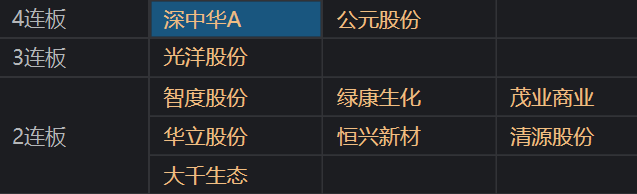<br />清源股份：光伏抱团高标。如果大盘跌就是抱团，如果大盘拉，可以作为光伏赛道的核心标的。只不过这个位置性价比很低了。<br />长白山：旅游高标，也是反指抱团，目前横在高位没给负反馈，如果大盘起来必死。<br />目前大盘这里还是看下跌中继。看这两个高标的反馈。<br /><br />深中华A：锂电+黄金+季报<br />光公元份：年报+机器人<br />这两个4板式需要PK的，谁能晋级5B<br />几种可能：只有一个晋级？短线增量资金有限。公元股份应该晋级。另一种可能是，二者都晋级，可能性小一些。如果鸿蒙线-智微智能这些走弱，则可能有足够的承接。--- 公元G。为什么？开出来惊鸿股份大单一字，业绩线地位补涨，资金都去顶这个票了，公元虽然也有大单买，但是被抛弃了。另外深中华A是小幅高卡秒板，卡掉公元。从筹码上将，公元两个一字，不给换手，很恶心，断板时必然是爆量阴线。盘子上将，公元盘子太大了。<br /><br /><br />光洋股份：不晋级的话这里4板空了，有唯一性。上一次没有4B是12/29。从逻辑上将，CES展已经闭幕了，飞行汽车这个逻辑也不算强。看竞价吧。-- G 四版断了，四版不断维持12个交易日。下一次是多久<br /><br />智度股份：跟智微智能挂钩的，周五大篮板，G<br />绿康生化：光伏+POE，<br />茂业商业：G <br />华立股份：鸿蒙补涨，鸿蒙有个会？<br />大千生态：看<br />恒星新材：G |
| 个股分析        | 军工没有持续性，冲高会略<br />飞行汽车是搭了军工的差，所以走不出来。<br /><br />周五是拉的银行。<br /><br />行情太差，<br />中兴商业天地，里面长东西，本来预期最好的买点，收一个栏板。<br /><br />高新发展：核心标的被兑现。<br />小鳄鱼？四个席位都是？<br /><br />中兴商业：高老师、秋 都是重仓，二班仅 的？<br /><br /><br />新能源，小盘股，大盘起来下一次需要啦新能源<br />思路：季报+新能源+， **题材叠加**，选股<br /><br /><br /><br />股市跌破生命线 有人是要被处理的！！！<br /><br />国家队还是想从新能源方向做。<br /><br /><br />异动：黄金，深中华A，四川黄金<br />军工 |
| 消息面          | 华为智能光伏                                                 |
| 昨日预期分析    | 昨日是否兑现<br />                                           |
| 预期            | 大盘预期：<br />板块预期：<br />个股预期：监控哪些股<br />高标断板，高低切，1进2 |
| 反思            | 永远做核心，今天核心是哪些，做了吗<br />在大局观下，结合板块分析个股、情绪、资金行进方向。<br />只看个股的封单、涨停时间、炸板与否，是没用的<br />高老师：深度思考、分析<br />竞价！ |
| 问财选股        | 20CM补涨                                                     |
| 明日计划        | 黄金：<br />医药：甲流？<br />军工：<br /><br />1-2：万方发展、联泓新科、上海沪工、 |

#### 2024-01-15

| 项目            | 详情                                                         |
| --------------- | ------------------------------------------------------------ |
| 持仓盈亏        | -50                                                          |
| 市场分析        | 沪深创科京：2886 +0.15% -0.36 -0.88 -0.64<br />量能：6100 缩量太严重了<br />市场情绪：42<br />涨停：36<br />跌停：4<br />外资流入：<br />上涨家数：1972<br />连板晋级率：9/26 还不错 |
| 板块题材/情绪面 | 情绪行进方向，先人一步<br />市场梯队(超短2板及以上是核心)<br />一进二<br /><br />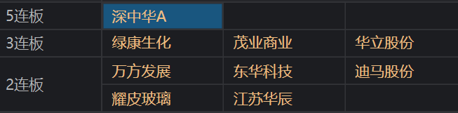<br />深中华A：卡掉公元股份。这个地方挺复杂的啊竞价开出来，8亿的静脉。涨停板成交3个亿，然后砸下来。公元的几个点：<br />1.强势补涨：锦泓集团，15亿竞买，比公元强太多了，这笔资金哪里来的，是从公元来的？同样的资金流？这个手法太残暴了。不让买。这里出现一个新的标的，老的还会继续顶吗？<br />2.筹码：公元一致不还手，底部筹码太多，抛压太重，难以承接。<br />3.公元盘子太大了。<br />4.竞争对手 深中华A，盘子小，小幅高开秒板，宣告胜利。这时公元的获利筹码也就没有预期了，也会抛出<br /><br /><br />深中华A既然突破了5板，那就继续看板。<br /><br />绿康生化：顶了一字，晋级预期的。<br />茂业商业：跟的盛中华，G<br />华立股份：板<br />这三个票近4都是互卡的关系，好的话两个成，后两个，不好的话华力一个吧。<br />2-3：耀皮玻璃、江苏华辰<br />1-2：西安旅游、景洪集团、 -- wrong |
| 个股分析        | 高新发展：核心中的核心，                                     |
| 消息面          | 台湾邦交国--                                                 |
| 昨日预期分析    | 昨日是否兑现<br />                                           |
| 预期            | 大盘预期：缩量，会有一个反弹吗？也不杀跌，跌不下去，上不起来<br />板块预期：<br />个股预期：监控哪些股<br />高标断板，高低切，1进2 |
| 反思            | 永远做核心，今天核心是哪些，做了吗<br />在大局观下，结合板块分析个股、情绪、资金行进方向。<br />只看个股的封单、涨停时间、炸板与否，是没用的<br />高老师：深度思考、分析<br />竞价！ |
| 问财选股        | 20CM补涨                                                     |
| 明日计划        |                                                              |

#### 2024-01-16

| 项目            | 详情                                                         |
| --------------- | ------------------------------------------------------------ |
| 持仓盈亏        | --                                                           |
| 市场分析        | 沪深创科京：2893 +0.27%，<br />量能：6848<br />市场情绪：39<br />涨停：32<br />跌停：3<br />外资流入：-40<br />上涨家数：1392<br />连板晋级率：9/36 |
| 板块题材/情绪面 | 情绪行进方向，先人一步<br />市场梯队(超短2板及以上是核心)<br />一进二<br /><br />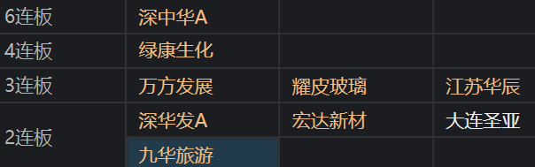 |
| 个股分析        | 深中华A：正指最高版的溢价，带起来了宁德时代。走的锂电。昨天顶住压力，卡掉公元，今天就独享溢价。<br />lksh: 独挡，4-5 -- G，这里是关键，本来是一字预期，这里竞买只有1k多万，远远不及预期，这里肯定不行了。<br />万方发展：上塘路、作手新一，封板太差了，军工+东北，G<br />耀皮玻璃：光伏，这里比另外两个都强，可能博一个唯一性<br />江苏华辰：走的电网，跟光伏+风电的话，能不能续吧<br />深华发A：名字？<br />宏达新材：PCB，板<br />大连圣亚：G<br />九华旅游：G<br /><br /><br /><br /><br />核心观察标的：<br />高新发展：不跟华力的大跌，尾盘强，博明天大盘修复的预期。<br />长白山：反指，大低开<br />清源股份：最高标，锂电 共振 |
| 消息面          |                                                              |
| 昨日预期分析    | 昨日是否兑现<br />                                           |
| 预期            | 大盘预期：<br />板块预期：<br />个股预期：监控哪些股<br />高标断板，高低切，1进2 |
| 反思            | 永远做核心，今天核心是哪些，做了吗<br />在大局观下，结合板块分析个股、情绪、资金行进方向。<br />只看个股的封单、涨停时间、炸板与否，是没用的<br />高老师：深度思考、分析<br />竞价！ |
| 问财选股        | 20CM补涨                                                     |
| 明日计划        |                                                              |

#### 2024-01-17

| 项目            | 详情                                                         |
| --------------- | ------------------------------------------------------------ |
| 持仓盈亏        | - 大几百。 股灾，科创ETF都能跌2.5%                           |
| 市场分析        | 沪深创科京：2833，-2%；-2.5% -3 -2.5<br />量能：6375<br />市场情绪：33<br />涨停：33<br />跌停：8<br />外资流入：-130<br />上涨家数：239<br />连板晋级率：10/32<br /><br />外资猛杀，今天统计局居然干活，没想到， |
| 板块题材/情绪面 | 情绪行进方向，先人一步<br />市场梯队(超短2板及以上是核心)<br />一进二<br /><br />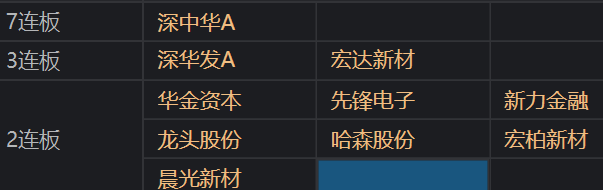 |
| 个股分析        | 深中华A：预期是一字，结果是高开小幅吸走回封。这里就有点不及预期了。<br />深华发A：名字，补涨溢价。<br />宏达新材：PCB+硅，看不太懂，不过开出来就是大单一字，3-4 --- 地板<br /><br />华金资本：“华字辈”<br />先锋电子：<br />新力金融：金融，一字。2-3<br />龙头股份：2-3  -- 4%<br />哈森股份：2-3<br />宏柏新材：<br />晨光新材：2-3<br /><br /><br />1-2：泰山石油、奥佳华、同兴环保、龙江交通 |
| 消息面          | 富士中国3被做多中国 -9%                                      |
| 昨日预期分析    | 昨日是否兑现<br />                                           |
| 预期            | 大盘预期：继续杀跌，三倍做空这个继续大涨<br />板块预期：<br />个股预期：监控哪些股<br />高标断板，高低切，1进2 |
| 反思            | 永远做核心，今天核心是哪些，做了吗<br />在大局观下，结合板块分析个股、情绪、资金行进方向。<br />只看个股的封单、涨停时间、炸板与否，是没用的<br />高老师：深度思考、分析<br />竞价！ |
| 问财选股        | 20CM补涨                                                     |
| 明日计划        | 观察大盘走势，预期是向下的，不买入，已有的仓位看怎么操作吧。冲高出清。 |

#### 2024-01-18

| 项目            | 详情                                                         |
| --------------- | ------------------------------------------------------------ |
| 持仓盈亏        | + xx<br />南京商旅按跌停，昨天回本没出，简直是傻逼操作。<br />深V走法，金针探底<br />盘中抄底ETF的话有性价比。<br />底部？看明天 |
| 市场分析        | 沪深创科京：2848 +0.43，+1 +1.93 +1.48<br />量能：8648，+35%<br />市场情绪：46<br />涨停：41<br />跌停：8<br />外资流入：-17<br />上涨家数：1438<br />连板晋级率：11/33 |
| 板块题材/情绪面 | 情绪行进方向，先人一步<br />市场梯队(超短2板及以上是核心)<br />一进二<br /><br />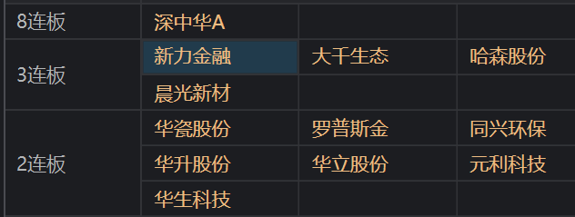<br /><br />新力金融：G<br />3-4：哈森股份、晨光新材<br /><br />2-3：罗普斯金<br />华瓷股份：<br />罗普斯金：链子票？昨天的几个，封单无敌，换手率极低，但是今天还是往地板按，这尼玛根本不是正常的行为。<br />同兴环保：<br />华升股份：<br /><br /> |
| 个股分析        | 罗普斯金的上塘路是 呼家楼！！！<br />                        |
| 消息面          |                                                              |
| 昨日预期分析    | 昨日是否兑现<br />                                           |
| 预期            | 大盘预期：<br />板块预期：<br />个股预期：监控哪些股<br />高标断板，高低切，1进2 |
| 反思            | 永远做核心，今天核心是哪些，做了吗<br />在大局观下，结合板块分析个股、情绪、资金行进方向。<br />只看个股的封单、涨停时间、炸板与否，是没用的<br />高老师：深度思考、分析<br />竞价！ |
| 问财选股        | 20CM补涨                                                     |
| 明日计划        |                                                              |

#### 2024-01-20

| 项目            | 详情                                                         |
| --------------- | ------------------------------------------------------------ |
| 持仓盈亏        | -200+ 服了，有他妈最高20CM，16点追，真是傻逼。               |
| 市场分析        | 沪深创科京：2832 -0.47% -0.68 -1 -0.37<br />量能：6666<br />市场情绪：<br />涨停：<br />跌停：<br />外资流入：<br />上涨家数：<br />连板晋级率：11/38 |
| 板块题材/情绪面 | 情绪行进方向，先人一步<br />市场梯队(超短2板及以上是核心)<br />一进二<br />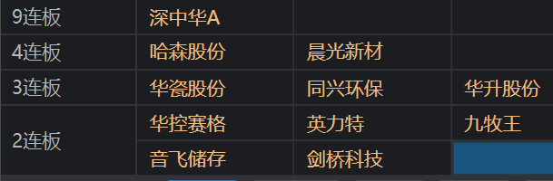<br />深中华A：最开始业绩线，然后华字辈，锂电和指数共振，然后跟随大盘变化，转反指。这就是龙头，绝对的核心，之前一段时间一直有5板压制，长白山走出来后，深中华也能高走。<br />哈森股份：重组，不让人进，狗庄<br />晨光新材：硅+光伏，进5预期<br /><br />华瓷股份：外销 华字辈 参股英航<br />同兴环保：3-4<br />华升股份：一字加速，外销 华字辈 参股券商<br /><br /><br />华控赛格：锂电 华字辈 <br />特力A：深中华的套利，光伏+氢能<br />九牧王：男装、新零售<br />**音飞储存**：机器人、智能物流<br />**剑桥科技**：光模块 华为<br /><br /><br />首板：<br />特力A：黄金珠宝<br />洪兴股份：跨境电商<br />华尔泰：烟花爆竹、锂电、华字辈， 这种反包有点经典，Mark<br />浙江正特：外销、平台经济<br />通达创智：体育户外、平台经济、外销、三胎<br />雪祺电气：外销、次新<br />丽江股份：旅游景点、酒店、云南<br />云南旅游：旅游<br />惠城科技：游戏、绝对的核心，一字预期，<br />游族网络：网络游戏<br />洪涛股份：华为、实控人变更国资、氢能<br />德力股份：光伏、游戏<br />群兴玩具：跨界算力？趁概念？换手太低，狗庄？<br />**先锋电子**：芯片】华为 传感器<br />瑞尔特：外销<br />中视传媒：中字头、影视传媒、股权转让<br />**莲花健康**：算力+年报。 核心<br />华塑股份：华字辈、光伏、可间接塑料<br />**华鼎股份**：华字辈、跨境电商、平台经济<br />上海电影：影视+业绩<br />神剑环境：环保、华为海思<br />永艺股份：外销 抖音<br />恒林股份：跨境电商 外销<br />阿科力：燃料电池 材料<br />**康普顿**：氢能 燃料电池，正直<br />松炀资源：环保<br />**太平鸟**：年报 零售<br />百利科技：锂电 氢能<br />**龙版传媒**：抖音举办2024精品微短剧“辰星计划”暨春节档发布会。<br /><br /><br />核心：<br /><br />长白山、深中华 --- 抱团/反指  态度<br /><br />泛AI方向：<br />剑桥科技、莲花健康<br />音飞储存、先锋电子：华为、机器人<br />华立股份<br /><br />游戏：惠城科技<br /><br /><br />选股：世纪华通<br /><br /><br /><br />光伏现在张不懂了，清源股份、金刚光伏 一大波光伏大跌，这里修复也是有限的，资金一定会寻找其他方向。<br /><br /><br />观察：罗普斯金，强庄股，周五那麽多人进，明天很多人都会割肉离场，这时候场外资金绝对不会拉的，就算后面要反包也必须要狠狠洗一遍。明天不是买点，就算买这个审美太差了。不看<br /><br /><br />带代销概念挺多的<br /><br />前一天做多、做空的票<br />和本票有联系的票<br />这些东西需要联系起来 |
| 个股分析        | 周三CPO动了<br />周四确认，所以无脑上<br />剑桥科技<br />20CM的恒信东方<br /> |
| 消息面          | 游戏18条无了，这里地方看游戏能不能走出来，二板？<br />这些消息确认了一个东西<br />剑桥科技肯定是核心<br /><br /><br />中美会议-跨境支付：跨境电商：小商品城、安克创新、拉卡拉、乐哥股份。 |
| 昨日预期分析    | 昨日是否兑现<br />                                           |
| 预期            | 大盘预期：<br />板块预期：<br />个股预期：监控哪些股<br />高标断板，高低切，1进2 |
| 反思            | 永远做核心，今天核心是哪些，做了吗<br />在大局观下，结合板块分析个股、情绪、资金行进方向。<br />只看个股的封单、涨停时间、炸板与否，是没用的<br />高老师：深度思考、分析<br />竞价！ |
| 问财选股        | 20CM补涨                                                     |
| 明日计划        |                                                              |

#### 2024-01-22

| 项目            | 详情                                                         |
| --------------- | ------------------------------------------------------------ |
| 持仓盈亏        | -1000+<br />科创50ETF继续大跌                                |
| 市场分析        | 沪深创科京：2756 -2.68, -3.5% -2.8% -3%<br />量能：7941<br />市场情绪：31<br />涨停：17<br />跌停：105<br />外资流入：17<br />上涨家数：125 !!!! 创造历史？ 离谱<br />连板晋级率：6/40<br /><br />股灾式下跌。<br />-4--7三千多家 |
| 板块题材/情绪面 | 情绪行进方向，先人一步<br />市场梯队(超短2板及以上是核心)<br />一进二<br />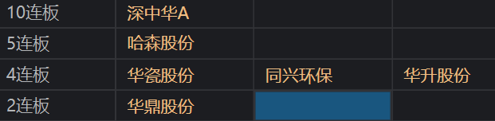<br /><br />深中华A：高位抱团，这个地方都是散户在参与了，大资金是进不来的。如果明天指数继续下跌，还会继续抱团。<br />这种核心没有参与一次，简直是太傻逼了。都说了要做核心，但是一直没有上过。。。<br />哈深：一直一字，低换手，不看，后面死的很惨的。<br />华瓷股份：G<br />同兴环保：<br />华升股份：也顶一字，G<br />华鼎股份：2-3？ 不进那3板有空了。<br /><br /><br /> |
| 个股分析        |                                                              |
| 消息面          |                                                              |
| 昨日预期分析    | 昨日是否兑现<br />                                           |
| 预期            | 大盘预期：<br />板块预期：<br />个股预期：监控哪些股<br />高标断板，高低切，1进2 |
| 反思            | 永远做核心，今天核心是哪些，做了吗<br />在大局观下，结合板块分析个股、情绪、资金行进方向。<br />只看个股的封单、涨停时间、炸板与否，是没用的<br />高老师：深度思考、分析<br />竞价！ |
| 问财选股        | 20CM补涨                                                     |
| 明日计划        |                                                              |

#### 2024-01-23

| 项目            | 详情                                                         |
| --------------- | ------------------------------------------------------------ |
| 持仓盈亏        |                                                              |
| 市场分析        | 沪深创科京：2770 +0.53，+1.38 +1.24 +1.01<br />量能：7042<br />市场情绪：59<br />涨停：44<br />跌停：26<br />外资流入：<br />上涨家数：2786<br />连板晋级率：9/ |
| 板块题材/情绪面 | 情绪行进方向，先人一步<br />市场梯队(超短2板及以上是核心)<br />一进二<br />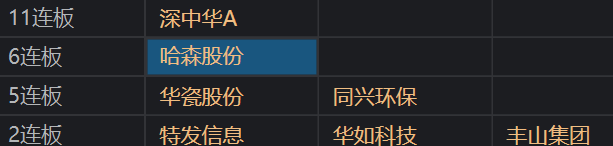<br />哈森股份：天地天，模仿？明天肯定面临分歧，有惩戒可能能撑住，不然往地板按。<br />华瓷股份 vs 同兴环保<br />华慈市值小一些，今天一字板上换手，通行是低开高走。<br />看好华慈吧，强度高盘子小，华字辈。<br /><br /><br />2-3：特发、凤山<br />华儒20CM2连，太强了卧槽<br /><br /><br /><br />剑桥科技：上周4没带得起来CPO，今天就带起来了。这个反包应该是预料中的，可惜没仔细思考没想到。<br />华如科技：大肉。<br />华是科技：肉<br />华西股份：AI地位补涨<br />科大讯飞：容量<br />直真科技：算力<br /><br />西电性能：次新 新能源， |
| 个股分析        |                                                              |
| 消息面          |                                                              |
| 昨日预期分析    | 昨日是否兑现<br />                                           |
| 预期            | 大盘预期：<br />板块预期：<br />个股预期：监控哪些股<br />高标断板，高低切，1进2 |
| 反思            | 永远做核心，今天核心是哪些，做了吗<br />在大局观下，结合板块分析个股、情绪、资金行进方向。<br />只看个股的封单、涨停时间、炸板与否，是没用的<br />高老师：深度思考、分析<br />竞价！ |
| 问财选股        | 20CM补涨                                                     |
| 明日计划        | 剑桥科技、华西股份为代表的泛AI方向<br />                     |

#### *2024-01-24

| 项目            | 详情                                                         |
| --------------- | ------------------------------------------------------------ |
| 持仓盈亏        |                                                              |
| 市场分析        | 沪深创科京: 2820 +1.8  1+  0.5+  0.07+<br />量能：7670 +9%<br />市场情绪：74 很好<br />涨停：74<br />跌停：3<br />外资流入：-5<br />上涨家数：3931<br />连板晋级率：19/44， 17个一进二<br /><br /><br /><br />为什么张？为什么拉多元金融+证券？<br />两万亿平准基金的预期！！！<br />为什么J神精准预料 |
| 大盘回顾        | 深V：杀到2744，然后多元金融<br /><br />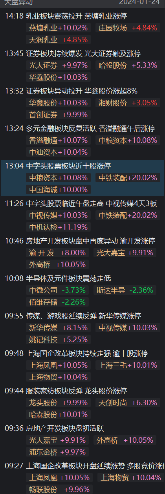<br /><br />今天的盘面比较经典：<br /><br />1.竞价开出来：上海票7个票顶一字。奠定今天做上海板块的预期，其他有板块异动，也应该优先往上海叠加。后面确实有非常多的上海票涨停。<br />上海板块这麽多一字？为什么没量？昨天都是涨停，今天1-2一字，说明有内幕，昨天进场拿先手，今天就没人想卖的。建元信托只有1kw的量。<br />2.同兴环保、华瓷股份：本来5-6PK的，结果全部挂了。<br />3.哈深：弱转强<br />4.深中华 弱转强、身法话A 反包<br />5.多元金融：九鼎投资、新力金融、华金资本 <br />6.中字头：中粮资本、中国海诚、中公高科。。。原因：新闻-央企股价要成为考核指标。<br />7.证券：首创证券、华鑫股份。 证券和金融为什么拉？护盘，那为什么选择金融证券？？？昨天是不是有个彭博社消息：国家要护盘，有2万亿平准基金，通过北向进入。但是以往都是证金公司买入股票的。所以这里接入点应该是证券、金融。<br />8.剑桥科技修复：有人不想做证券，想做AI。这个地方如果指数修复，就可以做，所以有资金博弈。<br />9.深中华A：板上杀到-3，原因就是指数强势，这个反指必死，非常快，两分钟中杀到水下。不过还有人接--92科比，说明什么，有资金觉得尽量量没有放出来，单纯是护盘引导出来的。博弈这个地方不是低，继续做反指。<br /><br /><br />每天盘面的演进都必须要理清楚。 |
| 板块题材/情绪面 | 情绪行进方向，先人一步<br />市场梯队(超短2板及以上是核心)<br />一进二<br /><br /><br />今天盘面的核心再哪里？大盘明天怎么走？明日计划<br /><br />盘面最强的几个方向、核心个股：<br />上海：中视传媒、长江投资、上海物贸、上海物贸、上海凤凰、建元信托、华建集团、上海易连、中华企业、凯淳股份20<br />多元金融证券：华金资本、威士顿、新力金融、首创证券、华鑫股份、光大证券<br />中字头：中视传媒、中铁装配20、中粮科工20、中油资本、中航产融、中公高科、中粮资本<br />泛AI：剑桥科技、特发信息<br /><br /><br /><br />这麽多涨停，明天量肯定也有限，支撑不起这麽多涨停，这些都是去弱留强，看核心，看风向标的竞价和走势。<br /><br /><br />长江投资：能板到下周，小号的高新发展？量太少了，类似高新2板<br />为什么拉剑桥？有人不想做金融，想做泛AI。只要指数要就能做AI。<br /><br />特发信息：早上回落没敢上，傻逼。知行不一。 |
| 个股分析        |                                                              |
| 消息面          |                                                              |
| 昨日预期分析    | 昨日是否兑现<br />                                           |
| 预期            | 大盘预期：<br />板块预期：<br />个股预期：监控哪些股<br />高标断板，高低切，1进2 |
| 反思            | 为什么别人能做到剑桥？<br />为什么别人能埋伏到金融？<br />你就是个傻逼，不思考 |
| 问财选股        | 20CM补涨                                                     |
| 明日计划        | 4个核心板块的去若刘强。<br />大盘指数观望。如果开得不及预期，这个地方买点后置，等低点接入金融证券。<br />如果高走，则做AI方向。<br />上海+中字头 有没有机会 |

#### **2024-01-25

| 项目            | 详情                                                         |
| --------------- | ------------------------------------------------------------ |
| 持仓盈亏        | +1500<br />中科信息昨天除了，没真钱，今天十多个点，亏麻了<br />今天也算有点踏空了，竞价沪指可以，其他的低开，没共振，不太乐观，昨天的计划也是觉得要分期，要去弱留强，还是低估了，昨天不算高潮，今天才是。<br />-华控赛格：深中华补涨之一，开一字，最强的。昨天打板的，今天一字，趟一字真他妈舒服啊，可以只有一手。推仓位是个非常重要的阶段，代表理解力下的信心。<br />中粮资本：打板<br />中国软件：追高，没涨停，明天要注意了。<br />科创板EFT：早盘没低吸，昨天就是低吸在半山腰，今天想等一下的，结果错过了低点。尾盘S了1/3，快回本了。 是真没想到抄底科创板都让我这么难受。<br />昊志机电：傻逼炒作，之前早改出了，亏了十多个点，服了。<br />中富电路：冲高是卖飞，好在没亏钱。这个操作也是垃圾，不该追高的，没有大行情的话难及时回本。 |
| 市场分析        | 沪深创科京：2906 +3%，2%，1.45%， 2%<br />量能：8914<br />市场情绪：94 ！！！ 前所未有，今天是我见过的最强的一天<br />涨停：104<br />跌停：3<br />外资流入：64<br />上涨家数：4835<br />连板晋级率：50%+， 平均涨幅5.49%<br /><br /><br />为什么中字头折磨强？？？<br />国企有很多很多的钱。这里出央企市值考核，就是要把国企的钱逼出来，流进股市。 国企（权力）有很多方式抬升股价。不是，这些央企国企富得流油，账上多的不得了。<br /><br /><br />今天黄线在上，比较少见，说明小盘股涨势更加猛烈。 |
| 大盘回顾        | 1.竞价：十多个票一字：**建元信托、畅联股份、上海凤凰、长江投资、中华企业、、香溢融通、华建集团、中视传媒、上海易连、上海物贸、特发信息、华控赛格、中粮资本**。 主要以上海+中字头 为主，这个时候感觉其实不太好，因为这些票都不给上车机会，同时票太多了没有一个聚焦，很难抉择，这就是很多人不适应空仓的原因。但是一定要反过来想，这里竞价折磨强，说明今天一定是有强度的。而且一字定方向，今天的主题一定是 中字头+上海 这个基调。。早盘唯一让人不舒服的就是：沪指没有和其他几个指数共振，深知、创业板、科创板、北交所都是绿的，这个地方没有共振，让人质疑强度，说明只是国家队在拉大盘，会其他方面反而造成虹吸。这点需要官网。<br />2.9:34：中字头 上海：开开实业、**浦东金桥**、**上海凯鑫**、中国海诚、上海沪工<br />3.上海中字头+证券：九鼎投资、华鑫股份<br />4.+地产：光大嘉宝锦和商管、京能置业、中交地产<br /><br />5+医药：中国医药、泓博医药、合富中国<br />6.人工智能：鸿博股份、铭普光磁<br />7.中字头：中航产融、中公高科、中铁装配20、中钢国际、中工国际、中农联合、中远海科<br />8+传媒：龙版传媒、中国科传、中国出版、中信出版20、博瑞传播、新华传媒、中天光泽<br />9:国改：常山北明、青岛食品<br />10:超级权重：中国石油、联通、中煤能源、中国交建、中国动力 |
| 板块题材/情绪面 | 情绪行进方向，先人一步<br />市场梯队(超短2板及以上是核心)<br />一进二<br />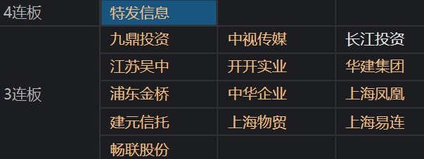<br />2-3的很多都是一字，其次是高妙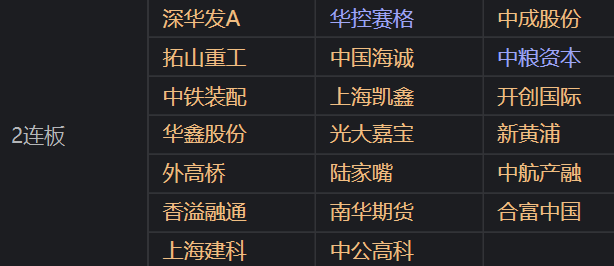<br />1-2的很多都给机会买入了<br /><br />明天肯定又是10+一字，聚焦核心。<br />今天百家涨停，明天是分歧预期，<br />分歧预期这个是共识，那么对于有先手的，开出来不及预期就会直接砸的，毕竟获利了，没有心理压力。<br />稍微后排的砸下来没有承接，必然要走低。<br />前排的有点辨识度的，会有资金承接---踏空的资金一定会想办法入场，这部分股票就是他们的目标。如果有量能，也会吸引更多的人入场，部分获利的也不会立即出来，选择格局。<br />所以明天就是去弱留强，高潮之后一定是分歧。<br />有没有可能来一个高高朝？不太可能，除非有更多的增量资金入场。<br /><br /><br />为什么今天很多票都无脑拉，特别是下午，像什么常山北明都涨停？因为很多踏空资金，非常难受，必须要上车，饥不择食，号的买不到，那次一点的也要强势拉。 |
| 个股分析        | 深中华5B：标准买点<br />今天为什么深中华涨停了？为什么不是反指了？我的理解：<br />1.地位：唯一的高位股，辨识度非常的高，昨天杀到水下就有很多资金入场抢筹。今天如果大盘是中下等修复，可能就是反指，会死掉。但是今天不是<br />2.整体行情太过于强势：涨疯了，踏空资金连后排的辨识度差的票都会抢，这种高位辨识度的票怎么可能放过，这里不可能当做反指看，是正直。或者说这种大行情下，正反没有太大的参考价值。普涨<br /><br /><br />核心分析：<br />长江投资、浦东金桥、中视传媒、<br />华鑫股份、首创证券、<br />特发信息 |
| 消息面          |                                                              |
| 昨日预期分析    | 昨日是否兑现<br />                                           |
| 预期            | 大盘预期：<br />板块预期：<br />个股预期：监控哪些股<br />高标断板，高低切，1进2 |
| 反思            | 永远做核心，今天核心是哪些，做了吗<br />在大局观下，结合板块分析个股、情绪、资金行进方向。<br />只看个股的封单、涨停时间、炸板与否，是没用的<br />高老师：深度思考、分析<br />竞价！ |
| 问财选股        | 20CM补涨                                                     |
| 明日计划        | 去弱留强<br />注意20CM<br />聚焦核心<br />指数分歧预期<br />看回流 |

#### 2024-01-28

| 项目            | 详情                                                         |
| --------------- | ------------------------------------------------------------ |
| 持仓盈亏        | -1500 科创板ETF 抄底抄错了<br />中国软件 没亏钱离场<br />打板中粮资本<br />华控赛格：早盘达芬奇，水下没加仓，糖拌，一手，，真不了钱 |
| 市场分析        | 沪深创科京：2910 +0.14，-1,1，-2，-2.5<br />量能：8287<br />市场情绪：61<br />涨停：60<br />跌停：7<br />外资流入：+15<br />上涨家数：<br />连板晋级率： |
| 大盘回顾        | 1.竞价：一字-上海、中字头                                    |
| 板块题材/情绪面 | 情绪行进方向，先人一步<br />市场梯队(超短2板及以上是核心)<br />一进二<br />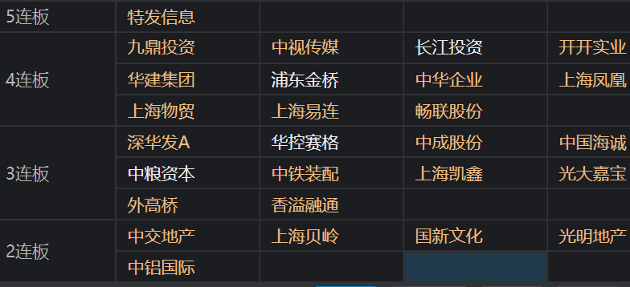<br /> |
| 个股分析        |                                                              |
| 消息面          |                                                              |
| 昨日预期分析    | 昨日是否兑现<br />                                           |
| 预期            | 大盘预期：<br />板块预期：<br />个股预期：监控哪些股<br />高标断板，高低切，1进2 |
| 反思            | 永远做核心，今天核心是哪些，做了吗<br />在大局观下，结合板块分析个股、情绪、资金行进方向。<br />只看个股的封单、涨停时间、炸板与否，是没用的<br />高老师：深度思考、分析<br />竞价！ |
| 问财选股        | 20CM补涨                                                     |
| 明日计划        | 拒绝杂毛、套利，必死，必须聚焦核心。<br />4-5淘汰赛<br /><br /><br />腾达科技：如果强势，看安邦护卫 |

#### 2024-01-29

| 项目            | 详情                                                         |
| --------------- | ------------------------------------------------------------ |
| 持仓盈亏        | 挣钱的愿望!!!<br />-3% -3500 卧槽，科创板ETF跌3个点，-5000了，日你妈，股灾，小盘股跌麻了。<br />早盘应该卖的，应该采用SB战法，不是BS战法。<br />安邦护卫：腾达竞价10亿封单，安邦卫护冲到很高的位置，还是下来了，大盘稍微好点也不至于，明天情况不对又得亏钱立场。<br /><br />海南高速：-5走，这种名牌的套利，没有多少意义。<br />中粮资本：水下摁<br />华控赛格：水下摁，最后拉起来涨停。<br /><br />教训：如果不看好，直接竞价按地板，如果开盘了，直接价格笼子底部摁，要拼手速。 |
| 市场分析        | 沪深创科京：2883-1，-2，-3.49， -2。79<br />量能：8052<br />市场情绪：31<br />涨停：28<br />跌停：55<br />外资流入：-5 主力-500<br />上涨家数：474<br />连板晋级率： |
| 大盘回顾        | 机构砸盘，创业板/科创板 大跌<br />小盘股大跌。<br /><br /><br />1.竞价：开出来10个一字。次新：腾达科技、永达股份。 上海+中字头：中国海诚、中视传媒、长江投资、浦东金桥、上海凤凰、上海汽配<br />2.核心标的竞价不及预期：上海凯鑫、<br />3.开出来大盘短暂往上拉，<br />4.中成股份 大长腿，如昨天所预料 肯定有低开换手上去的<br />5.华控赛格：深中华补涨，深中华今天横住了。大盘这摩擦，为什么没有抱团？？？位置太高了？没有人点火。太铭牌了 |
| 板块题材/情绪面 | 情绪行进方向，先人一步<br />市场梯队(超短2板及以上是核心)<br />一进二<br />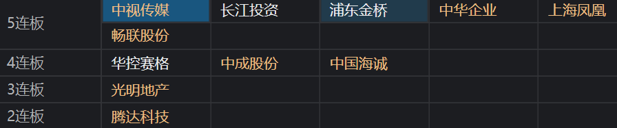<br />5联邦这麽多，还需要进一步分歧。<br /><br /><br /><br />光伏、CPO被按在地上<br />药明康德二连。<br /> |
| 个股分析        |                                                              |
| 消息面          |                                                              |
| 昨日预期分析    | 昨日是否兑现<br />                                           |
| 预期            | 大盘预期：<br />板块预期：<br />个股预期：监控哪些股<br />高标断板，高低切，1进2 |
| 反思            | 永远做核心，今天核心是哪些，做了吗<br />在大局观下，结合板块分析个股、情绪、资金行进方向。<br />只看个股的封单、涨停时间、炸板与否，是没用的<br />高老师：深度思考、分析<br />竞价！ |
| 问财选股        | 20CM补涨                                                     |
| 明日计划        | 看高标的继续分歧。<br />华控赛格是否能加速<br />天地是否能修复<br /> |

#### 2024-01-30

| 项目            | 详情                                                         |
| --------------- | ------------------------------------------------------------ |
| 持仓盈亏        | 挣钱的愿望!!!<br />-3000 日你妈 服了，科创板ETF都能下跌 3.5%<br />之前几百回本就该清仓，还他妈T，下跌中继。<br />新账户都快亏8000多了，卧槽，太尼玛痛苦了。<br /><br /><br /><br />安邦护卫：昨天次新强度不行，今天直接低开，几个次新都往地板按，这个开出来就应该直接按，操他妈，最后地板出。真实傻逼。<br /> |
| 市场分析        | 沪深创科京：2830 -1.8  -2.4  -2.4 -3.7<br />量能：6636<br />市场情绪：25<br />涨停：22<br />跌停：64<br />外资流入：+18<br />上涨家数：228<br />连板晋级率 |
| 大盘回顾        | 1.竞价：创新医疗一字：马斯克脑机消息。长江投资。长江投资、上海凤凰都被监管了。 后者走了 高-地-天-地<br />2.高妙：建艺集团--国资+互金。深南电A-电力年报-上塘路高老师，深中华A。 中视传媒。<br />3.浦东建设：浦东金桥的补。光伏 年报。 赣能股份：光伏电力年报。<br />4.欧陆通：年报+电源+20CM<br />中国海诚<br />中天光泽：中字头+国资+短剧？<br />老龙：中马传动 浙江世宝<br /><br />华建集团：地天 |
| 板块题材/情绪面 | 情绪行进方向，先人一步<br />市场梯队(超短2板及以上是核心)<br />一进二<br />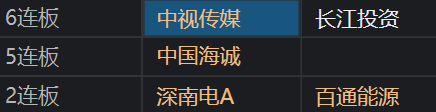<br /> |
| 个股分析        |                                                              |
| 消息面          |                                                              |
| 昨日预期分析    | 昨日是否兑现<br />                                           |
| 预期            | 大盘预期：<br />板块预期：<br />个股预期：监控哪些股<br />高标断板，高低切，1进2 |
| 反思            | 永远做核心，今天核心是哪些，做了吗<br />在大局观下，结合板块分析个股、情绪、资金行进方向。<br />只看个股的封单、涨停时间、炸板与否，是没用的<br />高老师：深度思考、分析<br />竞价！ |
| 问财选股        | 20CM补涨                                                     |
| 明日计划        | 不会思考的人，永远不可能做出来，这是个杀伐场<br /><br />核心标的：中视传媒、长江投资、中国海诚、深南电A、华建集团。<br />如果大盘向下：深南电应该开一字。上塘路在里面，也有兑现可能<br /><br />高老师：讲道理如果你们听我直播一个多月的，也应该悟道了。<br />你听了很久了吧，也没多少长进，说白了就是自己不思考。 |

#### 2024-01-31

| 项目            | 详情                                                         |
| --------------- | ------------------------------------------------------------ |
| 持仓盈亏        | 挣钱的愿望!!!学习&思考<br />-2000 科创板ETF有亏两个点。      |
| 市场分析        | 沪深创科京：2788 -1.48，-2 -0.6 -1.8<br />量能：7583 放量下跌，有些东西出问题了--融资盘爆仓，爆仓平仓<br />市场情绪：28<br />涨停：27<br />跌停：128 股灾，这样的下跌前所未有，难有<br />外资流入：+37<br />上涨家数：306<br />连板晋级率：5/22 |
| 大盘回顾        | 1.竞价：深南电2.2亿，封单不够，注定走不出来。不能顶一字，2个亿完全不可能封住一字，你想，梁板的票，多少获利盘，2个亿你就想走一字，走一字必死，如果低开让地位筹码进入，还有可能继续走下去。所以这个地方低量开一字必死。 <br />中视传媒：高开快速秒板，有换手，都比顶一字好。<br />核按钮：特发信息、畅联股份、上海凤凰-昨天天地今天直接按到地板、中华企业、深中华A<br />2.权重：宁德时代<br /><br />百通能源：次新 供热 电力，这是深南电的补吧<br />3.老龙：中天光泽、中马传动<br />4.华建集团：大长腿地天，昨天就是一个地天，非常超预期了<br /> |
| 板块题材/情绪面 | 情绪行进方向，先人一步<br />市场梯队(超短2板及以上是核心)<br />一进二<br />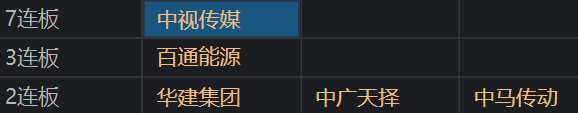<br /><br /><br />美邦服饰：业绩吧 |
| 个股分析        | 高老师：板扎 深南电<br />点火中粮资本：这个地方图好看，阻力小、题材正，和其他游资形成了合力。简直是天才。<br />被国家队收编了，另外还有5个人，4个交流过，2个妹子，都是坐庄的。--- 简直是我的偶像，要啥有啥。<br /><br /><br />中视传媒：不能看抱团，没分歧过，没有经过市场检验。<br />中视传媒最好是今天大分歧，尾盘回封，进行充分的筹码交换。<br /><br /><br />深南电：为什么今天走不出来？？？竞价开出来2.1亿的封单。这个封单大吗？我以为很大，但是真的大吗？15万手。34亿流通，20亿实际流通。只占1/10的封单。 |
| 消息面          |                                                              |
| 昨日预期分析    | 昨日是否兑现<br />                                           |
| 预期            | 大盘预期：<br />板块预期：<br />个股预期：监控哪些股<br />高标断板，高低切，1进2 |
| 反思            | 永远做核心，今天核心是哪些，做了吗<br />在大局观下，结合板块分析个股、情绪、资金行进方向。<br />只看个股的封单、涨停时间、炸板与否，是没用的<br />高老师：深度思考、分析<br />竞价！ |
| 问财选股        | 20CM补涨                                                     |
| 明日计划        | 核心：<br />中视传媒：没有大的换手，明天要接受市场检验了吧，量不足还想走一字，必死。低开可能还能往上。可能大单一字吗？不可能，这个点不可能有SB花大钱顶。里面的获利盘只可能离场的。<br />中粮资本：湖里大道、方新侠、量化，豪华阵容，明天肯定要分歧。<br />华建集团：两个地天，辨识度高，看走势。 |

### 02

#### 2024-02-01

| 项目            | 详情                                                         |
| --------------- | ------------------------------------------------------------ |
| 持仓盈亏        | 挣钱的愿望!!!学习&思考                                       |
| 市场分析        | 沪深创科京：2770 -0.6 +0.3 +1 +0.75 <br />量能：2730<br />市场情绪：37<br />涨停：30<br />跌停：47<br />外资流入：<br />上涨家数：1078<br />连板晋级率：6/27 |
| 大盘回顾        | 1.竞价：中视传媒开一字，但是封单只有两亿，注定要炸的，也果然炸了，不过换手之后又封上了。---和大盘共振的。今天经过了市场检验，明天可能有要加速了。板应该是没多大问题的，元子重仓进了<br />中基健康：顶一字，2800万换手，看不懂。太尼玛卷了，进不去，进去了就是坑。<br />宁夏建材：收购<br />中材节能<br /><br />2.高妙：<br />哈森股份：5连跌板，后涨停。拟收购，太极端了<br />威龙股份：<br /><br /><br />光伏：麦迪科技：订单、光伏。<br /><br />国盛科技<br />西电性能<br /><u>欧晶科技</u>：转债值得套利<br /><u>锦富技术</u><br />**山西路桥：光伏 高速公路 搜班<br />**<br />中马传动：老龙三板了，打破常规，感觉要兑现了。<br /><br />医疗：<br />创新医疗：3天2B<br />三博脑科：<br /><br />AI：<br /><u>剑桥科技</u>：<br />华西股份：<br />铭普光磁<br /><u>直真科技</u>：剑桥最好套利<br /><u>克来机电：</u>剑桥套利 |
| 板块题材/情绪面 | 情绪行进方向，先人一步<br />市场梯队(超短2板及以上是核心)<br />一进二<br />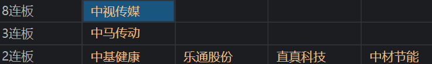<br /><br /><br /><br />今天就是：光伏+AI在撑着盘面。 |
| 个股分析        |                                                              |
| 消息面          |                                                              |
| 昨日预期分析    | 昨日是否兑现<br />                                           |
| 预期            | 大盘预期：<br />板块预期：<br />个股预期：监控哪些股<br />高标断板，高低切，1进2 |
| 反思            | 永远做核心，今天核心是哪些，做了吗<br />在大局观下，结合板块分析个股、情绪、资金行进方向。<br />只看个股的封单、涨停时间、炸板与否，是没用的<br />高老师：深度思考、分析<br />竞价！ |
| 问财选股        | 20CM补涨                                                     |
| 明日计划        |                                                              |

#### *2024-02-02

| 项目            | 详情                                                         |
| --------------- | ------------------------------------------------------------ |
| 持仓盈亏        | 挣钱的愿望!!!学习&思考                                       |
| 市场分析        | 沪深创科京：2730 -1.4，-2.2 -2.4 -2.4<br />量能：8057<br />市场情绪：24<br />涨停：26<br />跌停：47<br />外资流入：<br />上涨家数：23<br />连板晋级率：6/30 |
| 大盘回顾        | 大盘开出来小幅拉升，然后一直下跌，14:25跌了3.7个点，吓人，然后国家队通过北向入场护盘，指数拉升到-0.7，然后有跌倒-1.4<br /><br />杀跌原因：<br />1.基金赎回：基金融券做空<br />2.雪球产品<br />3.各种杠杆爆仓<br /><br /><br /><br />回顾：<br />1.竞价：四个一字：中百集团、中基健康、哈森股份、克来机电<br />哈森股份：14天14板，太极端了<br />克来机电：新知生产力？机器人 华为汽车<br />2.传媒：中视传媒的补？ 粤传媒、时代出版、省广集团。省广有Meta的利好<br />3.地产：深深房A、锦和商管<br />4.恒大新材：20CM？出现这个奇怪的东西，证明大盘不会好？<br /><br />5.浦东金桥<br />6.中马传动：老龙不过三 无效。<br /> |
| 板块题材/情绪面 | 情绪行进方向，先人一步<br />市场梯队(超短2板及以上是核心)<br />一进二<br />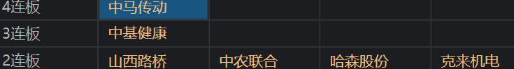<br />从周末消息-中央一号文件-乡村振兴来看：<br />中马传动：农机，做的消息的预期<br />中基健康：农产品<br />中农联合：农药<br />都是中字头+农用产品 ，显然有天龙人、内幕狗，做了这个预期。<br /><br />山西路桥：春节高速<br /><br />省广集团：<br /><br /><br />高老师：明天要出机会。不过开出来就是名牌。中农联合放量，周一开一字<br />中码、中农联合：这条线的首板，可以做，第二天做确认后往核心切。<br /><br />中马传动做盘太明显了，能代表<br /><br />如果明天大盘起来的话 看谁？中视传媒。如果明天要做的话，中视传媒必须要救的。 另外：药明康德需要止跌。<br />如果走反指的话看谁？中马、中农<br /><br /><br />金证股份：<br /><br />药明康德：如果被美国制裁，公司就接近没了，这个预期太糟糕了，如果是这样的话。就不用看药明康德了，不具备代表性。<br /><br />老一批游资：休息了<br />活跃的游资：选择了中马传动<br />国家队：选择了金证股份<br /><br /><br />如果要抓住机器人、农业这条线：中马、中农必须要给强度，然后负反馈必须要给修复--中视传媒、药明康德<br />深中华A：也不能A杀<br /><br />中马传动不能当做反指：中视传媒、浦东金桥、哈森股份还在前面呢，轮不到它。<br /><br /><br />中视传媒：加了一个乡村振兴。卧槽，太尼玛脏了，有人带元子加的，链子。<br /><br /><br />如果中视传媒明天接近地板开，然后往上拉一下，那它的任务已经完成了。资金集中去进攻中码<br /><br /><br />高老师：都得自己捋一捋。<br />“明天挺难的”<br /><br />元子：三个票：有一个走出来，都能走很久。那三个？<br /><br /><br />科创板里面：半导体 是不是有雷？<br /><br /><br />深中华A：尾盘抢筹4万手<br />浦东金桥：和中粮资本预期类似，图像很想<br /><br /><br />会不会用中字头来拉指数：把中国电信、中国移动大票再拉出来用一用？<br /><br />周一的竞价：会告诉你怎么回事，是周五盘面的一个总结。<br /><br />不管是做多还是做空，都绕不过 中视传媒。<br />沪深300ETF：明天闭着眼睛买的唯一标的？<br /><br />从指数上看，可以认为是年前的底部，所以这里中字头由于预期。<br /><br /><br />空仓总没错。<br /> |
| 个股分析        |                                                              |
| 消息面          |                                                              |
| 昨日预期分析    | 昨日是否兑现<br />                                           |
| 预期            | 大盘预期：<br />板块预期：<br />个股预期：监控哪些股<br />高标断板，高低切，1进2 |
| 反思            | 目前这个节点，没有增量资金了：<br />1.基金：都赎回<br />只有国家队有一些钱，但是这个地方拉没人跟。不能靠散户的，机构都在卖。<br />所以这个节点不可能往上的。<br /><br /><br /><br />国家队为什么不用劲往上拉？<br />你想啊？它为什么要逆势而为？<br />为什么不在可控范围内，让该释放的风险全部释放掉？该平仓的平掉，该暴的暴掉？<br />如果不这样，往上拉的时候有无尽的抛压，永远涨不上去。<br />国家队的目的是护盘，降低大幅的波动，它是不会管这一部分股民的，他们就是SB，是被抽血的部分。<br /><br /><br /><br />高老师的这个复盘简直是无敌。 |
| 问财选股        | 20CM补涨                                                     |
| 明日计划        |                                                              |

#### 2024-02-05千股跌停-冰点

| 项目            | 详情                                                         |
| --------------- | ------------------------------------------------------------ |
| 持仓盈亏        | 挣钱的愿望!!!学习&思考                                       |
| 市场分析        | 沪深创科京：<br />量能：8774<br />市场情绪：21<br />涨停：17<br />跌停：1280<br />外资流入：+7<br />上涨家数：378<br />连板晋级率：<br />股灾：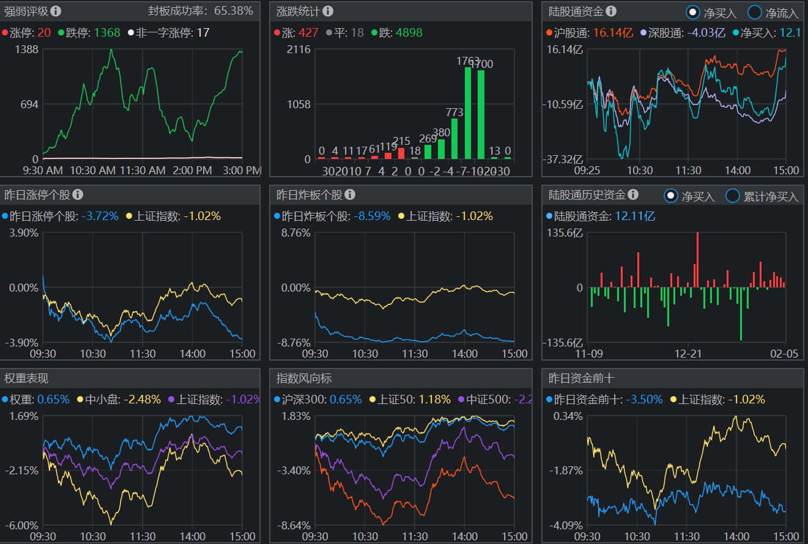<br />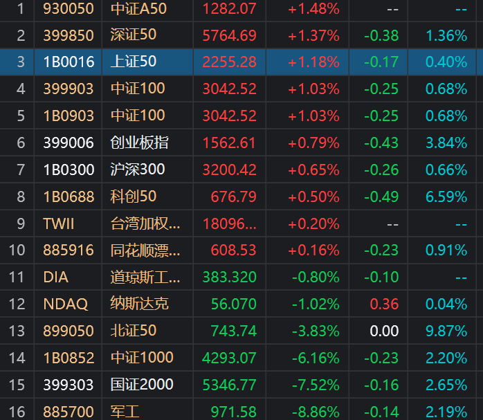<br />小盘股跌麻了<br /> |
| 大盘回顾        | 深中华A：昨天还是2%的获利，大部分都是套脑。昨天尾盘集合竞价，4万寿抢筹。今天一个平开往上拉，封板。吃掉大部分套牢盘，76%获利。  **什么叫做市场合力？这就是，如果有源源不断的跟随，有资金跟风，那不管你是套牢多少，都能给你撬开。**<br /><br />昨天深中华尾盘抢筹：博的是今天大盘狂杀的预期，博的是中视传媒、浦东金桥等死掉，作为最有辨识度的抱团高标。显然成功了。<br /><br />竞价：洪涛股份、克来机电、金自天正、中基健康 一字<br />深中华A：4600万委卖，超预期，开出来后强势拉升。<br />中农联合、山西路桥、省广集团、中马传动 等不及预期。确定了乡村振兴这条线走不出来。 这是正直，说明今天盘面不可能大修复<br /><br />中视传媒：直接按地板，7亿封单，没有翘班。这个核心标的没有反馈，说明不管是正直还是反指都走不出来，可以空仓的。<br />后面的行情也印证了这一点。<br />为什么：正直反向：中字头没按死，反指方向抱团绕过了这个最有辨识度的。而且没有翘班，情绪只差。<br />昨天有人还加了乡村振兴题材，可惜这个题材没走出来，没卵用<br /><br />药明康德：跌停板开，公司回购注销10亿，把价格一度拉倒+5，最后又砸到-4。<br /><br /> |
| 板块题材/情绪面 | 情绪行进方向，先人一步<br />市场梯队(超短2板及以上是核心)<br />一进二<br />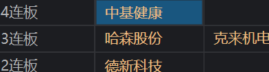<br />克来机电：这个位置有辨识度了，能不能带一些新知生产力/机器人方向<br />深中华A：核心关系，抱团。如果是又是股灾行情，这个抱团也不一定能保住。<br />金自天正：新知生产力核心 |
| 个股分析        |                                                              |
| 消息面          |                                                              |
| 昨日预期分析    | 昨日是否兑现<br />                                           |
| 预期            | 大盘预期：<br />板块预期：<br />个股预期：监控哪些股<br />高标断板，高低切，1进2 |
| 反思            | 永远做核心，今天核心是哪些，做了吗<br />在大局观下，结合板块分析个股、情绪、资金行进方向。<br />只看个股的封单、涨停时间、炸板与否，是没用的<br />高老师：深度思考、分析<br />竞价！ |
| 问财选股        |                                                              |
| 明日计划        | 如果继续砸，竞价不对劲：核心标的没有任何修复，砸掉ETF，盘中低点接回来。SB大发，为什么只敢BS，太傻逼。今天SB的话能盈利5个点。 |

上一次千股跌停复盘：18年6月

差异：那时候指数爆杀，今天被拉起来了！

相同点：农业的正指

人为干预是一定不会形成底部的，市场会给这个无形的手一个教训。

这不是底部

基金：没开放赎回点？

#### 2024-02-06百股涨停-救大票

| 项目            | 详情                                                         |
| --------------- | ------------------------------------------------------------ |
| 持仓盈亏        | 挣钱的愿望!!!学习&思考<br /><br />今天应该做ETF：中证1000、双创<br />知秋：北方华创+ETF<br />ETF：涨停的：科创100ETF<br /><br />我真是傻逼，科创板ETF还陆续清仓，没挣钱，ETF涨了6个点，账户2个点，还亏8千块。<br /><br />追高龙头股份：傻逼<br />敲地板时追 中农联合，结果由被按地板：你怎么想的，都已经有几个地天了，这时候怎么可能还有地天。而且这里接近尾盘了，是下午了，国家队的资金都基本打完了，是正常的冲高回落了，这时候绝对不是出手点。<br /><br />今天一个标准的出手方式就是：在指数黄线第一次拉起来，国家队入场得到确认后，重仓入局ETF：国政2000、双创。<br />或者做T+0 ETF。<br />更激进的是做20CM的暴利。<br /><br /><br />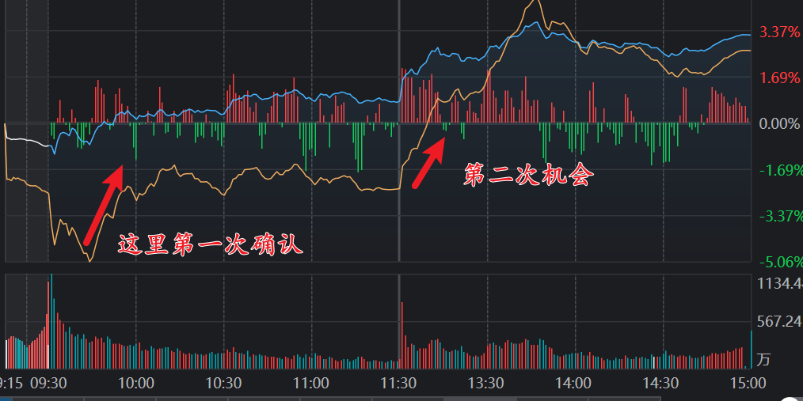其他做法都是傻逼。<br /><br /><br />新知生产力、医药。两个方向，看哪个方向能走出来 |
| 市场分析        | 沪深创科京：2789 +3.23  +6.22 + 6.7 + 6.5 指数都是爆辣。前期跌的多的双创、深成指 涨幅大<br />量能：9263<br />市场情绪：86<br />涨停：135<br />跌停：86<br />外资流入：126<br />上涨家数：3586<br />连板晋级率：5/17 |
| 大盘回顾        | 早上：跌幅大于7 1500家 --- 近似千股跌停<br />下午：涨幅大于7 1300家 --- 近似千股涨停<br /><br /><br />竞价：开出来是很悲观的，为什么？<br />1.两个一字：洪涛股份、克来机电。其他竞价都很弱。<br />2.沪指开出来-0.8<br />3.核心标的没有修复：中视传媒、浦东金桥还是地板。深中华、剑桥等低开。<br /><br />说实话：开出来我就做好了 卖出ETF，空仓过年的准备的。 哪知道后面国家队出手。这次不只是大大票沪指数，而是拉小票。没想到啊，往往最绝望的时候，也是转折节点。<br />为什么国家队要出手？<br />1.融资盘、基金等已经出清了不少。上方压力不算太大。2.最高层的指示：包子的压力？乌沙不保，该出手了<br />3.股民的愤怒：再跌，可能有人要走极端路线了，不只是送屎了<br /><br /><br />问题：这个是国家队呼出来的，大家都是抱着的跟随，套利的态度。如果情况不对，大家都抛出筹码。那还得往下。<br />所以国家队必须要源源不断去接的，每天都要维持一定的买入。<br />真正向上的节点还没有到来。<br />不过短线的情绪有修复。<br />安迪板的活跃资金今天都出来了--中视传媒、等<br /><br /><br />问题2：涨停里面65股封单不足1kw，这里是很弱的，只是一个无脑的跟随，不是资金情绪。不能代表短线行情。明天大部分都要低开的。除非竞价开出来国家队就猛买ETF<br /> |
| 板块题材/情绪面 | 情绪行进方向，先人一步<br />市场梯队(超短2板及以上是核心)<br />一进二<br />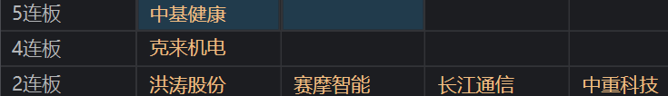<br /><br />地天：中基健康，短信核心，年报+乡村振兴线路，这条线比较弱。这个地天太有性价比了---按跌停后一致封不住，一直有买入，太活跃了，所以一点就上去了。<br /><br />克来机电：一字，新知生产力/机器人 核心标的，该接受市场检验了，高妙？或者换手板。 <br />赛摩智能：20CM2连，太刺激了<br /><br /><br />长江通信：地天，打出了辨识度，核心标的。上面抛压也不少，不会开一字，走换手<br />中重科技：新知生产力 核心<br /><br />每次拉大盘的时候：必有CPO |
| 个股分析        |                                                              |
| 消息面          |                                                              |
| 昨日预期分析    | 昨日是否兑现<br />                                           |
| 预期            | 大盘预期：<br />板块预期：<br />个股预期：监控哪些股<br />高标断板，高低切，1进2 |
| 反思            | 永远做核心，今天核心是哪些，做了吗<br />在大局观下，结合板块分析个股、情绪、资金行进方向。<br />只看个股的封单、涨停时间、炸板与否，是没用的<br />高老师：深度思考、分析<br />竞价！ |
| 问财选股        |                                                              |
| 明日计划        | 1. 新知生产力、医药：两条最可能的线路。<br />2. 核心标的竞价：该高开的、该修复的<br />3. CPO开得如何。 |

#### 2024-02-07百股涨停-救中票

| 项目            | 详情                                                         |
| --------------- | ------------------------------------------------------------ |
| 持仓盈亏        | 挣钱的愿望!!!学习&思考<br /><br />昨天知秋已经说过了：买中证500ETF！！！<br />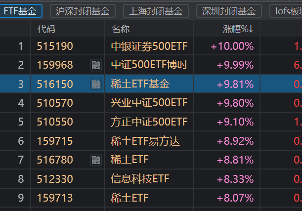<br />都是中证500相关的票，所以核心就是这里，确定性最强的<br /><br /><br />秋：今天要做另外就是 一进二。 中证500里面的一进二<br /><br /><br />择时择时择时！！！！！！ 今天这么好的行情，为什么不出手？？？？<br />择时+审美<br /><br /><br />傻逼<br /> |
| 市场分析        | 沪深创科京：<br />量能：<br />市场情绪：<br />涨停：<br />跌停：<br />外资流入：<br />上涨家数：<br />连板晋级率 |
| 大盘回顾        | 龙虎榜：量化出清？                                           |
| 板块题材/情绪面 | 情绪行进方向，先人一步<br />市场梯队(超短2板及以上是核心)<br />一进二<br /><br />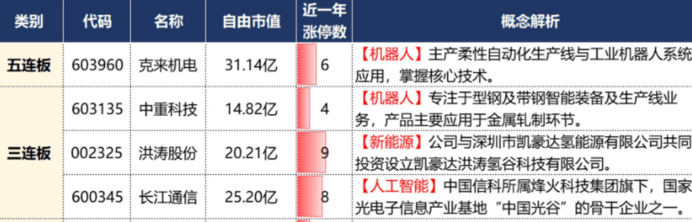<br />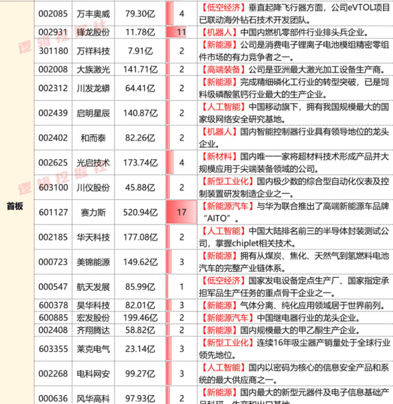<br /><br /> |
| 个股分析        | 中国稀土：J神，容量票。核心标的，如果走不出来，则说明目前的行情是国家队拉起来的脸面，本质并没有改变。<br /><br /> |
| 消息面          |                                                              |
| 昨日预期分析    | 昨日是否兑现<br />                                           |
| 预期            | 大盘预期：<br />板块预期：<br />个股预期：监控哪些股<br />高标断板，高低切，1进2 |
| 反思            | 问题：<br />1.为什么中基健康走不出来，走天地？<br />中字头：减分, 上一轮的正直。中直头没多少走出来的，被A得很惨？<br />昨天的地天：是被反推，强行做的<br />和中证500 PK 的票？失败了。 --没听清<br /><br /><br />医药为什么不看好？最高版是中基健康，走不出来。药明康德的利空还是在的。 |
| 问财选股        |                                                              |
| 明日计划        |                                                              |

#### 2024-02-08千股涨停-救小票

| 项目            | 详情                                                         |
| --------------- | ------------------------------------------------------------ |
| 持仓盈亏        | 挣钱的愿望!!!学习&思考                                       |
| 市场分析        | 沪深创科京：<br />量能：<br />市场情绪：<br />涨停：<br />跌停：<br />外资流入：<br />上涨家数：<br />连板晋级率 |
| 大盘回顾        |                                                              |
| 板块题材/情绪面 | 情绪行进方向，先人一步<br />市场梯队(超短2板及以上是核心)<br />一进二<br />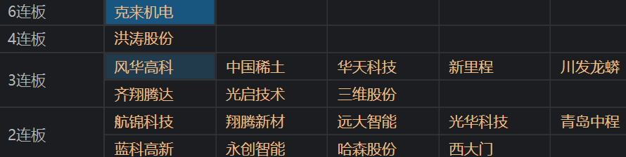<br /> |
| 个股分析        |                                                              |
| 消息面          |                                                              |
| 昨日预期分析    | 昨日是否兑现<br />                                           |
| 预期            | 大盘预期：<br />板块预期：<br />个股预期：监控哪些股<br />高标断板，高低切，1进2 |
| 反思            | 永远做核心，今天核心是哪些，做了吗<br />在大局观下，结合板块分析个股、情绪、资金行进方向。<br />只看个股的封单、涨停时间、炸板与否，是没用的<br />高老师：深度思考、分析<br />竞价！ |
| 问财选股        |                                                              |
| 明日计划        |                                                              |

#### 春节

Sora文生视频：


这个消息有容量吗？

1. 肯定不能和去年的GPT相比，但是也是革命性的技术。能根据文本指令，生成对应的视频
   1. 突破：开始理解人的认知、理解世界的物理规律等
2. 相关标的去年都有炒作，不过是GPT/传媒的衍生炒作。能走出来的一定是新的标的--炒新不炒旧。什么汉王科技 拓尔思肯定靠后。
3. 同样的衍生的题材：算力、芯片
4. 不管怎么样，AIGC、视频生成、相关题材有一波短期行情


芯片：

1. ARM Holding 周翻倍，英伟达核心供应商、持股公司
2. 英伟达创新高
3. 芯片概念接近2022-05的低点，最近狂跌
4. 

#### 2024-02-22

19-21春节在家，都没写

| 项目            | 详情                                                         |
| --------------- | ------------------------------------------------------------ |
| 持仓盈亏        | 挣钱的愿望!!!学习&思考                                       |
| 市场分析        | 沪深创科京：<br />量能：<br />市场情绪：<br />涨停：<br />跌停：<br />外资流入：<br />上涨家数：<br />连板晋级率 |
| 大盘回顾        |                                                              |
| 板块题材/情绪面 | 情绪行进方向，先人一步<br />市场梯队(超短2板及以上是核心)<br />一进二<br /><br /> |
| 个股分析        |                                                              |
| 消息面          |                                                              |
| 昨日预期分析    | 昨日是否兑现<br />                                           |
| 预期            | 大盘预期：<br />板块预期：<br />个股预期：监控哪些股<br />高标断板，高低切，1进2 |
| 反思            | 永远做核心，今天核心是哪些，做了吗<br />在大局观下，结合板块分析个股、情绪、资金行进方向。<br />只看个股的封单、涨停时间、炸板与否，是没用的<br />高老师：深度思考、分析<br />竞价！ |
| 问财选股        |                                                              |
| 明日计划        |                                                              |

#### 2024-02-25

| 项目            | 详情                                                         |
| --------------- | ------------------------------------------------------------ |
| 持仓盈亏        | 挣钱的愿望!!!学习&思考                                       |
| 市场分析        | 沪深创科京：<br />量能：<br />市场情绪：<br />涨停：<br />跌停：<br />外资流入：<br />上涨家数：<br />连板晋级率 |
| 大盘回顾        |                                                              |
| 板块题材/情绪面 | 情绪行进方向，先人一步<br />市场梯队(超短2板及以上是核心)<br />一进二<br /><br /><br />景峰医药、美吉姆、合力泰、文投控股、亚星客车：都是一样的超跌图形，走的是超跌反弹路线。<br /> |
| 个股分析        |                                                              |
| 消息面          | 老大：<br />荣耀发布会：                                     |
| 昨日预期分析    | 昨日是否兑现<br />                                           |
| 预期            | 机器人的封单--周末发酵<br />克来机电的封单<br />**ai机器人，智能物流和装备等**<br /><br />新》旧，拒绝中位 --- 知秋 |
| 反思            | 腾达科技：从K线上看，超跌后没有大幅反弹过，切接近破发，逻辑上是很硬的，很有性价比，但是我却没有买，下午果然一个快速板。<br />为什么？ 看出来了，说明有进步，逻辑就是这波反弹没涨过的超跌+接近破发，肯定有资金会拉的。但是为什么没上？<br /> |

#### 2024-02-26

| 项目            | 详情                                                         |
| --------------- | ------------------------------------------------------------ |
| 持仓盈亏        | 挣钱的愿望!!!学习&思考                                       |
| 市场分析        | 沪深创科京：<br />量能：<br />市场情绪：<br />涨停：<br />跌停：<br />外资流入：<br />上涨家数：<br />连板晋级率 |
| 大盘回顾        | <br /><br /><br /><br />维海德一板，克莱的，， 地位<br />创业板7B：创纪录， 大于克来机电<br /> |
| 板块题材/情绪面 | 情绪行进方向，先人一步<br />市场梯队(超短2板及以上是核心)<br />一进二<br /><br /> |
| 个股分析        |                                                              |
| 消息面          |                                                              |
| 昨日预期分析    | 昨日是否兑现<br />                                           |
| 预期            | 大盘预期：<br />板块预期：<br />个股预期：监控哪些股<br />高标断板，高低切，1进2 |
| 反思            | 永远做核心，今天核心是哪些，做了吗<br />在大局观下，结合板块分析个股、情绪、资金行进方向。<br />只看个股的封单、涨停时间、炸板与否，是没用的<br />高老师：深度思考、分析<br />竞价！ |
| 问财选股        |                                                              |
| 明日计划        |                                                              |

#### 2024-02-28

| 项目            | 详情                                                         |
| --------------- | ------------------------------------------------------------ |
| 持仓盈亏        | 挣钱的愿望!!!学习&思考                                       |
| 市场分析        | 沪深创科京：<br />量能：<br />市场情绪：<br />涨停：<br />跌停：<br />外资流入：<br />上涨家数：<br />连板晋级率 |
| 大盘回顾        |                                                              |
| 板块题材/情绪面 | 情绪行进方向，先人一步<br />市场梯队(超短2板及以上是核心)<br />一进二<br /><br /> |
| 个股分析        | 克莱带动中低位<br />中地位反推克莱<br />                     |
| 消息面          |                                                              |
| 昨日预期分析    | 昨日是否兑现<br />                                           |
| 预期            | 大盘预期：<br />板块预期：<br />个股预期：监控哪些股<br />高标断板，高低切，1进2 |
| 反思            | 永远做核心，今天核心是哪些，做了吗<br />在大局观下，结合板块分析个股、情绪、资金行进方向。<br />只看个股的封单、涨停时间、炸板与否，是没用的<br />高老师：深度思考、分析<br />竞价！ |
| 问财选股        |                                                              |
| 明日计划        |                                                              |

#### 2024-02-28

| 项目            | 详情                                                         |
| --------------- | ------------------------------------------------------------ |
| 持仓盈亏        | 挣钱的愿望!!!学习&思考                                       |
| 市场分析        | 沪深创科京：<br />量能：<br />市场情绪：<br />涨停：<br />跌停：<br />外资流入：<br />上涨家数：<br />连板晋级率 |
| 大盘回顾        | 爆量大分歧，但不是退潮<br /><br />西部证券：不能走弱转强高妙，这是金融票，如果你是做多的，你看的西部证券涨停，你有什么想法。<br />中科曙光高妙都是可以接收的。西部证券弱转强没意义？ |
| 板块题材/情绪面 | 情绪行进方向，先人一步<br />市场梯队(超短2板及以上是核心)<br />一进二<br /><br /> |
| 个股分析        |                                                              |
| 消息面          |                                                              |
| 昨日预期分析    | 昨日是否兑现<br />                                           |
| 预期            | 大盘预期：<br />板块预期：<br />个股预期：监控哪些股<br />高标断板，高低切，1进2 |
| 反思            | 永远做核心，今天核心是哪些，做了吗<br />在大局观下，结合板块分析个股、情绪、资金行进方向。<br />只看个股的封单、涨停时间、炸板与否，是没用的<br />高老师：深度思考、分析<br />竞价！ |
| 问财选股        |                                                              |
| 明日计划        |                                                              |

#### 2024-02-29

| 项目            | 详情                                                         |
| --------------- | ------------------------------------------------------------ |
| 持仓盈亏        | 挣钱的愿望!!!学习&思考                                       |
| 市场分析        | 沪深创科京：<br />量能：<br />市场情绪：<br />涨停：<br />跌停：<br />外资流入：<br />上涨家数：<br />连板晋级率 |
| 大盘回顾        | 昨天ICU，今天KTV                                             |
| 板块题材/情绪面 | 情绪行进方向，先人一步<br />市场梯队(超短2板及以上是核心)<br />一进二<br /><br /><br /> |
| 个股分析        | 塞力斯、高新发展，这两个容量大票，都接近铅膏了，从底部上来也翻倍了，这种票错过了，是在是过于傻逼。特别是高新发展，之前高老师调教过多少次了。还是没有定位到这种跳不过的核心标的。<br />中科曙光容量，也是在模仿这个走势，章盟主能买10个亿，前两都是有有多个涨停，有强度，中科曙光没涨停，弱一些。<br /><br /><br />上午半导体高潮：小作文几纳米有突破？ |
| 消息面          |                                                              |
| 昨日预期分析    | 昨日是否兑现<br />                                           |
| 预期            | 大盘预期：<br />板块预期：<br />个股预期：监控哪些股<br />高标断板，高低切，1进2 |
| 反思            | TODO：半导体核心个股                                         |
| 问财选股        |                                                              |
| 明日计划        |                                                              |

### 03

#### 2024-03-02

| 项目            | 详情                                                         |
| --------------- | ------------------------------------------------------------ |
| 持仓盈亏        | 挣钱的愿望!!!学习&思考                                       |
| 市场分析        | 沪深创科京：<br />量能：<br />市场情绪：<br />涨停：<br />跌停：<br />外资流入：<br />上涨家数：<br />连板晋级率 |
| 大盘回顾        |                                                              |
| 板块题材/情绪面 | 情绪行进方向，先人一步<br />市场梯队(超短2板及以上是核心)<br />一进二<br /><br /> |
| 个股分析        | 欧菲光：那一波上冲没成，反而是方正证券成了。这个地方为什么方正证券能成，是消息面吗 <br />还是拉证券，这种环境下证券+0.56，是否属于国家队拉证券吗，拉证券说明国家队在复盘，反而有不好的预期。<br />所以到底该怎么理解？从方正证券入手：<br />小作文：蚂蚁收购，蚂蚁想搞证券资质，类似东方财富，传言大战略是 社交+金融，应该有往这边发展行为<br /><br /><br /><br /><br />东方精工没有断板前，都可以空仓--鲍老师，为什么<br />如果东方断了，汇源通信成为最高版，可以买。<br />少做补涨：补涨能挣钱其他地方一定能挣钱，补涨开了大概率死 |
| 消息面          |                                                              |
| 昨日预期分析    | 昨日是否兑现<br />                                           |
| 预期            | 鲍老师：东方精工，零轴开，看四川金顶之前一波                 |
| 反思            |                                                              |
| 问财选股        |                                                              |
| 明日计划        |                                                              |

#### 2024-03-04

| 项目            | 详情                                                         |
| --------------- | ------------------------------------------------------------ |
| 持仓盈亏        | 挣钱的愿望!!!学习&思考                                       |
| 市场分析        | 沪深创科京：<br />量能：<br />市场情绪：<br />涨停：<br />跌停：<br />外资流入：<br />上涨家数：<br />连板晋级率 |
| 大盘回顾        |                                                              |
| 板块题材/情绪面 | 情绪行进方向，先人一步<br />市场梯队(超短2板及以上是核心)<br />一进二<br /><br /> |
| 个股分析        | 思泉新材：是关键，不该咋办，炸板不会封，就有导致很坏的剧本：下午批量天地<br /><br /><br />东方精工：应征鲍老师的预测，和公元股份一样。<br /><br /><br />今天很恶劣<br />东方精工是代表，汇源通信等加剧这种恶劣<br /><br /><br />7-12，天威实训，大票加速，斜率，大票死的方式---高新<br /><br />高新可以分歧，但是不能不给红盘，最近每天都有红盘，但是红盘越来越少，真钱效应边际递减<br /><br /><br />鲍老师：今晚干活太多，会看下 |
| 消息面          |                                                              |
| 昨日预期分析    | 昨日是否兑现<br />                                           |
| 预期            | 百股跌停？<br /><br />ai应用可能走出来<br/>也就是硬件切换至软件<br/>目前电影相关的最好<br/>上海电影因赛集团适合五日线低吸<br/>再埋伏一些别的类似百纳、华策<br/>ai不行的时候中字头轮动，ai行的时候就对应中国船舶中国石油低吸。 |
| 反思            |                                                              |
| 问财选股        |                                                              |
| 明日计划        | 先观望<br />看核心标的 竞价 开盘走势————高标+容量<br />人工智能：液冷、AI手机、存储<br />氢能： |

#### 2024-03-05

| 项目            | 详情                                                         |
| --------------- | ------------------------------------------------------------ |
| 持仓盈亏        | 挣钱的愿望!!!学习&思考                                       |
| 市场分析        | 沪深创科京：<br />量能：<br />市场情绪：<br />涨停：<br />跌停：<br />外资流入：<br />上涨家数：<br />连板晋级率 |
| 大盘回顾        |                                                              |
| 板块题材/情绪面 | 今天是抱团大票第一次分歧<br />                               |
| 个股分析        | 今天克莱和高新是对立的                                       |
| 消息面          | 今天开会第一天：国家队在买，维稳，另外机构有指导电话不能净卖出<br />国家队买体现在：小盘股跌幅大，指数红<br />沪深300 0.7<br />沪深300ETF：放巨量，百亿成交 |
| 昨日预期分析    | 昨日是否兑现<br />                                           |
| 预期            | 大盘预期：<br />板块预期：<br />个股预期：监控哪些股<br />高标断板，高低切，1进2 |
| 反思            | 克来机电的二波预期也被消化了？<br />为什么东方精工地天：<br />1.盘子较大，容量<br />2.龙虎榜买一：小鳄鱼，6kw，它敢买这麽多？有被国家队诏安的的意思<br />3.今天分歧，抱团<br />4.拉起来有有性价比：昨天获利套利的都出去不少，压力较小。<br />5.辨识度：今天封板，8天7板，最高版？<br /><br /><br /><br /><br />为什么可以竞价买安奈儿？<br /><br />安奈儿为什么竞价爆量：必须要放量、换手，加速就死。释放分歧方式有：板上换手、高秒、大长腿<br /><br />今天分歧够吗？不够<br /><br />信号：黄线穿白线<br /><br /><br />为什么思泉新材反包？<br /> <br /><br />听了这麽多直播？为什么能赚的核心都没有做？长白山、高新、东方精工、清远？<br />为什么没做高新？？？？？？<br /> |
| 问财选股        |                                                              |
| 明日计划        | 先观望<br />看核心标的 竞价 开盘走势————高标+容量<br />人工智能：液冷、AI手机、存储<br />氢能： |

#### 2024-03-06 TODO

| 项目            | 详情                                                         |
| --------------- | ------------------------------------------------------------ |
| 持仓盈亏        | 挣钱的愿望!!!学习&思考                                       |
| 市场分析        | 沪深创科京：<br />量能：<br />市场情绪：<br />涨停：<br />跌停：<br />外资流入：<br />上涨家数：<br />连板晋级率 |
| 大盘回顾        |                                                              |
| 板块题材/情绪面 | 情绪行进方向，先人一步<br />市场梯队(超短2板及以上是核心)<br />一进二<br /><br /> |
| 个股分析        |                                                              |
| 消息面          |                                                              |
| 昨日预期分析    | 昨日是否兑现<br />                                           |
| 预期            |                                                              |
| 反思            | 为什么克来机电能反抽？鲍老师付费文章<br />今天是监管问题？今天6号。博弈的是出监管的首日<br /><br /><br />芙蓉、天元 都是套<br />今天最好的是哎哎精工<br />和上次的高斯贝尔一样，一进二，标准一进二？<br />--标准的接力！！！！！ 研究<br /><br /><br />好好研究这两天的环境，非常的标准--鲍老师<br /><br />克来机电上板：一个号的信号，可以看多<br />安奈儿明天加速？克莱被反推2板？<br />新知生产力加强<br /><br />“没有模式，都是环境”<br />换汤不换药<br /><br />什么是核心，什么是套？<br />套利？套概念？A买不到就去买B，是补涨吗？也不是<br />套和身位 什么关系<br /><br />克莱什么时候展现强度？二班，同样的思路可以买到高斯贝尔<br /><br />高斯贝尔套的东方精工<br /><br />艾艾精工又是套的啥<br /><br />天元：卡次高，和哈森一样，套 |
| 问财选股        |                                                              |
| 明日计划        | 先观望<br />看核心标的 竞价 开盘走势————高标+容量<br />人工智能：液冷、AI手机、存储<br />氢能： |

#### 2024-03-07

| 项目            | 详情                                                         |
| --------------- | ------------------------------------------------------------ |
| 持仓盈亏        | 挣钱的愿望!!!学习&思考                                       |
| 市场分析        | 沪深创科京：<br />量能：<br />市场情绪：<br />涨停：<br />跌停：<br />外资流入：<br />上涨家数：<br />连板晋级率 |
| 大盘回顾        |                                                              |
| 板块题材/情绪面 | 情绪行进方向，先人一步<br />市场梯队(超短2板及以上是核心)<br />一进二<br /><br /> |
| 个股分析        |                                                              |
| 消息面          |                                                              |
| 昨日预期分析    | 昨日是否兑现<br />                                           |
| 预期            | 大盘预期：<br />板块预期：<br />个股预期：监控哪些股<br />高标断板，高低切，1进2 |
| 反思            | 克来机电：熬死了所有人气股：东方精工、安奈儿等---周期龙。<br />周期龙死的时候，盘面一般是很惨烈的。<br />克来机电这里没有二波了。这里做了一个阴线双头。<br /><br /> |
| 问财选股        |                                                              |
| 明日计划        | 先观望<br />看核心标的 竞价 开盘走势————高标+容量<br />人工智能：液冷、AI手机、存储<br />氢能： |

#### 2024-03-08

| 项目            | 详情                                                         |
| --------------- | ------------------------------------------------------------ |
| 持仓盈亏        | 挣钱的愿望!!!学习&思考                                       |
| 市场分析        | 沪深创科京：<br />量能：<br />市场情绪：<br />涨停：<br />跌停：<br />外资流入：<br />上涨家数：<br />连板晋级率 |
| 大盘回顾        |                                                              |
| 板块题材/情绪面 |                                                              |
| 个股分析        | 工业富联：妇联？38代码？<br />沪电股份：护垫？恶趣味？       |
| 消息面          |                                                              |
| 昨日预期分析    | 昨日是否兑现<br />                                           |
| 预期            |                                                              |
| 反思            |                                                              |
| 问财选股        |                                                              |
| 明日计划        |                                                              |


#### 2024-03-11

| 项目            | 详情                                                         |
| --------------- | ------------------------------------------------------------ |
| 持仓盈亏        | 挣钱的愿望!!!学习&思考                                       |
| 市场分析        | 沪深创科京：创业板大涨4.6，离谱<br />量能：<br />市场情绪：<br />涨停：99<br />跌停：<br />外资流入：100<br />上涨家数：<br />连板晋级率 |
| 大盘回顾        | 宁德时代：消息利好，                                         |
| 板块题材/情绪面 |                                                              |
| 个股分析        |                                                              |
| 消息面          |                                                              |
| 昨日预期分析    | 昨日是否兑现<br />                                           |
| 预期            |                                                              |
| 反思            |                                                              |
| 问财选股        |                                                              |
| 明日计划        |                                                              |

#### 2024-03-12

| 项目            | 详情                                                         |
| --------------- | ------------------------------------------------------------ |
| 持仓盈亏        | 挣钱的愿望!!!学习&思考                                       |
| 市场分析        | 沪深创科京：<br />量能：<br />市场情绪：<br />涨停：<br />跌停：<br />外资流入：<br />上涨家数：<br />连板晋级率 |
| 大盘回顾        | 高股息大跌 白酒顶上 维稳<br />飞行汽车<br />地产<br />中药   |
| 板块题材/情绪面 |                                                              |
| 个股分析        |                                                              |
| 消息面          |                                                              |
| 昨日预期分析    | 昨日是否兑现<br />                                           |
| 预期            |                                                              |
| 反思            |                                                              |
| 问财选股        |                                                              |
| 明日计划        |                                                              |

#### 2024-03-13

| 项目            | 详情                                                         |
| --------------- | ------------------------------------------------------------ |
| 持仓盈亏        | 挣钱的愿望!!!学习&思考                                       |
| 市场分析        | 沪深创科京：<br />量能：<br />市场情绪：<br />涨停：<br />跌停：<br />外资流入：<br />上涨家数：<br />连板晋级率 |
| 大盘回顾        | 竞价：飞行汽车开出来不及预期，为什么？高标李航科技 7个点开，没有封板，且开出来被兑现。万丰奥威1.2亿委买，对于容量票来说应该是不够的，开5也被兑现。后面日内才有修复。<br />竞价：AI走强。榕基软件高秒，网点软件、久其软件，AI+<br />掌阅科技：带动传媒走强<br /><br /> |
| 板块题材/情绪面 | 硬件切软件：中国软件涨停、SORA、文化传媒等涨<br />工业富联冲高回路、光迅科技、中科曙光、浪潮信息等表现差。<br />说明硬件端的主升要告一段落了。工业富联等大票都已经翻倍了，没有上涨的动能了<br /><br /><br />就是：AI+应用端/内容、衍生 |
| 个股分析        | 万丰奥威：频繁万手单博弈，很强，一直砸不死，50亿成交         |
| 消息面          |                                                              |
| 昨日预期分析    | 昨日是否兑现<br />                                           |
| 预期            | 应用端加强                                                   |
| 反思            |                                                              |
| 问财选股        |                                                              |
| 明日计划        | 手里开的超时 大部分都砸掉<br />不要都竞价杂，冲高砸<br />软件可能要加强，每大涨的+AI+衍生/医药/大模型/传媒<br />看核心个股的反馈：因赛集团、掌阅科技<br />万丰奥威：低空 |

#### 2024-03-14

| 项目            | 详情                                                         |
| --------------- | ------------------------------------------------------------ |
| 持仓盈亏        | hey今天我把手里的六个票全部清空了。分别是东安动力卖飞了。两个多点卖的。尾盘强势涨停。这个Pro的图形也是最好看的。预期应该是也非常大。开通股份汽车零部件。也是亏钱。Neon科技开出来应该就是被按监控卡了，没有第一时间去卖出实在是。非常傻逼的操作。特别是在我回家的时候，居然很犹豫。想看一下，看一下他能不能再往上冲。太贪婪了，太贪婪了，实在太他妈贪婪了。以后万万不能做这种东西。这一场傻逼上中一点都不果断。<br />还有另外一个大问题就是送你的票多了，不及时处理掉，非常的难受。你听着这几个票好的机会你都错过了。所以所以说这种模式就是不对的。你必须要提前做好预案。焦距核心然后第二天紧盯这些。计划lay的票。<br />还有刚才说的万丰奥威。这个比较做低空低空经济的。容量中军容量票230亿。做青年化的轮毂。一起相关的产品，当然也包括飞行汽车。这片开顺了就往下撒，这个太不急于情了。直接就把这个板块的预期给打没了。今天也是亏钱的。供电计量他昨天买了，准备是做低空安全的预期。也没成。亏钱0点有数，只有昨天一个脉冲追的。数据要素的之前的核心20cm。哎呀！也让我亏钱。在这种行情下，做做这种操作时一定会亏钱的。 |
| 市场分析        | 今天沪指收沪0.18。甚至搜狐0.52。创始收复0.64。好在市场量能维持在万亿。共1495，加上涨3410加下跌。情绪词45。涨停41家，跌停两家。板块上医药最强。环保骑士 |
| 竞价            | 进价开出来就有很多不及预期。首先就是昨天软件转硬件的。各个核心票中国软件inside集团还有传媒的票。大地开的。还有特别是工业妇联这个巨无霸。开五个点以下。对情绪的影响实在是太大了。今年医药是一个正常的能动。 |
| 大盘回顾        | 昨天低切的软件和应用端均没有后续<br />低位轮动<br />都没有持续性，没有赚钱效应：<br /><br />工业富联大低开：恐怖，退潮<br /><br /><br />每项资金在尾盘去强势拉指数。这个北向肯定是假的北向。国家队复盘而已。 |
| 板块题材/情绪面 | 当前无主线嗯                                                 |
| 个股分析        | 为什么克来机电会崩，然后有回升一部分呢<br />东田微 跷跷板<br />量化调仓，<br />和信雅达 12-23号一样<br />东田微里面是量化，量化出克来机电<br />克来机电被艾艾精工替代了，买不到哎哎才去的克莱<br /><br />克来机电摸跌停：这是很恐怖的<br /><br /><br /><br /><br />立航科技和艾艾精工：跷跷板，后者炸板，前者拉直线，后者回封，前者跌下来<br /><br /><br />现在的连板天梯上爱爱精工最高版八版。在这种行情下还能八进九吗？我感觉非常难。这票如果明天大的开，那就全天不用做了。谁知道呢，说不定往地板按。<br />然后就是五版的中电信发。这个应该是做磁电存储的吧？处理流出1.7个亿。今天还是抓了两次板。放出了巨量。明天5G Neo应该是有很大的机会的。然后就是4版的星光股份。这个是光电子。电学的今天开了个一字。连续两天一直明天总该。分析一下，放能量吧。四进五应该还是可以的吧。3班的永瑞科技大理药业。都不太看好。如果明天一要加强的话，大连永远有可能成。但是在当前在一个轮动的环境下，而且还有药明康德这种极大的付款，付款没有解决。Neil怎么可能加强？下二班的有三个票。四，科技计算机设备的这个还是当做人工智能线看吧。从最低点进来也翻倍了。诺心药业同样的意思。我多安动力。东安动力今天这个票不错。但是明天二进三。有没有预期啊？今天也是放了很大的量出来了。 |
| 消息面          |                                                              |
| 反思            | 聚焦核心个股。1看工业复联，万丰奥威。你很科技这些。开的怎么样？明天应该是一个空仓的酒店啊。 |
| 明日计划        |                                                              |

#### 2024-03-15周总结

| 项目            | 详情                                                         |
| --------------- | ------------------------------------------------------------ |
| 持仓盈亏        | -买入金杯汽车。没挣钱。                                      |
| 市场分析        | 大盘上涨0.54。个百分点。早盘低开，然后一直震荡。到13:45的时候，突然开始拉森。是什么导致拉伸的？是北乡拿生的。四三点43的时候，北向流入不到十个亿。然后到收盘一路45度拉伸。收盘的时候买入了102一个0 0 102亿103亿。。那像是买了哪些股票呢？平安银行买了。4v不对，不对，41次成交了。这里面看不到白箱没有多容易。Tomorrow有这个平安夜，五粮液恒润医疗in的时代塞利斯。陕西煤业，光大银行，比亚迪，美的集团，北方华创，工业互联，中国中联，阳光电源中继续创紫金矿业。洋河股份，药明康德，贵州茅台，阿尔眼科能进绿能。总共103亿。这些票都是权重。<br />沪深创科京：0.54 0.6 超预期<br />量能：200 9446亿。数量6%。缩量6%。从开盘到收盘，这个量能是？走到一个上升曲线。早上的时候量缩的严重。应该是开盘的十分钟吧。梁兰伟说的非常严重。所以说这个时间节点情绪很差。然后量了上来之后，情绪开始慢慢回暖了。所以说又是非常超预期。这个地方一直没有分期。一直推迟。就是从年前三天开始。In超于其ins超于其一直以为要大分歧。但是真正的分歧只有一，真正的大分歧只有一次。<br />市场情绪：世上情绪79。司机涨停71家，4G电竞一家。4150加上涨857家下跌。涨幅在20%的有2700家。破板率18%很低。昨日涨停4%很高了。周年版3%。居然没有总涨停高。唉，这是一个异常点，一般来说昨天连板一定比昨天，昨日涨停。药膏说明什么？说明上面的年版票有很多大跌的。拉低了这个平均水平。昨日破板金表表现1.1%。也还好，昨日昨日破板，今天没有给付反馈。<br />涨停：<br />跌停：<br />外资流入：<br />上涨家数：<br />连板晋级率<br /> |
| 竞价            |                                                              |
| 大盘回顾        |                                                              |
| 板块题材/情绪面 | 连板梯队：<br />哎，进攻：一个很大的问题是严重移动。节后以来几只严重移动的股票。触发严重运动的股票，第二天走势都不好。也不是都不好，都是会回落到移动范围内。这几只票有石泉新材安奈儿、荣科科技、金盾股份，没有一个成的。目前超出移动范围七个点。案例是经验，如果不能挑战监管，那么至少要回到七个点。总统的票是不可能付期的。我就是跌停。要么他就做出头鸟点监管。综合来看，还是跌停的可能性更大。 那明天就有几个剧本。一字，然后跌停。这感觉也不太靠谱。谁去定这个日子呢？我都没想到他现在出发严重移动不能调整监管。那是什么样的资金？他觉得他要去尝试这个监管呢。是有资金会去做这个尝试。有一个问题。之前克来机电没有被监管，没有被人没有触发严重运动。是出发了，但是没有监管函，真他妈双标狗逼。但是发了的都没人挑战。做文员是看跌停。不管是有人去尝试第一次，还是说平开还是红开，还是说跌停开还是说不开？最终不都是跌停。<br /><br />星光股份：  5板次高，为什么杨晨和包老师都不看好了？题材上是你店。照明各种多功能灯的生存，这其中就包含汽车车灯。也有新能源车的概念。为什么他们都不看好吗？  搜了一下。王川是三班组的座的票。3班主，上班族非常强势，涉及的营业部非常多。在手打出手版之后往往能飞快的做出二班，3班。观察吧，看看他们说的对不对。<br /><br />永悦科技：飞行汽车最高版。低空经济<br />容量有。万丰奥威。20cm的无人机。有来资莱科技另外就是扩散到大飞机概念：新大洲a，农机机械，声讯股份、应流股份。秒定核心，万中奥威<br /><br /><br />二班：宏达新材：PCB集成电路有机硅再叠加一点神经网络。很不错。二进三标的。<br />正宗设计：实力设计的题材。装配式建筑，叠加了一个AI设计概念。子公司正在基于什么Stable free开发应用，<br />超越科技：20cm核心标的。够废除。嗯，高管被请喝茶。明天要盯着看。<br />河段智能：工业木机新型工业化世界和聚变，明天一定是一致预期。包老师也是这么说的。2班里面封单应该是最大的吧。1.2不是<br /><br /><br />启迪环境：顾飞处理。<br />如果明天板块延续持续性的话，还是有预期的。<br />格林美：库费处理容量大票<br /><br />中在之环:同样是顾飞拆解<br />向下精密: 人型机器人供应部机减速器。<br />:日海智能:end的服务器华为边缘计算锅盖。<br />泰尔股份:机器人神经网络高端设备。它是液晶行业用联轴器领域龙头。<br />新北洋:智能设备制造商,涨跌原因是无人配送。机器人新型工业化智能制造虽然比较后排分担量很低，那个题材很不错哦。无人配送不是地方经济概念吗？机器人又是目前的核心概念。很不错<br /><br />德赛西威:汽车电子企业,对智能驾驶智能座舱，联想汽车，华为汽车风格量高。600亿。容量大票这不就是3意思是t吗？赛丽斯的部长。这玩意儿还要和这个北去南归去看。北汽南谷300多亿的盘子，成交额50多个亿。，换成18%。P这个德赛西威高但德赛西威也可以是为北京蓝谷的补啊。因为他是手板嘛。1+2+1。看吧？挺好心的。<br /><br />雷赛智能：人形机器人智能装备行业。<br /><br /><br /><br />机器人：泰尔股份、合锻智能、夏厦精密、雷赛智能、瑞德智能、固高科技、艾艾精工、博信股份、越剑智能、智莱科技、锋龙股份、新北洋、鸣志电器<br />汽汽车拆解：**格林美、怡球资源、华宏科技、启迪环境、超越科技、东江环保**<br /><br />fishing汽车i：永悦科技\\智莱科技<br />踊跃踊跃，科技明天应该开一次。<br /> |
| 个股分析        | 众兴菌业：做的是甘肃麻辣烫，甘肃板块。，这个票面没有一致的话，那就废了。需要加速。因为这个情绪到这个点儿了。上周五我是准备一个反包，甘肃板块起来了。加上这个麻辣烫盖呢？<br />有个问题就是今就是去年下半年到今年。啊，这种分支已经超过了两次了。第一次是淄博烧烤。第二次是南方小土豆。而且这两次应该比这个甘肃的强度都要大。<br /><br /><br />同和医药，可以当做避险的板块。这电话就是一个轮动。<br /><br /><br />北汽蓝谷：<br /><br />星光股份：明天跌停开。鲍老师说的。为什么？临走就秒板。一直开就天地吧。 |
| 消息面          | t+1。融券，堵住漏洞。<br />进攻被监管。重点监控。在进攻。哎，进攻。<br /><br />英伟达GTC大会：硬件为王，应用推广<br /><br />芯片：海关信息、寒武纪、景嘉微<br />服务器：<br />液冷：曙光数创、英维克<br />AI+X应用：与医疗、零售、制造业、娱乐等多个行业的应用不断深入，推动各行业创新<br /><br />5家上市公司实控人被村里请去喝茶。分别是思科瑞、华是科技，国光电气、超越科技、天宜上佳？？？ 超越科技？是的，多看财联社加红消息必看！！！<br /><br />创新药：**恒瑞医药、百济神州、百利天恒、迈威生物、海思科、艾迪药业**<br />AI+医药：泓博医药、润达医疗、成都先导、麦克奥迪<br /><br /><br />另外一个重点是：15号一节周末。就是15号。证监会发布了非常多的利好：申报及单责、市值管理、分红、违规减持。T+1 融券. 这一波正常面试给到位了。政策面是给到位了。难怪落叶之秋这样说。<br /><br />14号：人形机器人视频在社交媒体上热传，主角是Figure AI的人形机器人。该人形机器人由0penAI提供了视觉推理和语言理解，Figure AI的神经网络则提供快速、灵巧的机器人动作。 --- 当时看到这个消息为什么没有反应？你真是个傻逼。 |
| 反思            | 为什么今天二班这麽多？<br />艾艾精工开出来非常超预期，然后指数走了一个V字，今天是一个做多的节点，也是周五，资金想要买，而哎哎这种高标不给买，那就只能往地位做。<br /><br />这些问题很简单，你仔细思考，从资金，从人性方面 思考，很容易。<br />每天要看，每天要看四个软件。同花顺开盘啦。桃谷吧。财联社加红热榜。 |
| 明日计划        |                                                              |

鲍老师：周五艾艾精工应该是天地的，没有天地，那周五大盘的上涨是没有意义的，周一会跌下来。 好的剧本就是强更强，周一大盘高举高打，艾艾精工开一字

今天走了最好的路吧：指数小幅高开，放量高打，艾艾精工一字开出来，被兑现天地，然后快速拉起来，最后回封。 很好的路线了

#### 2024-03-18

| 项目            | 详情                                                         |
| --------------- | ------------------------------------------------------------ |
| 持仓盈亏        | 今日操作：<br />金杯汽车一手。吃饭没有卖？这票今天走势太差了。没有跟他板块动了，今天骑车你不见是有动的。<br />买了一手白色智能明天应该有个冲高兑现。好像没有涨停过后会不会涨停？<br /> |
| 市场分析        | 今天情绪太好了。<br />上证指数涨幅1%。深圳橙子1.46%，创业2.25%。北站0.81可穿50 2%。<br />小盘股更强。今天情绪值88。<br /><br />涨停85+0.1+。4445价上涨，559家下跌。可以说是铺张。20%~5%的有1700+。涨幅在2%以内的有2300家。<br />能11379亿。增量20%。今天从开盘就开始放量。整个一天让人都是为是在一个很高的水平。这种放量的感觉太他妈爽了。上面非常多的增量资金去入仓。<br />涨停铺板率22%，非常低。昨日涨停3.72% 3.17。<br />组织连板309。昨日破班。0.5%。<br /><br /><br />板块上地方经济最强。其实是人工智能，机器人概念以及消费电子汽车零部件。医药新型工业化化工文化传媒 |
| 竞价            | 今天开出来有六个一字：<br />进价为卖最多的是宏达新，宏达新材。11个亿的未满。涨的原因是化工板块有机硅。加速两天了。明天可能是高明好。高淼<br />其实是河段智能。河段镇是工业母鸡加上工费处理。也是人工智能板块。这个二波图形做的实在是太强了。一般五个班，第二波现在三个班了。<br />再者是永悦科技这是低空经济的核心。今天本来预期是他成为最高版的新冠股份和爱爱进攻都会死掉。但是今天爱金光超预期。封住了900。最高的预期。次高的预期。<br /><br />电工传媒走的是传媒加AI路线。 |
| 大盘回顾        | 今天也是有这个连板。往容量切的这个趋势啊。<br />成交额排行第一，工业妇联成交1041。涨了6.7个点。<br />赛尼斯成交80亿，涨了六个点。<br />那条信息成交了65亿，涨了五个点。<br />长安汽车56个亿。涨了六个点。<br />欧菲光45亿。七个点。<br />格林美32个亿。七个点。<br />沪电股份后天不是那个和38。女生节一起操作的吗？他是印刷电路板。交换机人工智能do you<br />人民网也有移动数据，缺钱不下。 |
| 板块题材/情绪面 | 当前主线：最强的是低空经济吗？就飞行汽车，疾控经济。<br />清空经济里面的容量是万分二位。万丰奥威，助力金额两个亿。成就了18个亿。<br />然后10cm，10cm这边最强的是永跃科技。石膏板，五板定位的有声讯股份。二班还有今天有一个手板是广电尽量这个逼片儿他妈的昨天才做的，前两天才做的。没人前走了，今天他就拉了一个班。还有另外一个20cm。好像也是，当时也是有关注。啊，就是这种组成的行情啊，他不可能分歧一下就完蛋了。他既然有强度，他率先分歧，那他就要率先回流。每次分期都是一个买点。像国内尽量这种吗？虽然比较后排，但是他没有绑过他的地位。他一定有人做的。<br />要20cmu很多套利的标的啊，金盾股份太超预期了，17个点。商洛电子八个点。今天车过来上路转载。那早盘直接往上路转，在里面怼。你不是有七八个点的日历收益？哎，我真他妈是傻逼。早上为什么没有买央视提醒过了。就我自己看，我是看到上路电子开的不及预期啊。几乎是小幅低开的。但你没有看到他开出来就往上拉吗？那个688的纵横股份。<br />你是20cm，这个也是非常的，关键明天要定制这个。中兴孩子后半<br /><br /><br />现在东方进攻也罢了。从2月6号到今天。有三个龙头。第一次克来机电。可能几点死了之后有一个不是，是是看了几天断之后有个东方进攻。<br /><br /><br /><br />就说明天这几个板块该怎么去？<br />低空经济卫衣那一次分期。因为今天是大高潮。明天肯定是有分歧的。分期的话，那肯定是我核心区聚焦。和核心是什么？永悦科技地位不大，深讯科技金价开出来怎么样？<br />然后今天是超是ai是AI加医疗吗？润达医疗，宏博医药。明天会不会能弄到其他AI家的方向？这个朗玛信息他妈的也是AI加一秒。唉，上班23年，上半年还是风筝。<br />我金盾股份四全新材。啊？看着眼红十几个点。为什么就做不到？我为什么就做不到？我为什么就做不到？我为什么就做不到？我为什么就做不到？ |
| 个股分析        | 当前的核心客户有哪些啊？连板梯队：<br />进攻晋级失败。记错了，是4班。石板傻逼输入法。<br />星光股份：昨天两位老师都说了走不出来。说是专顾。说是3班组做的。<br />今天开出来就兑现。<br />永悦科技一直尽心。那你药业也超预期了，也晋级400了。你药业。大理药业<br />二进三的有五次票。：<br />新大洲a大飞机。<br />宏达新材化工一致最强风单。<br />超越科技20cm三年。这是，这是购物费处理的。<br />河段智能越剑智能：都是人工智能的故障吧。<br />其他的二进三失败的都是些杂毛。北方铜业财信发展华宏科技三夫户外正宗设计赛隆药业互加股份压增加机。恒生能源<br /><br />哎、1200的票也是很多的。有12次票。为什么一进而这么多又是这个问题？因为是一个做多的节点，今天是一个长度摆在这儿，根本买不到。强度摆在这儿。高高位的票买不到，那只能往dv切呗。DVD容量票电广传媒中光学，中光学是一个mr 2的。这么消费电子这个地方有发酵。泰尔股份化工了吧？申讯股份飞机高峰汽车304的部长。东风汽车赛尼斯的部长。我怎么吐字不清晰呢？Science是的，鼓掌。赛丽斯的的部长。东风汽车这个票很不错啊。那个天才老师也做了，他妈的翻倍了，操。<br /><br /><br /><br />明日预期：<br />哎，经过很难受。康志祥这个地方。情绪高涨的话，那就继续往上顶。北方已经打破监管了。强势的去顶这个监管吗？四天，百分之百。如果顶不上去的话，那也可能是一个天地啊，情绪差的话。今天的天地是被救起来了。我明天上一天地。还有人来救吗？<br />大理药业：挂了<br />三进四。宏达新材河段智能<br />23：泰尔股份，声讯股份，博信股份 |
| 消息面          | 有个美股一航科技啊。高开低走很不及预期啊。这个明天对国有很大的，又有负反馈。<br /> |
| 反思            | 选的票太多了，根本定不过来。<br />因为就是他妈的这个进价的时间。起的太晚了，我操。操<br /> |
| 明日计划        |                                                              |

#### 2024-03-19

| 项目            | 详情                                                         |
| --------------- | ------------------------------------------------------------ |
| 持仓盈亏        | 挣钱的愿望!!!学习&思考                                       |
| 市场分析        | 沪深创科京：指数收复007。负0.7。小幅数量10779亿。创业板跌1%市场情绪60。我操！上涨1700家，下跌3200家。<br />涨停64家，没有跌停<br />今天这个量呢，还是不错的。<br />149只。280只，300两只，高度版五只。<br />涨停破板率29%。昨日涨停1%。昨日年满3%，昨日破板负一。<br />北向流出71。<br />量能：<br />市场情绪：<br />涨停：<br />跌停：<br />外资流入：<br />上涨家数：<br />连板晋级率<br /> |
| 竞价            | 今天竞价开出来踊跃科技，张天威卖41。其实是3017个亿。宏达新材三个亿，中原传媒。三个亿，泰尔股份两两个亿。<br />总共六个票，开一次。一字<br />Miss永悦科技，宏达新材动力，新科三零医疗。中原传媒，甘肃能源<br />唉啊？ |
| 大盘回顾        | 嗯嗯嗯嗯。现在大盘就是一个能动大票在伦敦。工业互联，高新发展万丰奥威中继续创浪潮信息。塞尼斯，中科曙光欧菲光，长安汽车新易盛这些发AI的汽车的大票成就一直是居高不下。<br />退这是一个向上的震荡。不断的在摸。 |
| 板块题材/情绪面 | 当前主线：当前主线是啥？当前表现最亮眼的无非无非是几条线吗？<br />低空经济<br />AI：比如说AI加消费电子智能驾驶<br />因为新能源有一点点有一点强度吧？<br /><br /><br />而最近的一个风格是：容量和连板切换。容量之间进行切换。<br />而现在这些机构游资很少做tea。就是打一枪吃一点利润，然后就换下一个票。<br /> |
| 梯队            | 11年版AI进攻，：是一个独立的腰鼓了，现在已经走成，11年半。想我他妈在手板前两天一个一个bs。错过了翻倍的机会。我是真傻逼啊！今天尾盘应该没有漏单。一low就会出大问题。天地板。鲍老师说了。这个票明天继续往下走的预期是？高开快速封盘，他下面的大理药业和永悦科技两个六年版可以用来当刀。就是他们作为中国吗？他们先死掉。中位股先死掉。那龙头多活一天。只有这样子更好一些。或者是早盘开出来也是大的分歧。然后subtle center又有人去承接。有人去捞。就和昨天的天地板一样。他们进攻不就是二十几块钱吗？你他妈为什么不买一手啊？我操他妈，你买一手也行啊。你买一手能亏多少钱呀？你能不能参与一下呀？以后这个龙头都他妈要避一手。操他妈的！先参与再说。太他妈猥琐了，我操。<br />臭臭臭猪。<br /><br />大理药业这个有点超预期了，昨天以为这个终于过要死掉的。他凭什么能起来啊？宁波桑田路吃中药。这票太小了，实际流动只有九个亿，这不是和爱进攻一样的吗？现在换一首8%，成交了2.35个亿。<br />明天就给AI进攻垫背吧。就是爱进攻，先死掉，他也卡不过隐约科技的。<br /><br />今天<br />有人看ab，也就是看到了大理药业和贝瑞基因上班，然后去做了最近有移动的。就最近之前讲过的这个景丰药业。这票有一定辨识度吗？就是这个很也也挖掘。哎，这种就是不脏嘛就是很简单的埋伏逻辑。贝瑞今天打牌没有进去。打完，打完了。打完，打完了。<br /><br /><br />那就是踊跃科技。低空经济的龙头。今天停了一次。成交4000万。这票实际流通20个亿。当前人气第三名。那么这个票两天加速了。明天该换手了吧？这票今天之所以能这么强势其中的这个中军万丰奥威的助推师。不可少的。<br />我方为今天高开这是四个点吗？然后全天是在一个不断的震荡。最后收7.5个点。中间摸了一把，然后被按了。竟然成交60个亿。我操，做你又出11个亿。Ka买了不少。看来散户买了不少。<br /><br />晚饭安慰今天是不是要卡这个节点啊？卡这个监管啊。今天3月19号涨幅达到9.42就出发严重移动。先涨幅七点几？我刚好卡了，这个没有涨停啊。Go<br />那今天都不去。挑战那个监管，那明天感觉也不太可能。因为十天嘛，第一天涨幅是基本上没有的。那推到明天的话，只要长就会挑战那个监管。如果说这个中心它是一个震荡在林州附近的话，没有这个助推，这个永远可见，还能走吗？纽约科技肯定也有一部分兑现。最坏的情况下是直接就给金工做垫背了。<br /><br /><br />4班有两只票。<br />宏达新材我们那时候抓到了五个点。今天也是放量。成交五个亿。11中就13个亿。实际流通13个亿。这个中卫裤。要死的也是现实。而且这边有个东西有个腾德吧，这个是西湖国贸。厦门仙岳路。不看好这个票。<br />新大洲a低空低空经济的一个中位股。大飞机成交四个亿。15%。如果有四斤五的话，那可能是从这里面产生。那可能是我明天化工板块的加强的话，可能宏达新材大飞机模块儿定位经济加强的话，那可能是新大洲吧。或者是都经济失败，明天大盘那个情绪不好。<br />今天三件是失败的，有三只票。超越科技这个20cm。三是太他妈难了。但是今天这个崇高也给了非常大的意见，差点儿模板了。这种票我怎么做不到啊？他们赚麻了买的票。这票就算他妈进价买，今天也能吃五个点。这种为什么做不出来？你前几天还有一个金盾股份啊。今天不是4:30还是纪念版啊。这他妈赤裸裸的模仿吗？这个。河段智能昨天那么强。今天吃了一个爆量。大面嗯，这里一个问题啊，明天会不会有人去做饭吃啊？今天成交17个亿。实际流通30个亿，大量，从而经过交换了。我靠，这个便宜要关注一下。还说这种普通票审美不好。我的票人气挺高的。看出来为什么会失败呢？第一昨天顶一次加速强度那么高，今天开的太低了。这是开四个点吗？车辆开的低了。第二你开的低，你还没有网上动能。冲到五个点之后就杀到了-1-2。这基本就宣告失败了吗？然后又有一波资金去做了拉伸。或者是又多吧。有多出货。摸了一下板，然后又被爆头。这就明白了，放弃了吗这就明天看一下有没有资金愿意去做这个修复。你今天接的有点high啊。搜狐我最近忽略啊。What?<br /><br /><br /> 越剑智能这就是垃圾中位股。没有辨识度。不行也不咋地。<br /><br /><br />三班有两个票，电广传媒。国庆股份<br /><br />电广传媒今天做了一个高庙啊。有点超预期啊，昨天分期之后，今天直接加强。而且这是个容量票啊，实际流动90个亿。今天成交了六个亿。手链金卖一个亿。那个传媒板块尾盘好像带起来了一波传媒的唇膏。就开始作弊吧。坐去坐到他们今天这个票上的，没有买入啊。上当中买入了1400万。国都证券西安曲江池卖出了1000万，这他妈是高老师吗？昨天的那个。在万汇丰自己买点。<br /><br />博信股份这个片也是昨天一直加速啊，今天也是有加强。这种票一次之后的一个加强。之所以能成他，是因为他他梯队稍微低一点，他才300吗？400 500，这样玩儿。钱有高标，那你就不能成。这是一个中医过吗？中卫国往上比没有辨识度，往下比没有性价比。你的博信股份这个地方二进三还是有性价比的。这是昨天有盘前计划的，没有按照计划去做。然后昨天二级赛失败了又十字票<br />恒银科技这个金融票没意思。古心倒是不错。超过杨家又又霾。东风汽车<br />东风汽车这个嗯，今天走路了。我开低头，然后摸了一下板。然后震荡下跌15 3%。作为一个容量票。这走势不太行。那是开的稍微低一点，然后逐步往上爬山的话，那多好。今天开了八个点吧这是？这预期一下被打满了。国泰君安<br /><br />泰尔股份机器人也被兑现。这些票明天有没有修复啊？<br /><br />声讯股份今天也是。高开秒板，然后被疯狂兑现。你走的太弱了。曹贵阳家做了个tea。<br />中光学国防集团都不行。<br /><br /><br />二班有八字票。第一次AI医疗。30医疗。基因20cm对应的是宏博医药。宏博医药今天走势还算可以。有冲高回落吗？东方时尚驾校垃圾漫画做的。<br /><br />芙蓉科技ac前一波的票，现在又走了二波了。这代表IP c消费电子板块啊，明天看一下。<br /><br />方正机电，方正电机：这个也是昨天的计划类的票啊。唉，结果没有按计划实施啊，这个已经成功了。银通通讯不行<br />卧龙电区这是一个飞行汽车电机电控的一个容量票。<br /><br /><br />一般有49只。甘肃能源，甘肃板块中原传媒传媒板块将年报增长维科技术。你点板块。嗯强度还行。我<br />神农集团农业居然有80票。康普顿氢能源安邦复位俺妈复位走的是低空经济啊。这是安全相关的吗？广电尽量一样的逻辑。童花生专户里面有两首。安邦复位啊。今天赚了两百块钱。还亏了十多个点。之前他妈把同花顺的账户忘了没有清空，操服了。西昌电力，电力板块，波恩股份，农业个月股份，浩丰科技。这几个20你们要看了华峰科技。<br />前锋控股也是农业。祥路物业有色。在森科技。Div大飞机。部长百达精工这个票<br />就有意思了。<br />唉，早上他妈的杨晨说了要去做，要去看百达精工。要去看把他进攻。结果他妈今天那只是线就起来了。这个逻辑就是按经过的部长吗？逻辑最正的还有亚通进攻。这就是一个唉，真的不长逻辑。你看今天要是拿到先手了，那今个晚上一发酵，明天那些人要去买吗？那明天卖给他们不就行了吗？就先人一步。没做到太可惜了。<br />不管是养生还是jason，充了电，大航海。应该都是给过机会了，自己没有帮我做。最近太谨慎了。该买的也不买。<br />指尖电子锂电消费四川九州他妈的地方经济就周日。奥特迅，充电桩，景峰医药。1一股份。<br />一一股份不会是朝那个跌电池吧？安安进攻1一股份。香蕉股份<br /><br />智能驾驶今天强度挺高的。<br />金逸科技10cm的。还不错万季科技这个图就很强。量化打板国泰君安。华信金券卖出全他妈是机构。<br />啊？清明之东你是做这个？汽车无人驾驶电子后视镜的东西。Rain码精密未地股份，天迈科技今天买了一手天迈科技啊，这个图挺那个的。典型的冲高，然后回落到四个点附近。然后再一把拉上去。这第一步就是主力的试盘行为吗？怪不得有两个量化席位啊。都特么是华信证券量化。大量量化，最好是高级高达呀。就是你一开始跌，他妈的，那我就开始炸了，我操。<br />卧槽，这个新亚电子这个票强度怎么那么高啊？风弹量将有1.6个亿。5G通信才能让我这个消息嘛说嘛，什么武器覆盖率很高很高。<br /><br /><br />华丰科技盛景微我申请为什么？这个不是不得吗？我这票痴心啊，最近没长过。你怎么？最地铁40块吗？涨了54没怎么早。可能要看一下这个没涨过的票。<br />京东科技名牌珠宝，瑞贝卡。Bea不错。周龙妇联。雅思光电，上海建科。中路扣分。Io股份 |
| 个股分析        | 看A做B，去景峰<br /><br /><br />永悦科技和大理药业 挡刀，艾艾精工再高秒<br /><br /><br />一个值得一提的票就是高清发展。当我在水下震荡然后拉到了涨停板。涨停板上报量嗯，一路下行。到尾盘的时候加速下跌。收两个点左右。<br />明天做什么？ |
| 消息面          | 这个ctc就是因为打的那个大会不是发布了几个机器人吗？明天我估计要往机器人这个方向去做了。<br />好了 |
| 反思            |                                                              |
| 明日计划        | 合锻智能 修复<br />东风汽车<br />泰尔股份<br />芙蓉科技<br />卧龙电区<br />维科技术<br />浩峰科技<br />万机科技<br />金逸科技<br />新亚电子<br />盛景微 |

#### 2024-03-20

| 项目     | 详情                                                         |
| -------- | ------------------------------------------------------------ |
| 持仓盈亏 | 挣钱的愿望!!!学习&思考                                       |
| 市场分析 | 沪深创科京：<br />量能：<br />市场情绪：<br />涨停：<br />跌停：<br />外资流入：<br />上涨家数：<br />连板晋级率<br /> |
| 竞价     |                                                              |
| 大盘回顾 |                                                              |
| 板块题材 | 当前主线                                                     |
| 涨停梯队 |                                                              |
| 个股分析 | 大理药业该死的，被低位推起来了：塞力医疗、贝瑞基因。<br />永悦科技：最强的，开出了这种强度，就表明今天的情绪 应该是没问题的<br />电广传媒：消息驱动的把，kimi,12-13的旺达软件<br />艾艾精工：明天保送，明天永悦科技和大理药业 挡刀，今天超预期都晋级<br /><br />今天很多机会：比如异议股份、电广传媒、<br />情绪太好：高位没有负反馈，也没有波及中地位<br />今天为什么不买一手艾艾精工<br /><br /><br />艾艾精工的加单，说明什么<br />塞力医疗 贝瑞基因 有确定性<br /><br />**低位具备随机性，一定程度上取决于资金行为**<br />电广传媒 明天不好卖 大票<br /><br />带逻辑的情绪是最号的<br /><br /><br />北方铜业今天最好？<br /><br />元子：<br />应用端，传媒 Kimi，应该还有走<br />低空经济是一个大年，刚启动，会反复炒<br />AI应该是螺旋式上升的过程 |
| 消息面   |                                                              |
| 反思     |                                                              |
| 明日计划 | 艾艾精工：明天预期高妙，两种情况：大盘红走共振，绿走抱团     |

#### 2024-03-21

| 项目     | 详情                                                         |
| -------- | ------------------------------------------------------------ |
| 持仓盈亏 | 挣钱的愿望!!!学习&思考                                       |
| 市场分析 | 沪深创科京：<br />量能：<br />市场情绪：<br />涨停：<br />跌停：<br />外资流入：<br />上涨家数：<br />连板晋级率<br /> |
| 竞价     |                                                              |
| 大盘回顾 | 盘面拆解                                                     |
| 板块题材 | 当前主线                                                     |
| 涨停梯队 |                                                              |
| 个股分析 | 永悦科技：子公司是低空经济的核心---知秋<br /><br />          |
| 消息面   |                                                              |
| 反思     | 思考，围绕盘面，每天至少问自己5个问题                        |
| 明日计划 |                                                              |


#### 2024-03-23周总结

| 项目     | 详情                                                         |
| -------- | ------------------------------------------------------------ |
| 持仓盈亏 | 挣钱的愿望!!!学习&思考                                       |
| 市场分析 | 沪深创科京：<br />量能：<br />市场情绪：<br />涨停：<br />跌停：<br />外资流入：<br />上涨家数：<br />连板晋级率<br />不是嗯<br />周五指数小幅低开。上午是呈下跌趋势，最低跌到负1.5。到付06之后又继续下跌。最终收付0.95。<br /><br />回升：国家队的护盘行为。<br />这应该是节后以来第二次大分歧。大回落第一次是2月28号。<br />不过好的是目前量的还是在万一。你既然记录有什么意义呢？<br />你这样记录有什么意义？虽然是语音输入，那又有什么意义呢？<br />你不思考，你把这些写下来又有什么意义？写每天的量能多少有什么意义？<br />你要思考，你要思考，你思考。<br /><br /> |
| 竞价     |                                                              |
| 大盘回顾 | 盘面拆解<br />                                               |
| 板块题材 | 当前主线                                                     |
| 涨停梯队 |                                                              |
| 个股分析 |                                                              |
| 消息面   | - 大模型<br />- 俄罗斯恐怖袭击<br />-                        |
| 反思     | 思考，围绕盘面，每天至少问自己5个问题                        |
| 明日计划 | 大模型、应用端<br />底层 语料、算力<br /><br />              |


#### 2024-03-25反思

操作：

1. 2024-03-25：早上kimi开出来兑现，掌阅科技大把机会水上不走，最后被按到-6
2. 2024-03-22：永悦科技早盘高开不走，最后被按跌停，+10变-20

反思：

1. 交易你的计划，计划你的交易：对于持仓股必须要做预案，推演走势以及对应的操作。
2. 看不懂盘面：那么大信号看不懂，反应迟钝麻木，让自己处于被动。
3. 粘票是短线大忌：不及预期就离场，特别是情绪差的时候
4. 早上开盘必须要高强度盯盘：9:15必须要盯着盘面
5. 阵眼锚定：盯核心个股、核心题材，竞价、开盘走势，灵活应变，让自己处于主动位置。

| 项目     | 详情                                                         |
| -------- | ------------------------------------------------------------ |
| 持仓盈亏 | 今日操作：<br />地板歌永<br 哥永跃科技。<br />掌阅科技开出来不及预期。没有卖。水下分流人磁场。<br />进家买了360。中高回落亏钱<br /><br />傻逼操作。张悦科技和永悦科技。两个相同的抽，同样的时候发了两次。反思了一下，有几个原因。<br />第一：教育你的计划。计划你的交易。对慈善股以及以及核心个股，预计大盘都要做相应的预测推演，对板块也要做相应的推演。那么大盘怎么样，板块又会怎么样，核心的个股又会怎么样？你必须要做到心里有数。<br />Dear：你还看不懂。盘面你还看不懂。今年长月开出来这么大的负反馈。这个题材。没有任何强度。明显的退场你却看不懂。三月最后应该是kb板块。天美板块较后回落到水下的，这么多的机会选上你都不走。挣钱的时候你不走，亏钱的时候你他妈非非得走。最近他妈带着亏钱的时候，<br />第三：早上必须要高强热停盘。进价必须要看。看核心的客户，看大班。看题材。看是否有超预期的地方，看不及预期的地方。针对这些超预期以及不及预期做相应的记错对<br />第四：短线的一些常规常常规原则以及一些打击。比如说一定不能年票。估计预期获利就要出局。你把利润带出来。不能格局，不能格局，不能格局，特别是这种。大环境特别差的时候，不但把利润要还回去，而且还要让自己赔钱。这种傻逼操作你是怎么做到的？不要让自己处于被动。一定要让自己去主动的位置。只有主动的位置，自己才能有足够的融合空间去操作。 |
| 市场分析 | 沪深创科京：<br />量能：<br />市场情绪：<br />涨停：<br />跌停：<br />外资流入：<br />上涨家数：<br />连板晋级率<br /><br />敷了一个多小时的班，把今天的市场题材给我说一下吧，重金一下。<br />台面上今天父子跌了。0.7个点做了一个action低开。震荡了上身。然后a下来我把有个小回来脉冲，然后又回头到0.7。搜3026。<br />上午指数的一个拉伸完全是靠的石油板块。高股息银行板块。今天沪深300一天，并没有放量。反而是呈现一个缩量。那就说明了今天的是由这些大屁股带起来的。指数是由这些大屁股辅助的，出鉴定指数第二。嗯，不是特别多。但是整体的一个个股跌的非常惨。同花顺全a中增2000，国增2000，跌幅都在2.5%左右。嗯嗯。<br />对，题材上周末吹的太狠了。吹开me。吹大冒险，以及大冒险背后的算力。大模型背后的算力。AI语料等等。今天早上开出来。你个大高开。就是一个对线点。不急预期。掌阅科技分担太低。去这个地方我也没他这种太懂这种这么大的盘子，你要让他定一只的话，实际上有个男的。但不管怎么说，这个开出来分歧这么大。不但封不住，而且空投疯狂的砸，疯狂的兑现。直接把这个情绪就带崩了。这时候你应该是主动的抛出股票的。要站在对的一方。那站在墙的地方。<br />然后飞行汽车也是一个继续的。对线利航科技踊跃，科技备案地板。虽然卧龙电器行业是受了铺几个点，今天万丰奥威算是横住了，只跌了一个点。哈哈自己<br /><br />好今天总共有二17家票跌停。有42家票涨停。好昨天的票里面有一些核心的客户。风向标比如说永悦科技大理药业。恒庭国际亲爱电子以及昨天强势的动力，新科之间今天直接被按地板。还有kim概念中广天泽。存储概念中电新发。低空经济，踊跃科技。<br />这些负反馈，必须要有修复。这个地方才能情绪上才能继续看下去。像annie已经跌了三天了。如果他不确定的话，这个地方是没法做了。永悦科技已经二年了，大年由于二年<br /><br />今天ii进公司做了一个房子高标报团。跟当初的山中环有异曲同工之妙啊。这是今天这个强度是不够的。尾盘在住进去。包团包成风，但也是很小。明天估计感觉要低开了。<br /><br />王子心裁地空经济的二连版。你要离开的。<br /><br />嗯当前的最高标六年半的博信股份。今天走了一个天地天。<br />明天也要集体的。<br /><br /> |
| 竞价     |                                                              |
| 大盘回顾 | 盘面拆解                                                     |
| 板块题材 | 当前主线                                                     |
| 涨停梯队 | 整天对大幅缩水。张天梯队只有13只个股。啊？张天梯队<br />就最强的应该是康达新材吧。就看好的。其他的一些地产的票什么镜头发展要增家居，爱丽家居。那你看能不能冲进5班吧？宁科生物 |
| 个股分析 |                                                              |
| 消息面   | 消息没什么消息啊。                                           |
| 反思     | 思考，围绕盘面，每天至少问自己5个问题<br />反思问题就不个问题。<br />第一：掌阅科技为什么不去运行？？为什么要开出？竞价就不及预期。风单太小。到9:20的时候，车单非常的多，风感非常的小。另外华策影视富士开中广天泽备案地板。，板块没有质量效应。这个地方你的这个张一科就是独木难治的。加上本身强度不够，那一就是一个对线的卖点。绝对不能格局。<br />第二：AI经过是什么措施？抱团<br />第三：为什么东方私生今天开了一家。东方时尚。昨天错杀的太狠。外盘跌了18个点。今天正常应该给个修复的，如果我们不该修复的，我能市场。插到机子。 因为可能是预期差的方向。<br />第四：不信为什么能起来？博信股份。他播的是一个高标。和之前的爱爱情公是一样的伤罪。上周一。<br />第五：为什么商洛专在今天是最好的？到你表。套立标。退潮期的。一个日内回流在。是最好的套利标。退潮期的日内回流在是最好的逃离表。 |
| 明日计划 | 看这些负反馈有没有修复，如果不修复空仓。<br />如果有修复，而且这个修复是真的。那可以播一些饭盒。烧的太猛了，可以买一点。<br />我这个节点出售的银贵币都是很低的。可能可以多赢少。多看少动吧。 |

#### 2024-03-26

| 项目     | 详情                                                         |
| -------- | ------------------------------------------------------------ |
| 持仓盈亏 | 挣钱的愿望!!!学习&思考                                       |
| 市场分析 | 沪深创科京：<br />量能：<br />市场情绪：<br />涨停：<br />跌停：<br />外资流入：<br />上涨家数：<br />连板晋级率<br /> |
| 竞价     |                                                              |
| 大盘回顾 | 盘面拆解<br />弱修复：小米汽车、固态电池  是最优解<br /><br />本来锚定的是各个负反馈的个股，比如掌阅科技必须要红，不然没法做。<br />结果掌阅科技没红，其他大跌的票也止跌：安奈儿、永悦科技、大理药业、动力新科。。。<br />市场绕过了这些票，去做修复。<br />所以锚定负反馈也需要看情况，这个板块长得太高，没预期，接不了，那就选择别的方向。直接抛弃这个方向。不仅造成资金恐慌流出，反而有虹吸效应。<br /><br /弱修复是这样的，如果是强修复又不一样，如果大盘涨1个点，4000+红，那这些负反馈 很多都有冲高的可能，地板的放人。<br />所以还是看当前的市场。<br /><br /> 另外看这个板块能不能跳过。绕不过去就有修复。 |
| 板块题材 | 当前主线                                                     |
| 涨停梯队 |                                                              |
| 个股分析 |                                                              |
| 消息面   |                                                              |
| 反思     | 思考，围绕盘面，每天至少问自己5个问题<br />                  |
| 明日计划 |                                                              |

#### 2024-03-27

| 项目     | 详情                                                         |
| -------- | ------------------------------------------------------------ |
| 持仓盈亏 | 挣钱的愿望!!!学习&思考                                       |
| 市场分析 | 沪深创科京：<br />量能：<br />市场情绪：<br />涨停：<br />跌停：<br />外资流入：<br />上涨家数：<br />连板晋级率<br /> |
| 竞价     |                                                              |
| 大盘回顾 | 盘面拆解                                                     |
| 板块题材 | 当前主线                                                     |
| 涨停梯队 |                                                              |
| 个股分析 |                                                              |
| 消息面   |                                                              |
| 反思     | 思考，围绕盘面，每天至少问自己5个问题                        |
| 明日计划 |                                                              |

#### 2024-03-28*

| 项目     | 详情                                                         |
| -------- | ------------------------------------------------------------ |
| 持仓盈亏 | 随手单，亏1千，再这样把手砍了<br /><br />https://mp.weixin.qq.com/s/54pqgbX-NnKYE7tAXMs4nw<br /> |
| 市场分析 | 沪深创科京：<br />量能：<br />市场情绪：<br />涨停：<br />跌停：<br />外资流入：<br />上涨家数：<br />连板晋级率<br /> |
| 竞价     |                                                              |
| 大盘回顾 | **飞行汽车在利好刺激下掀起涨停潮仍是市场主流题材**，其余算力、铜缆高速连接、卫星等等**跟随表现**。今天集体反弹过后**明天预期分化（尾盘算力高新发展往回捞，就是有资金在预期分支继续轮动）**，主流前排估计还能冲一冲，其他分支的难度都会加大<br />**可以明显感受到这里做多的核心力量依然来自指数氛围的推力，行情能否继续的关键点依然在于指数能否进一步走强**，这里就必须继续观察北向+市场成交量有没有不利变化，如果氛围OK，继续围绕几大板块核心票去反复做 |
| 板块题材 | 当前主线、涨跌板块                                           |
| 涨停梯队 |                                                              |
| 个股分析 | 负反馈：高新发展---标志科技线可能告一段落？ <br />           |
| 消息面   | 小米汽车发布，应该是超预期的：<br />三挡标准promax：21、24、30W<br />自动泊车、智驾<br />雷军做情怀，堪比华为的爱国情怀<br /><br /><br />那小米明天必要要分流，预计是高开高打，然后回落一部分。<br />低空经济今天强度3万大高潮，明天也必然面临分歧 |
| 反思     | 主线是低空经济，为什么AI有强修复呢？算强修复吗<br />硬件端：浪潮信息、工业富联、<br />软件端：昆仑万维、科大讯飞<br /><br />算力：浪潮信息<br /><br />机构票回补仓位？ |
| 明日计划 | 小米如果竞价开得别太高，可以参与<br />开得太高可以参与转载：拓扑转债<br />海泰转债、超搭转载<br />纽泰转债、银轮转载、<br /><br /> |

#### 2024-03-29

| 项目     | 详情                                                         |
| -------- | ------------------------------------------------------------ |
| 持仓盈亏 | 做债：亏一千<br />周四小米吹得太猛了，周一高开太多--小米汽车指数高开6个点。<br />开这麽搞，怎么接啊，这不就是828吗，又没涨记性。<br />开太高注定就是兑现的一天。<br />小米汽车指数 走了一个中阴线：6-3.6<br /><br />之所以做转债，两个原因：<br />1.华体转载、商洛转载 让你看到了真钱效应，觉得这个怎么都有冲高的预期，肯定能挣钱<br />2.小米汽车正股肯定开很高不能接，这一点以意识到了。但是你觉得正股不行，那转债肯定能参与，这一点错了，转债也开得太高了，和正负争先管的，也开出来就不断下跌。<br />一定要记住，开得太高都不能接，不管是正股还是转债，必须要找预期差的方向。 |
| 市场分析 | 沪深创科京：1.01 0.62 <br />量能：8500 量能不够<br />市场情绪：68<br />涨停：66<br />跌停：6<br />外资流入：23<br />上涨家数：3786<br />连板晋级率<br /> |
| 竞价     | 华体科技：话题转账。 这个转债也挣钱啊，要搞最强的。早上一定要听洋神的。<br />中信海直：<br />厦门信达：<br />万丰奥威：<br /><br />华体是独立逻辑 |
| 大盘回顾 | 盘面拆解                                                     |
| 板块题材 | 当前主线、涨跌板块                                           |
| 涨停梯队 |                                                              |
| 个股分析 | 负反馈：                                                     |
| 消息面   | 23年公募亏了4千多万？<br />                                  |
| 反思     | 华体科技：操作逻辑是啥？智慧灯杆？LED<br /><br />爱克股份：华体科技的20套利， |
| 明日计划 | 低空经济+北京：消息利好。四维图新能反包吗，<br />            |

#### 2024-03-30周总结

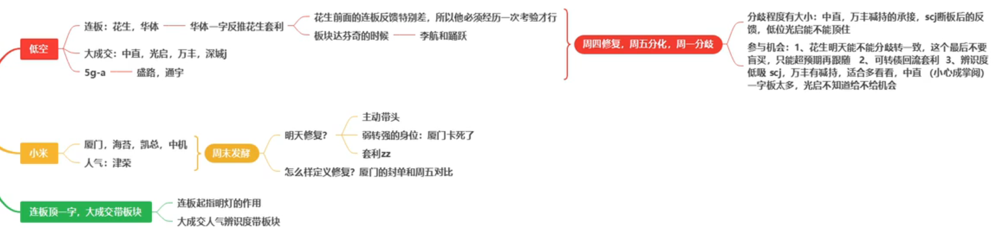

花生水下 参考艾艾精工

低空经济：低位，天河、

下周 祭祖行情

### 04

#### 2024-04-01

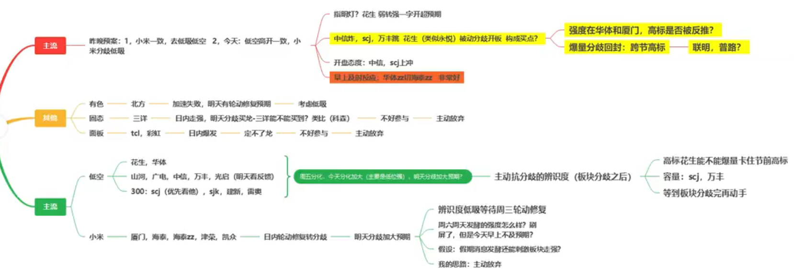


盘面乱：主线乏力

看几个核心，能不能往上走。

中信海直顶住了，这里仍然是主线，没结束

今天离场的明天会回流

低空经济持续性超预期，花生、中信海直没结束之前不会结束

跌停：必须要修复，3连跌停的必须要放人

明天有可能是个离场点

指数这个位置有点危险，如果是箱体震荡，那应该要下行，三连阳了，而且是三中阳。

有色：顺周期

黄金博弈的是美国降息，是历史上的惯性


#### 2024-04-02

明天如果化工继续

低空经济是不是完蛋了

化工是因为石油涨价


#### 2024-04-03

涛涛EXE：  涛神

瑞泰新材

和深城交一样，只是节点不对


炒股是抄的人

它有自己定义的周期，不是情绪周期、双冰---模式不是固定的不是公式化的


锚定，把周期套进去


不是 每天都可以做

机会每天都有，但是你不一定每天都能把握住

只有板哥每天都能做


北京炒家3年曲线，就是涛神一年的曲线

太牛逼了，估计快一个小目标了


#### 20240404周总结

这周就三天

0401： 锂电、低空经济、面板、有色、汽车零部件

0402：化工大爆发、锂电、有色，低空、风电、汽车零部件

0403：有色大爆发


消息：

S3赛季开打前奏：

1. 以色列+美国  Vs. 伊朗等伊斯兰国家
2. 俄罗斯 vs. 乌克兰+北约
3. 中国 vs. 

利好：

1. 军工
2. 有色：黄金等保值品


美国经济数据超预期，持续火热，降息预期降低


短时间内，相同的玩法 事不过三

每一轮高标的特征、图形


非核心4加速--华体科技

顺威的逻辑带入三祥新材


和别人交流进步快，还是自己一个人做快？你先得有自己做出来的思想才能和别人交流，肚子里有货交流才有意义。


分析-预判-推演-预案-反馈-修正-进化


秋老师：

周一是冰点

周二是弱修复

周三是出手节点：关键节点。 艾艾精工

艾艾精工带起来的行情，出现了缩量跌停，再国家维护3000的情况下，艾艾精工一定不可能连续缩量跌停，所以开的低一定可以入手的。 周三艾艾精工竞价是标准买点

沃尔核材、万丰奥威

周三可以确定：这波行情一定只有 飞行汽车可以做

周三：大理药业止跌，表名情绪开始修复。

周四可以推仓位，走势早上飞行汽车，就表明了态度。

然后剩下的全部和小涛朴了20  深城交、建新股份、金盾股份 （TODO 他们是怎么筛选出这些票的）


周五：博弈华为手机的周末消息，至少20个点事高股息拉的 中国石油 中国海油 中国神华

今天低空经济强度稍弱


这个月50个点：1000万+ 太牛逼了


(你看他还在看艾艾精工这些核心标的)

核心标的代表的是背后的情绪，带头的人一定不能被枪毙 （大理药业）

盘面一定是一个整体。


今天金盾股份负反馈很明显

卧龙电气看不上，是昨天反应慢的人做的套利

(思考：最牛逼的人做的那些票，反应慢的人只能做哪些票)


周二可以预判周三企稳，周三竞价开出来，可以看出企稳了

所以周四可以确定一定是大阳，周三一定要拿先手


万丰奥威逼高新发展 抗跌---代表低空经济更强

万丰奥威中间两次是被大单砸，但是被接住了


中值：标准的补涨，它结束那这波行情也就借宿了

涛涛多30个点，80个点？ 太牛逼了


#### 周期复盘


克来机电：穿越

秋神：这轮行情三个票推了仓位：克来机电、高新发展、工业富联。

2024-03-14：这波做到克来机电的反抽，昨天空仓，这轮行情做了30+点

2000*30 = 600万

这轮行情到这里差不多了

工业富联大跌---高切地 旧切新


无量上冲，然后被爆头，参考之前的引力传媒

7-12，天威实训，大票加速，斜率，大票死的方式---高新


4月份 一定有大雷

村长就是像这么玩的

没听懂？ 现在的趋势是偏向大票的？没价值的小盘股，仙股化？同时配合退市---新村长就想这样干。

4月份的大雷是啥？？？？


一些妖股的股性、创业板3板以上的图形--这些都要刻在脑子里

主动和被动，上板的区别非常大

有些人，只有遭受毒打才会明白的，看了一年直播还是这样


初二到高三那种专注的劲，似乎再也找不回了，能高考222，炒股能有多难？


元隆雅图、国华网安、中天光泽、铭普光磁？：连续几天的 阴线-涨停反包

**信息发展**

  比较经典的炸板弱转强，从三超新材、科创新源、荣科股份开始也流行1+1反包、炸板反包等走趋势


涛涛：20接力就是方向的加强，方向的加强有几个前提条件，这几个前提条件是什么？

只是术没有意义

看单子：看到单子就可以知道能不能封住，怎么看？

空间板一字意味着什么？


92科比：捷荣、银宝山新，他的情绪周期，被LV一对一单练

https://xueqiu.com/9433015733/206858890

高位是零和博弈，先看同身位，同时间立航科技在加速赶地板

13:32 立航科技最低点，接近地板

你像这样

2板定龙头，3板确认，4板买


为什么川润股份不能干，安奈儿能干。为什么中视传媒能搞，中基健康不行？

立航科技：被大屁股带起来的，这种不好，需要小票反推？---元子


**板块后期的日内回流债是最佳套利**


#### template

| 项目     | 详情                                                         |
| -------- | ------------------------------------------------------------ |
| 持仓盈亏 | 挣钱的愿望!!!学习&思考                                       |
| 市场分析 | 沪深创科京：<br />量能：<br />市场情绪：<br />涨停：<br />跌停：<br />外资流入：<br />上涨家数：<br />连板晋级率<br /> |
| 竞价     |                                                              |
| 大盘回顾 | 盘面拆解                                                     |
| 板块题材 | 当前主线、涨跌板块<br /><br />题材XX：<br />连板：<br />容量： |
| 涨停梯队 |                                                              |
| 个股分析 |                                                              |
| 消息面   |                                                              |
| 反思     | 思考，围绕盘面，每天至少问自己5个问题<br />思考板哥、其他大佬的操作逻辑 |
| 明日计划 |                                                              |

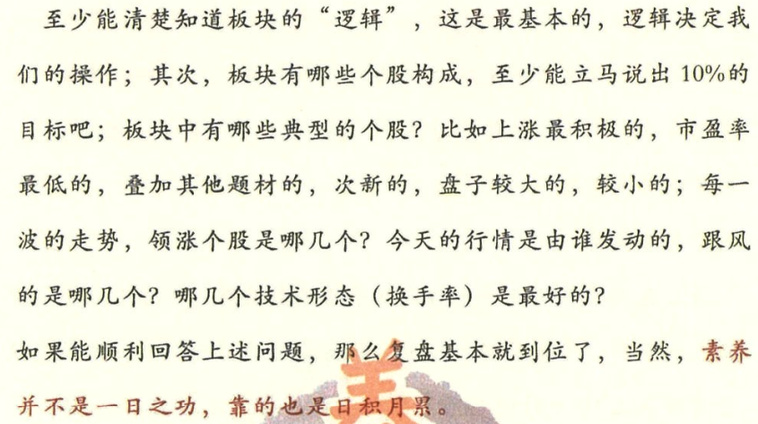


#### 未来的方向

- 稀土永磁
- 新知生产力
- 医药
- 并购重组
- 芯片
- 中证1000成分股


#### TODO

1. 涨停后3天内再次涨停的概率多大，走出来的图形如何。
2. 竞价委卖到达多少才算大，怎么才能支撑该票走出来：2024-01-31深南电：这个能理解，2亿的封单对于20亿的实际流通，不够，10%的实际换手就没了。2024-01-29腾达科技：这个不理解，7.5亿的封单，对于10亿的盘子，当天是封住了，但是为什么套利不能做，比如安邦护卫不能做？是因为选择的不是安邦？而是金帝这种？
3. 用Python来分析、找规律：比如封单占实际流通多少 才能走一字 / 涨停。
4. 2024-02-05：千股跌停，和18-06年类似，复盘
4. 次高和最高谁先死的问题：2024-03-20的永悦科技大理药业v艾艾精工，次高先死至少等两天才能做，后死等一天？？？
4. 怎么算主动
4. 非ST股，最多的连续跌停是多少，退潮期最多多少连跌？ 连续缩量跌停的不放人的连板多少
4. 反抽：一般跌多少 30%
4. 康总 是谁？
4. 涨跌停 分析 代码
4. 大理药业这种三个跌停的，第四天一般都会修复
4. 随手单，冲高是追  大忌
4. 第一天冲高回落，第二天高开的，很可能是可以做的，2024-03-28深城交，2024-03-20掌阅科技
4. 2024-03-29低空经济：有容量有情绪标有逻辑有政策有消息有资金愿意搞。 和23上半年的AI一样
15. 什么是机构票？机构票回补仓位又是什么？
16. 周期：高潮后分歧，当自己感到非常低迷时，往往是反弹之日，总结
17. 退潮期过渡题材持续性一般两天左右：比如，总结
18. 国在逆回购 研究：情绪好大家愿意下场的时候，逆回购利率很高，一天期10万都有30多元
18. 首板一字的票，三板以上很难接
18. 中位的同身位套利 最难成
18. 3-4,4-5,6-7 的特点？市值越小越好
18. 节点：龙头断板的1、2板
18. 高潮次日不接力：2024-03-29小米 828
18. 黄金博弈的是美国降息？二者之间的关系
18. pmi
18. 竞价开出来多少才算爆量，2024-04-01光启技术开出来成交3个亿，400亿成交。1分钟10个亿。中信海直同一天，爆量更多--市值小一些1/3，结果成了。这是同板块之间的竞争，高度、盘子大小、热度 都有影响
18. 什么是弹性的品种？20CM？深城交
18. 封单的变化：可以看到情绪和强度，加单 
18. 换手卡一字
18. 监控
18. 周期：把当前的时间线 划分周期
18. 


鲍老师：左侧：

三祥新材昨天高妙，如果以强强来分析，

江特点击，套三祥新材，三祥新材不炸就不走。


一字意味着不给买


每次周期行情结束的时候，都有部分赛道来承接流动性


股票能有多难？高老师一年就被国家队招募，达到超高理解力。你的努力远远不够。

炒股是有天赋之分的，多少人在原地踏步


- 92科比 情绪周期
- 量化的盘口特征 -- 东田微2024-03-14
- 杰哥 语录


周五应该买票，周一再去接很愚蠢，周五应该多买一些周末会发酵的板块。

注册制以后所有高标的反抽 逻辑


鲍老师：

- 永远记住：真诚是必杀技

- 只要我有目标，我就一定要实现

高老师、鲍老师，强者都有一个共同点：信念+努力


当面对一件事情时，如果缺乏信念和持之以恒的努力，可以尝试以下方法来提高动力和坚持：

1. **明确目标**：清晰地定义你的目标，了解为什么要做这件事，以及完成它对你的长远意义。
2. **设定小目标**：将大目标分解为一系列小目标或里程碑，这样可以更容易地跟踪进度并庆祝每一个小成就。
3. **寻找激励**：找到能够激励你的东西，无论是内在的满足感、成就感，还是外在的奖励和认可。
4. **建立习惯**：通过每天固定时间做固定的事情来建立习惯，一旦形成习惯，就会更容易坚持下去。
5. **保持积极心态**：用积极的心态看待挑战和失败，将它们视为成长和学习的机会。
6. **寻求支持**：和家人、朋友或同事分享你的目标，他们的支持和鼓励可以帮助你在困难时刻保持动力。
7. **管理时间**：合理安排时间，确保有足够的时间来专注于你的目标。
8. **保持身体健康**：健康的身体是坚持努力的基础，保证充足的睡眠、健康的饮食和适量的运动。
9. **反思和调整**：定期反思自己的行动和进度，如果当前的方法不奏效，不要害怕做出调整。
10. **保持耐心**：理解任何值得做的事情都可能需要时间，保持耐心，不要因为短期内没有看到结果就放弃。
11. **培养兴趣**：尝试找到事情中你感兴趣的方面，兴趣是最好的老师，也是持续动力的源泉。
12. **自我激励**：给自己设定奖励，每当达成一个小目标，就给自己一些奖励。
12. 

记住，每个人在追求目标的过程中都可能遇到动力不足的时候，关键是要找到适合自己的方法来重新点燃激情和坚持到底。


#### 债

正股超强做债 手法

2024-03-28 华体科技

商洛电子

总结


#### 题材行进规律

切换、分歧

行进规律


#### 反思

1. 你为什么来炒股？为了挣钱？
2. 你是如何朝这个方向努力的？时间、财力、精力！“达成一件事最好方式是付出100%的时间和精力”
3. 计划如何？短期、长期目标如何？
4. 结果如何？挣钱了吗？
5. 高标核心撑过分歧后 为什么看两天


不能看A做B，提高审美做核心

现在所有钱的用于化债去了，再苦一苦百姓吧

- 大明王朝1566

看到一个新闻/事件，立马思考一下对股市里面题材、个股的影响！


操盘技巧：

1. 开盘看创业板 涨幅
2. 看连板梯队开出来怎么样
3. 看竞价委买


今天798看到一个富哥，从咖啡厅出来，开着超跑，把着靓妹，太他妈爽了，有钱太他妈爽了，努力挣钱啊傻逼


情绪--挣钱效应--合力


#### 怎么分析一只票？

1. 基本面：
   - 换手
   - 量能
   - 流通、实际流通
2. 大环境：
   - 大盘走势
   - 市场情绪
3. 板块、题材、情绪
   - 板块、题材热度
   - 资金流向
   - 板块容量
4. 个股强度
   - 板块内地位：
     - 当前综合排名
     - 是否封板、封板时间
     - 炸板次数
     - 封单量
   - 是否有补涨
   - 辨识度、人气
   - 联动：
     - 前排是谁，有带动作用吗？前排的表现怎么样，能补涨吗？
     - 后排是谁，有反推作用吗，还是被拉下去？
   - 对手盘：对手板块、对手股、资金是否会被吸走
   - 竞价强度
   - 短线情绪内的地位：是否能承载短线情绪资金
   - 参与性价比
   - 是否异动、严重异动
   - 是否被监管
5. 资金面
   - 龙虎榜：
     - 游资？该游资的风格
     - 机构？是不是转融通，高管卖公司
     - 散户
   - 散户参与情况
   - 大单情况
   - 主力资金流入量
6. 技术面
   - K线形态
   - 分时走势
   - 超级盘口
7. 消息面
   - 是否有利好消息
8. 外围
   - 美股
   - 港股
9. 走势预期
   - 行情的演进
   - 个股的走势--预期
   - 持筹持币者分析


前一天做多、做空的票<br />和本票有联系的票<br />这些东西需要联系起来

#### TODO 高老师

复盘：从**<u>大单入手</u>**寻找大资金意图，把**消息面、基本面**理个思路。查看**当日股市涨跌榜**，分析**大盘及个股**情况，注意**成交最大的个股榜及涨幅最大的股票群**，看主力是在抛货还是在进货。周末，关注**外盘**走势、消息动态，分析宏观面、基本面及技术面，分析本周大盘与个股走势，预测未来走势，确定操作方案。


如何看分时单子

早上盯盘真的是太重要的了

历史地天后续走势

钱的来源就5种： 交换、剥削、掠夺、垄断、受赠 

判断是否退潮：成交额排行，涨停数量？

怎么识别量化？基本功？


高老师：

1. **提高审美**：开盘啦情绪，熟悉板块，熟悉龙头个股。每天的热点标的的分时，研究分时的逻辑。
2. 理解力不到位的时候，不要看涨速榜---一个脉冲就把你骗了。
3. 联动
4. 人性的角度：多思考
5. 短信：全天盯盘。异动，比如，银宝山新板了，算力异动，就会跟
6. 6个月：2000多。落叶知秋：半年1200多
6. 24-43：离火大运？不去四川重庆
6. 永远做核心
6. 天予不取 反受其咎
6. 人生关键的既不一定要走对，气色往往是短时间的
6. 平时直播的时间就是复盘的时间---可想而知，复盘花多少时间---休闲时间都在复盘
6. 短线能做出来的，都是人精中的人精
6. 大局观的培养
6. 思维的深度
6. 短线的博弈
6. 基本功：一个票动，立马联系到板块，板块的历史龙头有哪些，，，
6. 永远不要幻想，不要不切实际地希望
6. 一只票，如果已经盈利，竞价直接走永远是没错的。 不要粘票
6. 只看别人的历史交割单是没有意义的，必须要结合当时的环境、情绪。不然没啥用。
6. 怎么分析明天的方向/板块，08号分析第二天是机器人，从哪些标的触发分析，用了什么方式？
6. 

短线资金可以当做一种情绪<br />这笔资金需要板块承接<br />预判这笔资金下一步承接的板块。<br />切换的时候会先抢占目标板块的高标<br />不是一个板块走出来了，你才去时候诸葛分析，而是要分析走出来的原因。<br />一定要思考，深度思考，思考背后的深层次原因，高老师这个人太牛逼，做什么都深入研究、深入思考，学习！！<br /><br />高老师半年就做起来了，一开始认识票、认识板块、各题材核心标的，然后看情绪，看当前环境下的核心票，思考行进的逻辑。<br /><br />建立短线框架：<br />1. 认识短线票：什么是短线票(游资、合力)，什么是庄股/机构(eg:德业股份)，什么是量化<br />


上班的同时抄短线？是不好，只能试试了

投机永不死
实际流通：开盘啦可以看，流通-超过5%的大股东


趋势票<br />macd底背离<br />顽主<br />20CM补涨


2024是基金的强赎回年？机构会大幅流出

## 年度目标与总结

#### 2023总结

今年是主线+题材模式

主线3个月题材2个月，

主线2个月题材1个月

| 时间线 | 主线                                   | 题材   | 核心 |
| ------ | -------------------------------------- | ------ | ---- |
| 1      | AI                                     | 机器人 | 技术 |
| 2      | 复苏:地产、证券                        | 华为   | 信心 |
| 3      | 改善？ 企业、基建、？？？              | ？     | ？   |
|        | 华为概念、华为汽车、汽车零部件、大科技 |        |      |
|        | 国企改革                               |        |      |


2023行业涨跌：


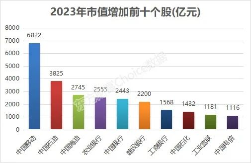

(中国移动21年美股退市，21年A股上市)

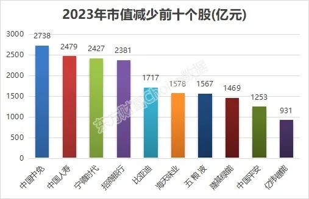


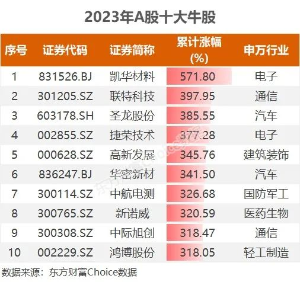

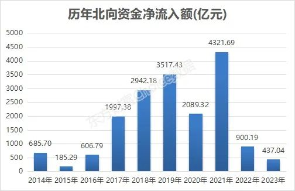

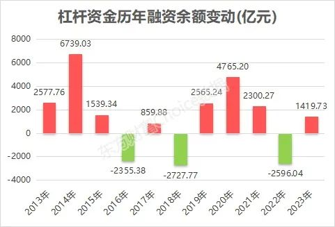

融资余额：借钱数-归还数


#### 2024目标

现在是2024-01-01
跨年：没有双人任务

2024目标

1. 翻倍
2. 

#### 


