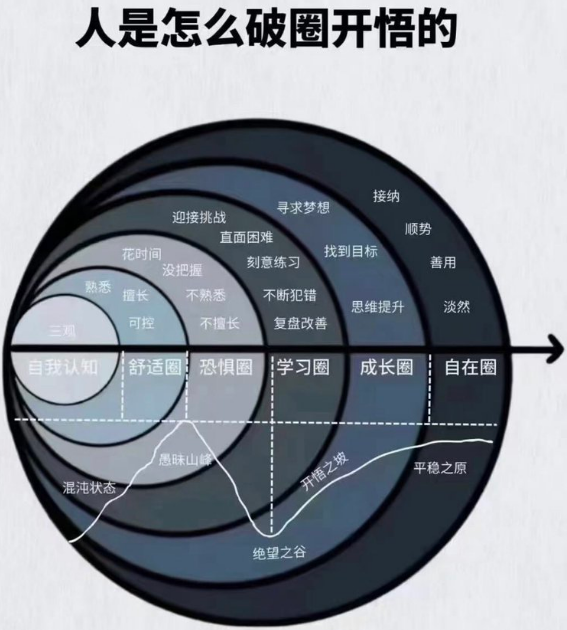
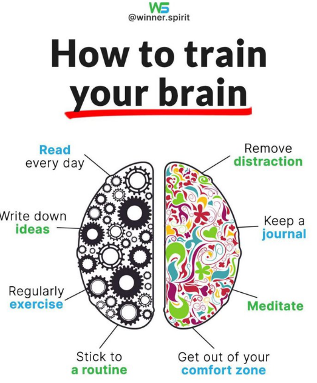
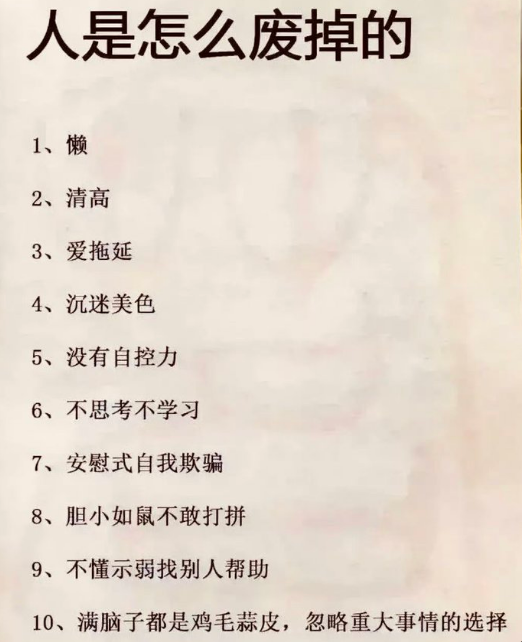
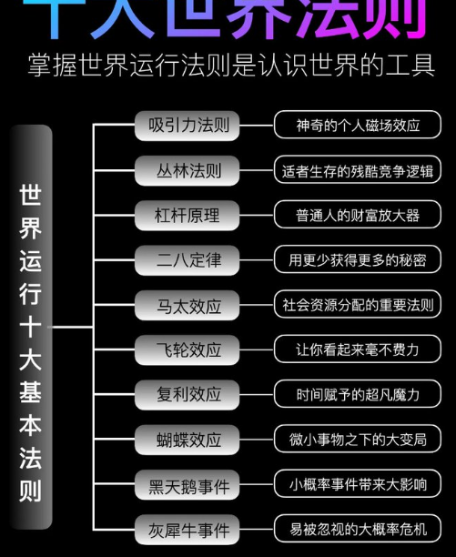

# 励志

- 
- 命是弱者的借口，运是强者的谦辞

你不对自己下狠手，这个社会就会对你下狠手

**真正让人变好的选择，过程都不会让人很舒服**

**大的成功一定是将一些方法论或事情做到了极致**

当你攒够了钱，这个世界就会对你很温柔，你也不会在患得患失，生怕被人辜负，即便有钱不一定幸福，但离开谁你都能从容开始。钱虽然很俗，但这个世界都在为钱让路，因为它会让你底气十足。

迷茫只是理想太远大，无法下手

**不得不说，我们绝大多数人，都没有那么强烈的渴望改变、渴望有钱、渴望有地位、渴望有尊严，学习对我们来说，也就没有那么重要的意义。**

爱上学习的方式：
1、第一阶段：向前看齐，激发对金钱的渴望
方法一大堆知道很多大道理，然而还是三天打鱼两天晒网。原因在于：还不够惨、还不够穷。人们为了自我保护，喜欢蒙蔽自己，觉得自己的生活还不错，比上不足比下有余。
如果没有动力，就把赚钱当做第一目的。
想象自己每读完一本书，自己的储存账户就会增加多少虚拟货币。
20多岁的年龄，最容易迷茫，没钱、没背景、没资源，虚度年华，等到30岁时又后悔莫及。

2、第二阶段：逼自己学习。
要设定一个目标，不完成誓不罢休，死不罢休

3.第三阶段：先前看齐：寻找榜样的力量
选择学习，就不能选择其他的，这是你必须付出的机会成本
你是要选择片刻的安逸，还是要选择长久的安逸
心理学：知识的诅咒——当我们知道一件事时，很难想想不知道这件事的人是怎样一种心理，我们默认他们知道这件事
所以我们不知道一件事，也就无法想象这件事的好处，学习也一样，我们难以想象学习的好处，所以人们很快放弃看不到好处的东西。

4、第四阶段：组队学习，或者找一个私人教练

只有逼自己一次，达到顶峰体验过这种巅峰的感觉，你就不会允许你自己失败，而又足够的动力，去克服学习障碍。

全部弄到文件里了

林语堂：吾国吾民，看一下
中国人的三：面、命、

邪恶令好人团结
Facing evil brings good people together
只是没有人觉得自己是邪恶的一边
No one ever thinks that they’re the evil one

## 去哪儿高级技术总监

优秀是一种习惯，高标准是一种习惯

找到办法持续提升 持续增值

2年多晋升真总监 而大多数人还在原地踏步

对自己写的每一个字 每一封邮件，每一句话，每一行代码负责

卓越 追求实在的成就感

构建专业知识、工作过程中提升自我、在其中是否开心

## 励志演讲

### 施瓦辛格-关于成功·成功的真谛

I went to college, I went and worked out five hours a day. And I was working on construction, because in those days in body-building, there was no money. I didn’t have the money for food supplements or anything. So I had to go to work. So I worked in construction, I went to college and worked out in the gym. And tnight from 8 o’clock at night to 12 midnight. I went to acting class four times a week. I did all that. There was not one single minute that I wasted. And this is why I standing here today.

在大学里，我每天训练五个小时。同时还在工地里干活，因为那时候做健美的根本没有钱。我没有钱去买食物或其它别的东西，我不得不去工作。我在工地里干活，去大学的健身房健身，从晚上八点一直到午夜十二点，每周还去上四次表演课。我做了所有的这些事情，没有浪费任何一分钟，这就是我今天能够站在这里的原因。

With the age of 20 I went to London, and I won the Mr. Universe Contest as the youngest Mr. Universe ever and it was because I had a goal. You see, if you don’t have a vision of where you go, and if you don’t have a goal where you go, you drift around and you never end up anywhere.

20岁的时候我去了伦敦,赢了宇宙先生的比赛，成为史上最年轻的宇宙先生。这是因为我一直有这样一个目标。如果你对于自己要去向哪没有任何想法，不知道自己的目标是什么，你将四处漂泊没有终日。

74% of people hate their job in America. The majority of people don’t like what they’re doing, because they’re not doing it, because they didn’t have a goal and then followed this goal. They’re just aimlessly drift around and there’s a job opening, so they get their job because they need to work. But then when you work, it’s a chore. It’s work. It’s not fun. So if you think about it, only a quarter of people really enjoy what they’re doing in life.

74%的美国人讨厌他们的工作，大多数人并不喜欢他们正在做的事。因为他们根本不是真正地在“做”，因为他们没有目标也没有努力朝着它奋斗，他们只是毫无目的地漂泊。遇到一份现成的工作时，他们就拿到了一份工作仅仅是出于需要。但真的开始做时却发现它只是乏味琐事，只是工作，毫无趣味。所以你想想看，只有四分之一的人真正在生活中享受他们的工作啊。

So people always ask me, when they saw me in the gym in the pumping iron days, they say why is it that you’re working out so hard, five hours a day six hours a day, and you have always a smile on your face? The others are working out just as hard as you do look sour in the face, why is that？

人们经常问我,当他们看到我在健身房里没日没夜地健身时,他们问我为什么这么辛苦地锻炼,一天五六个小时,脸上还一直挂着微笑？那些和你一样辛苦的人,他们的脸上却写满了痛苦，为什么会这样？

I told people all the time, because to me, I am shooting for a goal. In front of me is the Mr. Universe title. So, every rep that I do gets me close to accomplishing the goal. To make this goal this vision turning into reality. Every single set that I do, every repetition of weight that I lift, will get me a step close to turning this goal into a reality.

我每次都这样告诉他们，因为对我来说，我在追逐目标。在我面前的是宇宙先生的称号，所以我做的每一次训练都让我离实现目标又近了一点，让这个目标这个愿景变成现实。我每做的一组练习，我每举起的一次重量，会使我离把目标转化为现实又更近一步。

So, I couldn’t wait to do another 500 pound squat; I couldn’t wait to do another 500 pound bench press; I couldn’t wait to do another 2,000 sit-ups; I couldn’t wait for the next exercise. So let me tell you something. Visualizing your goal and going after it makes it fun. You got to have a purpose no matter what you do in life, you got to have the purpose.

所以我等不及想做下一次500磅的深蹲，我等不及想做下一次500磅的卧推，我等不及想做下一次2000个仰卧起坐，我等不及想开始下一次训练。所以我告诉你，设想你的目标并且追寻它真的很有趣，你需要一个目标，无论你在生活中做什么，你必须要有一个目标。

I hate Plan B, because we have so many doubters. We have so many of those people that say “no” and “you can’t do it” “it’s impossible”. But when you start doubting yourself, that’s very dangerous,Because now what you’re basically saying is that if my plan doesn’t work, I have a fallback plan, I have a plan B. And that means you’re start thinking about Plan B. Every thought that you put into Plan B, you’re taking away that thought and that energy from plan A.

我讨厌备选计划，因为我们身边有太多持怀疑态度的人，我们身边有太多的人会说“不”“你做不了的”“绝对不可能”的人。但如果你自己也怀疑自己时，那真的很危险。因为这基本上就等于在说如果我的计划没有成功，我还有一条退路，我还有一个备选计划。这就意味着你已经开始想备选计划。每当你开始想备选计划，你就已经消耗了可以放在最优计划里的想法和能量。

And it’s very important to understand that we function better if there is no safety net. Because Plan B becomes a safety net. It says that “if I fail then I fall and I get picked up and I have something else there that will protect me.”and that’s not good. Because people perform better when there’s no safety net. People perform better in sports and in everything else if you don’t have a plan B.

重要的是，你必须明白没有安全网时我们反而会表现得更好。备选计划就是那张安全网，它在安慰你：“如果我失败摔倒重新开始，还有可以保护我的东西。”这种想法并不好，因为如果没有安全网，人们往往会做得更好。不论是运动领域还是其它事情上，人们没有安全网时会表现得更好。

I’m telling you I’ve never ever had a plan B. I made a full commitment that I’m gonna go be a body-building champion. I made a full commitment that I’m gonna be in America. I made a full commitment that I’m gonna get into show business and I’m going to be a leading man. No matter what it takes I will do the work. I will do the work over and over and over until I get it. And the same is in politics and everything like that. So, to me, it is very dangerous to have a plan B, because you’re cutting yourself off from the chance of really succeeding.

我告诉你们我从来没有过备选计划。我竭尽全力去做健美冠军；我竭尽全力留在美国；我竭尽全力进入演艺圈并成为领军人物。无论代价是什么，我都会努力去做。我一次又一次地努力直到获得成功。在政界也一样，其它所有的事情都一样。所以，对我来说有备选计划是很危险的，因为它将会阻断你获得真正成功的机会。

And the reason one of the main reasons why people want to have a plan B is because they are worried about failing. What if I fail then I don’t have anything else? well, let me tell you something. Don’t be afraid of failing, because there’s nothing wrong with failing, You have to fail in order to climb that ladder. There’s no one that doesn’t fail.

人们想要备选计划的主要原因之一在于因为他们害怕失败。万一我失败了一无所有怎么办？那么，让我告诉你，不要害怕失败，因为失败没有错。你必须失败才能开始攀登成功的阶梯，没有人不失败。

Michael Jordan said in one of his interviews when they said “you’re unbelievable”“you the greatest basketball player of all times, and he says “well, you just mentioned the successes”,but he says “For me, to become the greatest basketball player, I missed 9,000 shots when I was playing basketball the NBA games.” So, during this games that he was so successful, he missed 9000 shots. Does it make him a failure? No. He is one
of the greatest basketball player of all times, but he failed 9,000 times! Do
you get it? We all fail! It’s okay.

迈克尔乔丹在一次采访中，听到自己被誉为“不可思议的”“有史以来最伟大的篮球运动员”时他说：“你只提到了成功”。他接着说“对我来说，成为最伟大的球员之前我在NBA球场上投丢了9000次。”所以，在这些属于他的如此成功的球赛里，他投丢了9000次。这让他失败了吗？不。他是有史以来最伟大的球员之一，但他失败了9000次。你明白了吗？我们都会失败！没关系。

What is another case is when you fail you stay down, whoever stays down is a loser. Winners will fail and get up, fail and get up, fail and get up. You always get up, that is a winner.

另一种情况是当你失败沉沦的时候，如果一直沉沦下去，你就是一个失败者。成功的人会失败但也会重新站起来，失败再站起来，失败再站起来。你一定会站起来，这才是成功的人。

I lost body-building competitions; I lost powerlifting competitions; I lost weightlifting competitions; I had movies that went in the toilet and that were terrible and got the worst reviews. We all lose! We all have loses! This is okay. And this is why I say don’t be worried about losing, because when you’re afraid of losing, then you get frozen, you get stiff you’re not relaxed. In order to perform well in anything, if it’s in boxing or if it is on your job or with your thinking, It is only happening when you relax.

我输掉了健美比赛；我输了力量举重比赛；我输了杠铃举重比赛；我有过失败的电影，真的很糟糕，得到了最差的评价。我们都会失败，我们都有很多失败的经历。没关系，这就是为什么我说不要害怕失败。因为你害怕失败的时候，你就会畏缩不前，身体变得僵硬，无法放松。为了表现得很好，不论是在拳击或是你的工作，或是在思考，成功只会发生在你放松的时候。

So, relax. It’s okay to fail. let’s just go all out and give it everything that you got!. That’s what it is all about, So, don’t be afraid to fail!

所以，放松去做吧。失败也没关系，让我们全力以赴，拼尽全力。这就是成功的真谛。不要害怕失败！
