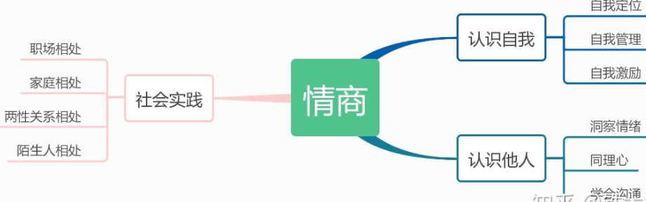

# EQ

- [话术与口才历史笔记](../自我提升/话术与口才.pdf)

## 常用词语

| 词语                                  | 意义 | 场景与举例         |
| ------------------------------------- | ---- | ------------------ |
| 蚂蚁量                                |      | 我喝酒不行，蚂蚁量 |
| 移花接木 春秋笔法  断章取义 |      | 夸张、豪放         |
| 光环 buff                             |      | 你确实有光环、buff |
| 弟位                                  |      |                    |
|                                       |      |                    |

## 常用短语

| 短语                                                  | 意义 | 场景与举例 |
| ----------------------------------------------------- | ---- | ---------- |
| 只有当潮水褪去了之后，你才知道谁在裸泳                |      |            |
| 压了葫芦起了瓢                                        |      |            |
| 批评无自由，赞美无意义                                |      |            |
| 中国驰名双标                                          |      |            |
| 高手在民间，专家在眼前                                |      |            |
| 我与赌毒不共戴天                                      |      |            |
| 事后诸葛，事前一头猪                                  |      |            |
| 腿打折了送一块创口贴                                  |      |            |
| 只有不会呼吸的敌人才是好敌人                          |      |            |
| 既分高下也决生死                                      |      |            |
| 拿着结论找认同                                        |      |            |
| 饿时吃糠甜如蜜，饱时吃蜜都不甜                        |      |            |
| 渴时不饮盗泉之水                                      |      |            |
| 奈何本人没文化，一句NB走天下                          |      |            |
| 比窦娥还冤                                            |      |            |
| 癞蛤蟆跳到脚面上，不咬也吓一跳啊                      |      |            |
| 想XX的后面排队哈，我们一起想                          |      |            |
| 我的梦想是挣一个亿，和你爸一样， 他的梦想也是挣一个亿 |      |            |
| 跟着XX混，三天饿九顿                                  |      |            |
| 不把村长当干部，小看人                                |      |            |
| 糖衣炮弹：糖衣吃了，炮弹给打回去                      |      |            |
| 有两点不行：这也不行，那也不行                        |      |            |

## 常用话术

| 序号 | 内容                                                         |
| ---- | ------------------------------------------------------------ |
| 1    | 男生不能和女人打架，打赢了你算什么男人，打输了你算什么男人   |
|      | 影响了大宋的精神文明建设                                     |
|      | 不是在沧州就是在沧州的路上                                   |
|      | 有钱男子汉，没钱汉子难                                       |
|      | **一寸光阴一寸金，三寸光阴一个鑫**                           |
|      | 放假？只有对社会没有用的人才需要放假，像我这种国家栋梁之材，怎么可能放假 |
|      | 国庆节怎么过？错过，略过，擦肩而过                           |
|      | - 世界那么大，我想去看看 - 买个地球仪吧，可以看看，也可以转转 |
|      | 抗辽数十年，突然告诉我我是契丹人                             |

## 一些案例

- 把亮度调高一点，因为我向往光明

## 常用诗词

| 如同天上降魔主，真是人间太岁神 |      |
| ------------------------------ | ---- |
| 他时若遂凌云志，敢笑黄巢不丈夫 |      |
| 王侯将相，宁有种乎             |      |
|                                |      |

## 常用技术

### 反向思维

A:女团是不能谈恋爱的。

B:那可以有地下恋情吧

## 常用幽默话术

| 序号 | 详情                                                         |
| ---- | ------------------------------------------------------------ |
| 1    | 高中有人谈恋爱，老师发现了，叫双方家长，结果双方家长一看，觉得还挺合适的。 |
| 2    | 人之初性本善，你洗澡我偷看                                   |
| 3    |                                                              |

## 故事

孙子爷爷划船，浆坏了：孙子，爷爷讲（浆）完了

## 游戏整蛊

手拿筷子，放在马桶边，发“今天又是吃饱的一天”

## 励志演讲

### 模板1

你将经历难以想象的磨砺，忍受锥心刺骨的痛苦

## 表白

- 喜欢的人绝对不喜欢自己，这是宇宙定律嘛
- 

### 今晚月色真美

在自己的青葱岁月里如果能遇到一个红着耳朵对自己说出这句话的少年，或是有一个能让自己鼓起勇气说出这句话的人，**都足以构成未来咀嚼良久的美好回忆**，如果有自己喜欢的人，大胆一点。在一个月色无边的夜晚邀请TA，然后目光坚定的对TA说：今夜月色很好。

最佳答复：“吻我。”“我也是。”“我没看到月亮，我眼里全是你。”“**月上柳梢头，人约黄昏后**。”不过这边有个很逗的回复，就是适合叉猹，笑死了，适合情侣开玩笑啊

如果你同意了他(她)的表白，那么你就回复“风也温柔”，毕竟月色这么美了，再加上微微的柔风，岂不是更佳?如果不同意的话，那就回“适合刺猹”!

单身路上的绊脚石

## 歇后语

- 太监开会——无稽之谈

## Article-Reading Notes

### 如何成为一个高情商的人？
有什么梦想呢？比如当宇航员狙击手科学家这种
http://www.7k7k.com/flash/16534.htm

我们先来看两个好玩的现象：

1.碰到困境时，习惯性地说出**“这不是我的错。”“我没想到会是这个结果。”**

2.做出误判时，不自觉地说出**“早知道...就好了。”“我不该这样做的。”**

什么是情商？

情商即情绪商数，是**指在自身感受与他人相处中的平衡点**，是一个抽象的概念。

我们从低情商的表现入手，会更好理解。情商低的人通常不自知：

说话做事时**无意识**顾及别人的感受
**下意识**地推卸责任、散发负面情绪

感知力差，**收不到**他人的情绪反馈
**缺乏**安全感，渴望得到他人的关注

惯性泼冷水，**没有**赞美他人的天性

改变这些也不难，只要你理解了下面这段话：“提高情商是把“不可控情绪”的部分变为“可控制情绪”，从而增强理解他人及与他人相处的能力。”

情商之父的丹尼尔·戈尔曼 *(Daniel Kahneman)* 曾提出情商五要素：**了解自我、自我情绪、自我激励、识别他人情绪、处理人际关系。**

#### 认识自我

##### 自我定位

察觉情绪的出现，监视情绪的变化，审视内心的体验

心理哲学领域，最简单也是最难的事情

**一旦完成了自我定位，其后的步骤会游刃有余**；而现实是，多数人会受限于自身的视角，对“自我”产生误解。

保持对自我的质疑：

当你感觉被冒犯时，请抽出2秒钟的思考。“此刻是什么情绪；是什么导致了情绪的产生；将情绪表现出来是什么后果；是否承担其结果。”

感觉应该时时刻刻思考自己的情绪，脱离于自身，站在另一个角度思考自己当前的情绪————站在上帝视觉(The Watcher)，问自己当前是什么情绪

改变叙事方式：

跳出自己的情绪圈，在不同人的角度，挖掘事情的本质，才能深层次地审视内心不同体验的变化。

多角度的正面反馈

要获得清晰的自我定位，就要有足够的外界反馈，剔除无爱的批评者unloving critics和无批评的爱人uncritical lovers, 接受他人真正的评价，不要为此恼火，这只是提高情商非常基础的一步。

学会感恩

感恩能让人身心愉悦健康，也会让他人觉得你有很高的素养。

#### 自我管理

自我情绪管理

### 怎样提高说话时的瞬时反应能力？

https://mp.weixin.qq.com/s/0btzWdMDVQGRBqtZGHsszw

有些性格内向的人就害怕与人说话聊天，于是就选择逃避，不愿意与人聊天说话，长此以往，就得了“社交恐惧症”

**如何提高说话时的瞬时反应能力呢？请做好下面几点：**

- 提高理解能力

理解对方话语中每个名词、形容词、成语的意思

所以平时掌握大量的常用名词和形容词的意思很重要。这是与人沟通交流的基础。

- 提高语言组织能力、遣词造句的能力

很多口才不好的朋友都有这样一种感受。明明心中有想法，就是不能准确清晰的表达出来。明明知道该怎样回应对方，可就是说不出口。这就是口才的基本功——`语言组织能力差`的原因。想提高语言组织能力，遣词造句的能力，必须经过`大量刻苦的训练`，在这里给大家提供几个简单实用的训练方法:
    - 写日记法
        - 讲故事法
        - 留言评论法
        - 多聊天实战法
        - 语言打卡训练法。

- 提高聊天能力，学习记住并熟练运用各种聊天技巧、聊天套路、聊天说话公式等

   说话时的反应能力差，一个重要原因就是聊天能力差，接话能力差。聊天能力越强，接话能力越好，反应就会越快。说话时反应慢的人都是平时不爱聊天不会聊天的人，别人随便说一句话，都不知道该用什么技巧、什么套路去接对方的话。所以口才不好，不会聊天的人一定要多学习各种聊天技巧、套路和说话公式，同时要多聊天实战训练，多分析总结经验教训

- 提高逻辑思维能力

与人沟通交流时，好多话题都是需要运用逻辑思维解决的问题，所以逻辑思维能力的强弱会决定反应速度的快慢。逻辑思维能力差的人可以买一些关于逻辑学的书多看看，多训练。

- 提高情商，学习各种社交知识，例如社交礼仪、 社交规则、社交暗语、说话禁忌等。

情商越高的人，就越能够迅速判断在什么场合该说什么话，越能够迅速准确的判断自己的话说出去的后果。很多人说话反应慢的一个重要原因就是不能快速准确的判断自己想说的话该不该说，所以就犹豫不决，拖慢了反应的时间。

- 每天多反思总结，多积累经验教训

